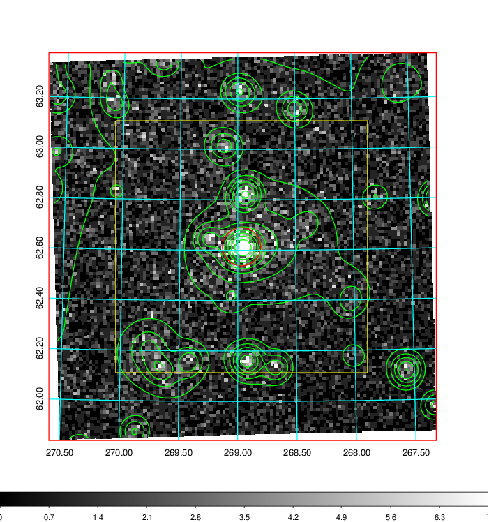
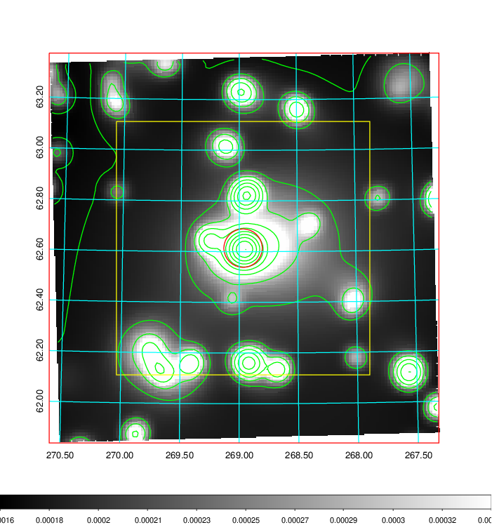
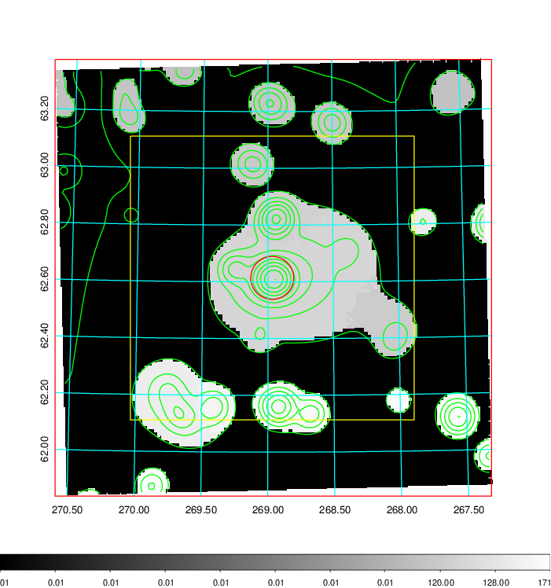
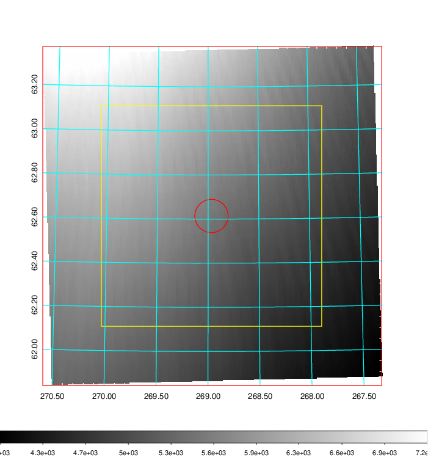
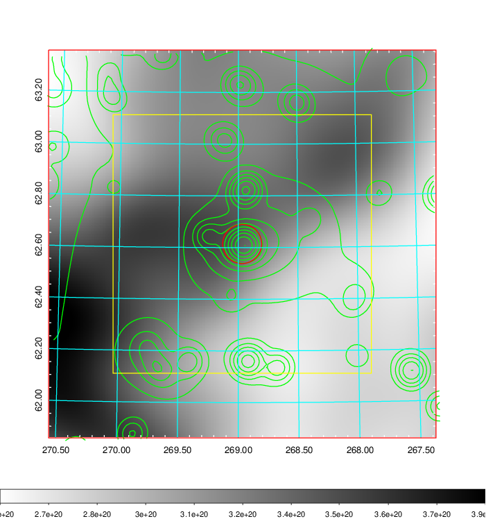
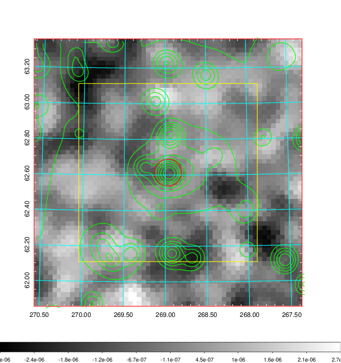
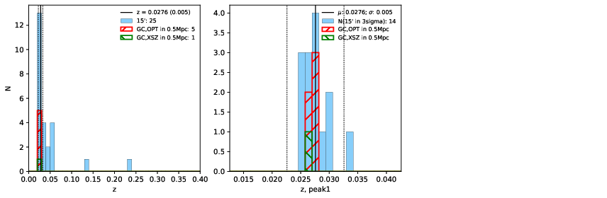
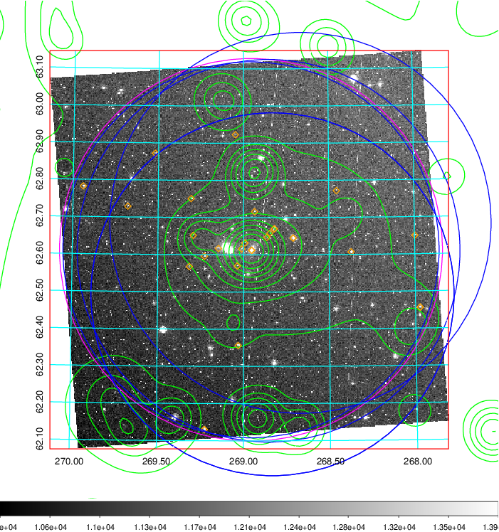
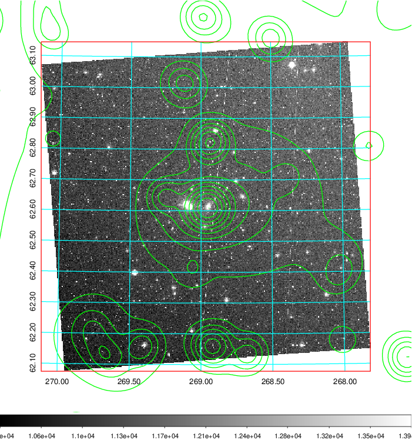
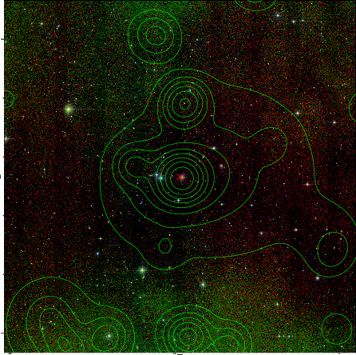

### 755

|Name|RAJ2000[deg]|DEJ2000[deg] |Ext[arcmin]| Ext,ml | z | z_src| C|GC(XSZ,Delta_z<0.01)| GC(OPT,Delta_z<0.01)|GC| R_sig[arcmin] | R500[arcmin] | R500[Mpc]| CRsig[c/s] | CR500[c/s] |L500[1E44 erg/s]|F500[1E-12 erg/s/cm^2]| M500[1E14 Msun]|Tx[keV]|Cnt_sig|Beta|Rc[arcmin]|Comment|Alias|
|---|---|---|---|---|---|------|---|--------|---------|----------|---|---|---|---|---|---|---|---|---|---|---|---|---|---|
|755| 268.967| 62.614| 4.54| 637.50| 0.0276(0.005)| z1, z_xsz| B| MCXC| N, Zw| MCXC, N| 10.750| 14.972| 0.498| 0.152(0.010)| 0.163(0.011)| 0.038(0.002)| 2.169(0.111)| 0.36(0.01)| 1.15(0.02)| 1138.2| 0.790(-0.069+0.088)| 3.828(-0.506+0.582)| -| k507|

|[RASS image](../image/755/755_img.pdf)|[filtered image](../image/755/755_fil.pdf)|[Segment image](../image/755/755_seg.pdf)|
|-------------------|--------------------|-------------------|
|   |    |   |

|[Exposure image](../image/755/755_mex.pdf)| [nH image](../image/755/755_nh.pdf)| [Planck image](../image/755/755_p.pdf)|
|-------------------|--------------------|-------------------|
|   |     |  |

|[Redshift Histogram](../image/755/755_zg.pdf) | [DSS image(z1)](../image/755/755_dss_z1.pdf)      |  [DSS image(z2)](../image/755/755_dss_z2.pdf)    |
|-------------------|--------------------|-------------------|
| |  Blue circle for optical clusters;  Magenta circle for XSZ clusters;  all with r=1Mpc;  Only GC with Delta_z<0.01 are shown. |  Blue circle for optical clusters;  Magenta circle for XSZ clusters;  all with r=1Mpc;  Only GC with Delta_z<0.01 are shown.  |

|[known Abell/XSZ clusters](../image/755/755_gc.pdf) | [2MASS image](../image/755/755_2mass.pdf)      |
|-------------------|-------------------|
|  Magenta, blue and green circles  for optical, X-ray and SZ clusters  respectively, with redshift of clusters  labelled. The radius of circles  are 1Mpc.|  |

|[PS1 image](../image/755/755_ps1.pdf)            |
|-------------------|
|   |
