

### 756

|Name|RAJ2000[deg]|DEJ2000[deg] |Ext[arcmin]| Ext,ml | z | z_src| C|GC(XSZ,Delta_z<0.01)| GC(OPT,Delta_z<0.01)|GC| R_sig[arcmin] | R500[arcmin] | R500[Mpc]| CRsig[c/s] | CR500[c/s] |L500[1E44 erg/s]|F500[1E-12 erg/s/cm^2]| M500[1E14 Msun]|Tx[keV]|Cnt_sig|Beta|Rc[arcmin]|Comment|Alias|
|---|---|---|---|---|---|------|---|--------|---------|----------|---|---|---|---|---|---|---|---|---|---|---|---|---|---|
|756| 269.287| 53.860| 1.24| 71.98| 0.1110(0.008)| z1, z_opt| S| -| A, C| A, C, N, W| 9.288| 6.499| 0.788| 0.092(0.015)| 0.087(0.014)| 0.513(0.037)| 1.619(0.116)| 1.55(0.06)| 2.91(0.07)| 258.1| 0.949(-0.068+0.037)| 2.576(-0.275+0.217)| -| t016|

|[RASS image](../image/756/756_img.pdf)|[filtered image](../image/756/756_fil.pdf)|[Segment image](../image/756/756_seg.pdf)|
|-------------------|--------------------|-------------------|
| 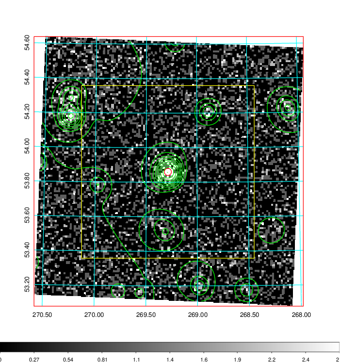  | 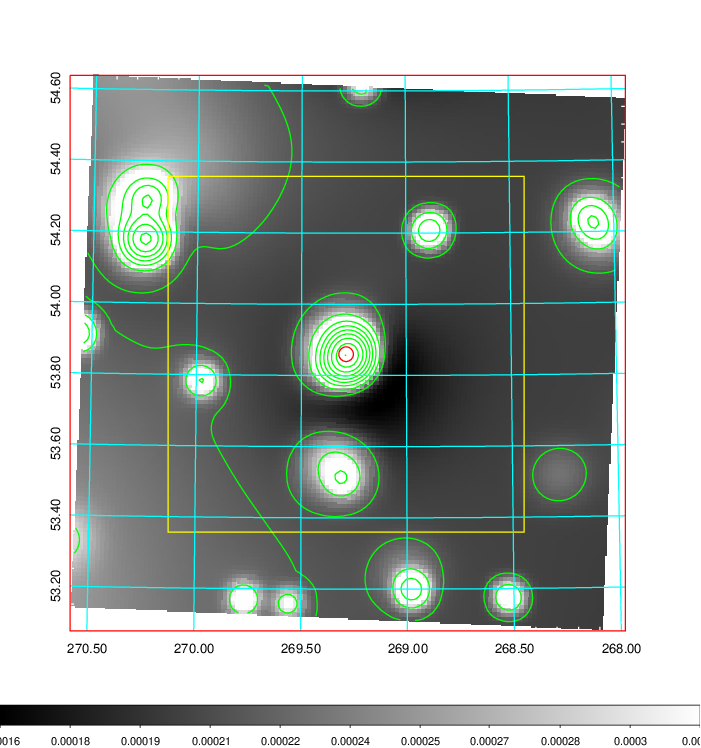   | 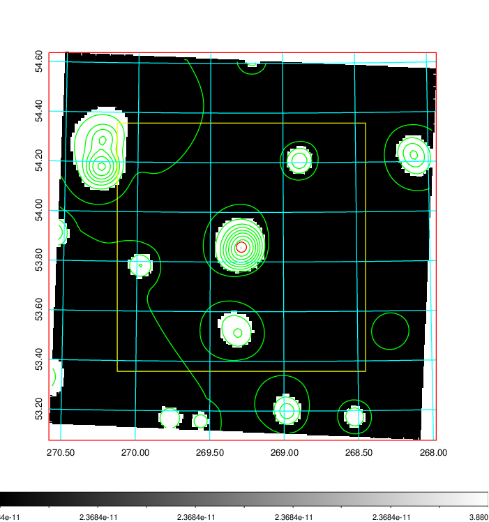  |

|[Exposure image](../image/756/756_mex.pdf)| [nH image](../image/756/756_nh.pdf)| [Planck image](../image/756/756_p.pdf)|
|-------------------|--------------------|-------------------|
|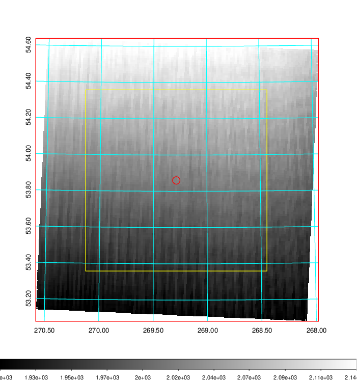   | 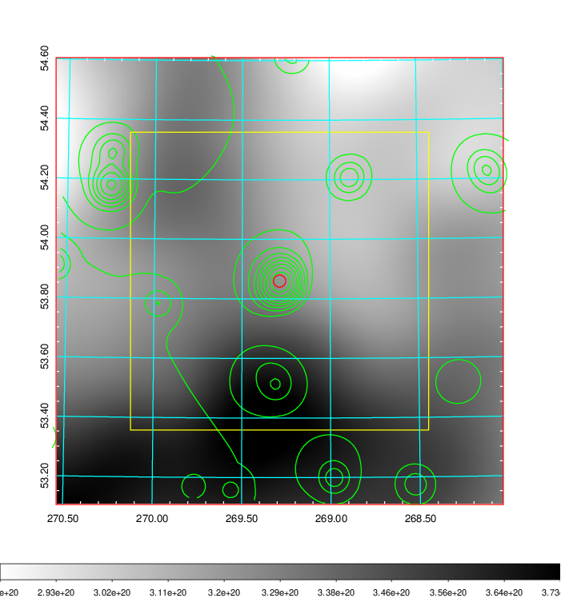    | 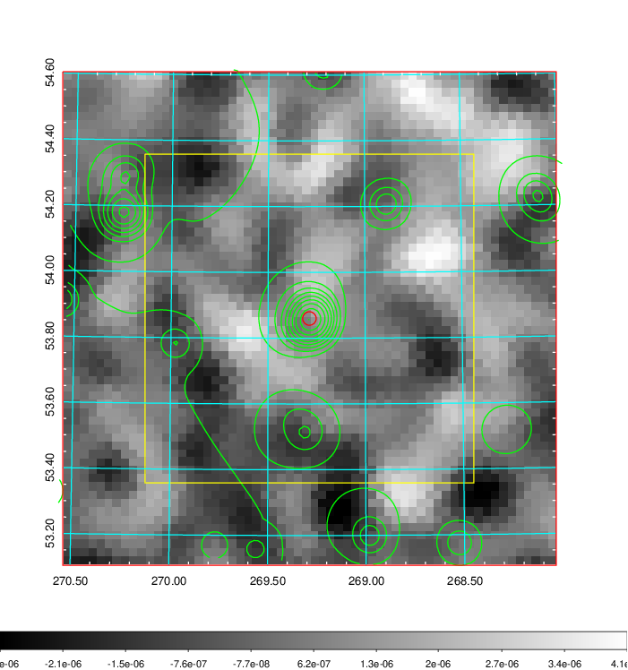 |

|[Redshift Histogram](../image/756/756_zg.pdf) | [DSS image(z1)](../image/756/756_dss_z1.pdf)      |  [DSS image(z2)](../image/756/756_dss_z2.pdf)    |
|-------------------|--------------------|-------------------|
|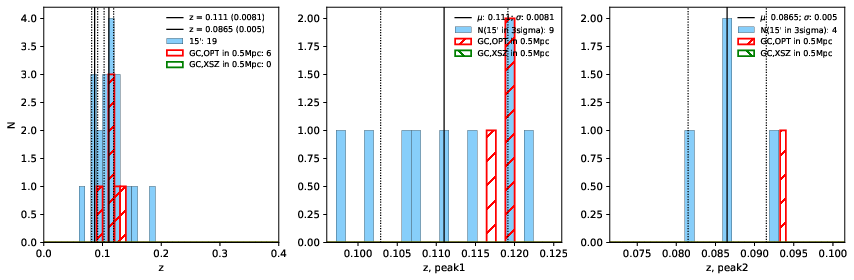 |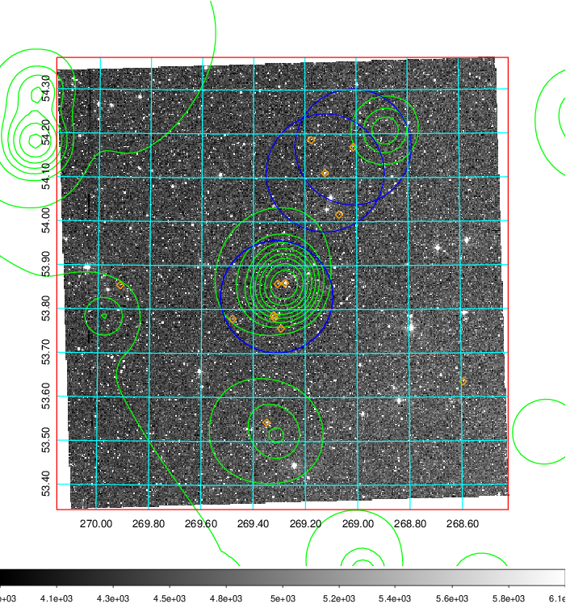  Blue circle for optical clusters;  Magenta circle for XSZ clusters;  all with r=1Mpc;  Only GC with Delta_z<0.01 are shown. | 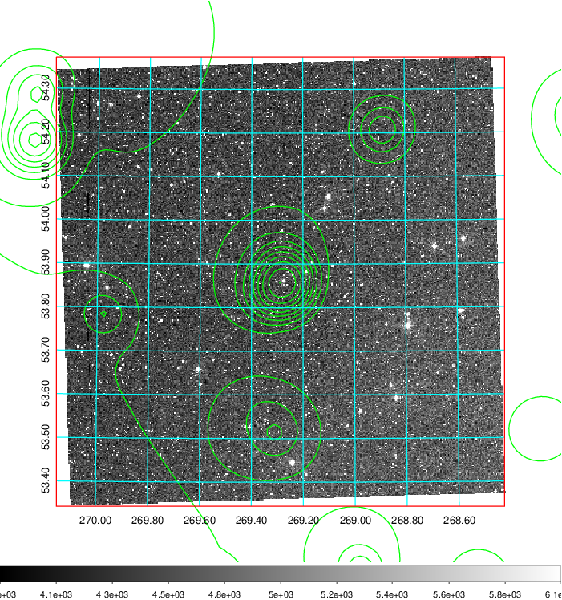 Blue circle for optical clusters;  Magenta circle for XSZ clusters;  all with r=1Mpc;  Only GC with Delta_z<0.01 are shown.  |

|[Previous-identified clusters](../image/756/756_gc.pdf) | [2MASS image](../image/756/756_2mass.pdf)      |[SDSS image](../image/756/756_sdss.pdf)   |
|-------------------|-------------------|-------------------|
|  Green, magenta, and blue circles  for optical, X-ray and SZ clusters  respectively, with redshift of clusters  labelled. The radius of circles  are 1Mpc.|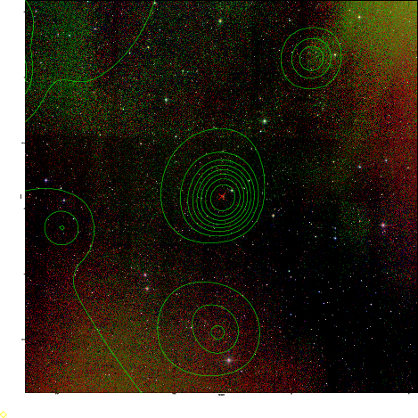  | 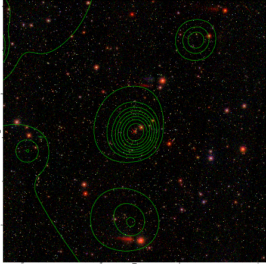  |

