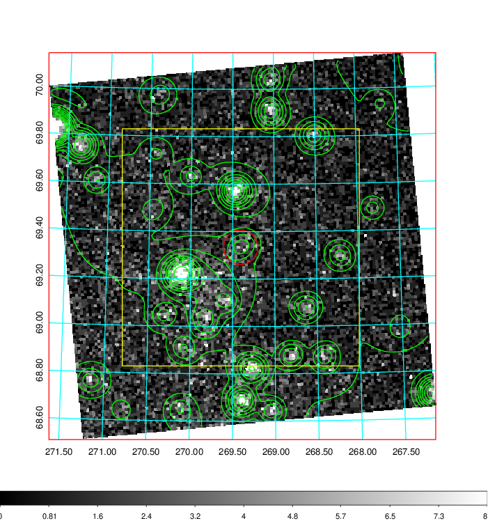
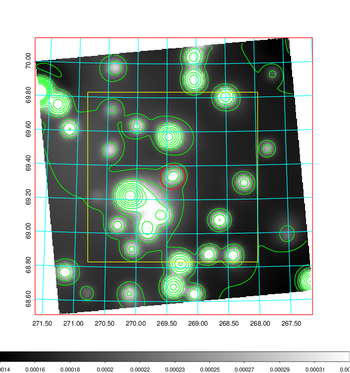
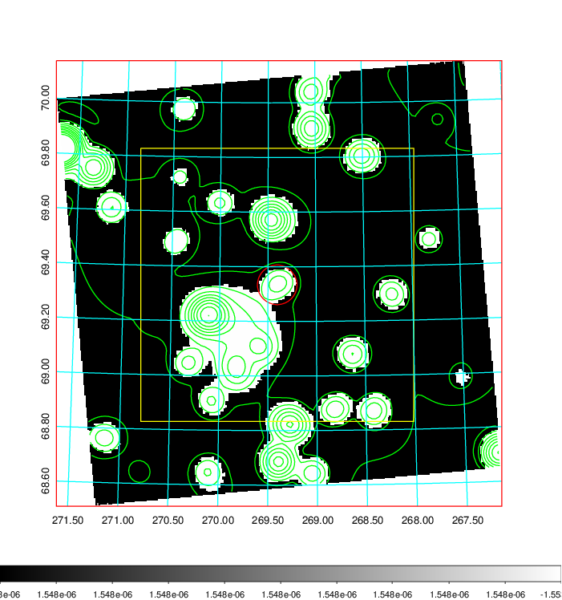
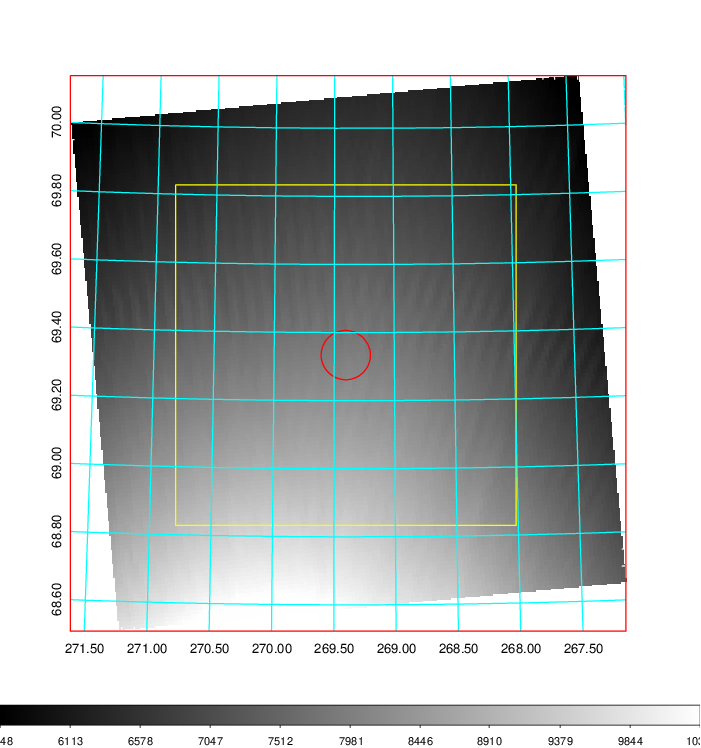
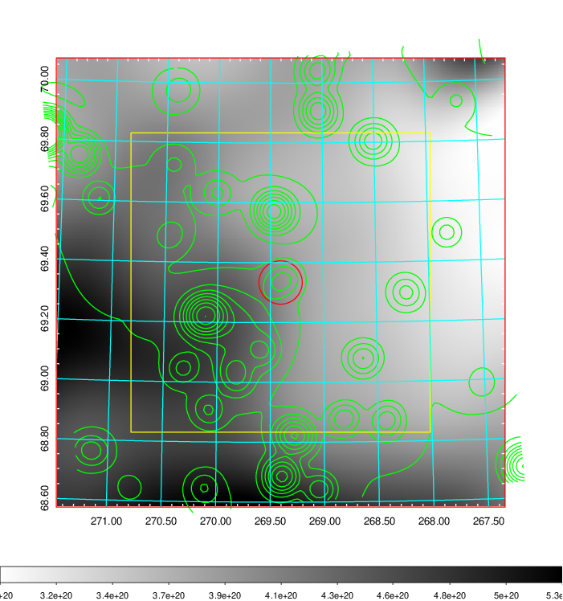
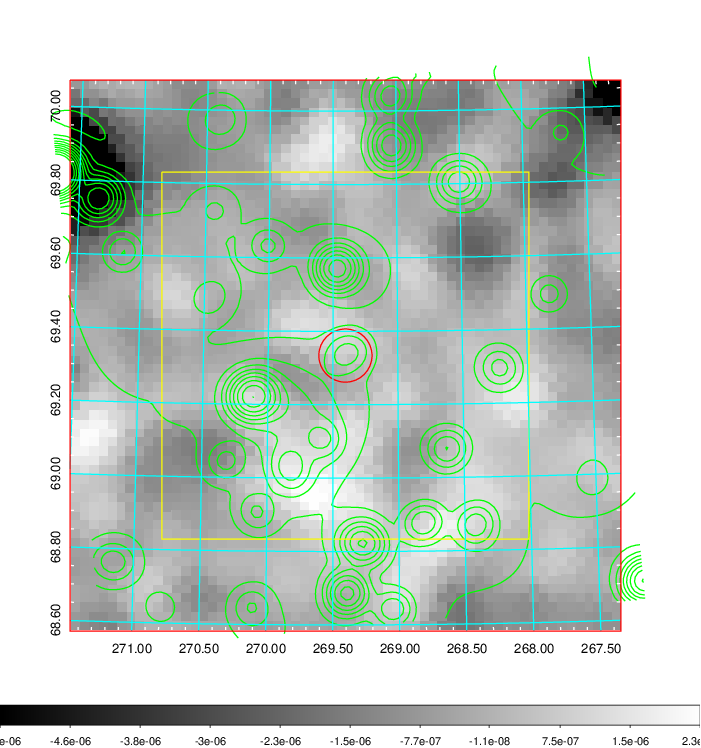
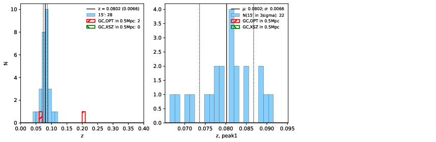
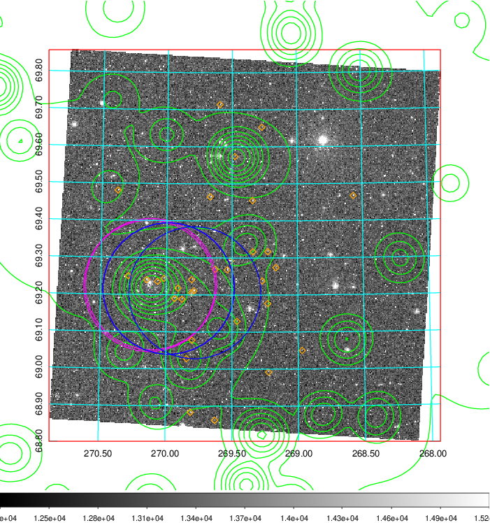
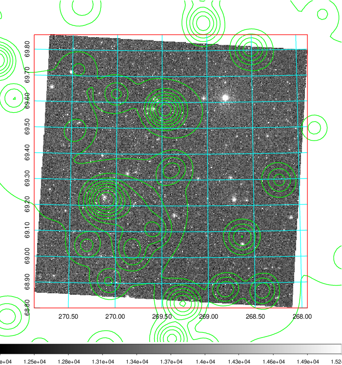
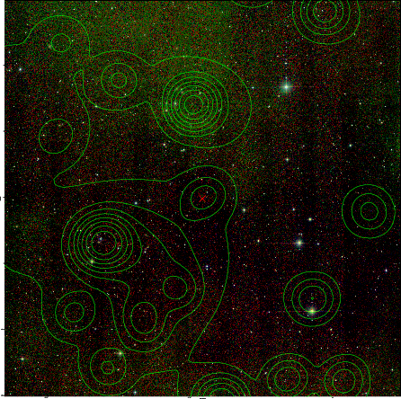

### 757

|Name|RAJ2000[deg]|DEJ2000[deg] |Ext[arcmin]| Ext,ml | z | z_src| C|GC(XSZ,Delta_z<0.01)| GC(OPT,Delta_z<0.01)|GC| R_sig[arcmin] | R500[arcmin] | R500[Mpc]| CRsig[c/s] | CR500[c/s] |L500[1E44 erg/s]|F500[1E-12 erg/s/cm^2]| M500[1E14 Msun]|Tx[keV]|Cnt_sig|Beta|Rc[arcmin]|Comment|Alias|
|---|---|---|---|---|---|------|---|--------|---------|----------|---|---|---|---|---|---|---|---|---|---|---|---|---|---|
|757| 269.404| 69.334| 4.35| 58.60| 0.0802(0.007)| z1,| G| -| -| A, L03, N, W| 14.162| 6.802| 0.618| 0.054(0.008)| 0.050(0.007)| 0.131(0.041)| 0.826(0.258)| 0.72(0.12)| 1.80(0.18)| 615.3| 0.501(-0.002+0.004)| 2.568(-0.072+0.343)| -| t221|

|[RASS image](../image/757/757_img.pdf)|[filtered image](../image/757/757_fil.pdf)|[Segment image](../image/757/757_seg.pdf)|
|-------------------|--------------------|-------------------|
|   |    |   |

|[Exposure image](../image/757/757_mex.pdf)| [nH image](../image/757/757_nh.pdf)| [Planck image](../image/757/757_p.pdf)|
|-------------------|--------------------|-------------------|
|   |     |  |

|[Redshift Histogram](../image/757/757_zg.pdf) | [DSS image(z1)](../image/757/757_dss_z1.pdf)      |  [DSS image(z2)](../image/757/757_dss_z2.pdf)    |
|-------------------|--------------------|-------------------|
| |  Blue circle for optical clusters;  Magenta circle for XSZ clusters;  all with r=1Mpc;  Only GC with Delta_z<0.01 are shown. |  Blue circle for optical clusters;  Magenta circle for XSZ clusters;  all with r=1Mpc;  Only GC with Delta_z<0.01 are shown.  |

|[known Abell/XSZ clusters](../image/757/757_gc.pdf) | [2MASS image](../image/757/757_2mass.pdf)      |
|-------------------|-------------------|
|  Magenta, blue and green circles  for optical, X-ray and SZ clusters  respectively, with redshift of clusters  labelled. The radius of circles  are 1Mpc.|  |

|[PS1 image](../image/757/757_ps1.pdf)            |
|-------------------|
|   |
