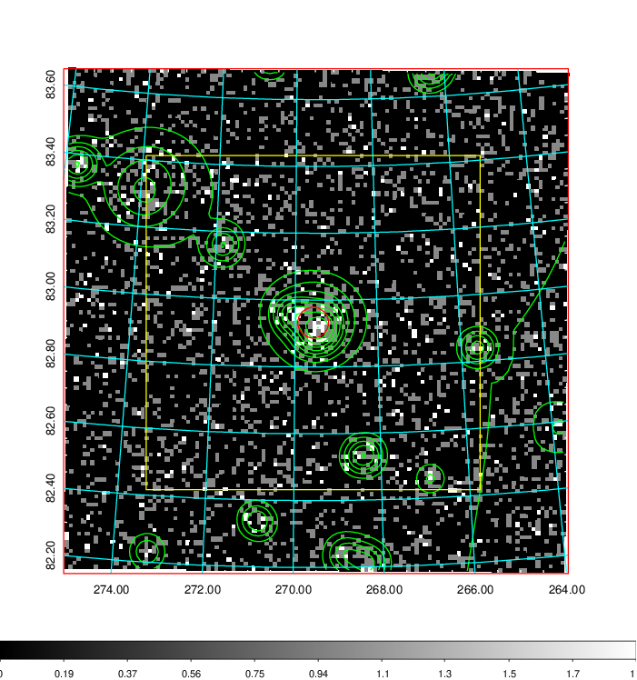
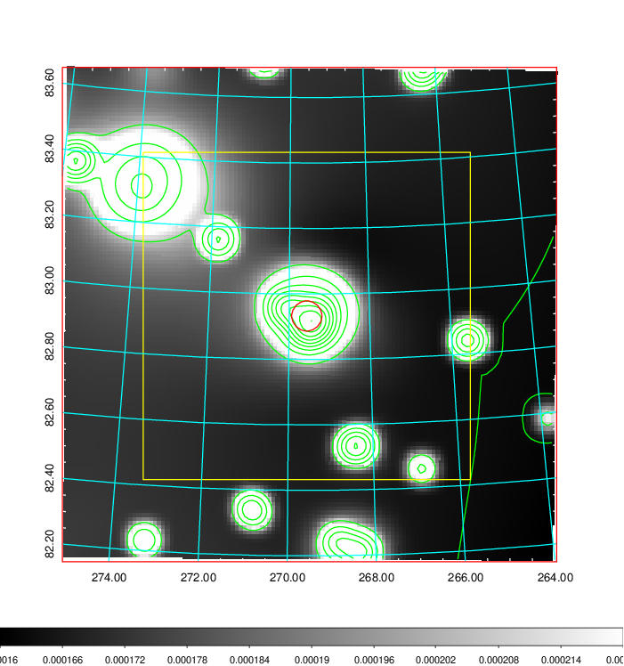
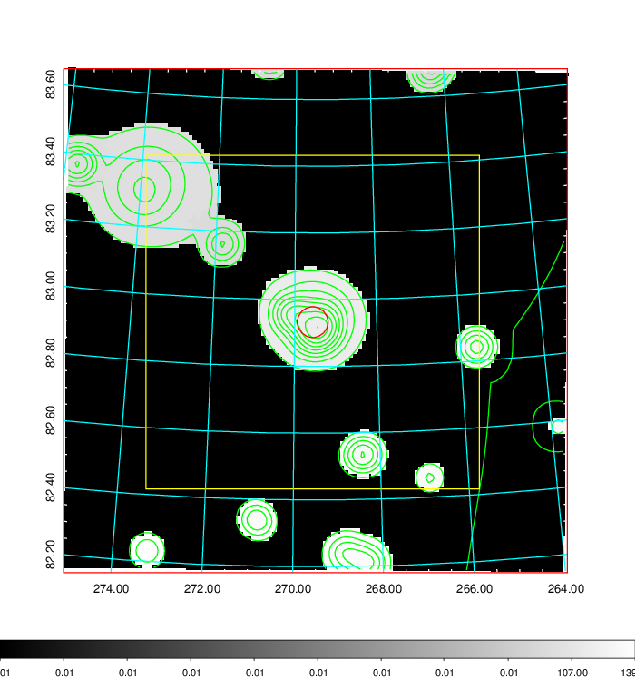
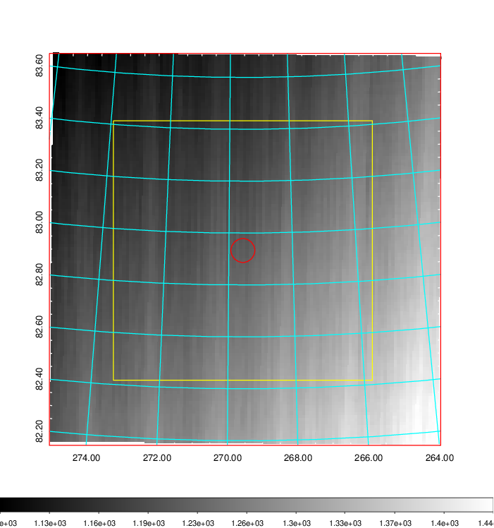
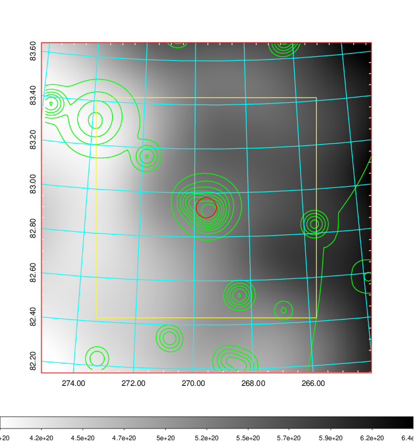
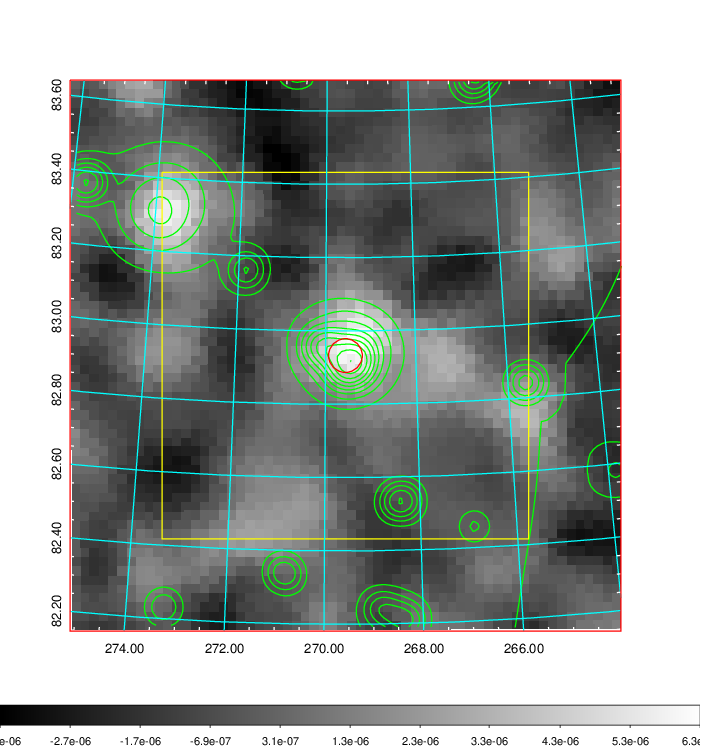
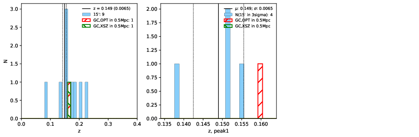
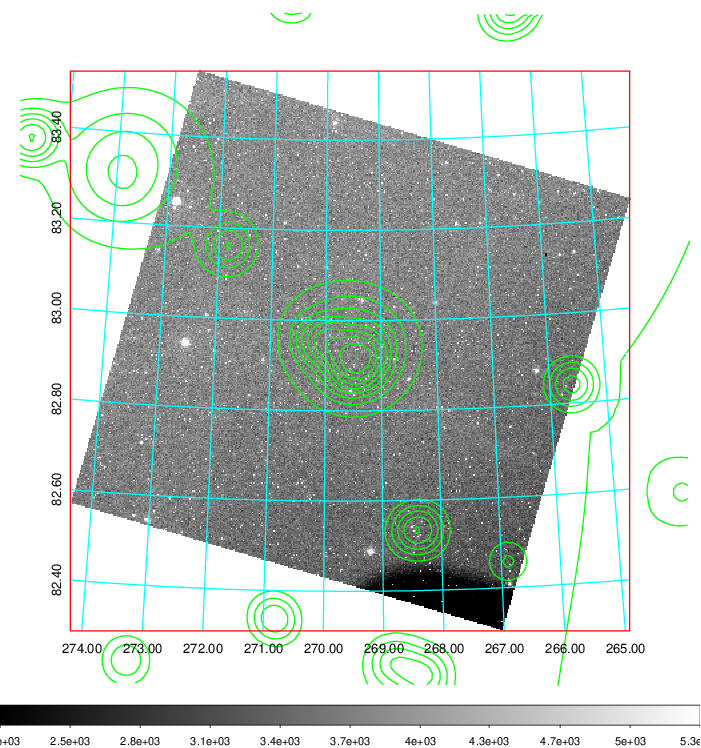
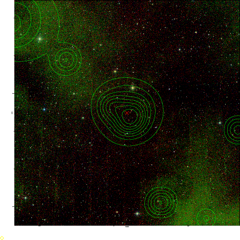

### 758

|Name|RAJ2000[deg]|DEJ2000[deg] |Ext[arcmin]| Ext,ml | z | z_src| C|GC(XSZ,Delta_z<0.01)| GC(OPT,Delta_z<0.01)|GC| R_sig[arcmin] | R500[arcmin] | R500[Mpc]| CRsig[c/s] | CR500[c/s] |L500[1E44 erg/s]|F500[1E-12 erg/s/cm^2]| M500[1E14 Msun]|Tx[keV]|Cnt_sig|Beta|Rc[arcmin]|Comment|Alias|
|---|---|---|---|---|---|------|---|--------|---------|----------|---|---|---|---|---|---|---|---|---|---|---|---|---|---|
|758| 269.560| 82.933| 2.76| 77.67| 0.1490(0.006)| z1,| G| -| -| A, Tar, W| 11.238| 5.765| 0.899| 0.101(0.019)| 0.093(0.018)| 1.011(0.095)| 1.686(0.158)| 2.39(0.11)| 3.84(0.11)| 158.0| 0.906(-0.105+0.067)| 4.667(-0.666+0.484)| An SZ cluster with $z$ = 0.169 and offset = 0.21 Mpc| t118|

|[RASS image](../image/758/758_img.pdf)|[filtered image](../image/758/758_fil.pdf)|[Segment image](../image/758/758_seg.pdf)|
|-------------------|--------------------|-------------------|
|   |    |   |

|[Exposure image](../image/758/758_mex.pdf)| [nH image](../image/758/758_nh.pdf)| [Planck image](../image/758/758_p.pdf)|
|-------------------|--------------------|-------------------|
|   |     |  |

|[Redshift Histogram](../image/758/758_zg.pdf) | [DSS image(z1)](../image/758/758_dss_z1.pdf)      |  [DSS image(z2)](../image/758/758_dss_z2.pdf)    |
|-------------------|--------------------|-------------------|
| |  Blue circle for optical clusters;  Magenta circle for XSZ clusters;  all with r=1Mpc;  Only GC with Delta_z<0.01 are shown. |  Blue circle for optical clusters;  Magenta circle for XSZ clusters;  all with r=1Mpc;  Only GC with Delta_z<0.01 are shown.  |

|[known Abell/XSZ clusters](../image/758/758_gc.pdf) | [2MASS image](../image/758/758_2mass.pdf)      |
|-------------------|-------------------|
|  Magenta, blue and green circles  for optical, X-ray and SZ clusters  respectively, with redshift of clusters  labelled. The radius of circles  are 1Mpc.|  |

|[PS1 image](../image/758/758_ps1.pdf)            |
|-------------------|
|   |
