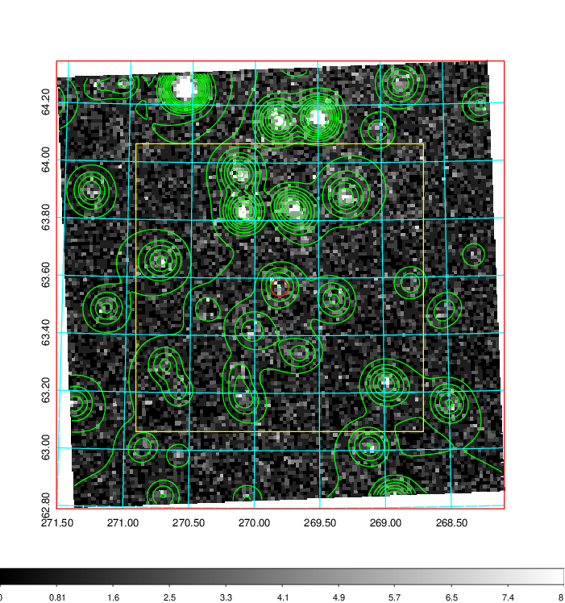
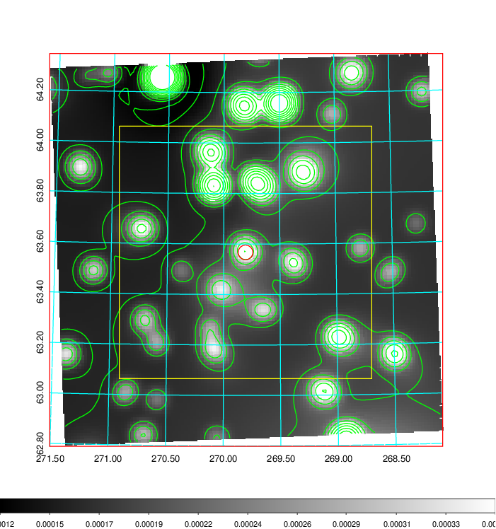
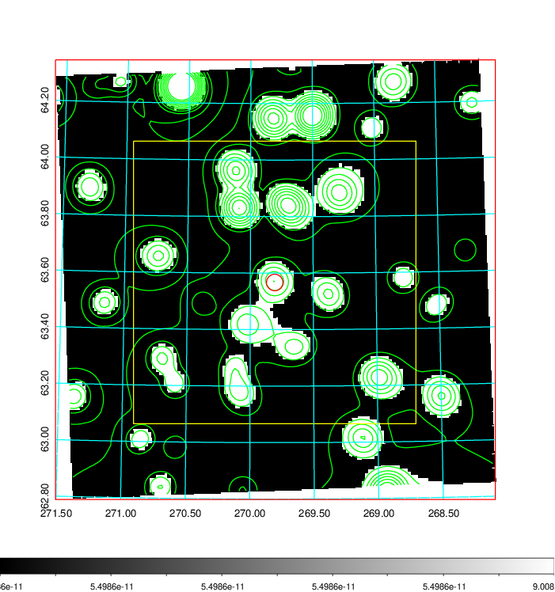
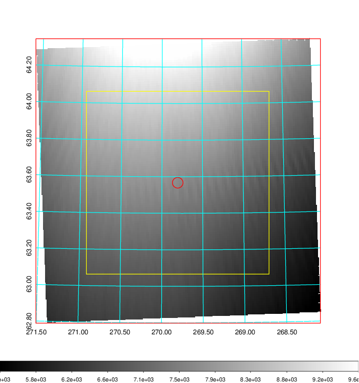
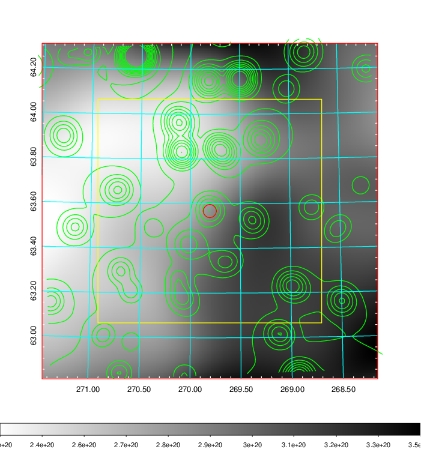
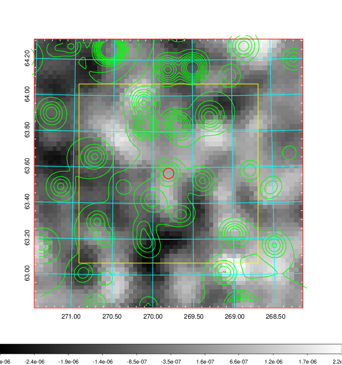
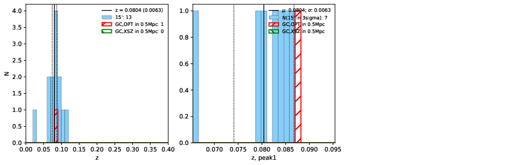
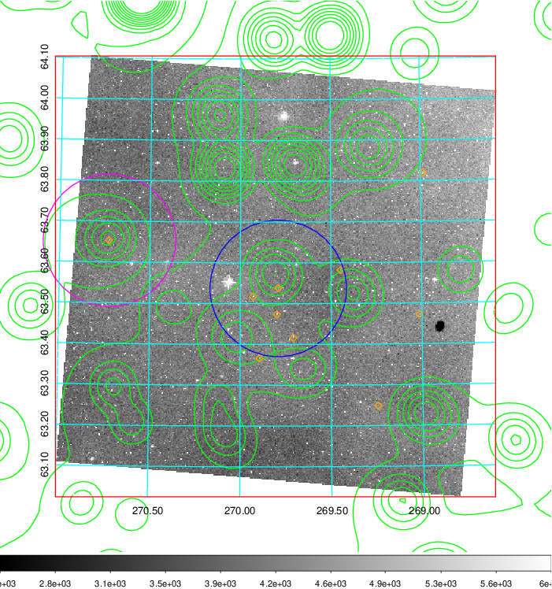
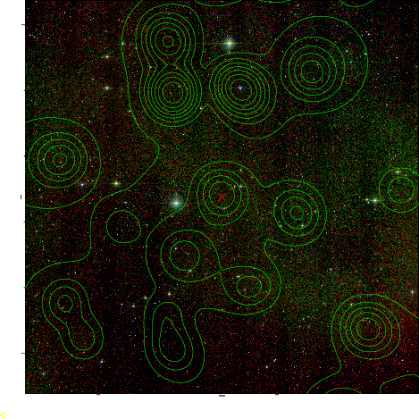
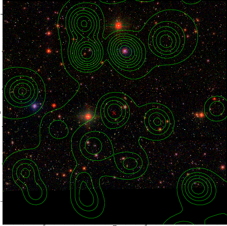

### 759

|Name|RAJ2000[deg]|DEJ2000[deg] |Ext[arcmin]| Ext,ml | z | z_src| C|GC(XSZ,Delta_z<0.01)| GC(OPT,Delta_z<0.01)|GC| R_sig[arcmin] | R500[arcmin] | R500[Mpc]| CRsig[c/s] | CR500[c/s] |L500[1E44 erg/s]|F500[1E-12 erg/s/cm^2]| M500[1E14 Msun]|Tx[keV]|Cnt_sig|Beta|Rc[arcmin]|Comment|Alias|
|---|---|---|---|---|---|------|---|--------|---------|----------|---|---|---|---|---|---|---|---|---|---|---|---|---|---|
|759| 269.806| 63.567| 1.75| 31.45| 0.0804(0.006)| z1, z_opt| S| -| W| C, N, W| 15.138| 6.978| 0.635| 0.063(0.007)| 0.057(0.007)| 0.160(0.047)| 1.004(0.295)| 0.79(0.12)| 1.89(0.18)| 489.8| 0.502(-0.002+0.003)| 2.758(-0.065+0.077)| -| t044|

|[RASS image](../image/759/759_img.pdf)|[filtered image](../image/759/759_fil.pdf)|[Segment image](../image/759/759_seg.pdf)|
|-------------------|--------------------|-------------------|
|   |    |   |

|[Exposure image](../image/759/759_mex.pdf)| [nH image](../image/759/759_nh.pdf)| [Planck image](../image/759/759_p.pdf)|
|-------------------|--------------------|-------------------|
|   |     |  |

|[Redshift Histogram](../image/759/759_zg.pdf) | [DSS image(z1)](../image/759/759_dss_z1.pdf)      |  [DSS image(z2)](../image/759/759_dss_z2.pdf)    |
|-------------------|--------------------|-------------------|
| |  Blue circle for optical clusters;  Magenta circle for XSZ clusters;  all with r=1Mpc;  Only GC with Delta_z<0.01 are shown. |  Blue circle for optical clusters;  Magenta circle for XSZ clusters;  all with r=1Mpc;  Only GC with Delta_z<0.01 are shown.  |

|[known Abell/XSZ clusters](../image/759/759_gc.pdf) | [2MASS image](../image/759/759_2mass.pdf)      |[SDSS image](../image/759/759_sdss.pdf)   |
|-------------------|-------------------|-------------------|
|  Magenta, blue and green circles  for optical, X-ray and SZ clusters  respectively, with redshift of clusters  labelled. The radius of circles  are 1Mpc.|  |   |

