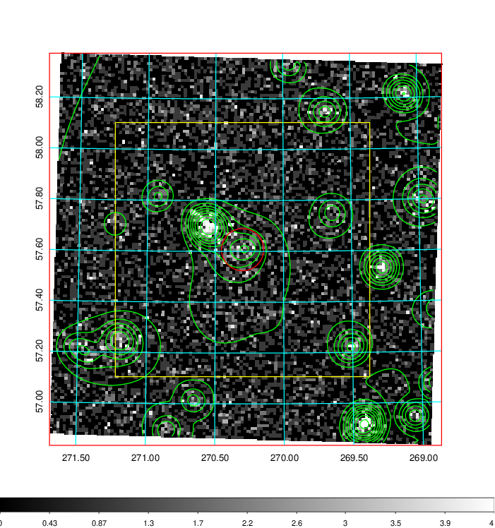
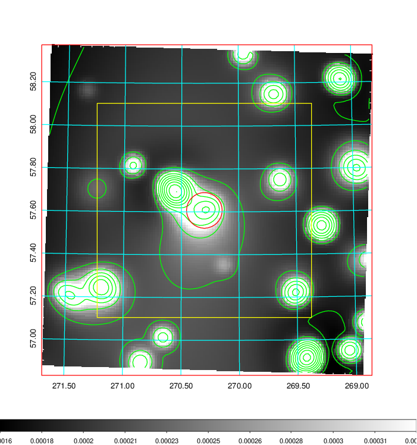
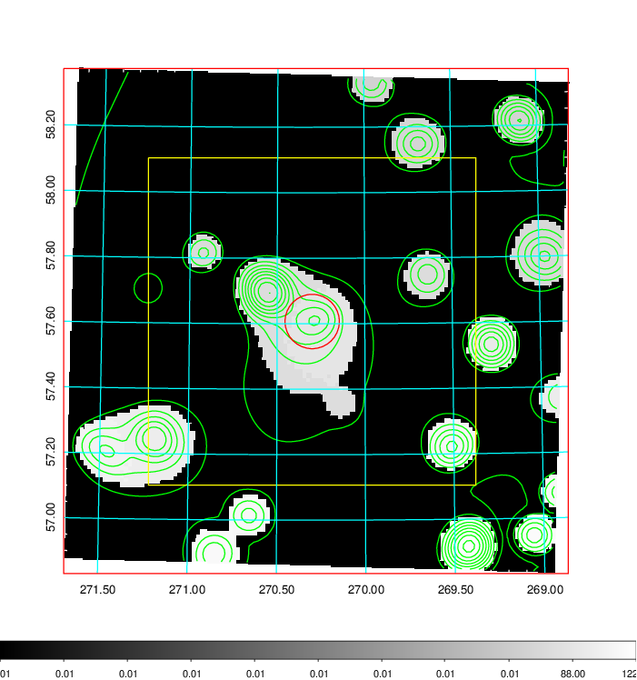
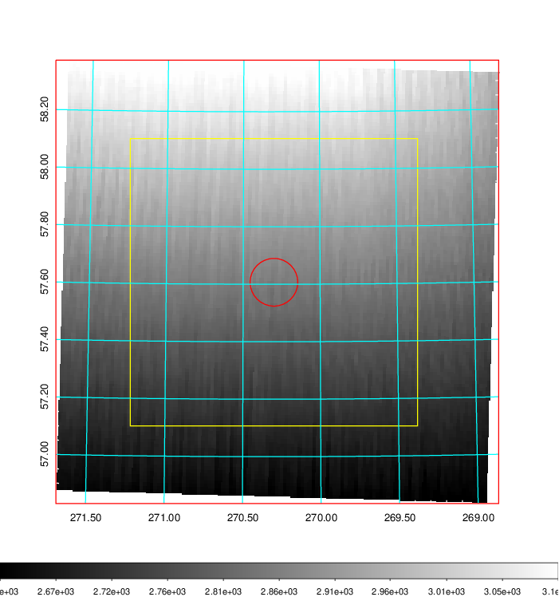
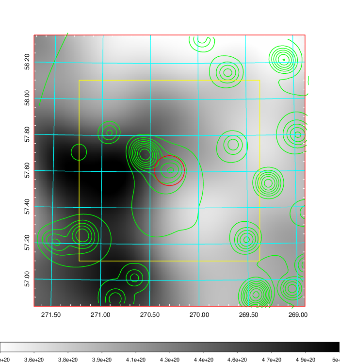
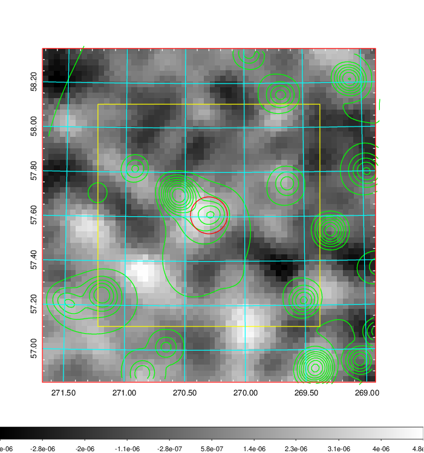
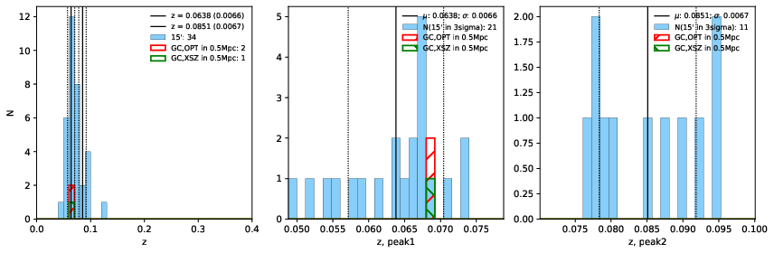
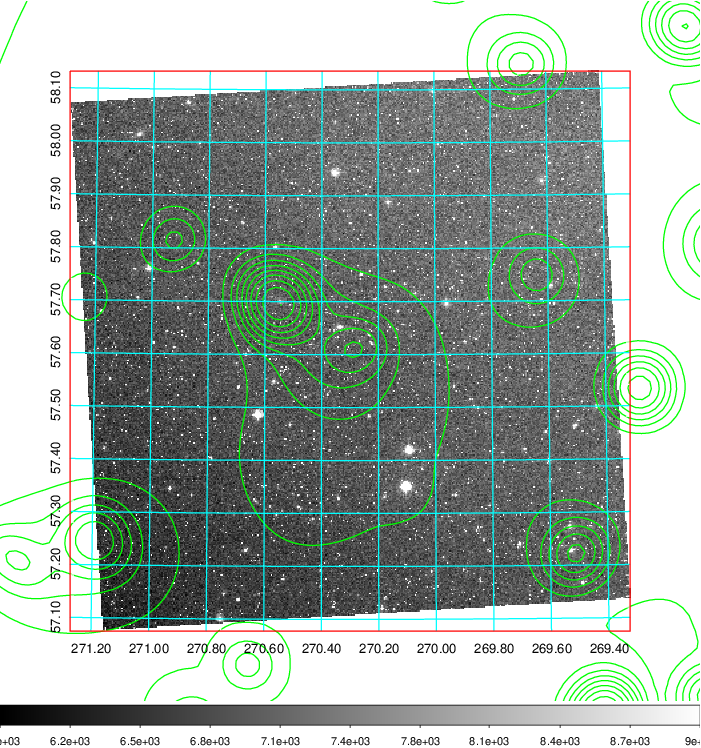
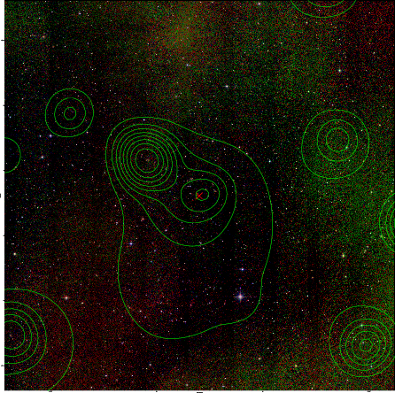

### 760

|Name|RAJ2000[deg]|DEJ2000[deg] |Ext[arcmin]| Ext,ml | z | z_src| C|GC(XSZ,Delta_z<0.01)| GC(OPT,Delta_z<0.01)|GC| R_sig[arcmin] | R500[arcmin] | R500[Mpc]| CRsig[c/s] | CR500[c/s] |L500[1E44 erg/s]|F500[1E-12 erg/s/cm^2]| M500[1E14 Msun]|Tx[keV]|Cnt_sig|Beta|Rc[arcmin]|Comment|Alias|
|---|---|---|---|---|---|------|---|--------|---------|----------|---|---|---|---|---|---|---|---|---|---|---|---|---|---|
|760| 270.300| 57.607| 4.98| 64.76| 0.0638(0.007)| z1, z_xsz| B| L03| A| A, L03, W| 14.650| 8.873| 0.653| 0.108(0.014)| 0.101(0.013)| 0.166(0.018)| 1.694(0.182)| 0.84(0.05)| 1.96(0.07)| 488.5| 0.753(-0.140+0.155)| 7.981(-1.754+1.572)| -| t259|

|[RASS image](../image/760/760_img.pdf)|[filtered image](../image/760/760_fil.pdf)|[Segment image](../image/760/760_seg.pdf)|
|-------------------|--------------------|-------------------|
|   |    |   |

|[Exposure image](../image/760/760_mex.pdf)| [nH image](../image/760/760_nh.pdf)| [Planck image](../image/760/760_p.pdf)|
|-------------------|--------------------|-------------------|
|   |     |  |

|[Redshift Histogram](../image/760/760_zg.pdf) | [DSS image(z1)](../image/760/760_dss_z1.pdf)      |  [DSS image(z2)](../image/760/760_dss_z2.pdf)    |
|-------------------|--------------------|-------------------|
| |  Blue circle for optical clusters;  Magenta circle for XSZ clusters;  all with r=1Mpc;  Only GC with Delta_z<0.01 are shown. |  Blue circle for optical clusters;  Magenta circle for XSZ clusters;  all with r=1Mpc;  Only GC with Delta_z<0.01 are shown.  |

|[known Abell/XSZ clusters](../image/760/760_gc.pdf) | [2MASS image](../image/760/760_2mass.pdf)      |
|-------------------|-------------------|
|  Magenta, blue and green circles  for optical, X-ray and SZ clusters  respectively, with redshift of clusters  labelled. The radius of circles  are 1Mpc.|  |

|[PS1 image](../image/760/760_ps1.pdf)            |
|-------------------|
|   |
