

### 761

|Name|RAJ2000[deg]|DEJ2000[deg] |Ext[arcmin]| Ext,ml | z | z_src| C|GC(XSZ,Delta_z<0.01)| GC(OPT,Delta_z<0.01)|GC| R_sig[arcmin] | R500[arcmin] | R500[Mpc]| CRsig[c/s] | CR500[c/s] |L500[1E44 erg/s]|F500[1E-12 erg/s/cm^2]| M500[1E14 Msun]|Tx[keV]|Cnt_sig|Beta|Rc[arcmin]|Comment|Alias|
|---|---|---|---|---|---|------|---|--------|---------|----------|---|---|---|---|---|---|---|---|---|---|---|---|---|---|
|761| 270.691| 42.803| 2.10| 30.14| 0.0537(0.006)| z1, z_xsz| B| MCXC| N, W| MCXC, N, W| 11.725| 9.988| 0.626| 0.124(0.025)| 0.121(0.024)| 0.142(0.022)| 2.074(0.325)| 0.74(0.06)| 1.80(0.09)| 180.0| 0.598(-0.067+0.133)| 2.403(-0.664+1.078)| -| k235|

|[RASS image](../image/761/761_img.pdf)|[filtered image](../image/761/761_fil.pdf)|[Segment image](../image/761/761_seg.pdf)|
|-------------------|--------------------|-------------------|
| 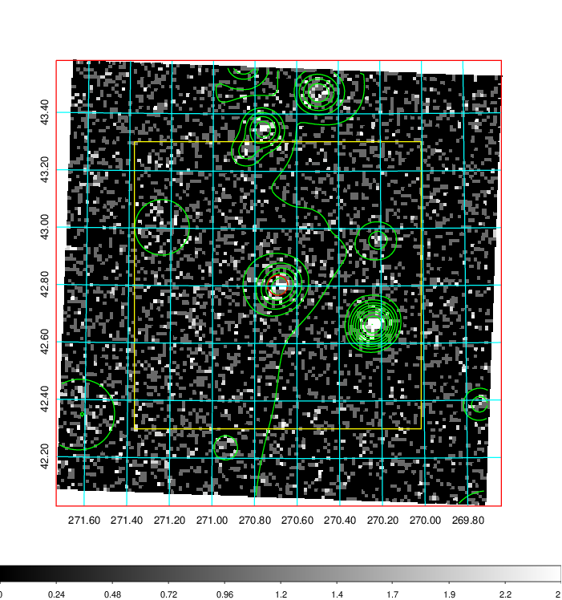  | 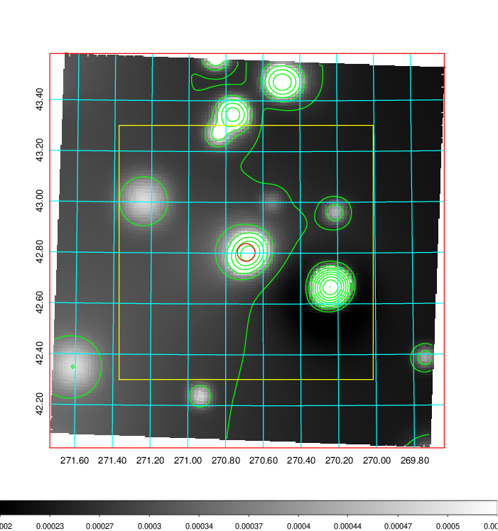   | 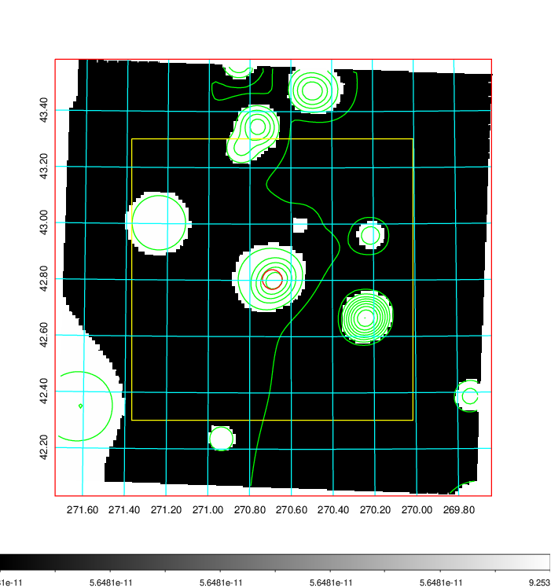  |

|[Exposure image](../image/761/761_mex.pdf)| [nH image](../image/761/761_nh.pdf)| [Planck image](../image/761/761_p.pdf)|
|-------------------|--------------------|-------------------|
|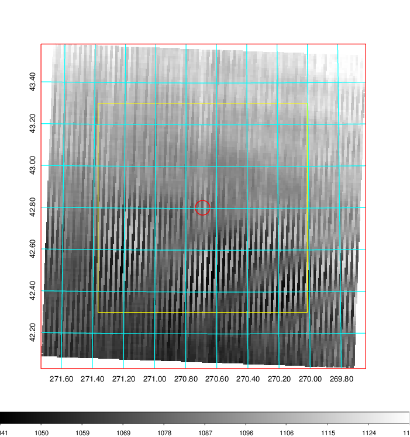   | 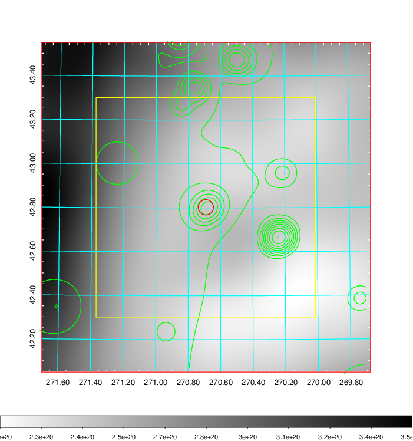    | 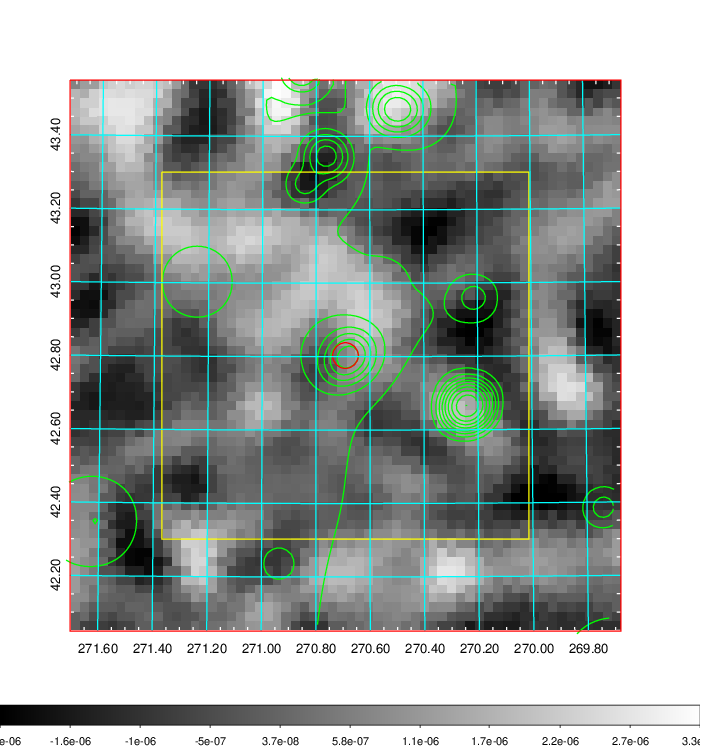 |

|[Redshift Histogram](../image/761/761_zg.pdf) | [DSS image(z1)](../image/761/761_dss_z1.pdf)      |  [DSS image(z2)](../image/761/761_dss_z2.pdf)    |
|-------------------|--------------------|-------------------|
|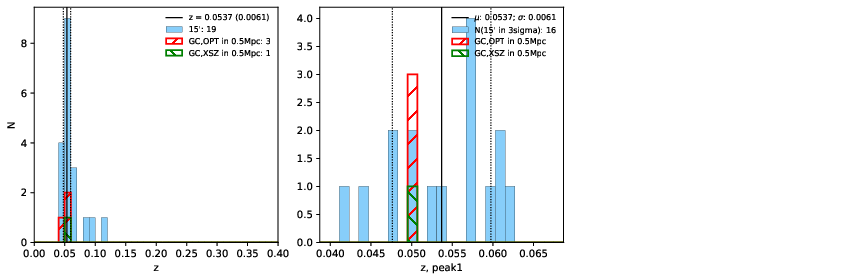 |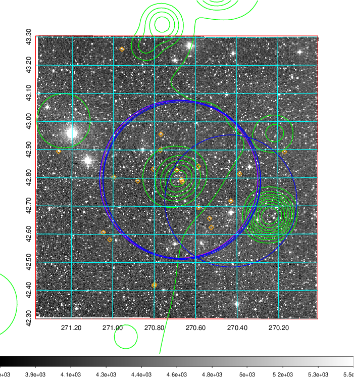  Blue circle for optical clusters;  Magenta circle for XSZ clusters;  all with r=1Mpc;  Only GC with Delta_z<0.01 are shown. | 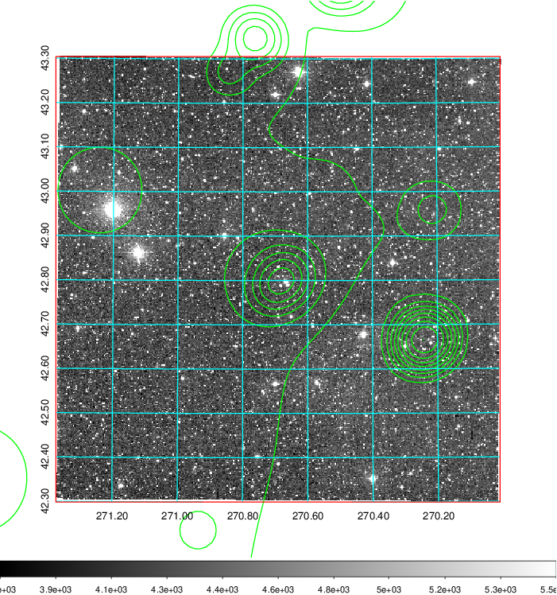 Blue circle for optical clusters;  Magenta circle for XSZ clusters;  all with r=1Mpc;  Only GC with Delta_z<0.01 are shown.  |

|[Previous-identified clusters](../image/761/761_gc.pdf) | [2MASS image](../image/761/761_2mass.pdf)      |[SDSS image](../image/761/761_sdss.pdf)   |
|-------------------|-------------------|-------------------|
|  Green, magenta, and blue circles  for optical, X-ray and SZ clusters  respectively, with redshift of clusters  labelled. The radius of circles  are 1Mpc.|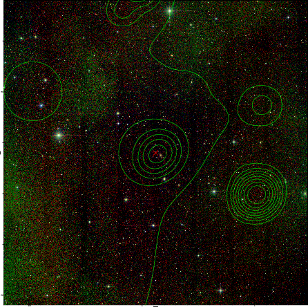  | 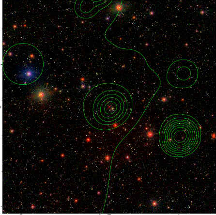  |

