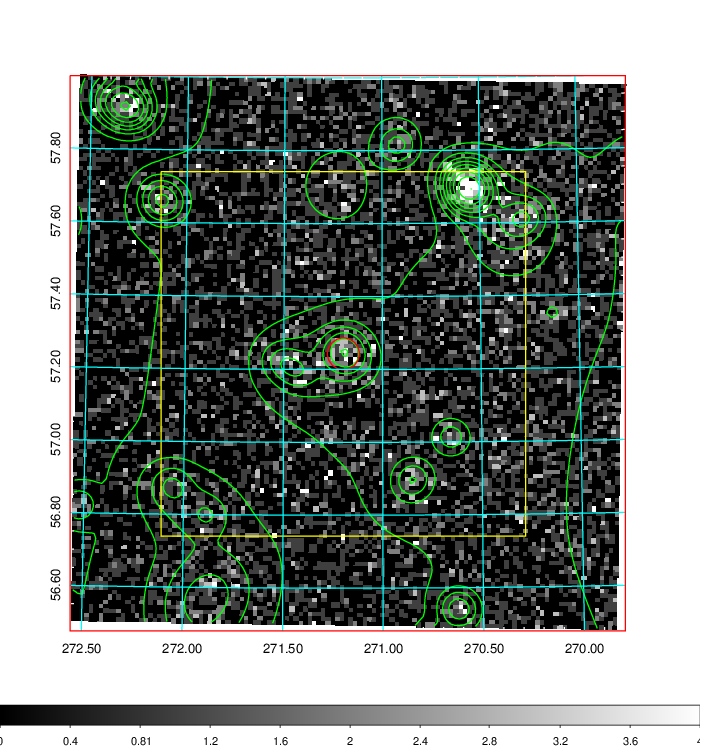
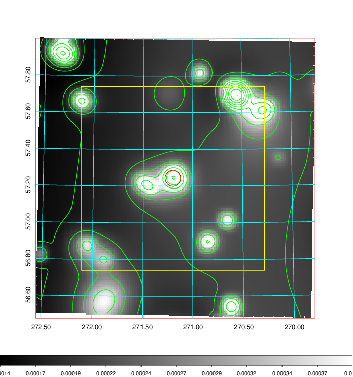
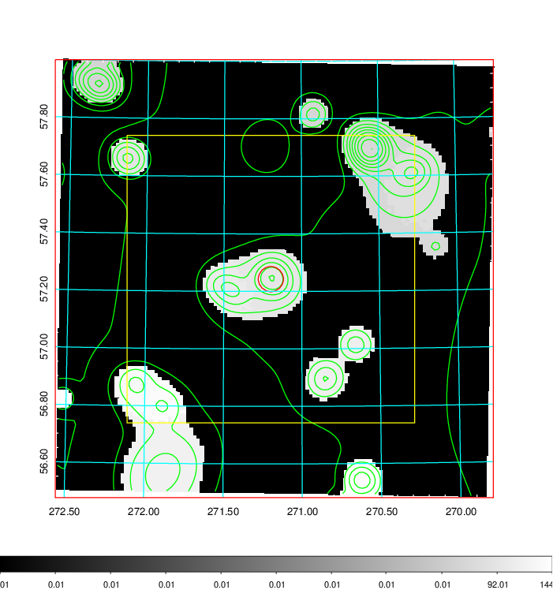
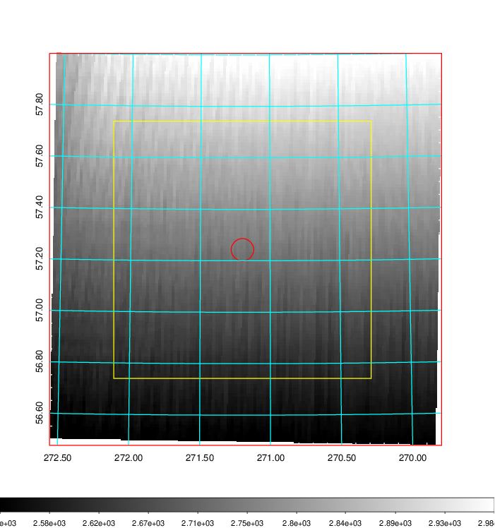
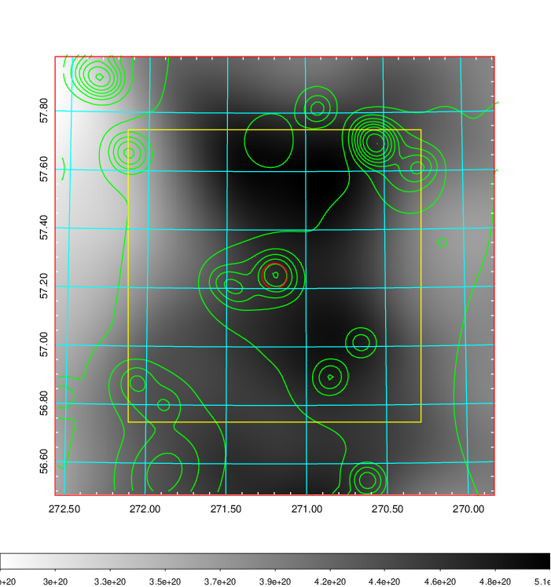
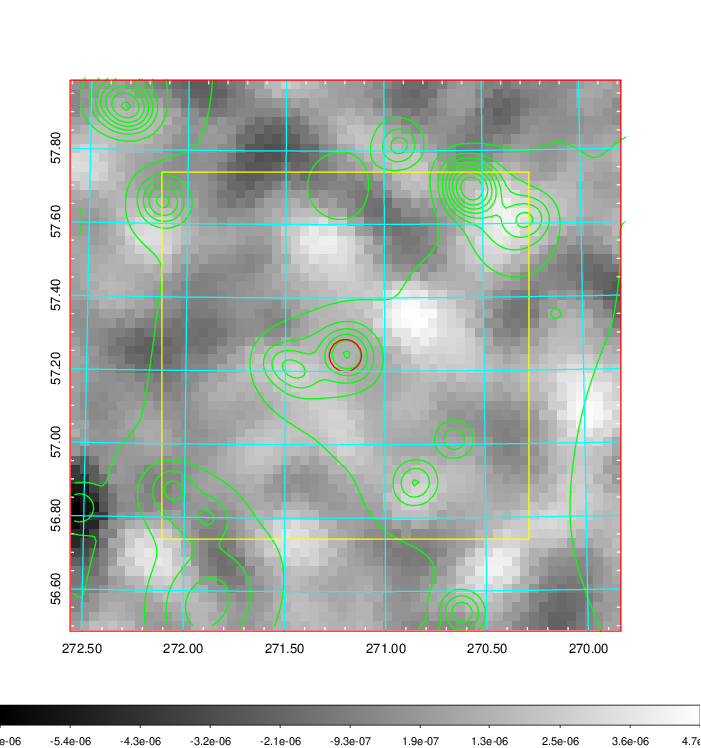
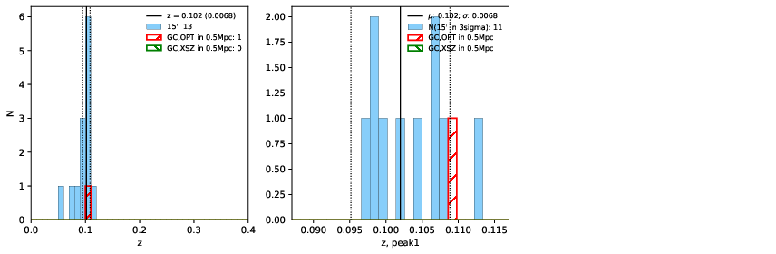
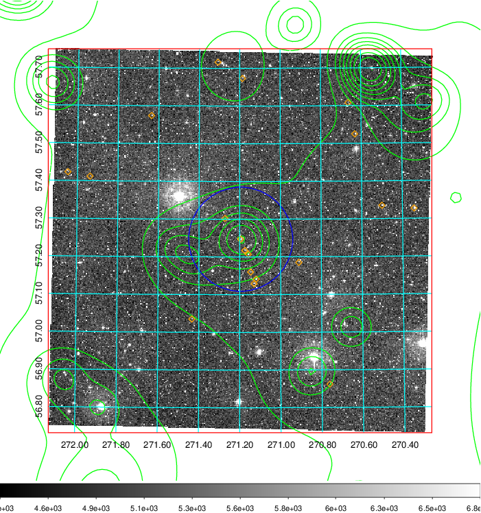
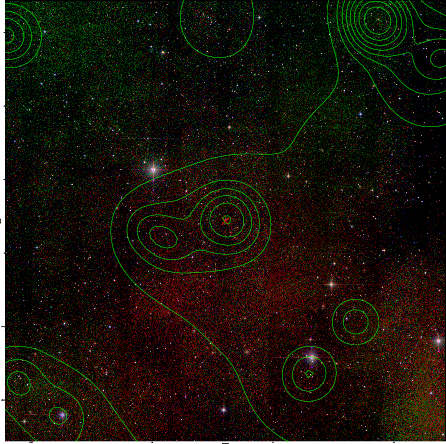

### 762

|Name|RAJ2000[deg]|DEJ2000[deg] |Ext[arcmin]| Ext,ml | z | z_src| C|GC(XSZ,Delta_z<0.01)| GC(OPT,Delta_z<0.01)|GC| R_sig[arcmin] | R500[arcmin] | R500[Mpc]| CRsig[c/s] | CR500[c/s] |L500[1E44 erg/s]|F500[1E-12 erg/s/cm^2]| M500[1E14 Msun]|Tx[keV]|Cnt_sig|Beta|Rc[arcmin]|Comment|Alias|
|---|---|---|---|---|---|------|---|--------|---------|----------|---|---|---|---|---|---|---|---|---|---|---|---|---|---|
|762| 271.198| 57.243| 2.62| 51.47| 0.1020(0.007)| z1, z_opt| S| -| W| W| 15.625| 5.919| 0.667| 0.048(0.013)| 0.044(0.012)| 0.201(0.035)| 0.759(0.133)| 0.93(0.08)| 2.11(0.12)| 259.7| 0.856(-0.141+0.101)| 3.880(-0.868+0.632)| -| t109|

|[RASS image](../image/762/762_img.pdf)|[filtered image](../image/762/762_fil.pdf)|[Segment image](../image/762/762_seg.pdf)|
|-------------------|--------------------|-------------------|
|   |    |   |

|[Exposure image](../image/762/762_mex.pdf)| [nH image](../image/762/762_nh.pdf)| [Planck image](../image/762/762_p.pdf)|
|-------------------|--------------------|-------------------|
|   |     |  |

|[Redshift Histogram](../image/762/762_zg.pdf) | [DSS image(z1)](../image/762/762_dss_z1.pdf)      |  [DSS image(z2)](../image/762/762_dss_z2.pdf)    |
|-------------------|--------------------|-------------------|
| |  Blue circle for optical clusters;  Magenta circle for XSZ clusters;  all with r=1Mpc;  Only GC with Delta_z<0.01 are shown. |  Blue circle for optical clusters;  Magenta circle for XSZ clusters;  all with r=1Mpc;  Only GC with Delta_z<0.01 are shown.  |

|[known Abell/XSZ clusters](../image/762/762_gc.pdf) | [2MASS image](../image/762/762_2mass.pdf)      |
|-------------------|-------------------|
|  Magenta, blue and green circles  for optical, X-ray and SZ clusters  respectively, with redshift of clusters  labelled. The radius of circles  are 1Mpc.|  |

|[PS1 image](../image/762/762_ps1.pdf)            |
|-------------------|
|   |
