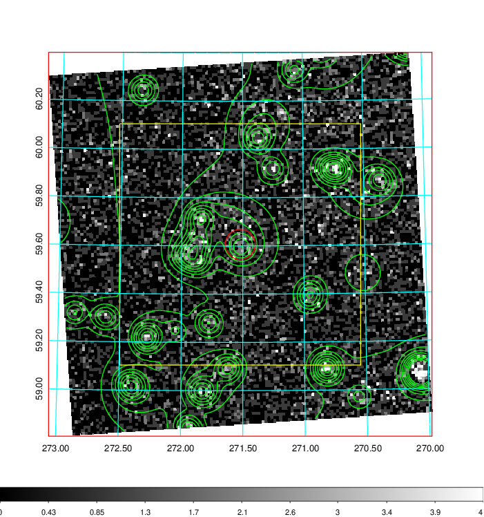
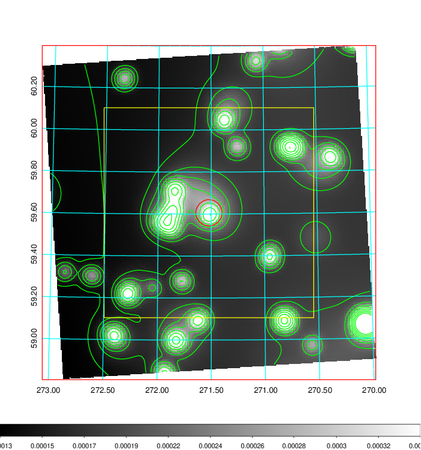
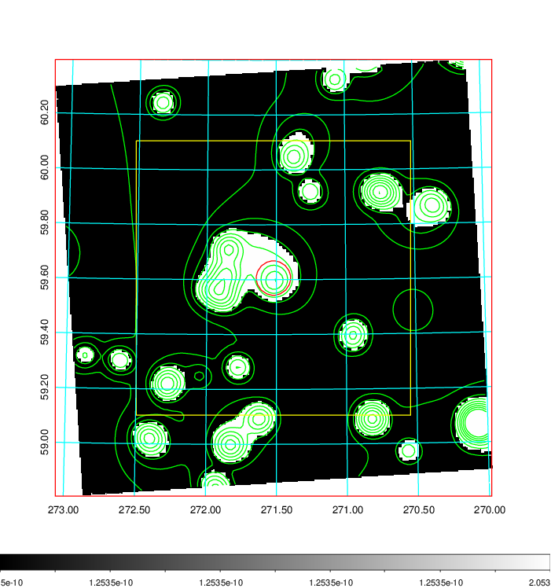
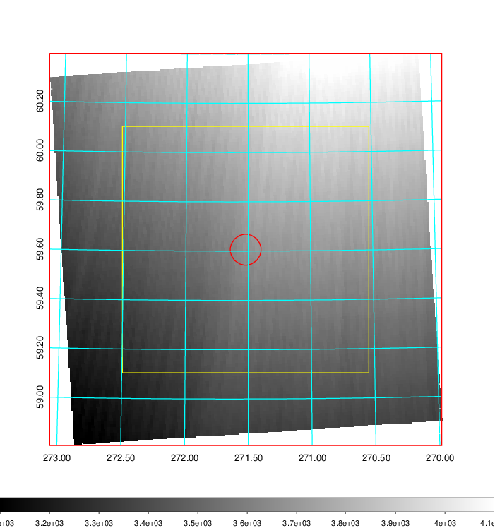
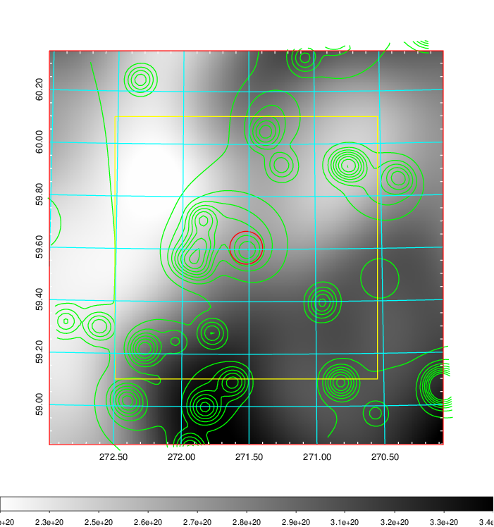
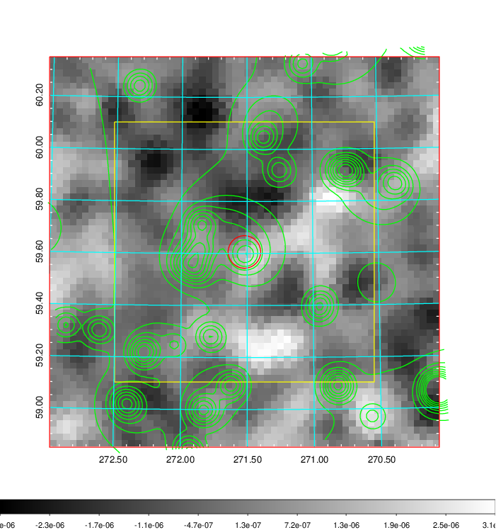
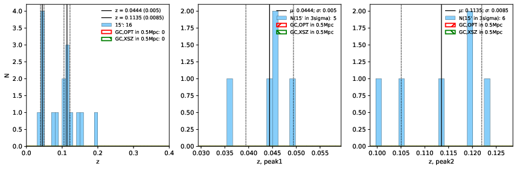
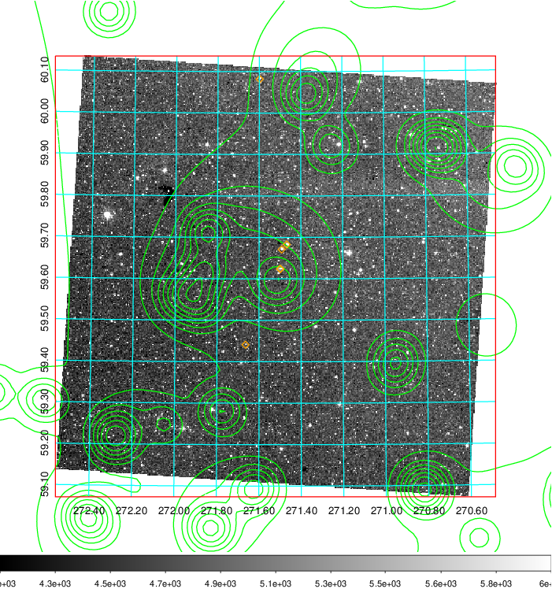
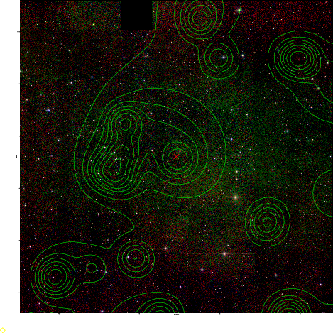
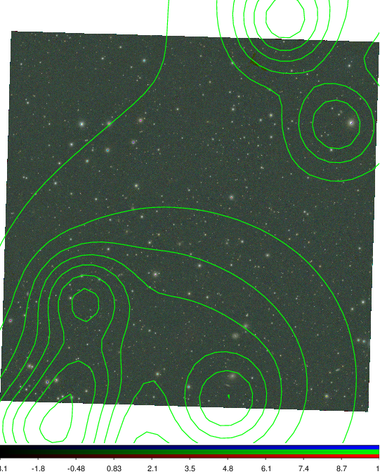

### 764

|Name|RAJ2000[deg]|DEJ2000[deg] |Ext[arcmin]| Ext,ml | z | z_src| C|GC(XSZ,Delta_z<0.01)| GC(OPT,Delta_z<0.01)|GC| R_sig[arcmin] | R500[arcmin] | R500[Mpc]| CRsig[c/s] | CR500[c/s] |L500[1E44 erg/s]|F500[1E-12 erg/s/cm^2]| M500[1E14 Msun]|Tx[keV]|Cnt_sig|Beta|Rc[arcmin]|Comment|Alias|
|---|---|---|---|---|---|------|---|--------|---------|----------|---|---|---|---|---|---|---|---|---|---|---|---|---|---|
|764| 271.521| 59.606| 3.76| 28.48| 0.0444(0.005)| z1,| G| -| -| W| 20.256| 9.762| 0.512| 0.077(0.016)| 0.071(0.015)| 0.047(0.012)| 1.022(0.268)| 0.40(0.05)| 1.23(0.10)| 287.3| 0.504(-0.004+0.009)| 3.463(-0.110+0.066)| -| t178|

|[RASS image](../image/764/764_img.pdf)|[filtered image](../image/764/764_fil.pdf)|[Segment image](../image/764/764_seg.pdf)|
|-------------------|--------------------|-------------------|
|   |    |   |

|[Exposure image](../image/764/764_mex.pdf)| [nH image](../image/764/764_nh.pdf)| [Planck image](../image/764/764_p.pdf)|
|-------------------|--------------------|-------------------|
|   |     |  |

|[Redshift Histogram](../image/764/764_zg.pdf) | [DSS image(z1)](../image/764/764_dss_z1.pdf)      |  [DSS image(z2)](../image/764/764_dss_z2.pdf)    |
|-------------------|--------------------|-------------------|
| |  Blue circle for optical clusters;  Magenta circle for XSZ clusters;  all with r=1Mpc;  Only GC with Delta_z<0.01 are shown. |  Blue circle for optical clusters;  Magenta circle for XSZ clusters;  all with r=1Mpc;  Only GC with Delta_z<0.01 are shown.  |

|[Previous-identified clusters](../image/764/764_gc.pdf) | [2MASS image](../image/764/764_2mass.pdf)      |
|-------------------|-------------------|
|  Green, magenta, and blue circles  for optical, X-ray and SZ clusters  respectively, with redshift of clusters  labelled. The radius of circles  are 1Mpc.|  |

|[PS1 image](../image/764/764_ps1.pdf)            |
|-------------------|
|   |
