

### 765

|Name|RAJ2000[deg]|DEJ2000[deg] |Ext[arcmin]| Ext,ml | z | z_src| C|GC(XSZ,Delta_z<0.01)| GC(OPT,Delta_z<0.01)|GC| R_sig[arcmin] | R500[arcmin] | R500[Mpc]| CRsig[c/s] | CR500[c/s] |L500[1E44 erg/s]|F500[1E-12 erg/s/cm^2]| M500[1E14 Msun]|Tx[keV]|Cnt_sig|Beta|Rc[arcmin]|Comment|Alias|
|---|---|---|---|---|---|------|---|--------|---------|----------|---|---|---|---|---|---|---|---|---|---|---|---|---|---|
|765| 271.642| 42.347| 36.57| 299.07| 0.1113(0.009)| z1, z_opt| S| -| W| A, W| 6.850| 5.583| 0.679| 0.043(0.024)| 0.042(0.023)| 0.240(0.097)| 0.754(0.305)| 0.99(0.20)| 2.20(0.29)| 73.9| 0.831(-0.165+0.121)| 5.373(-1.165+0.828)| -| t664|

|[RASS image](../image/765/765_img.pdf)|[filtered image](../image/765/765_fil.pdf)|[Segment image](../image/765/765_seg.pdf)|
|-------------------|--------------------|-------------------|
| 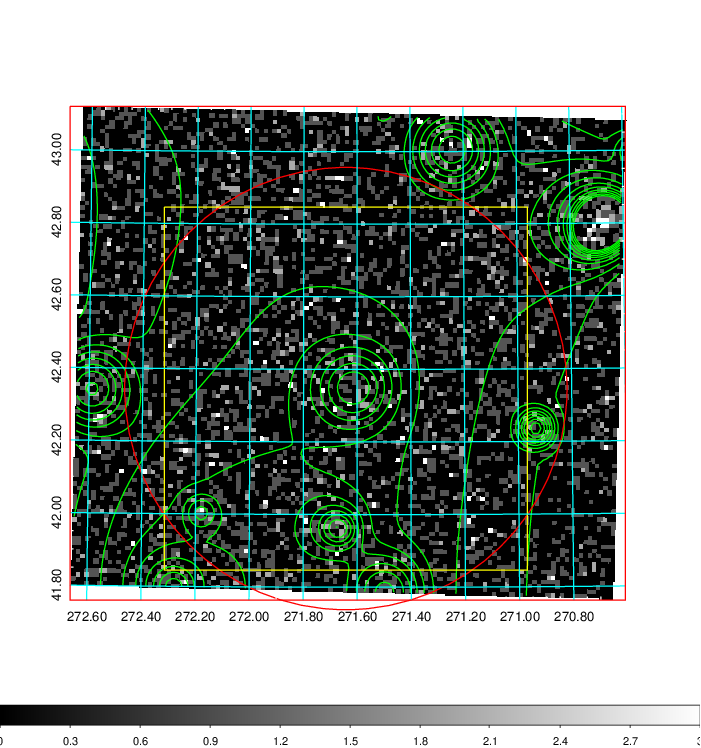  | 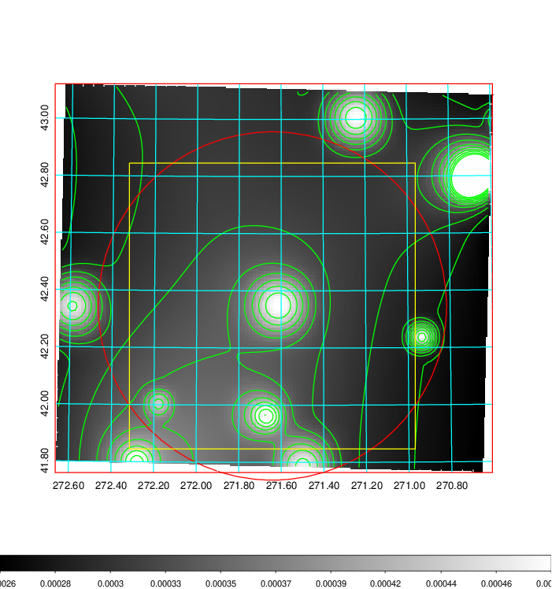   | 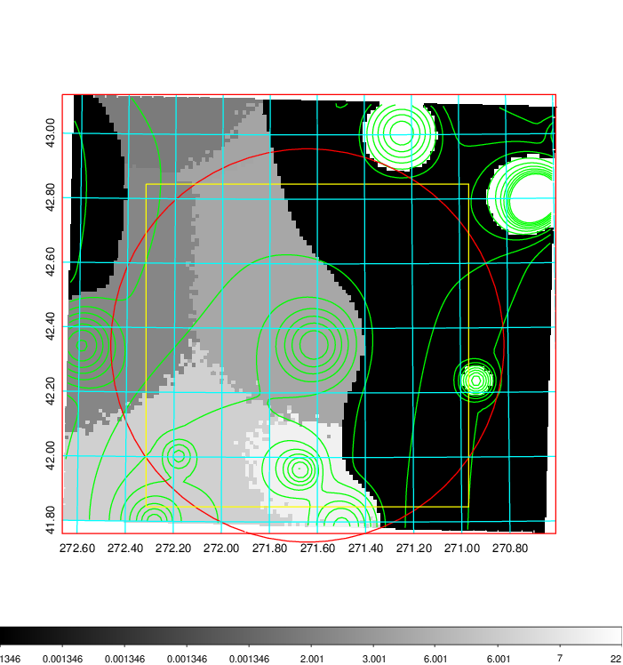  |

|[Exposure image](../image/765/765_mex.pdf)| [nH image](../image/765/765_nh.pdf)| [Planck image](../image/765/765_p.pdf)|
|-------------------|--------------------|-------------------|
|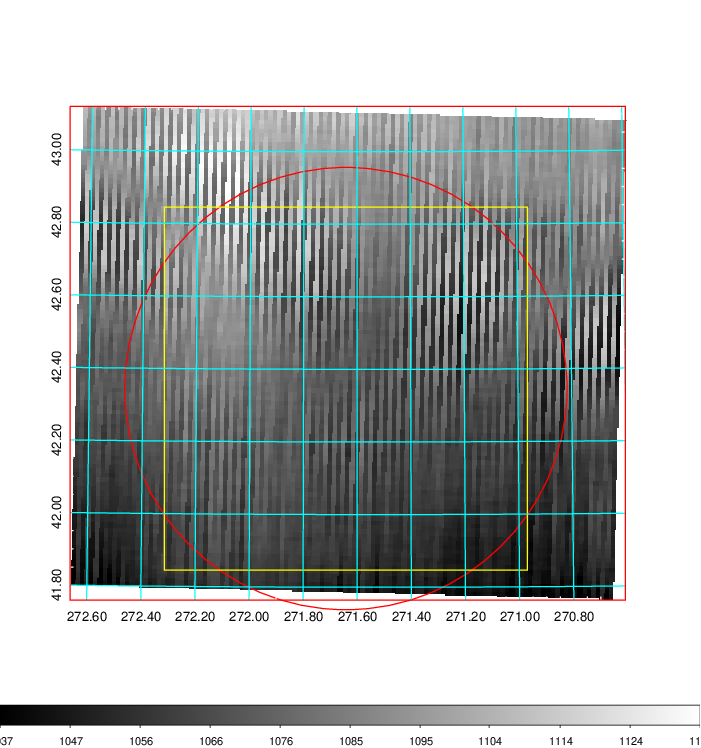   | 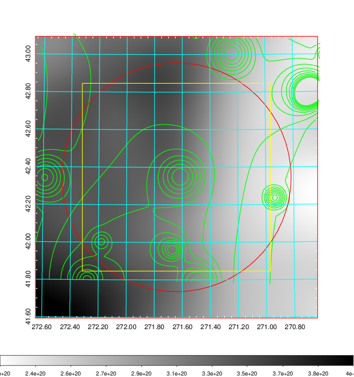    | 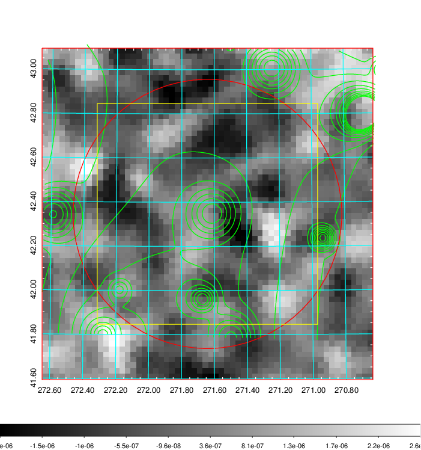 |

|[Redshift Histogram](../image/765/765_zg.pdf) | [DSS image(z1)](../image/765/765_dss_z1.pdf)      |  [DSS image(z2)](../image/765/765_dss_z2.pdf)    |
|-------------------|--------------------|-------------------|
|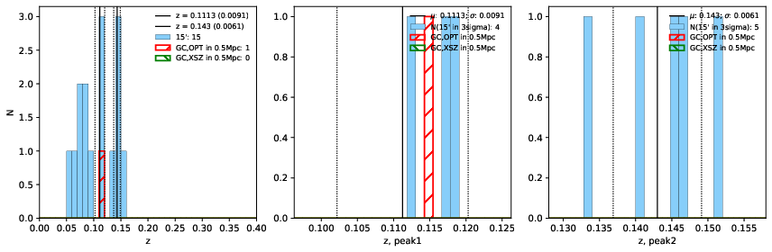 |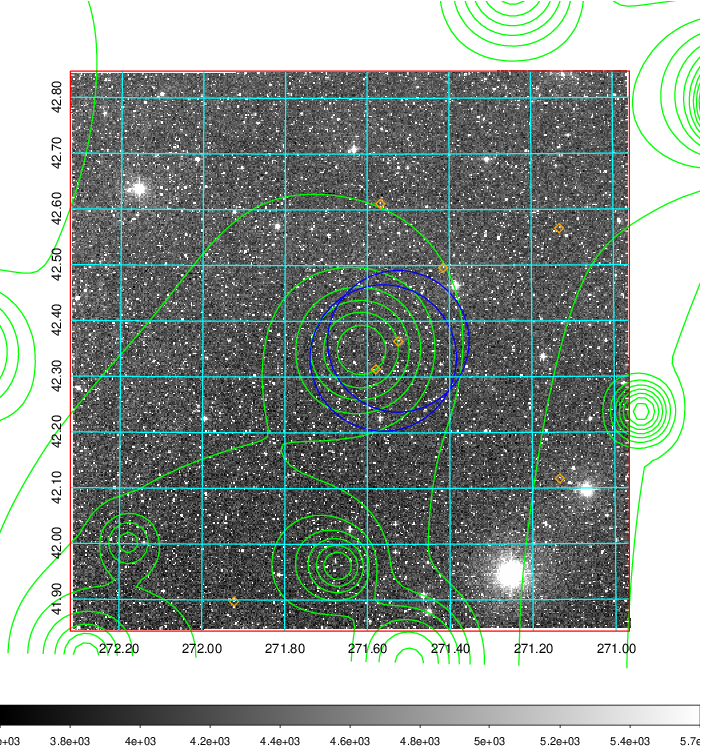  Blue circle for optical clusters;  Magenta circle for XSZ clusters;  all with r=1Mpc;  Only GC with Delta_z<0.01 are shown. | 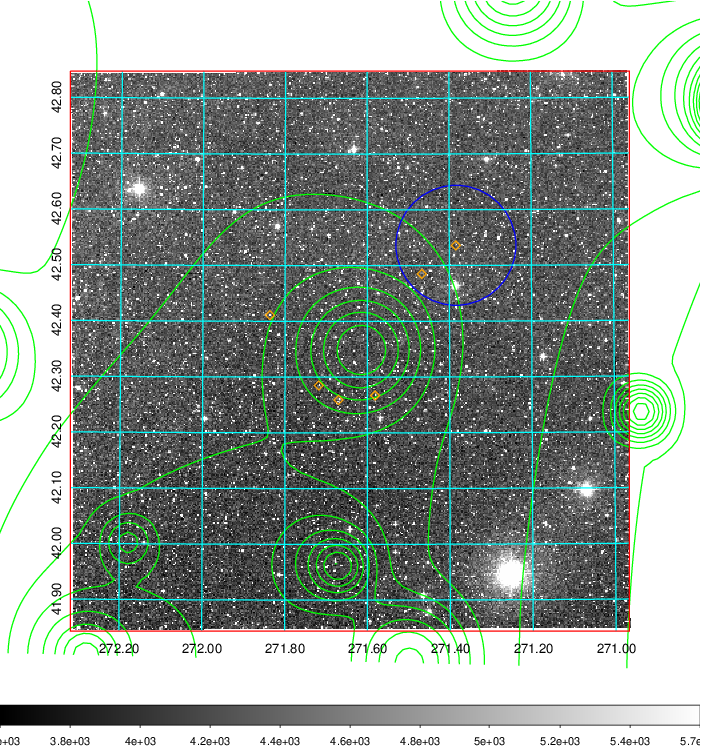 Blue circle for optical clusters;  Magenta circle for XSZ clusters;  all with r=1Mpc;  Only GC with Delta_z<0.01 are shown.  |

|[Previous-identified clusters](../image/765/765_gc.pdf) | [2MASS image](../image/765/765_2mass.pdf)      |[SDSS image](../image/765/765_sdss.pdf)   |
|-------------------|-------------------|-------------------|
|  Green, magenta, and blue circles  for optical, X-ray and SZ clusters  respectively, with redshift of clusters  labelled. The radius of circles  are 1Mpc.|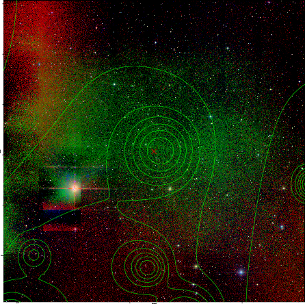  | 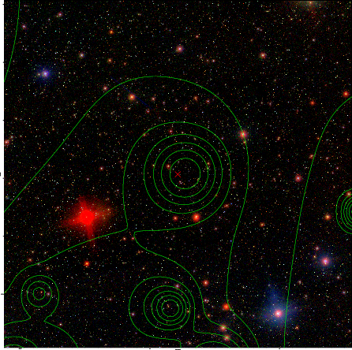  |

