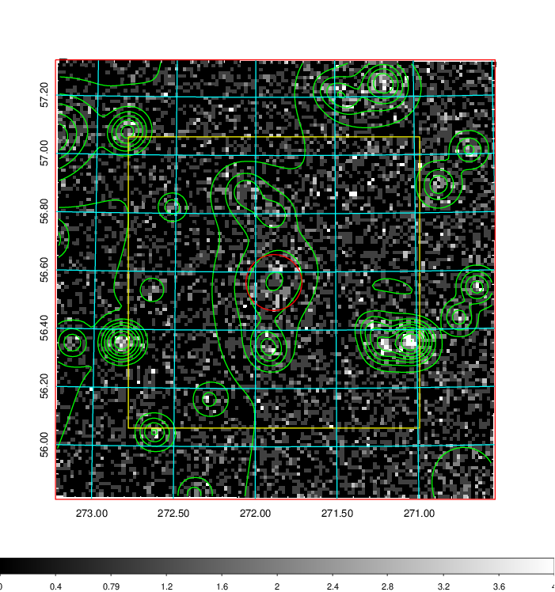
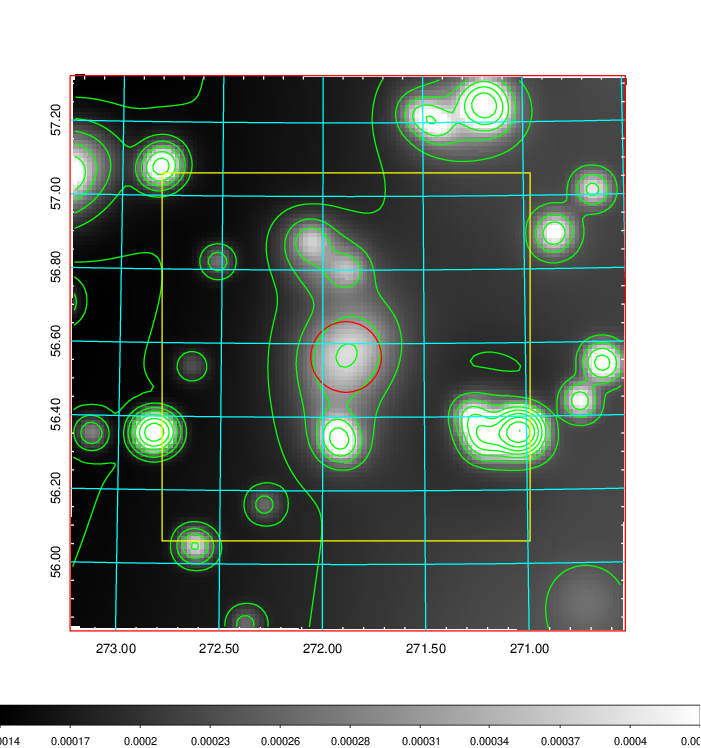
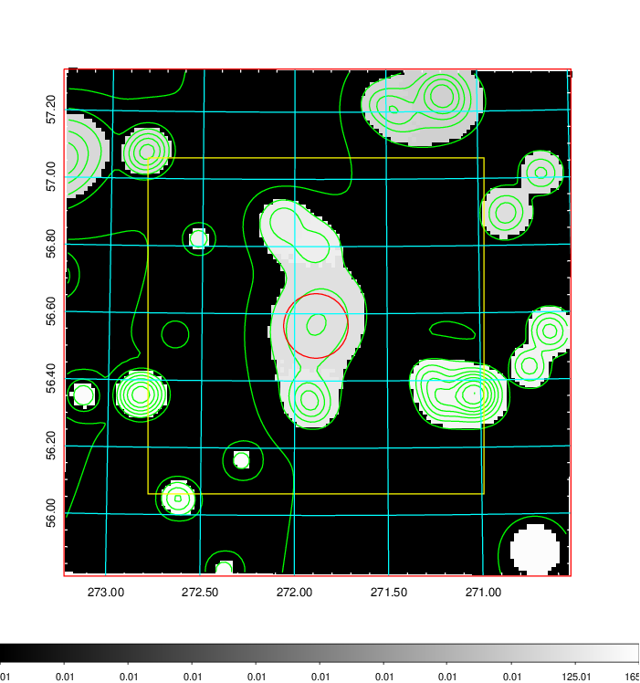
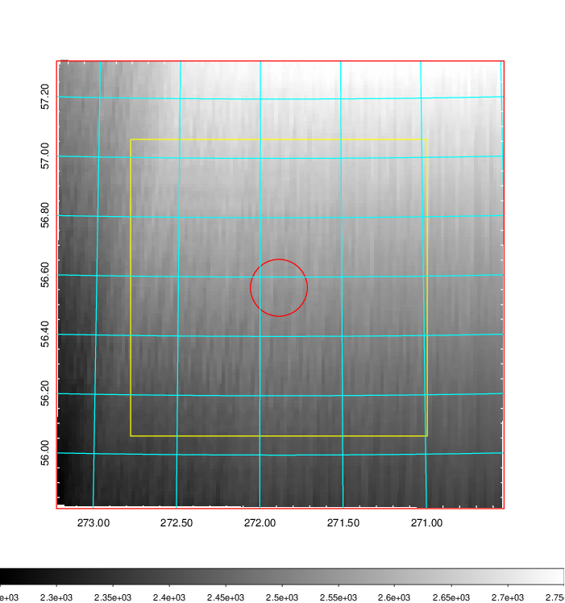
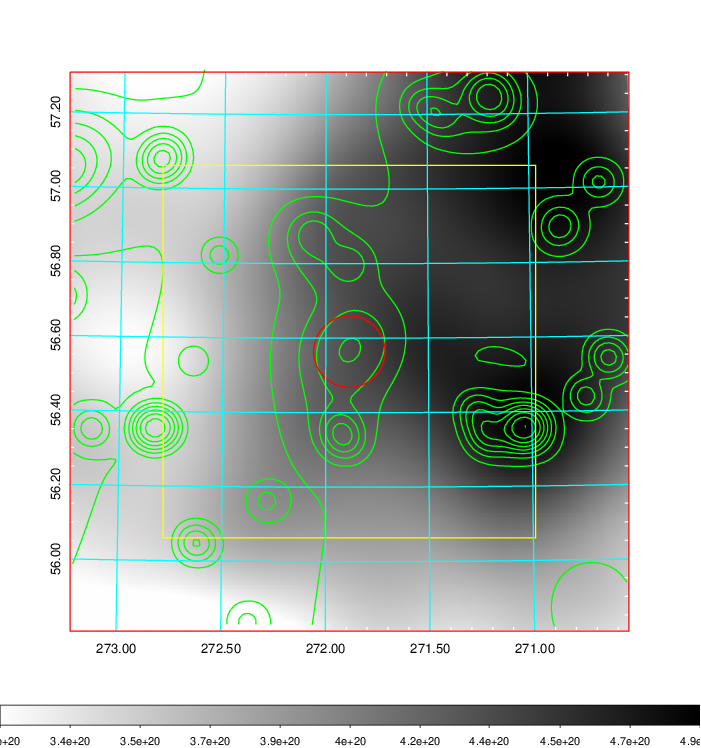
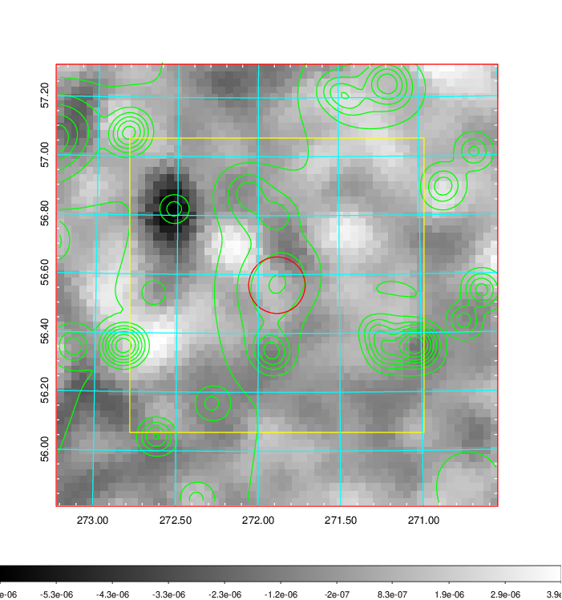
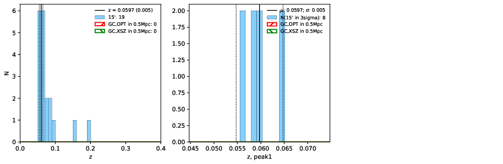
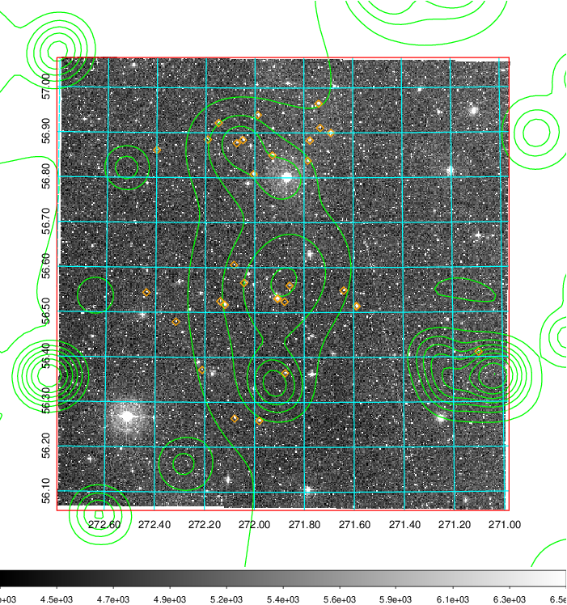
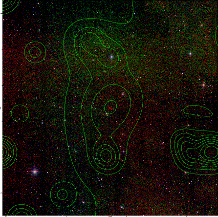
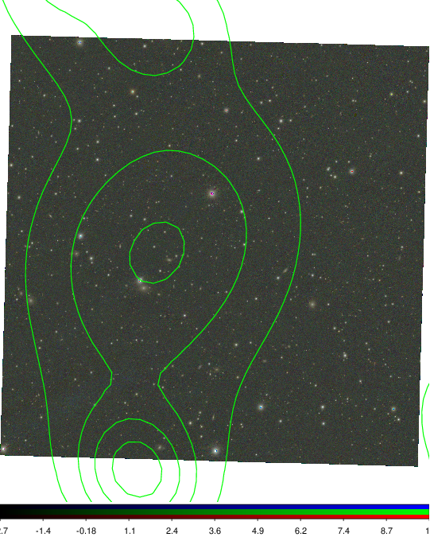

### 766

|Name|RAJ2000[deg]|DEJ2000[deg] |Ext[arcmin]| Ext,ml | z | z_src| C|GC(XSZ,Delta_z<0.01)| GC(OPT,Delta_z<0.01)|GC| R_sig[arcmin] | R500[arcmin] | R500[Mpc]| CRsig[c/s] | CR500[c/s] |L500[1E44 erg/s]|F500[1E-12 erg/s/cm^2]| M500[1E14 Msun]|Tx[keV]|Cnt_sig|Beta|Rc[arcmin]|Comment|Alias|
|---|---|---|---|---|---|------|---|--------|---------|----------|---|---|---|---|---|---|---|---|---|---|---|---|---|---|
|766| 271.885| 56.564| 5.76| 48.35| 0.0597(0.005)| z1,| G| -| -| N| 14.650| 8.210| 0.568| 0.065(0.013)| 0.061(0.013)| 0.080(0.014)| 0.937(0.167)| 0.55(0.05)| 1.51(0.09)| 235.5| 0.577(-0.055+0.093)| 4.511(-0.588+0.888)| -| t299|

|[RASS image](../image/766/766_img.pdf)|[filtered image](../image/766/766_fil.pdf)|[Segment image](../image/766/766_seg.pdf)|
|-------------------|--------------------|-------------------|
|   |    |   |

|[Exposure image](../image/766/766_mex.pdf)| [nH image](../image/766/766_nh.pdf)| [Planck image](../image/766/766_p.pdf)|
|-------------------|--------------------|-------------------|
|   |     |  |

|[Redshift Histogram](../image/766/766_zg.pdf) | [DSS image(z1)](../image/766/766_dss_z1.pdf)      |  [DSS image(z2)](../image/766/766_dss_z2.pdf)    |
|-------------------|--------------------|-------------------|
| |  Blue circle for optical clusters;  Magenta circle for XSZ clusters;  all with r=1Mpc;  Only GC with Delta_z<0.01 are shown. |  Blue circle for optical clusters;  Magenta circle for XSZ clusters;  all with r=1Mpc;  Only GC with Delta_z<0.01 are shown.  |

|[Previous-identified clusters](../image/766/766_gc.pdf) | [2MASS image](../image/766/766_2mass.pdf)      |
|-------------------|-------------------|
|  Green, magenta, and blue circles  for optical, X-ray and SZ clusters  respectively, with redshift of clusters  labelled. The radius of circles  are 1Mpc.|  |

|[PS1 image](../image/766/766_ps1.pdf)            |
|-------------------|
|   |
