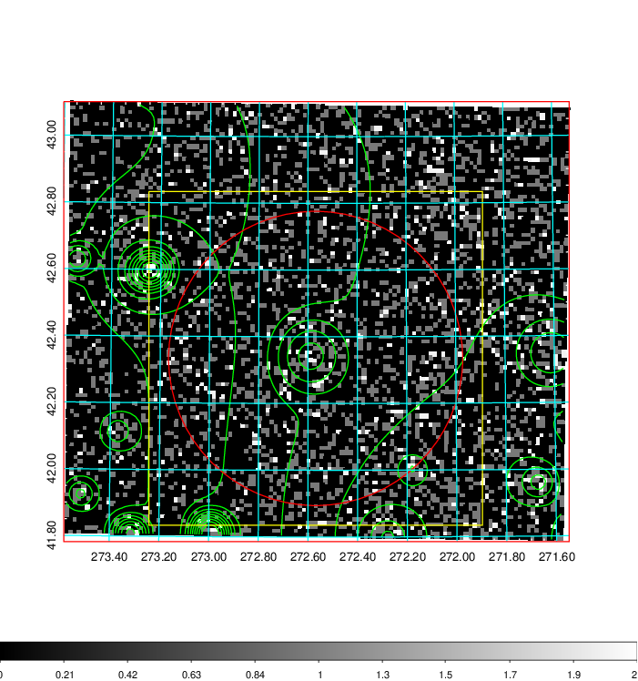
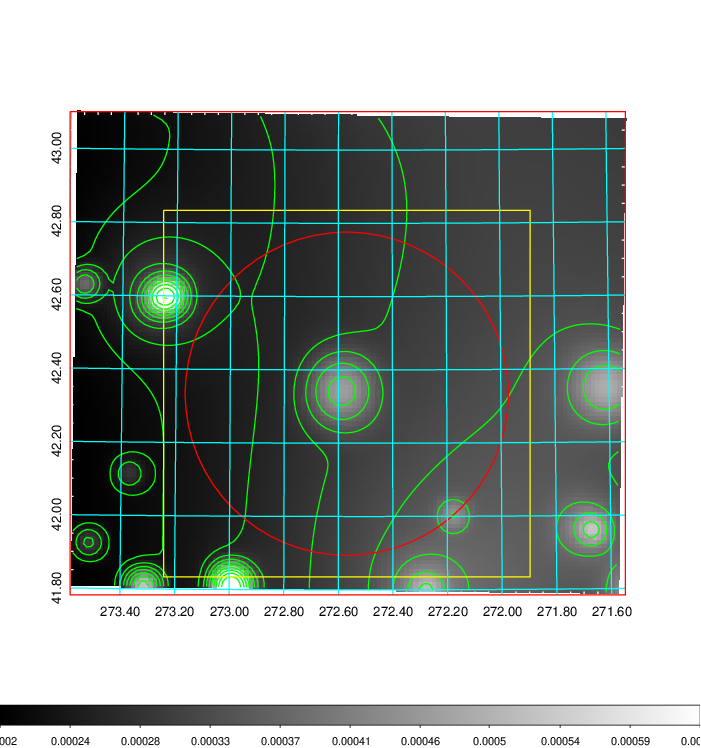
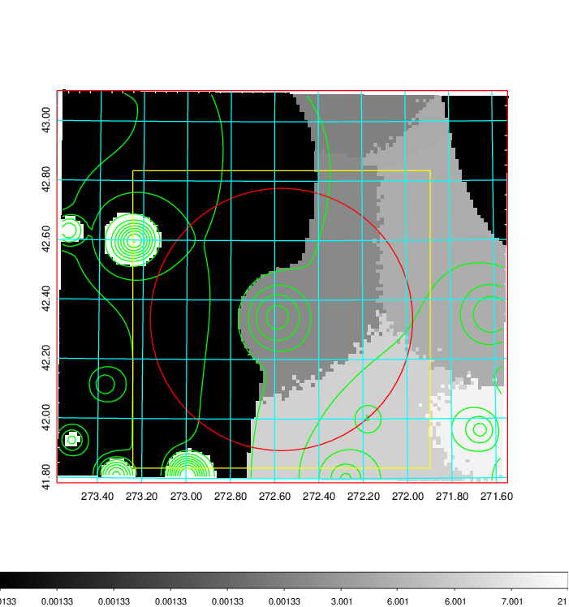
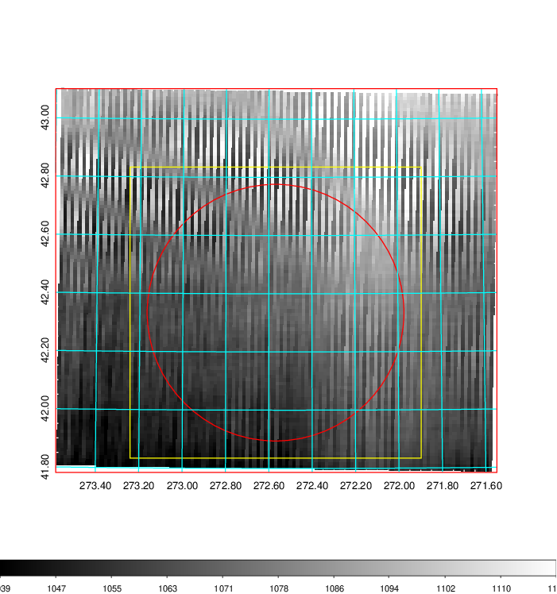
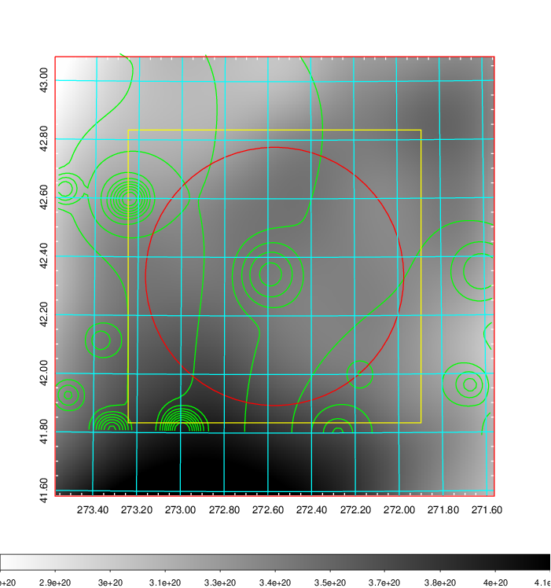
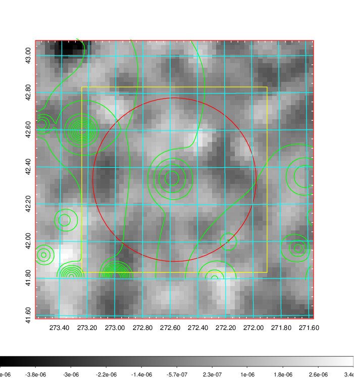
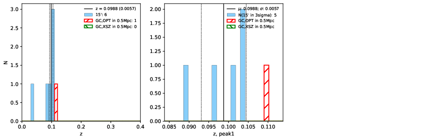
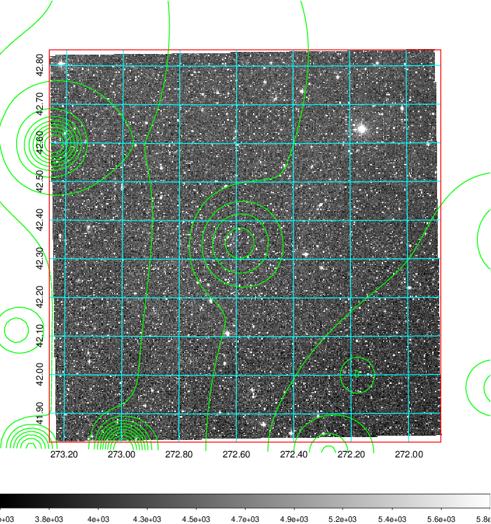
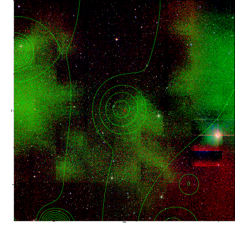
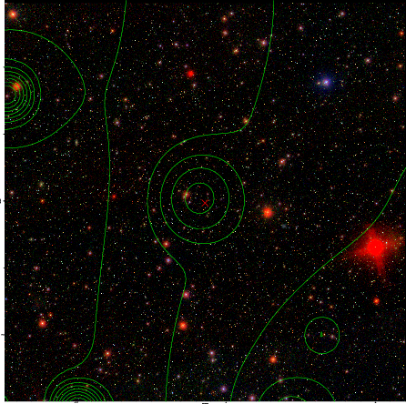

### 768

|Name|RAJ2000[deg]|DEJ2000[deg] |Ext[arcmin]| Ext,ml | z | z_src| C|GC(XSZ,Delta_z<0.01)| GC(OPT,Delta_z<0.01)|GC| R_sig[arcmin] | R500[arcmin] | R500[Mpc]| CRsig[c/s] | CR500[c/s] |L500[1E44 erg/s]|F500[1E-12 erg/s/cm^2]| M500[1E14 Msun]|Tx[keV]|Cnt_sig|Beta|Rc[arcmin]|Comment|Alias|
|---|---|---|---|---|---|------|---|--------|---------|----------|---|---|---|---|---|---|---|---|---|---|---|---|---|---|
|768| 272.569| 42.335| 26.46| 110.97| 0.0988(0.006)| z1,| G| -| -| W| 47.035| 9.375| 1.026| 0.440(0.062)| 0.389(0.055)| 1.802(0.916)| 7.292(3.706)| 3.38(0.85)| 4.68(0.75)| 1259.7| 0.500(-0.001+0.001)| 6.726(-0.115+1.064)| -| t626|

|[RASS image](../image/768/768_img.pdf)|[filtered image](../image/768/768_fil.pdf)|[Segment image](../image/768/768_seg.pdf)|
|-------------------|--------------------|-------------------|
|   |    |   |

|[Exposure image](../image/768/768_mex.pdf)| [nH image](../image/768/768_nh.pdf)| [Planck image](../image/768/768_p.pdf)|
|-------------------|--------------------|-------------------|
|   |     |  |

|[Redshift Histogram](../image/768/768_zg.pdf) | [DSS image(z1)](../image/768/768_dss_z1.pdf)      |  [DSS image(z2)](../image/768/768_dss_z2.pdf)    |
|-------------------|--------------------|-------------------|
| |  Blue circle for optical clusters;  Magenta circle for XSZ clusters;  all with r=1Mpc;  Only GC with Delta_z<0.01 are shown. |  Blue circle for optical clusters;  Magenta circle for XSZ clusters;  all with r=1Mpc;  Only GC with Delta_z<0.01 are shown.  |

|[Previous-identified clusters](../image/768/768_gc.pdf) | [2MASS image](../image/768/768_2mass.pdf)      |[SDSS image](../image/768/768_sdss.pdf)   |
|-------------------|-------------------|-------------------|
|  Green, magenta, and blue circles  for optical, X-ray and SZ clusters  respectively, with redshift of clusters  labelled. The radius of circles  are 1Mpc.|  |   |

