

### 77

|Name|RAJ2000[deg]|DEJ2000[deg] |Ext[arcmin]| Ext,ml | z | z_src| C|GC(XSZ,Delta_z<0.01)| GC(OPT,Delta_z<0.01)|GC| R_sig[arcmin] | R500[arcmin] | R500[Mpc]| CRsig[c/s] | CR500[c/s] |L500[1E44 erg/s]|F500[1E-12 erg/s/cm^2]| M500[1E14 Msun]|Tx[keV]|Cnt_sig|Beta|Rc[arcmin]|Comment|Alias|
|---|---|---|---|---|---|------|---|--------|---------|----------|---|---|---|---|---|---|---|---|---|---|---|---|---|---|
|77| 24.330| -9.213| 1.86| 112.99| 0.0404(0.005)| z1, z_xsz| B| MCXC| N, W| C, F20, MCXC, N, W| 13.675| 15.164| 0.727| 0.403(0.038)| 0.410(0.039)| 0.277(0.014)| 7.274(0.377)| 1.13(0.03)| 2.34(0.04)| 168.1| 0.884(-0.103+0.080)| 4.666(-0.713+0.514)| -| k187|

|[RASS image](../image/77/77_img.pdf)|[filtered image](../image/77/77_fil.pdf)|[Segment image](../image/77/77_seg.pdf)|
|-------------------|--------------------|-------------------|
| 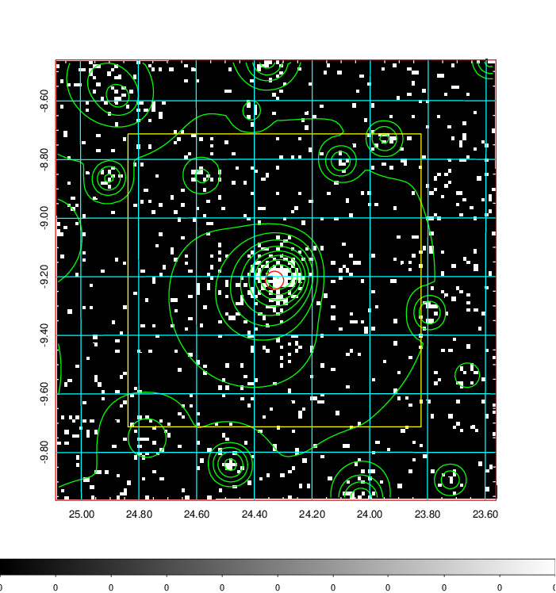  | 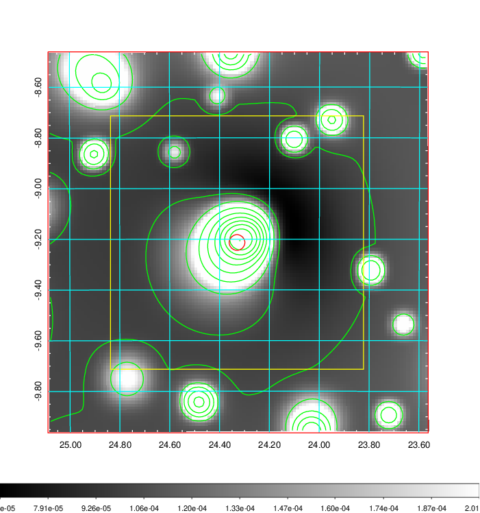   | 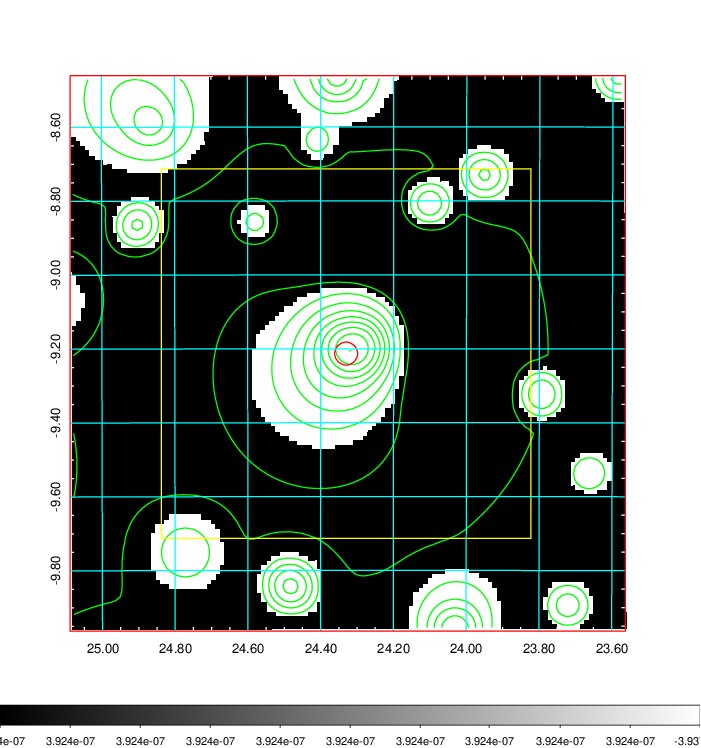  |

|[Exposure image](../image/77/77_mex.pdf)| [nH image](../image/77/77_nh.pdf)| [Planck image](../image/77/77_p.pdf)|
|-------------------|--------------------|-------------------|
|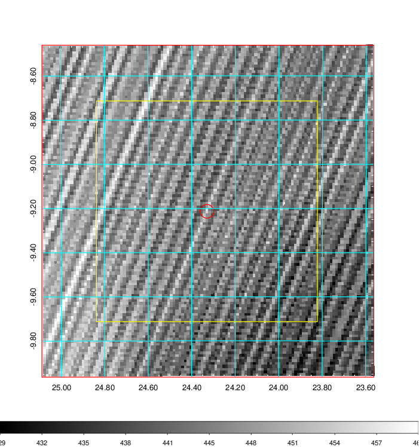   | 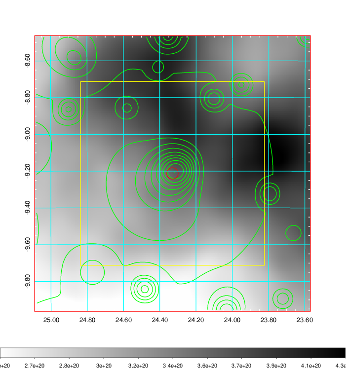    | 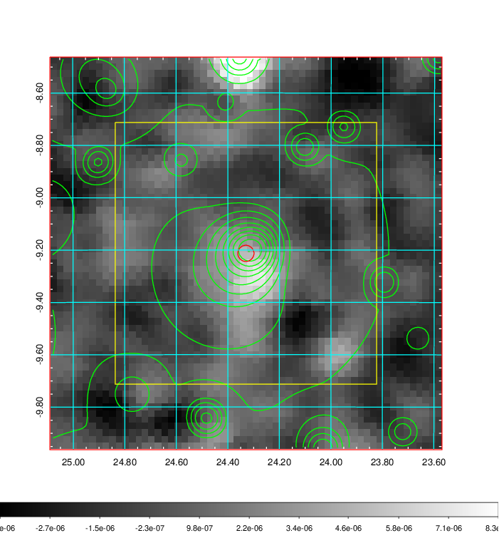 |

|[Redshift Histogram](../image/77/77_zg.pdf) | [DSS image(z1)](../image/77/77_dss_z1.pdf)      |  [DSS image(z2)](../image/77/77_dss_z2.pdf)    |
|-------------------|--------------------|-------------------|
|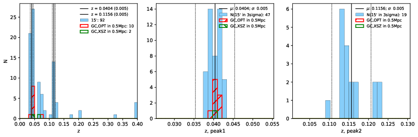 |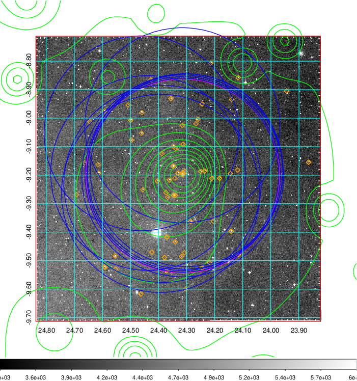  Blue circle for optical clusters;  Magenta circle for XSZ clusters;  all with r=1Mpc;  Only GC with Delta_z<0.01 are shown. | 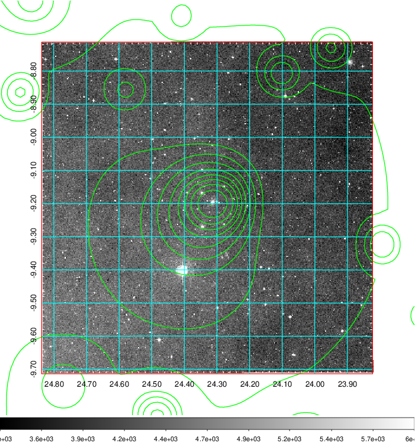 Blue circle for optical clusters;  Magenta circle for XSZ clusters;  all with r=1Mpc;  Only GC with Delta_z<0.01 are shown.  |

|[known Abell/XSZ clusters](../image/77/77_gc.pdf) | [2MASS image](../image/77/77_2mass.pdf)      |[SDSS image](../image/77/77_sdss.pdf)   |
|-------------------|-------------------|-------------------|
|  Magenta, blue and green circles  for optical, X-ray and SZ clusters  respectively, with redshift of clusters  labelled. The radius of circles  are 1Mpc.|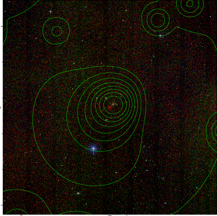  | 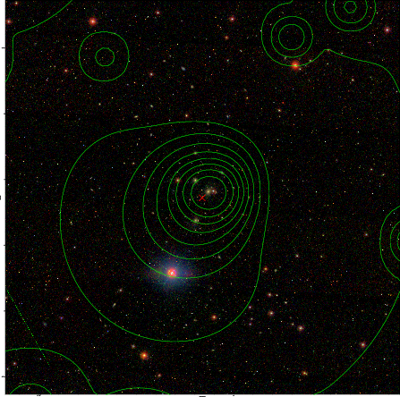  |

|[DES image](../image/77/77_des.pdf)   |[ATLAS image](../image/77/77_s.pdf)        |
|-------------------|-------------------|
|   |   |
