

### 770

|Name|RAJ2000[deg]|DEJ2000[deg] |Ext[arcmin]| Ext,ml | z | z_src| C|GC(XSZ,Delta_z<0.01)| GC(OPT,Delta_z<0.01)|GC| R_sig[arcmin] | R500[arcmin] | R500[Mpc]| CRsig[c/s] | CR500[c/s] |L500[1E44 erg/s]|F500[1E-12 erg/s/cm^2]| M500[1E14 Msun]|Tx[keV]|Cnt_sig|Beta|Rc[arcmin]|Comment|Alias|
|---|---|---|---|---|---|------|---|--------|---------|----------|---|---|---|---|---|---|---|---|---|---|---|---|---|---|
|770| 273.574| 69.662| 1.72| 89.10| 0.0834(0.007)| z1, z_xsz| B| MCXC| A, N, W| A, MCXC, N, W| 13.188| 6.844| 0.644| 0.060(0.009)| 0.055(0.009)| 0.158(0.013)| 0.917(0.077)| 0.82(0.04)| 1.95(0.05)| 386.3| 0.919(-0.090+0.057)| 3.520(-0.469+0.321)| -| k162|

|[RASS image](../image/770/770_img.pdf)|[filtered image](../image/770/770_fil.pdf)|[Segment image](../image/770/770_seg.pdf)|
|-------------------|--------------------|-------------------|
| 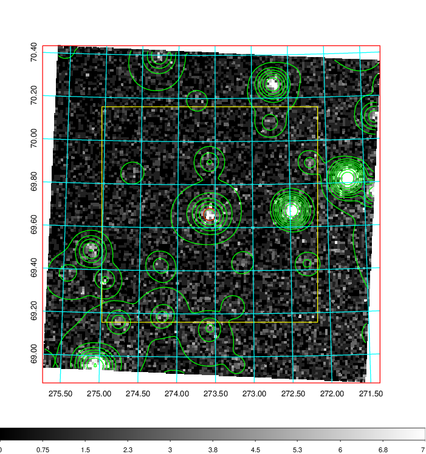  | 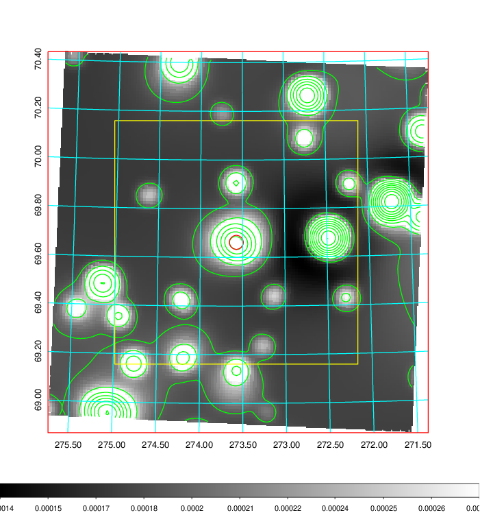   | 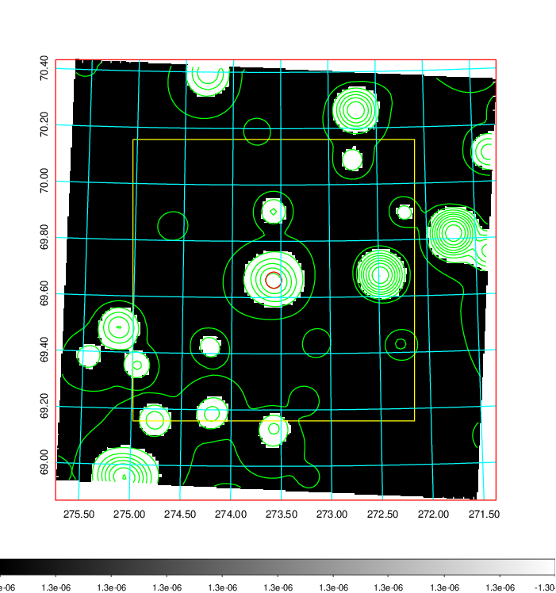  |

|[Exposure image](../image/770/770_mex.pdf)| [nH image](../image/770/770_nh.pdf)| [Planck image](../image/770/770_p.pdf)|
|-------------------|--------------------|-------------------|
|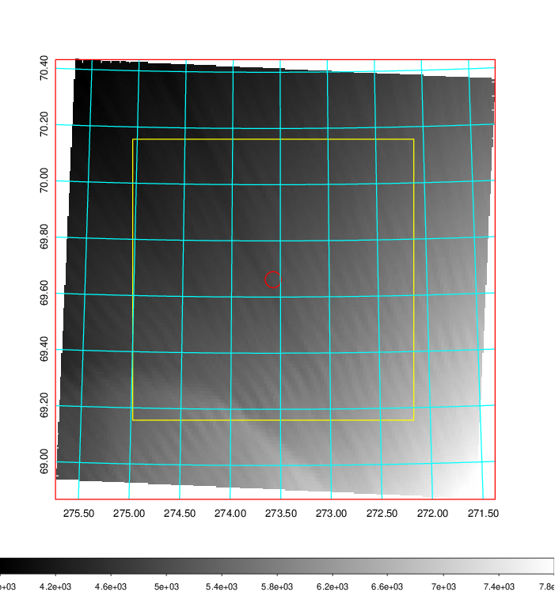   | 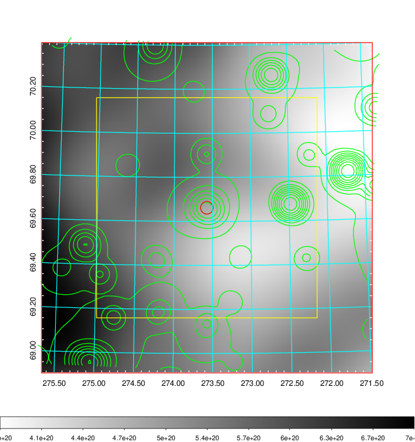    | 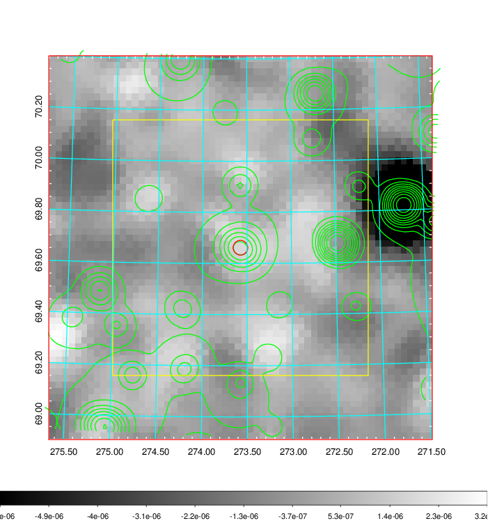 |

|[Redshift Histogram](../image/770/770_zg.pdf) | [DSS image(z1)](../image/770/770_dss_z1.pdf)      |  [DSS image(z2)](../image/770/770_dss_z2.pdf)    |
|-------------------|--------------------|-------------------|
|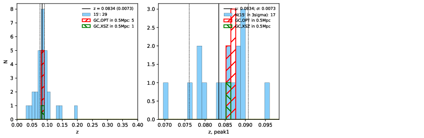 |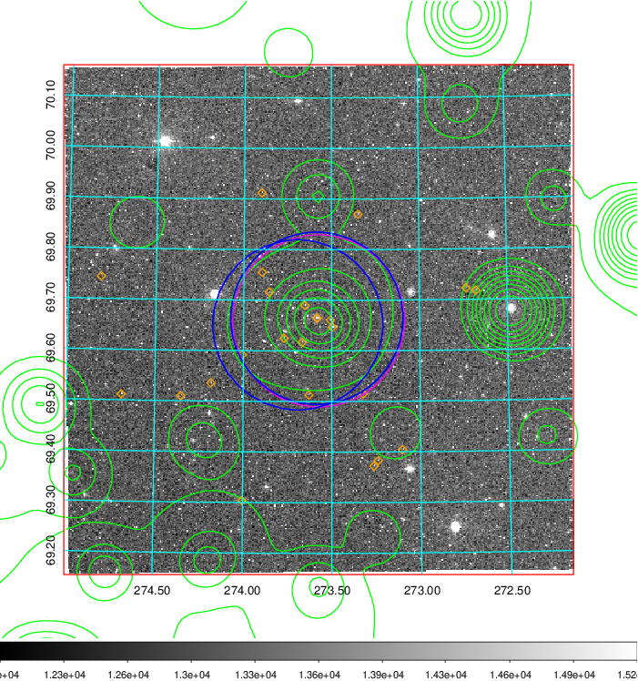  Blue circle for optical clusters;  Magenta circle for XSZ clusters;  all with r=1Mpc;  Only GC with Delta_z<0.01 are shown. | 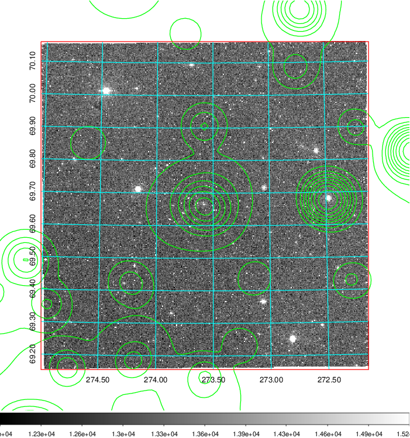 Blue circle for optical clusters;  Magenta circle for XSZ clusters;  all with r=1Mpc;  Only GC with Delta_z<0.01 are shown.  |

|[Previous-identified clusters](../image/770/770_gc.pdf) | [2MASS image](../image/770/770_2mass.pdf)      |
|-------------------|-------------------|
|  Green, magenta, and blue circles  for optical, X-ray and SZ clusters  respectively, with redshift of clusters  labelled. The radius of circles  are 1Mpc.|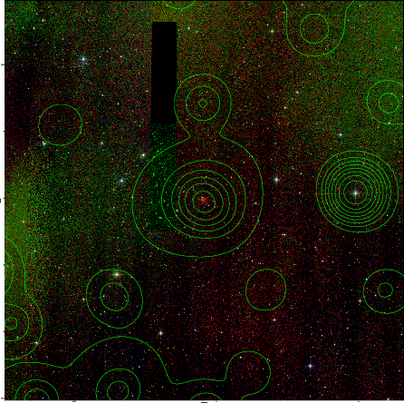  |

|[PS1 image](../image/770/770_ps1.pdf)            |
|-------------------|
| 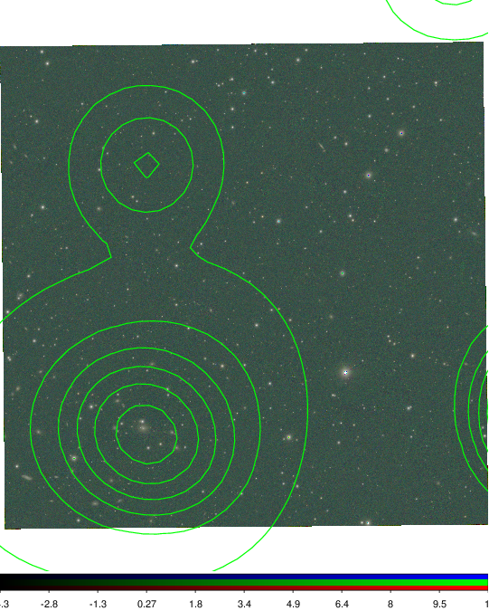  |
