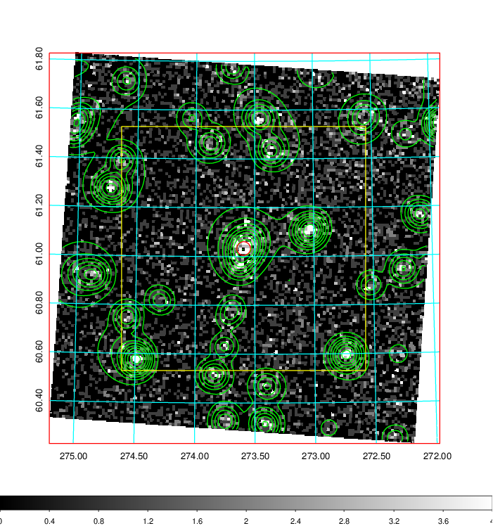
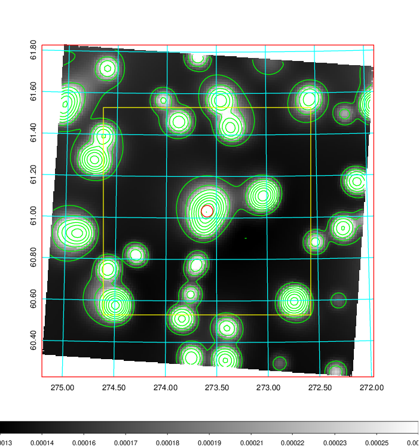
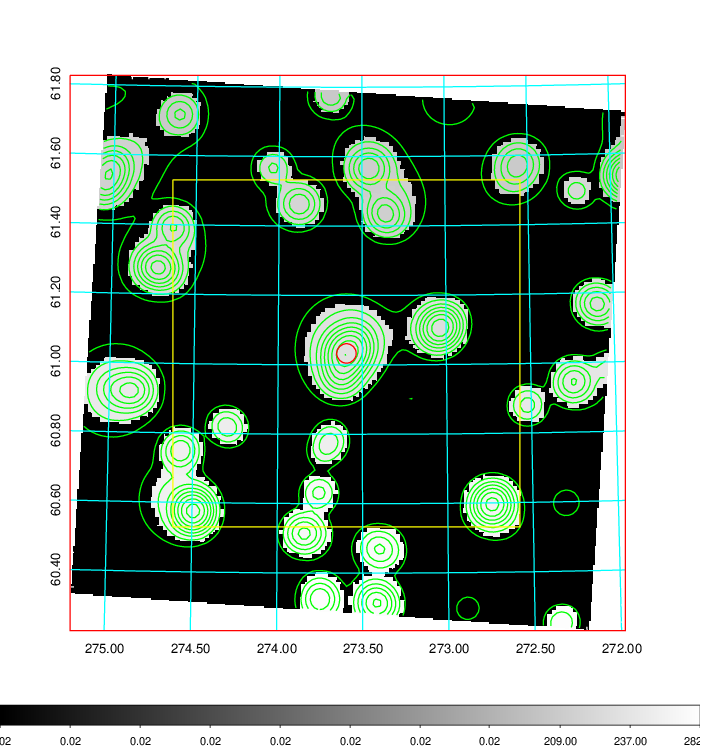
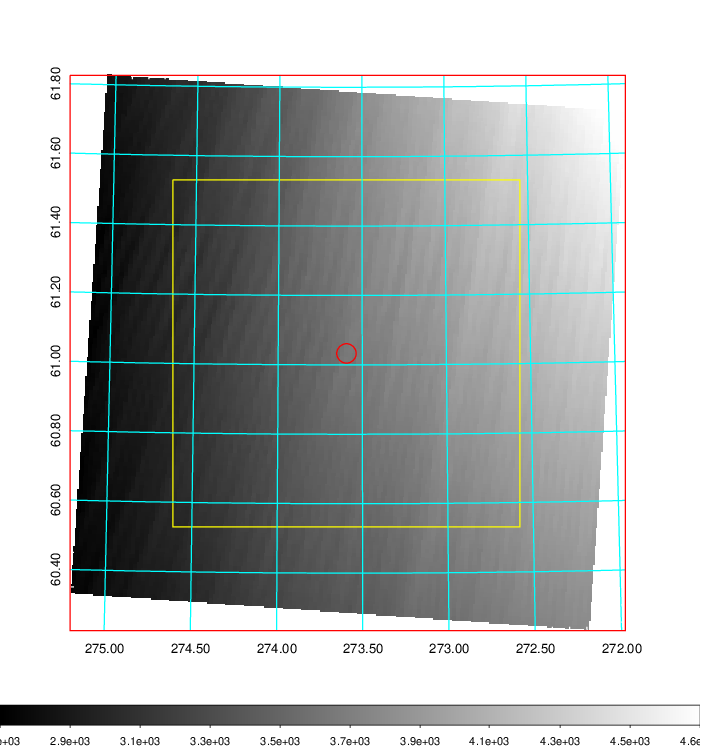
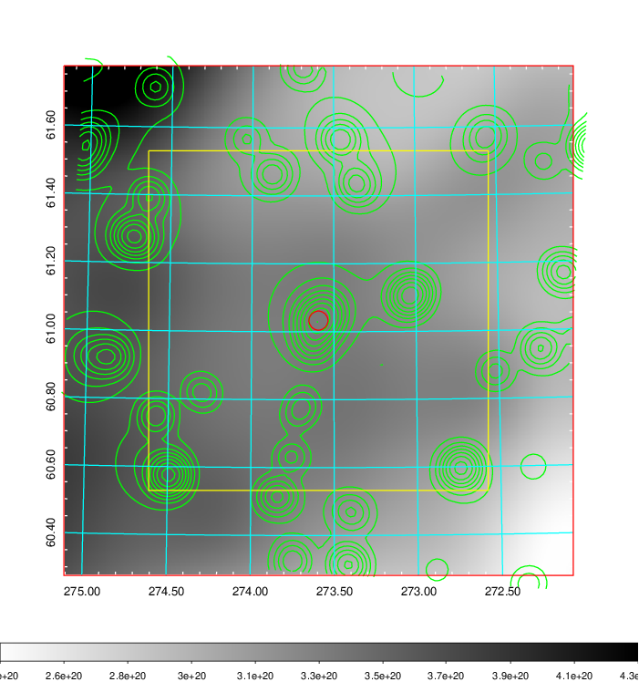
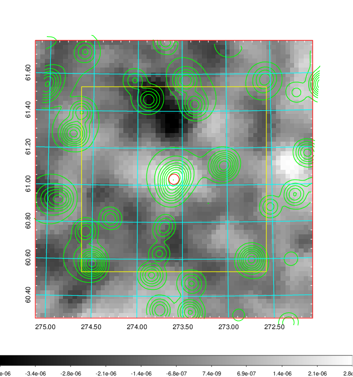
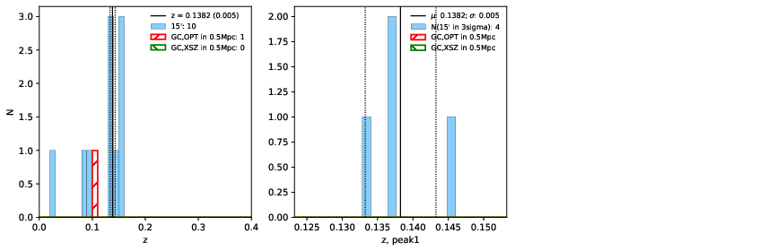
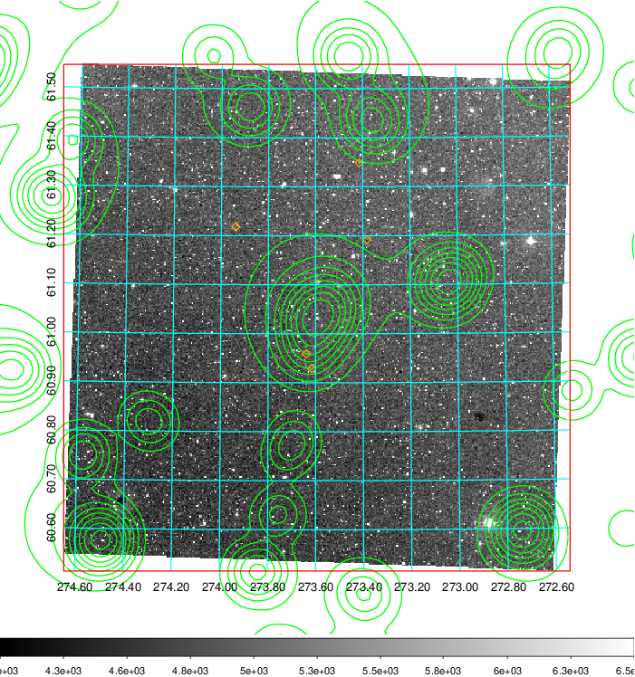
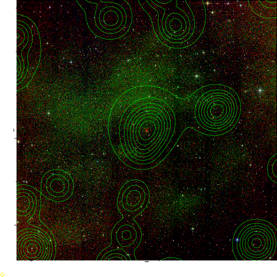

### 771

|Name|RAJ2000[deg]|DEJ2000[deg] |Ext[arcmin]| Ext,ml | z | z_src| C|GC(XSZ,Delta_z<0.01)| GC(OPT,Delta_z<0.01)|GC| R_sig[arcmin] | R500[arcmin] | R500[Mpc]| CRsig[c/s] | CR500[c/s] |L500[1E44 erg/s]|F500[1E-12 erg/s/cm^2]| M500[1E14 Msun]|Tx[keV]|Cnt_sig|Beta|Rc[arcmin]|Comment|Alias|
|---|---|---|---|---|---|------|---|--------|---------|----------|---|---|---|---|---|---|---|---|---|---|---|---|---|---|
|771| 273.594| 61.033| 1.68| 72.76| 0.1382(0.005)| z1,| G| -| -| W| 13.675| 5.581| 0.817| 0.077(0.010)| 0.070(0.009)| 0.657(0.058)| 1.291(0.115)| 1.78(0.08)| 3.19(0.09)| 200.6| 0.845(-0.114+0.102)| 4.151(-0.751+0.606)| -| t038|

|[RASS image](../image/771/771_img.pdf)|[filtered image](../image/771/771_fil.pdf)|[Segment image](../image/771/771_seg.pdf)|
|-------------------|--------------------|-------------------|
|   |    |   |

|[Exposure image](../image/771/771_mex.pdf)| [nH image](../image/771/771_nh.pdf)| [Planck image](../image/771/771_p.pdf)|
|-------------------|--------------------|-------------------|
|   |     |  |

|[Redshift Histogram](../image/771/771_zg.pdf) | [DSS image(z1)](../image/771/771_dss_z1.pdf)      |  [DSS image(z2)](../image/771/771_dss_z2.pdf)    |
|-------------------|--------------------|-------------------|
| |  Blue circle for optical clusters;  Magenta circle for XSZ clusters;  all with r=1Mpc;  Only GC with Delta_z<0.01 are shown. |  Blue circle for optical clusters;  Magenta circle for XSZ clusters;  all with r=1Mpc;  Only GC with Delta_z<0.01 are shown.  |

|[known Abell/XSZ clusters](../image/771/771_gc.pdf) | [2MASS image](../image/771/771_2mass.pdf)      |
|-------------------|-------------------|
|  Magenta, blue and green circles  for optical, X-ray and SZ clusters  respectively, with redshift of clusters  labelled. The radius of circles  are 1Mpc.|  |

|[PS1 image](../image/771/771_ps1.pdf)            |
|-------------------|
|   |
