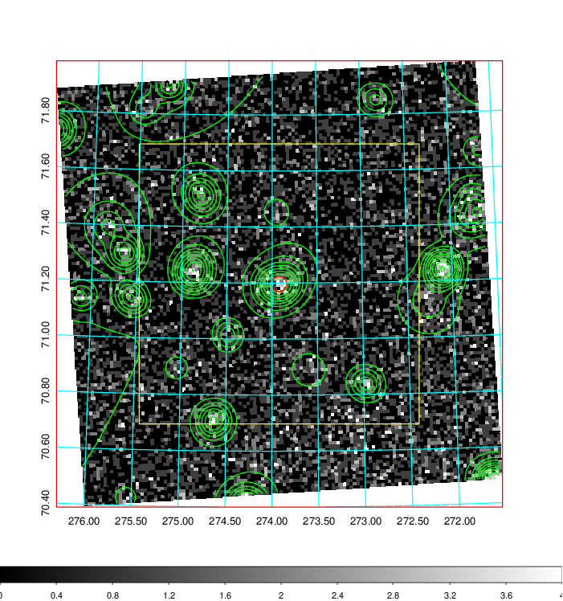
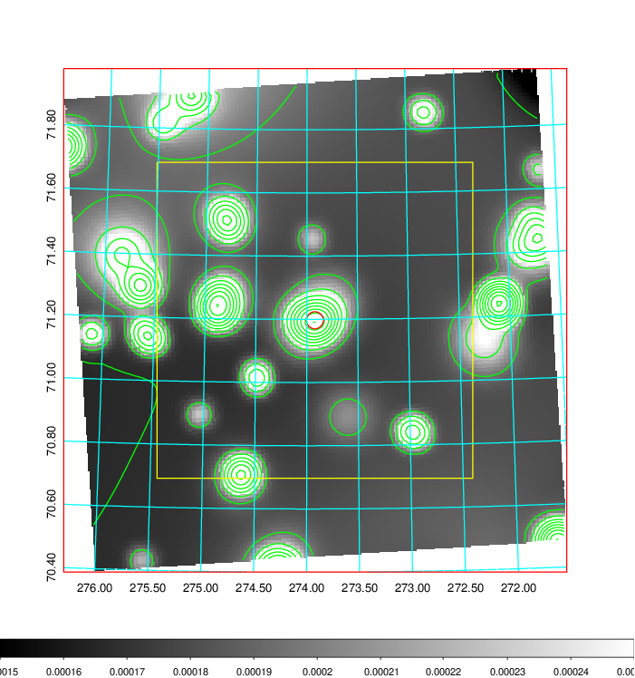
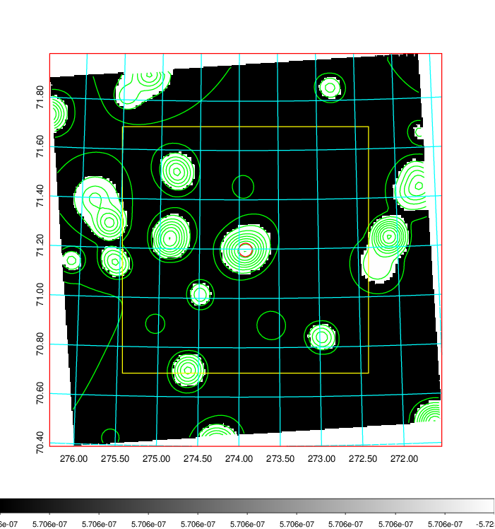
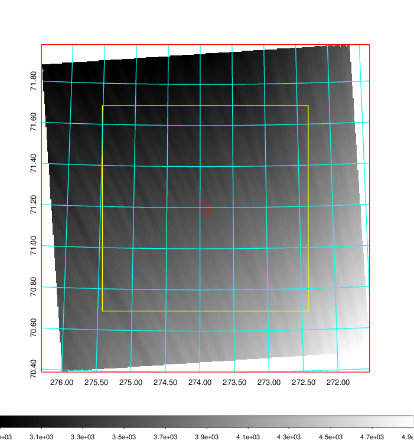
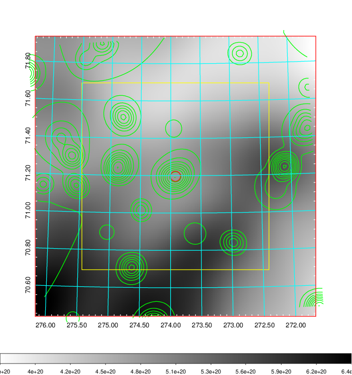
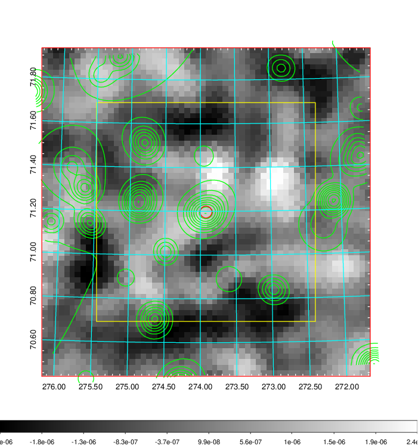
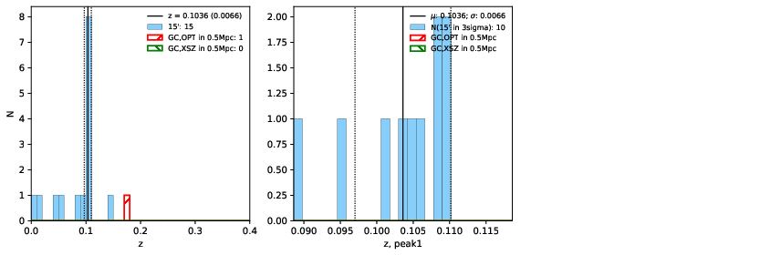
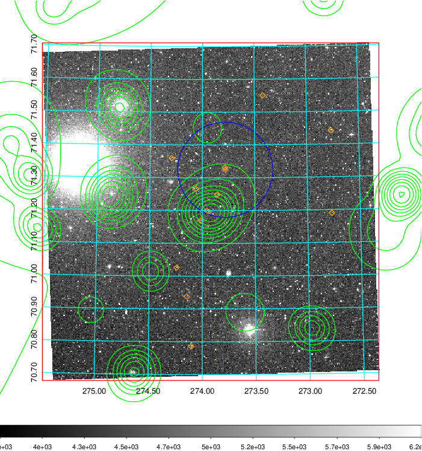
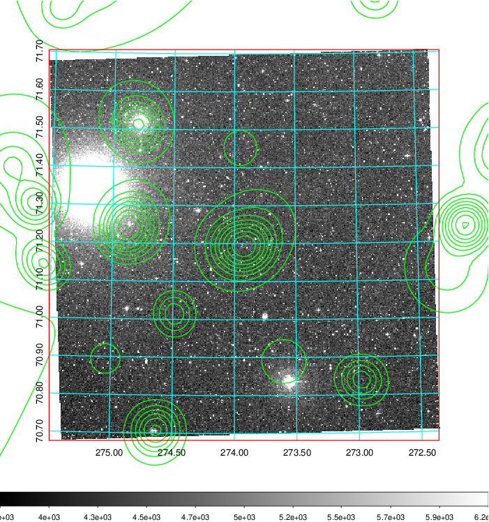
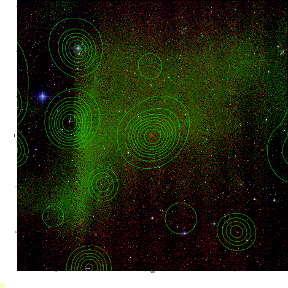

### 772

|Name|RAJ2000[deg]|DEJ2000[deg] |Ext[arcmin]| Ext,ml | z | z_src| C|GC(XSZ,Delta_z<0.01)| GC(OPT,Delta_z<0.01)|GC| R_sig[arcmin] | R500[arcmin] | R500[Mpc]| CRsig[c/s] | CR500[c/s] |L500[1E44 erg/s]|F500[1E-12 erg/s/cm^2]| M500[1E14 Msun]|Tx[keV]|Cnt_sig|Beta|Rc[arcmin]|Comment|Alias|
|---|---|---|---|---|---|------|---|--------|---------|----------|---|---|---|---|---|---|---|---|---|---|---|---|---|---|
|772| 273.921| 71.197| 1.62| 33.17| 0.1036(0.007)| z1,| G| -| -| N, W| 10.262| 5.336| 0.609| 0.031(0.010)| 0.028(0.010)| 0.126(0.020)| 0.461(0.074)| 0.71(0.06)| 1.79(0.09)| 160.4| 0.931(-0.087+0.051)| 3.128(-0.418+0.349)| -| t032|

|[RASS image](../image/772/772_img.pdf)|[filtered image](../image/772/772_fil.pdf)|[Segment image](../image/772/772_seg.pdf)|
|-------------------|--------------------|-------------------|
|   |    |   |

|[Exposure image](../image/772/772_mex.pdf)| [nH image](../image/772/772_nh.pdf)| [Planck image](../image/772/772_p.pdf)|
|-------------------|--------------------|-------------------|
|   |     |  |

|[Redshift Histogram](../image/772/772_zg.pdf) | [DSS image(z1)](../image/772/772_dss_z1.pdf)      |  [DSS image(z2)](../image/772/772_dss_z2.pdf)    |
|-------------------|--------------------|-------------------|
| |  Blue circle for optical clusters;  Magenta circle for XSZ clusters;  all with r=1Mpc;  Only GC with Delta_z<0.01 are shown. |  Blue circle for optical clusters;  Magenta circle for XSZ clusters;  all with r=1Mpc;  Only GC with Delta_z<0.01 are shown.  |

|[known Abell/XSZ clusters](../image/772/772_gc.pdf) | [2MASS image](../image/772/772_2mass.pdf)      |
|-------------------|-------------------|
|  Magenta, blue and green circles  for optical, X-ray and SZ clusters  respectively, with redshift of clusters  labelled. The radius of circles  are 1Mpc.|  |

|[PS1 image](../image/772/772_ps1.pdf)            |
|-------------------|
|   |
