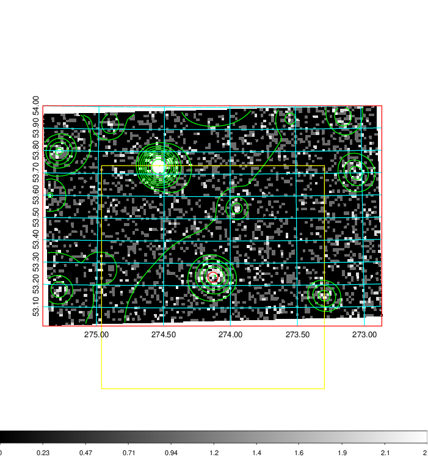
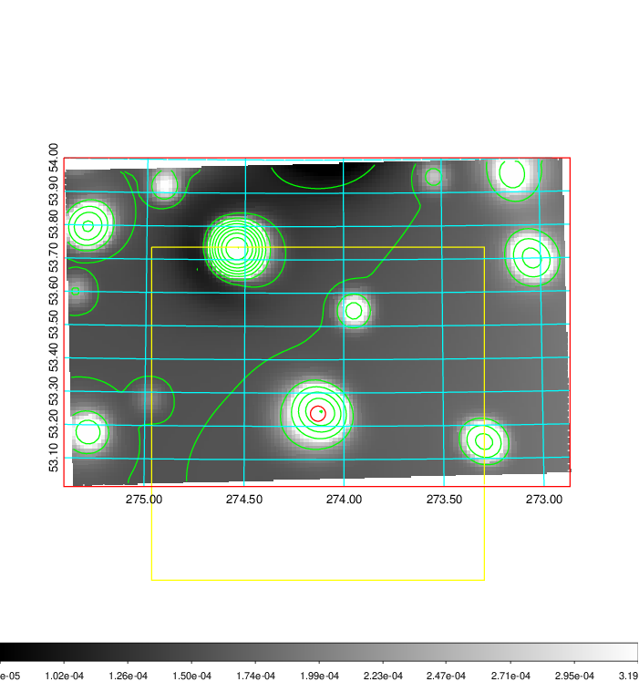
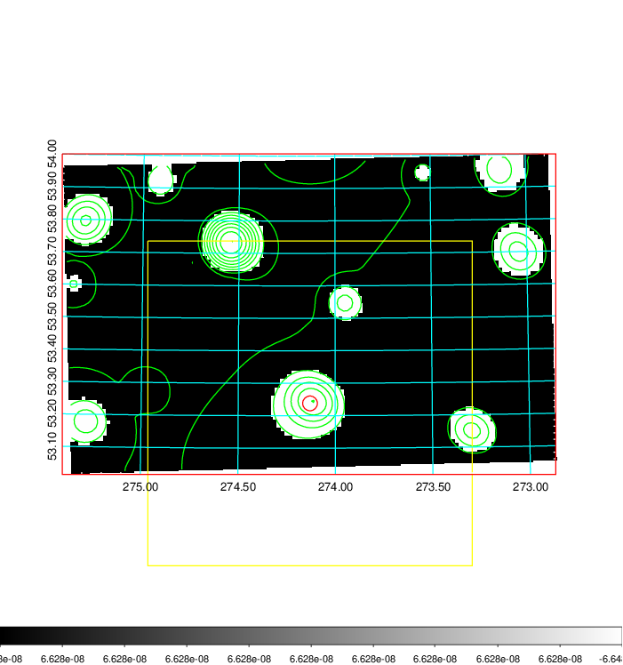
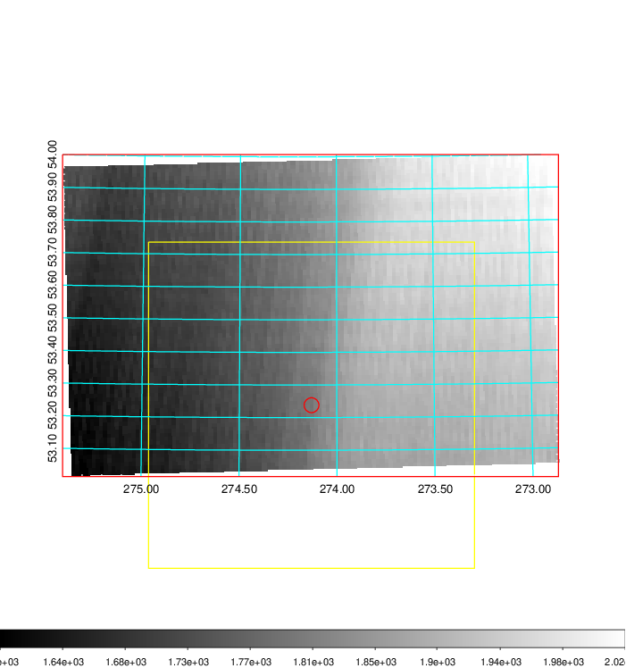
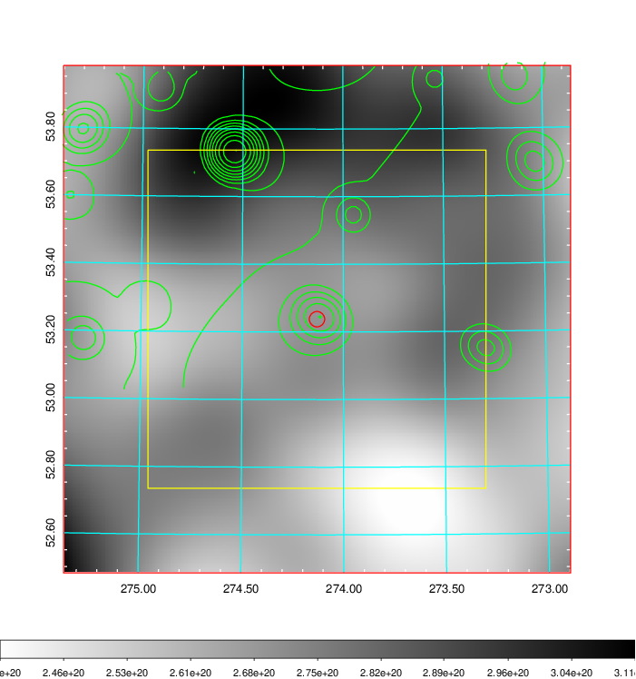
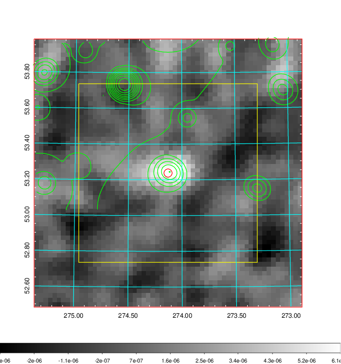
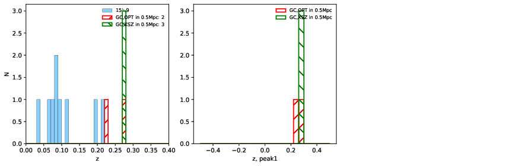
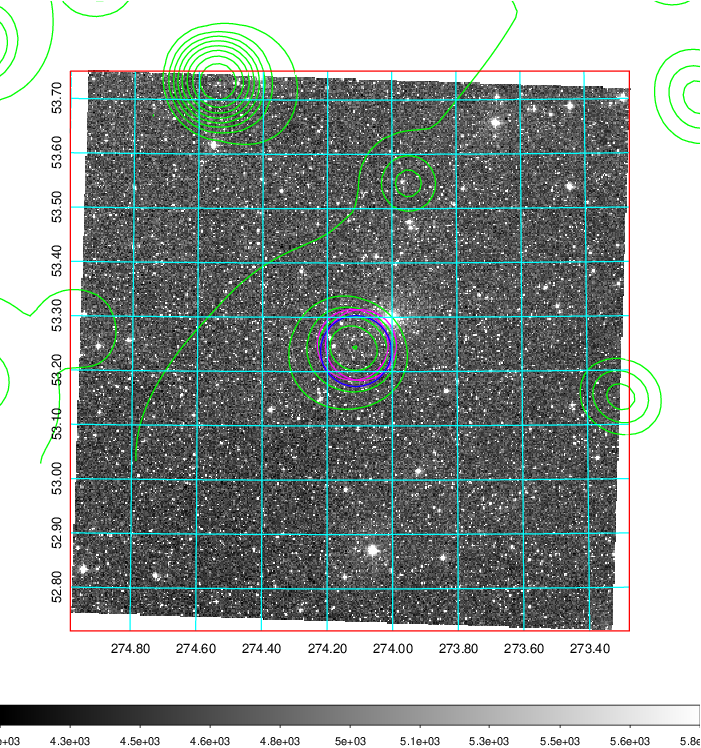
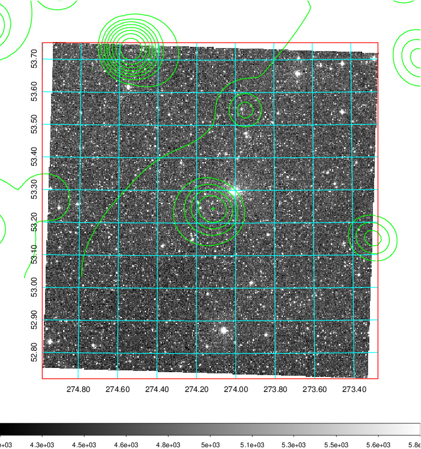
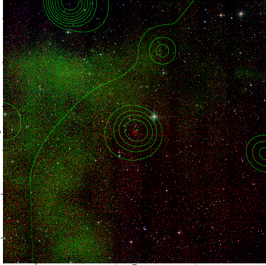

### 773

|Name|RAJ2000[deg]|DEJ2000[deg] |Ext[arcmin]| Ext,ml | z | z_src| C|GC(XSZ,Delta_z<0.01)| GC(OPT,Delta_z<0.01)|GC| R_sig[arcmin] | R500[arcmin] | R500[Mpc]| CRsig[c/s] | CR500[c/s] |L500[1E44 erg/s]|F500[1E-12 erg/s/cm^2]| M500[1E14 Msun]|Tx[keV]|Cnt_sig|Beta|Rc[arcmin]|Comment|Alias|
|---|---|---|---|---|---|------|---|--------|---------|----------|---|---|---|---|---|---|---|---|---|---|---|---|---|---|
|773| 274.130| 53.238| 1.37| 32.86| 0.2764(0.000)| z_xsz| B| MCXC, PSZ2, Tar| N| MCXC, N, PSZ2, Tar, W| 15.625| 4.210| 1.062| 0.087(0.014)| 0.077(0.013)| 3.645(0.342)| 1.526(0.143)| 4.52(0.20)| 5.95(0.17)| 126.8| 0.886(-0.115+0.082)| 3.422(-0.612+0.448)| -| k089|

|[RASS image](../image/773/773_img.pdf)|[filtered image](../image/773/773_fil.pdf)|[Segment image](../image/773/773_seg.pdf)|
|-------------------|--------------------|-------------------|
|   |    |   |

|[Exposure image](../image/773/773_mex.pdf)| [nH image](../image/773/773_nh.pdf)| [Planck image](../image/773/773_p.pdf)|
|-------------------|--------------------|-------------------|
|   |     |  |

|[Redshift Histogram](../image/773/773_zg.pdf) | [DSS image(z1)](../image/773/773_dss_z1.pdf)      |  [DSS image(z2)](../image/773/773_dss_z2.pdf)    |
|-------------------|--------------------|-------------------|
| |  Blue circle for optical clusters;  Magenta circle for XSZ clusters;  all with r=1Mpc;  Only GC with Delta_z<0.01 are shown. |  Blue circle for optical clusters;  Magenta circle for XSZ clusters;  all with r=1Mpc;  Only GC with Delta_z<0.01 are shown.  |

|[known Abell/XSZ clusters](../image/773/773_gc.pdf) | [2MASS image](../image/773/773_2mass.pdf)      |
|-------------------|-------------------|
|  Magenta, blue and green circles  for optical, X-ray and SZ clusters  respectively, with redshift of clusters  labelled. The radius of circles  are 1Mpc.|  |

|[PS1 image](../image/773/773_ps1.pdf)            |
|-------------------|
|   |
