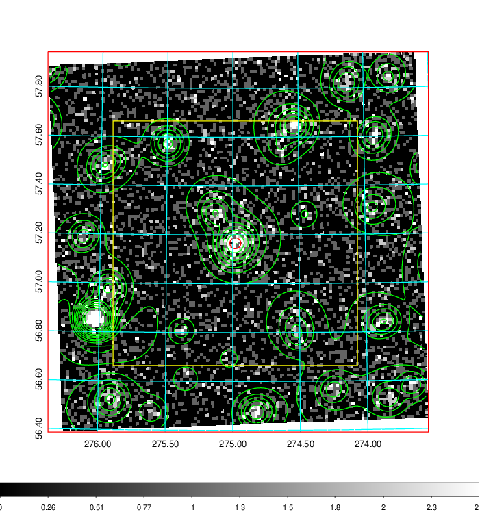
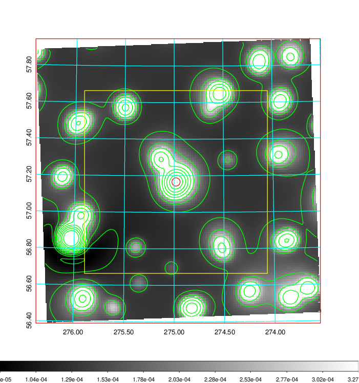
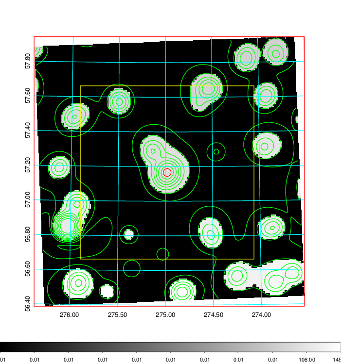
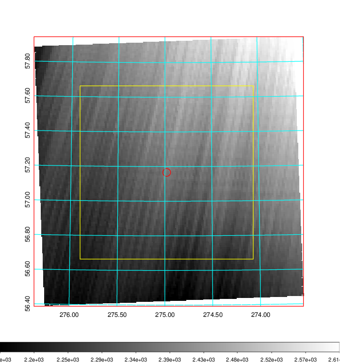
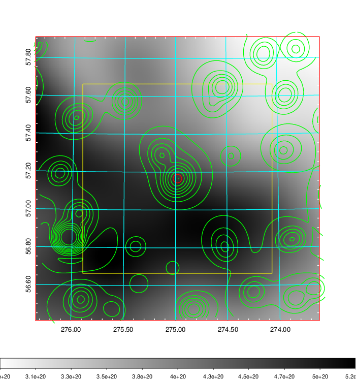
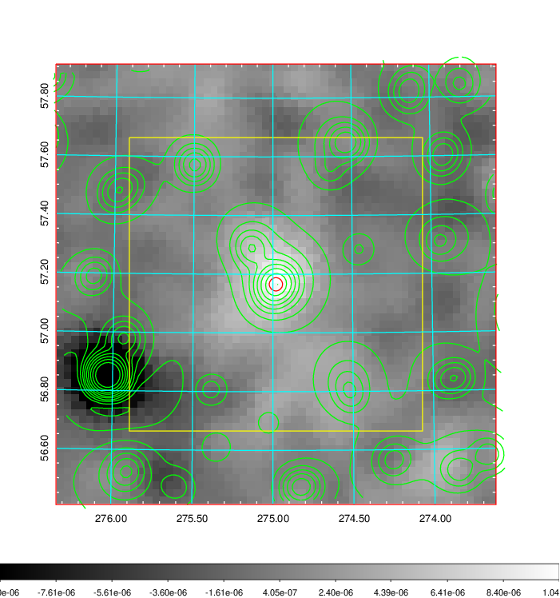
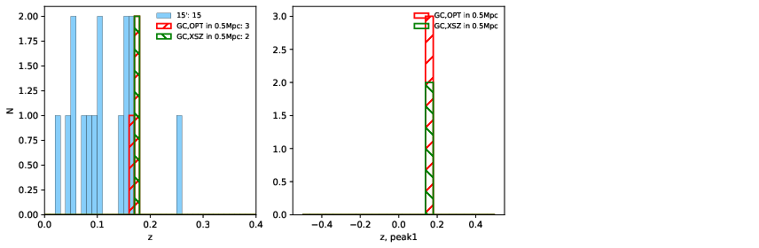
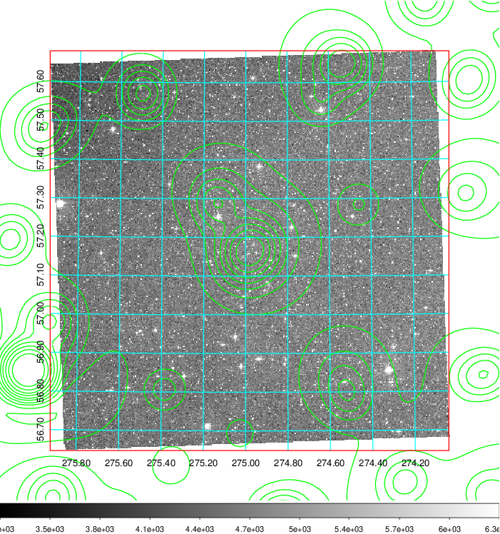
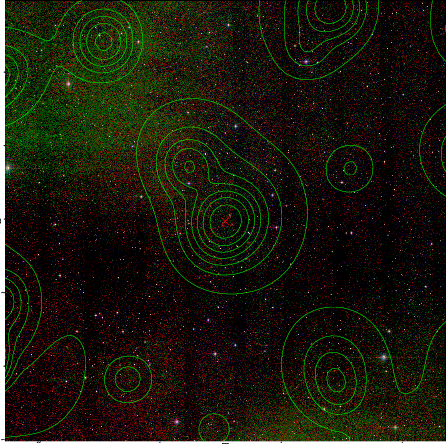

### 774

|Name|RAJ2000[deg]|DEJ2000[deg] |Ext[arcmin]| Ext,ml | z | z_src| C|GC(XSZ,Delta_z<0.01)| GC(OPT,Delta_z<0.01)|GC| R_sig[arcmin] | R500[arcmin] | R500[Mpc]| CRsig[c/s] | CR500[c/s] |L500[1E44 erg/s]|F500[1E-12 erg/s/cm^2]| M500[1E14 Msun]|Tx[keV]|Cnt_sig|Beta|Rc[arcmin]|Comment|Alias|
|---|---|---|---|---|---|------|---|--------|---------|----------|---|---|---|---|---|---|---|---|---|---|---|---|---|---|
|774| 274.981| 57.166| 1.36| 52.57| 0.1790(0.000)| z_xsz| B| PSZ2, Tar| A, N| A, N, PSZ2, Tar, W| 10.262| 5.483| 0.994| 0.118(0.013)| 0.110(0.012)| 1.829(0.112)| 2.037(0.125)| 3.33(0.10)| 4.77(0.09)| 243.8| 0.820(-0.102+0.108)| 4.087(-0.736+0.685)| -| k086|

|[RASS image](../image/774/774_img.pdf)|[filtered image](../image/774/774_fil.pdf)|[Segment image](../image/774/774_seg.pdf)|
|-------------------|--------------------|-------------------|
|   |    |   |

|[Exposure image](../image/774/774_mex.pdf)| [nH image](../image/774/774_nh.pdf)| [Planck image](../image/774/774_p.pdf)|
|-------------------|--------------------|-------------------|
|   |     |  |

|[Redshift Histogram](../image/774/774_zg.pdf) | [DSS image(z1)](../image/774/774_dss_z1.pdf)      |  [DSS image(z2)](../image/774/774_dss_z2.pdf)    |
|-------------------|--------------------|-------------------|
| |  Blue circle for optical clusters;  Magenta circle for XSZ clusters;  all with r=1Mpc;  Only GC with Delta_z<0.01 are shown. |  Blue circle for optical clusters;  Magenta circle for XSZ clusters;  all with r=1Mpc;  Only GC with Delta_z<0.01 are shown.  |

|[known Abell/XSZ clusters](../image/774/774_gc.pdf) | [2MASS image](../image/774/774_2mass.pdf)      |
|-------------------|-------------------|
|  Magenta, blue and green circles  for optical, X-ray and SZ clusters  respectively, with redshift of clusters  labelled. The radius of circles  are 1Mpc.|  |

|[PS1 image](../image/774/774_ps1.pdf)            |
|-------------------|
|   |
