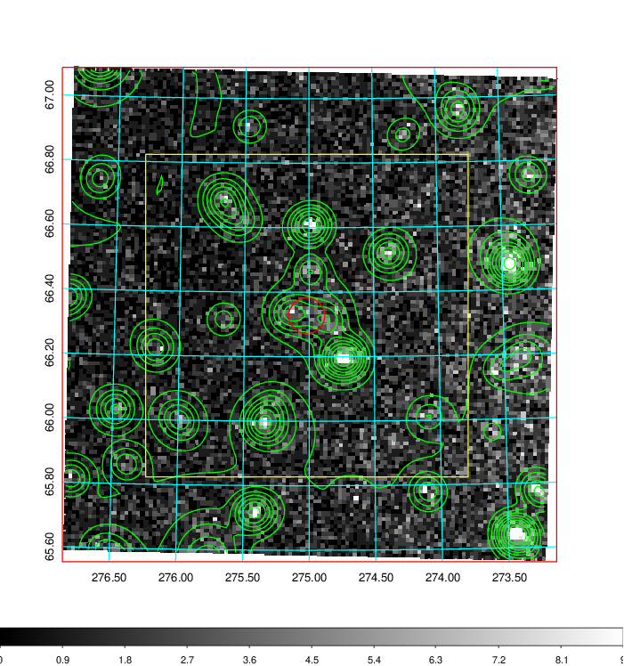
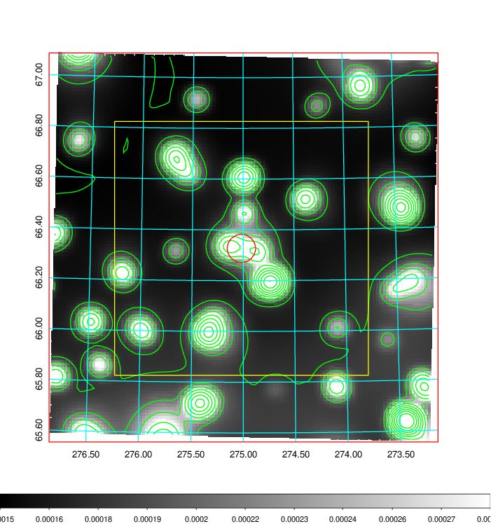
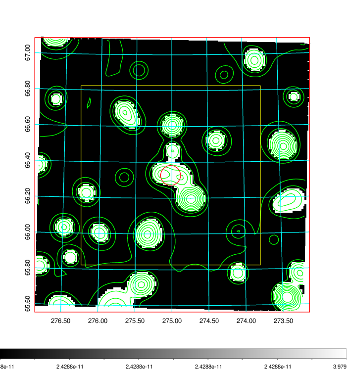
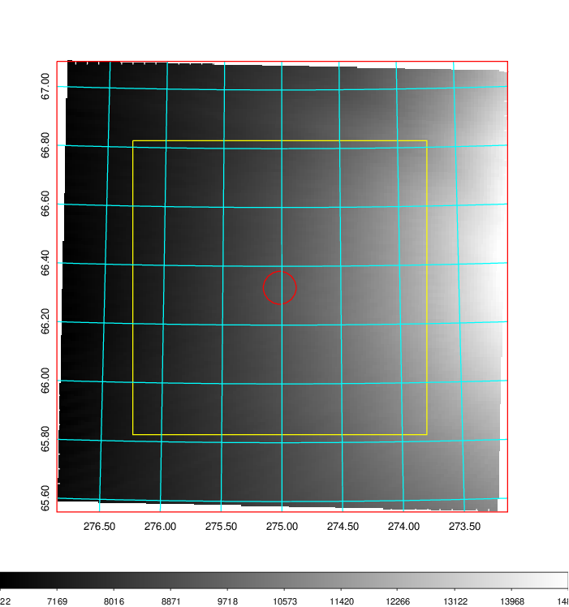
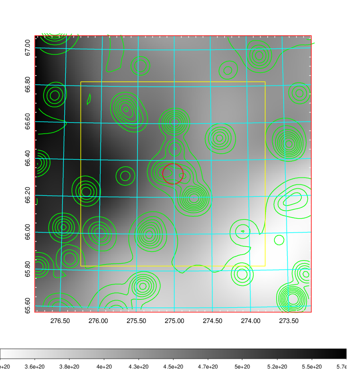
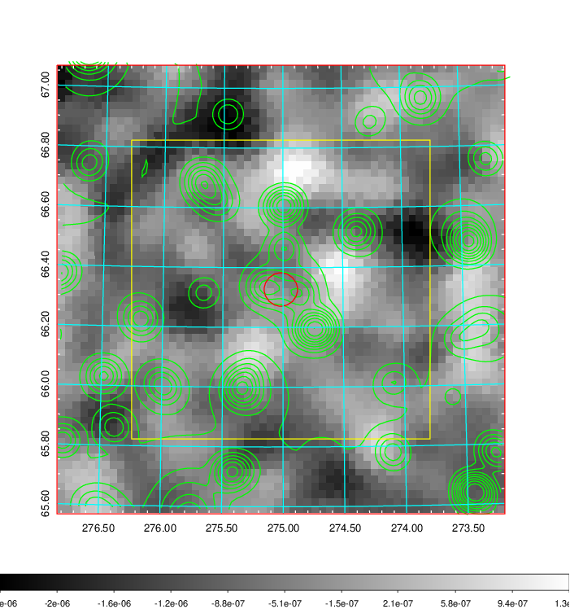
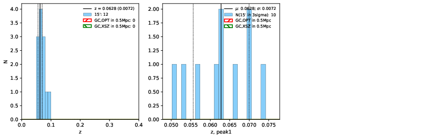
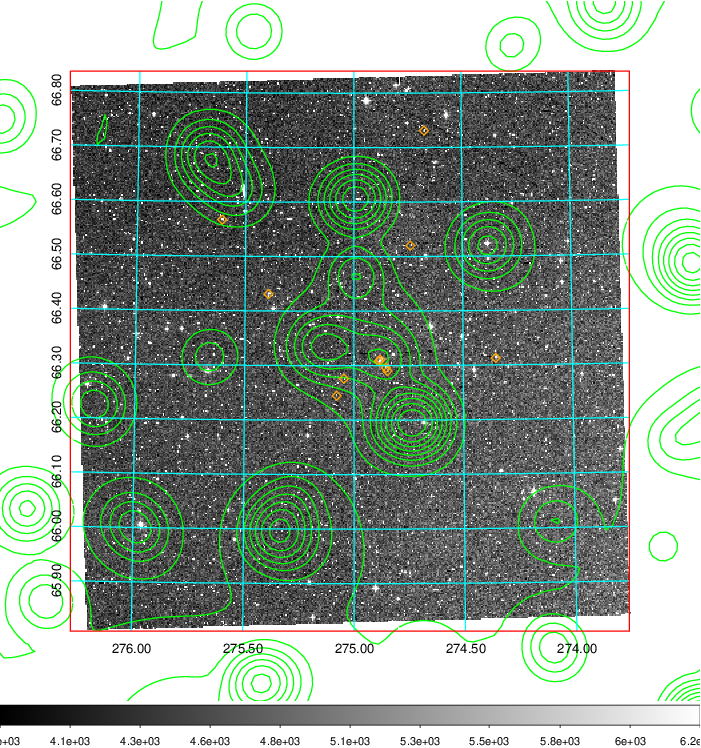
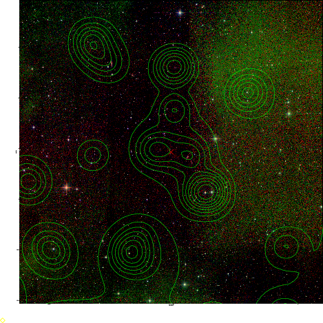

### 775

|Name|RAJ2000[deg]|DEJ2000[deg] |Ext[arcmin]| Ext,ml | z | z_src| C|GC(XSZ,Delta_z<0.01)| GC(OPT,Delta_z<0.01)|GC| R_sig[arcmin] | R500[arcmin] | R500[Mpc]| CRsig[c/s] | CR500[c/s] |L500[1E44 erg/s]|F500[1E-12 erg/s/cm^2]| M500[1E14 Msun]|Tx[keV]|Cnt_sig|Beta|Rc[arcmin]|Comment|Alias|
|---|---|---|---|---|---|------|---|--------|---------|----------|---|---|---|---|---|---|---|---|---|---|---|---|---|---|
|775| 275.018| 66.327| 3.35| 50.41| 0.0628(0.007)| z1,| G| -| -| N| 8.312| 6.848| 0.497| 0.030(0.006)| 0.029(0.006)| 0.040(0.006)| 0.417(0.066)| 0.37(0.03)| 1.18(0.06)| 239.1| 0.570(-0.042+0.061)| 2.765(-0.319+0.418)| -| t154|

|[RASS image](../image/775/775_img.pdf)|[filtered image](../image/775/775_fil.pdf)|[Segment image](../image/775/775_seg.pdf)|
|-------------------|--------------------|-------------------|
|   |    |   |

|[Exposure image](../image/775/775_mex.pdf)| [nH image](../image/775/775_nh.pdf)| [Planck image](../image/775/775_p.pdf)|
|-------------------|--------------------|-------------------|
|   |     |  |

|[Redshift Histogram](../image/775/775_zg.pdf) | [DSS image(z1)](../image/775/775_dss_z1.pdf)      |  [DSS image(z2)](../image/775/775_dss_z2.pdf)    |
|-------------------|--------------------|-------------------|
| |  Blue circle for optical clusters;  Magenta circle for XSZ clusters;  all with r=1Mpc;  Only GC with Delta_z<0.01 are shown. |  Blue circle for optical clusters;  Magenta circle for XSZ clusters;  all with r=1Mpc;  Only GC with Delta_z<0.01 are shown.  |

|[known Abell/XSZ clusters](../image/775/775_gc.pdf) | [2MASS image](../image/775/775_2mass.pdf)      |
|-------------------|-------------------|
|  Magenta, blue and green circles  for optical, X-ray and SZ clusters  respectively, with redshift of clusters  labelled. The radius of circles  are 1Mpc.|  |

|[PS1 image](../image/775/775_ps1.pdf)            |
|-------------------|
|   |
