

### 776

|Name|RAJ2000[deg]|DEJ2000[deg] |Ext[arcmin]| Ext,ml | z | z_src| C|GC(XSZ,Delta_z<0.01)| GC(OPT,Delta_z<0.01)|GC| R_sig[arcmin] | R500[arcmin] | R500[Mpc]| CRsig[c/s] | CR500[c/s] |L500[1E44 erg/s]|F500[1E-12 erg/s/cm^2]| M500[1E14 Msun]|Tx[keV]|Cnt_sig|Beta|Rc[arcmin]|Comment|Alias|
|---|---|---|---|---|---|------|---|--------|---------|----------|---|---|---|---|---|---|---|---|---|---|---|---|---|---|
|776| 275.052| 68.956| 1.72| 226.16| 0.0873(0.005)| z1, z_xsz| B| L03, MCXC| A, N| A, L03, MCXC, N, W| 12.700| 7.636| 0.748| 0.106(0.010)| 0.100(0.009)| 0.326(0.016)| 1.714(0.084)| 1.30(0.03)| 2.58(0.04)| 732.9| 0.797(-0.076+0.094)| 3.255(-0.473+0.521)| -| k163|

|[RASS image](../image/776/776_img.pdf)|[filtered image](../image/776/776_fil.pdf)|[Segment image](../image/776/776_seg.pdf)|
|-------------------|--------------------|-------------------|
| 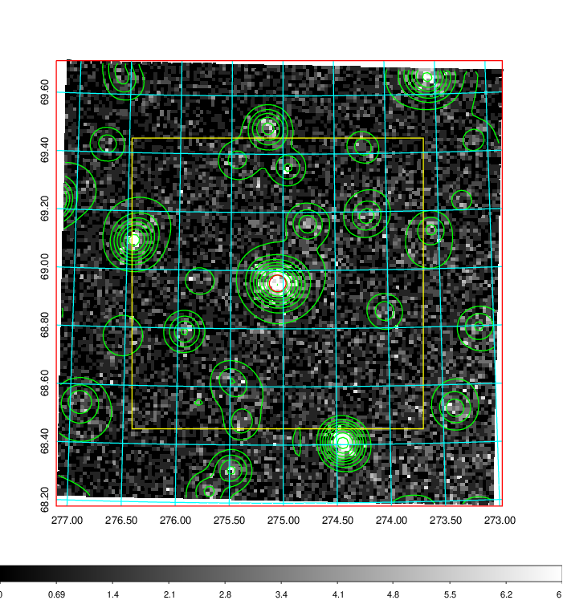  | 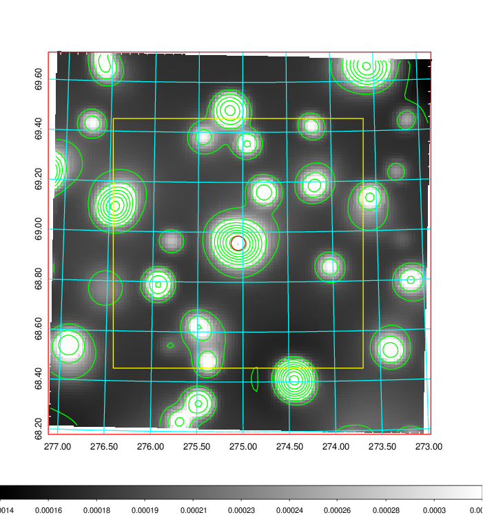   | 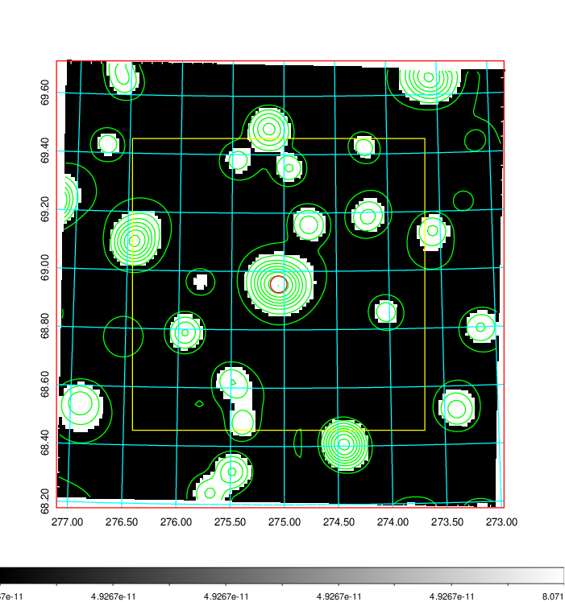  |

|[Exposure image](../image/776/776_mex.pdf)| [nH image](../image/776/776_nh.pdf)| [Planck image](../image/776/776_p.pdf)|
|-------------------|--------------------|-------------------|
|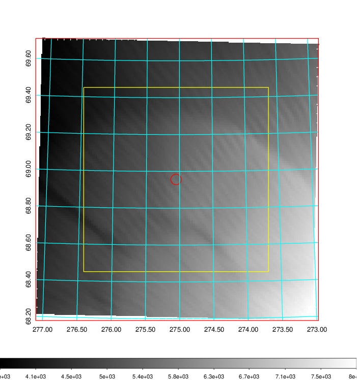   | 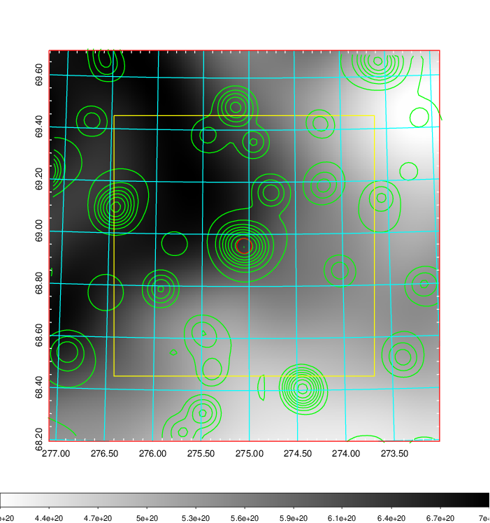    | 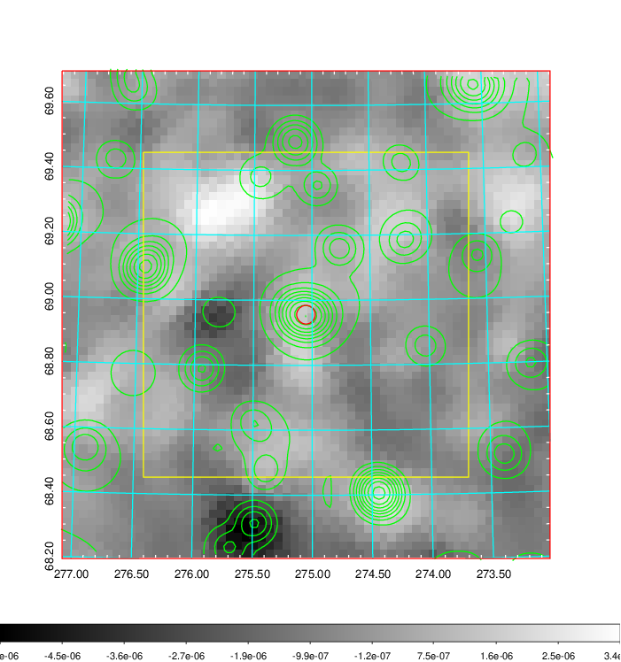 |

|[Redshift Histogram](../image/776/776_zg.pdf) | [DSS image(z1)](../image/776/776_dss_z1.pdf)      |  [DSS image(z2)](../image/776/776_dss_z2.pdf)    |
|-------------------|--------------------|-------------------|
|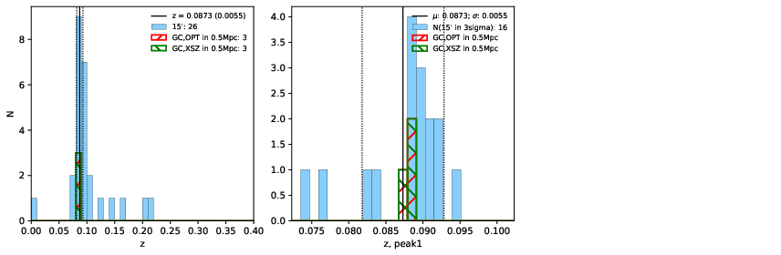 |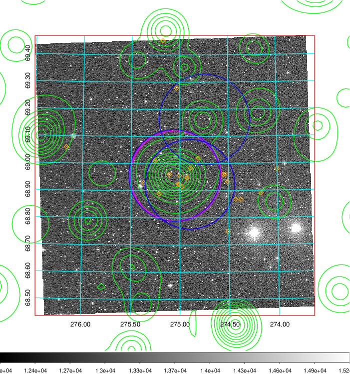  Blue circle for optical clusters;  Magenta circle for XSZ clusters;  all with r=1Mpc;  Only GC with Delta_z<0.01 are shown. | 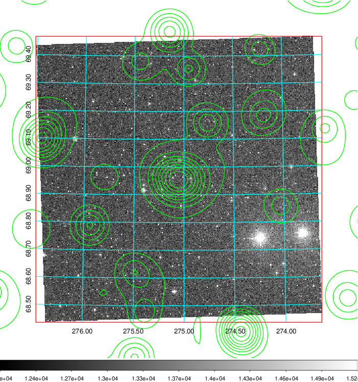 Blue circle for optical clusters;  Magenta circle for XSZ clusters;  all with r=1Mpc;  Only GC with Delta_z<0.01 are shown.  |

|[Previous-identified clusters](../image/776/776_gc.pdf) | [2MASS image](../image/776/776_2mass.pdf)      |
|-------------------|-------------------|
|  Green, magenta, and blue circles  for optical, X-ray and SZ clusters  respectively, with redshift of clusters  labelled. The radius of circles  are 1Mpc.|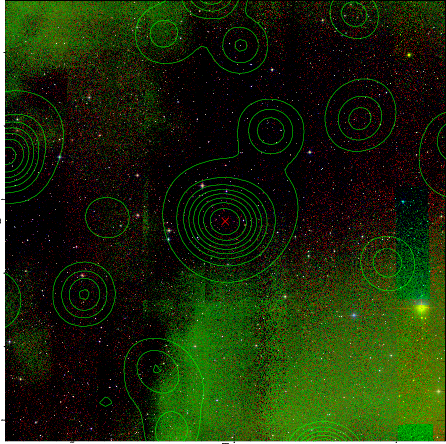  |

|[PS1 image](../image/776/776_ps1.pdf)            |
|-------------------|
| 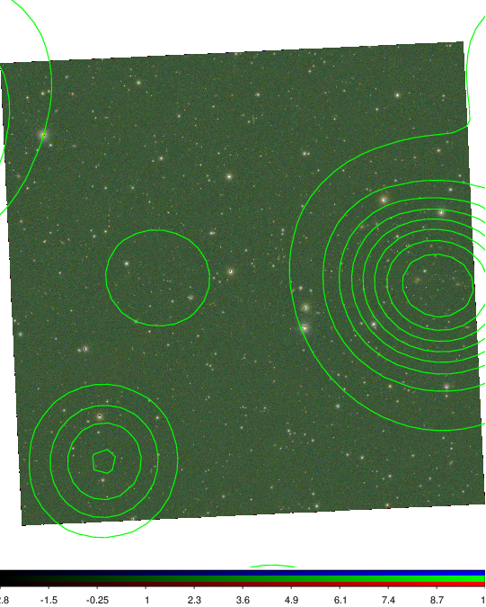  |
