

### 777

|Name|RAJ2000[deg]|DEJ2000[deg] |Ext[arcmin]| Ext,ml | z | z_src| C|GC(XSZ,Delta_z<0.01)| GC(OPT,Delta_z<0.01)|GC| R_sig[arcmin] | R500[arcmin] | R500[Mpc]| CRsig[c/s] | CR500[c/s] |L500[1E44 erg/s]|F500[1E-12 erg/s/cm^2]| M500[1E14 Msun]|Tx[keV]|Cnt_sig|Beta|Rc[arcmin]|Comment|Alias|
|---|---|---|---|---|---|------|---|--------|---------|----------|---|---|---|---|---|---|---|---|---|---|---|---|---|---|
|777| 275.643| 65.120| 8.77| 91.56| 0.2006(0.000)| z_opt| S| -| W| Tak, W| 18.550| 3.579| 0.710| 0.020(0.008)| 0.018(0.007)| 0.381(0.160)| 0.329(0.138)| 1.24(0.26)| 2.61(0.35)| 1638.6| 0.509(-0.007+0.015)| 1.867(-0.113+0.118)| An X-ray cluster with $z$ = 0.1932 and offset = 0.96 Mpc(4.88 arcmin),| t409|

|[RASS image](../image/777/777_img.pdf)|[filtered image](../image/777/777_fil.pdf)|[Segment image](../image/777/777_seg.pdf)|
|-------------------|--------------------|-------------------|
| 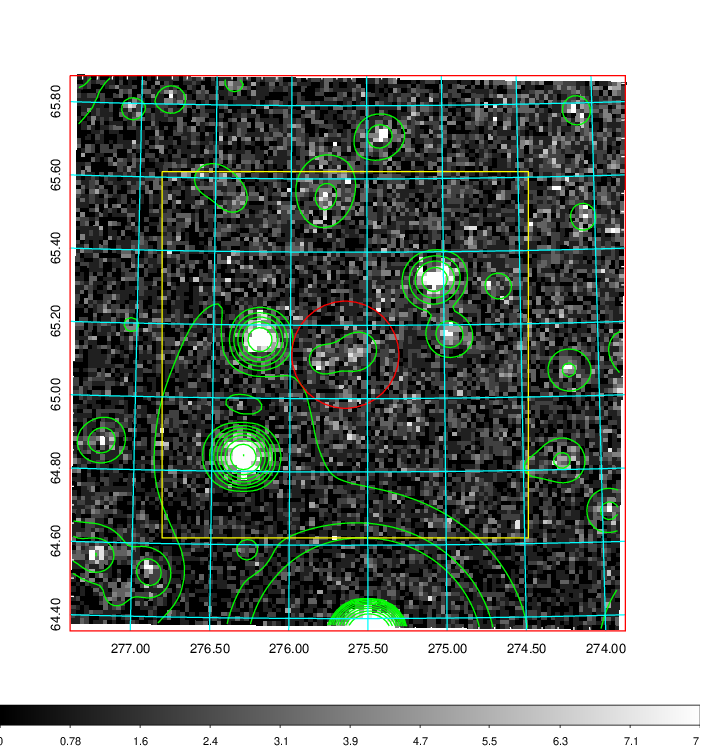  | 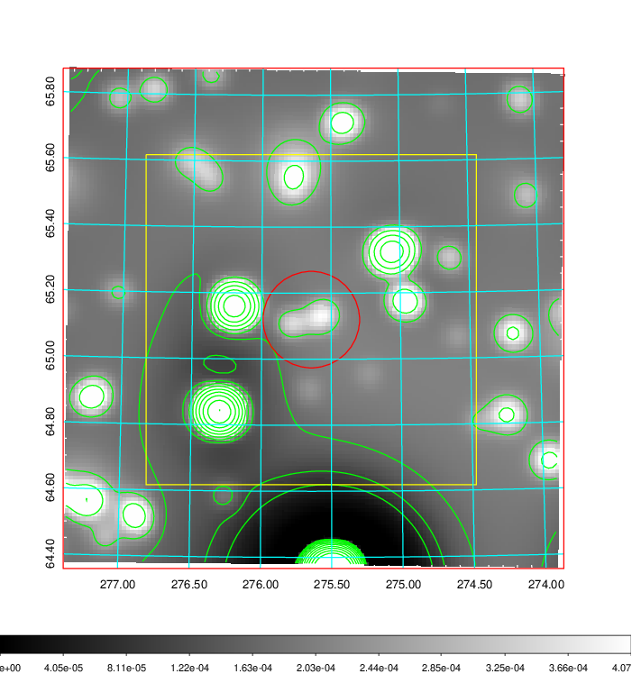   | 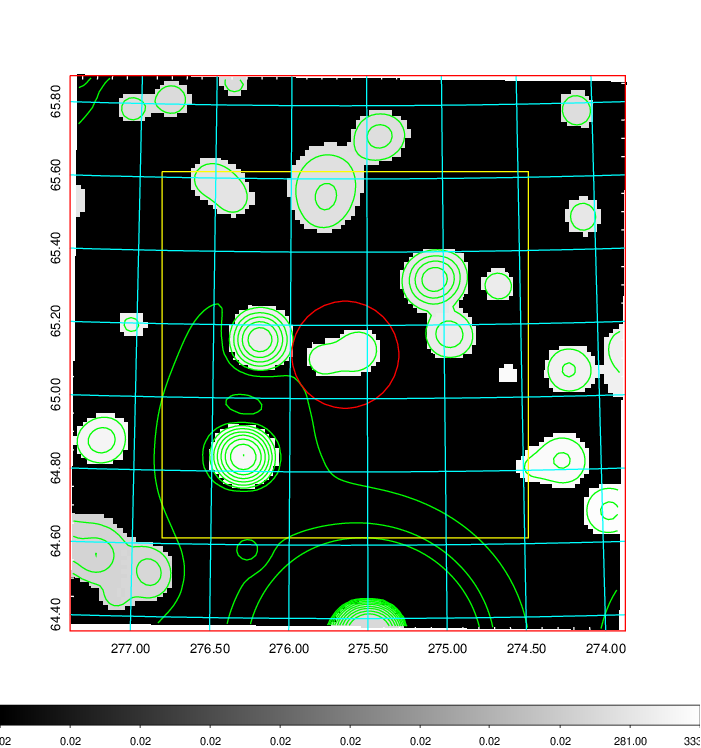  |

|[Exposure image](../image/777/777_mex.pdf)| [nH image](../image/777/777_nh.pdf)| [Planck image](../image/777/777_p.pdf)|
|-------------------|--------------------|-------------------|
|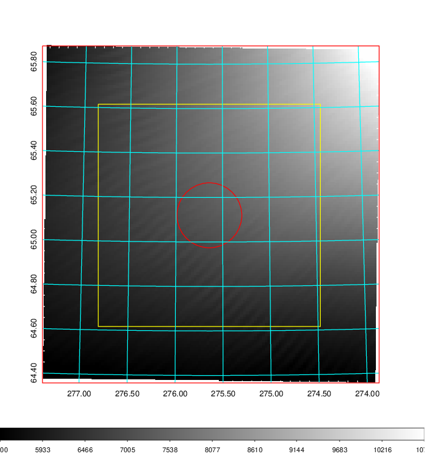   | 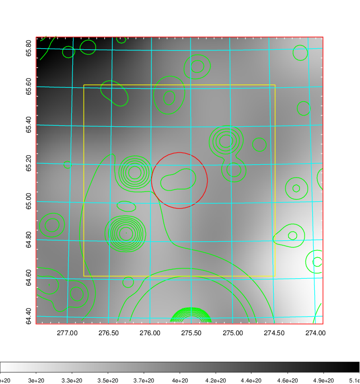    | 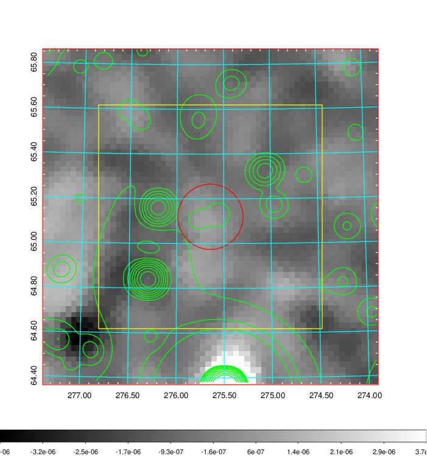 |

|[Redshift Histogram](../image/777/777_zg.pdf) | [DSS image(z1)](../image/777/777_dss_z1.pdf)      |  [DSS image(z2)](../image/777/777_dss_z2.pdf)    |
|-------------------|--------------------|-------------------|
|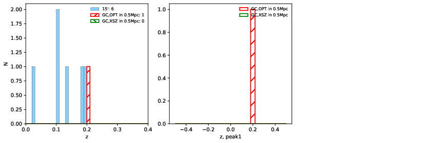 |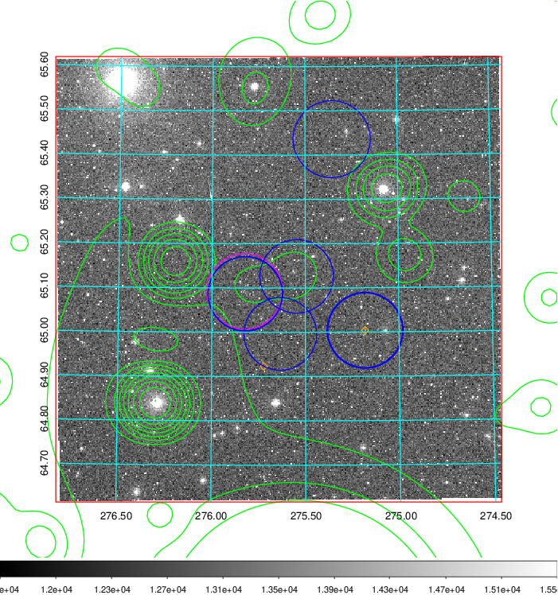  Blue circle for optical clusters;  Magenta circle for XSZ clusters;  all with r=1Mpc;  Only GC with Delta_z<0.01 are shown. | 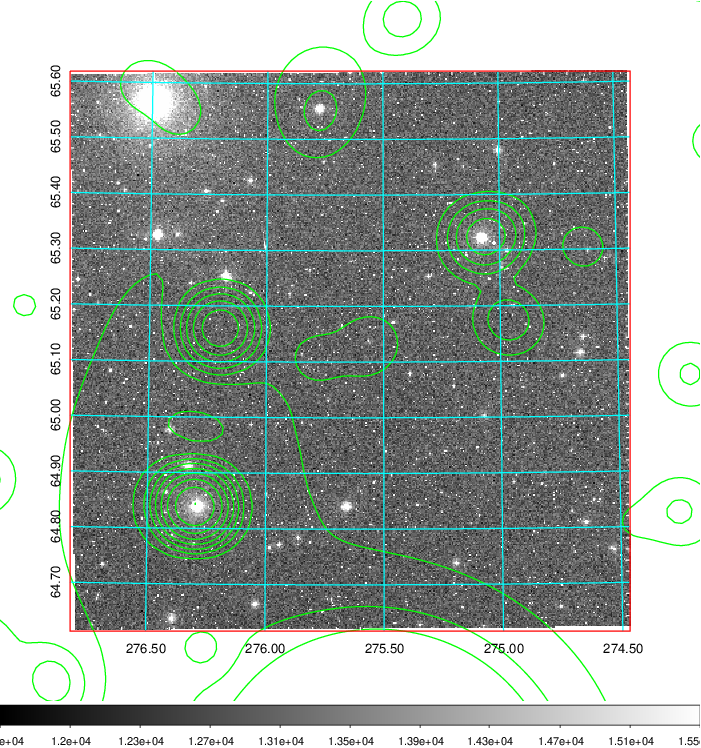 Blue circle for optical clusters;  Magenta circle for XSZ clusters;  all with r=1Mpc;  Only GC with Delta_z<0.01 are shown.  |

|[known Abell/XSZ clusters](../image/777/777_gc.pdf) | [2MASS image](../image/777/777_2mass.pdf)      |[SDSS image](../image/777/777_sdss.pdf)   |
|-------------------|-------------------|-------------------|
|  Magenta, blue and green circles  for optical, X-ray and SZ clusters  respectively, with redshift of clusters  labelled. The radius of circles  are 1Mpc.|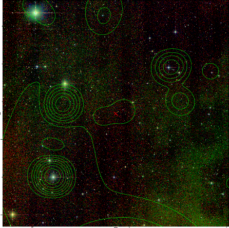  | 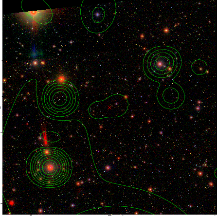  |

