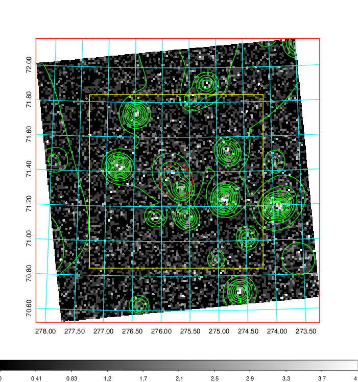
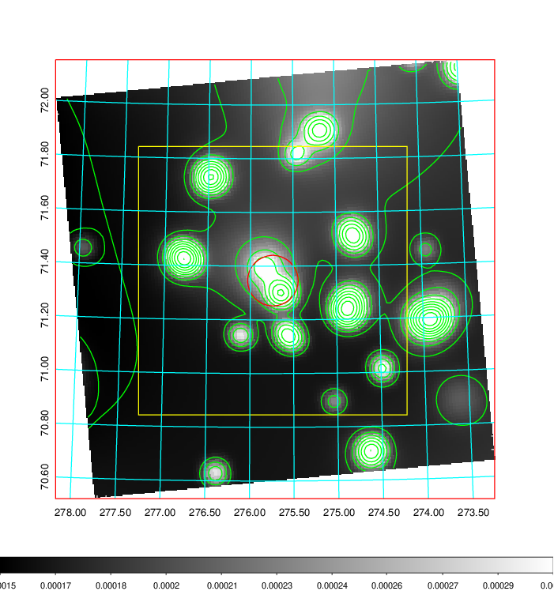
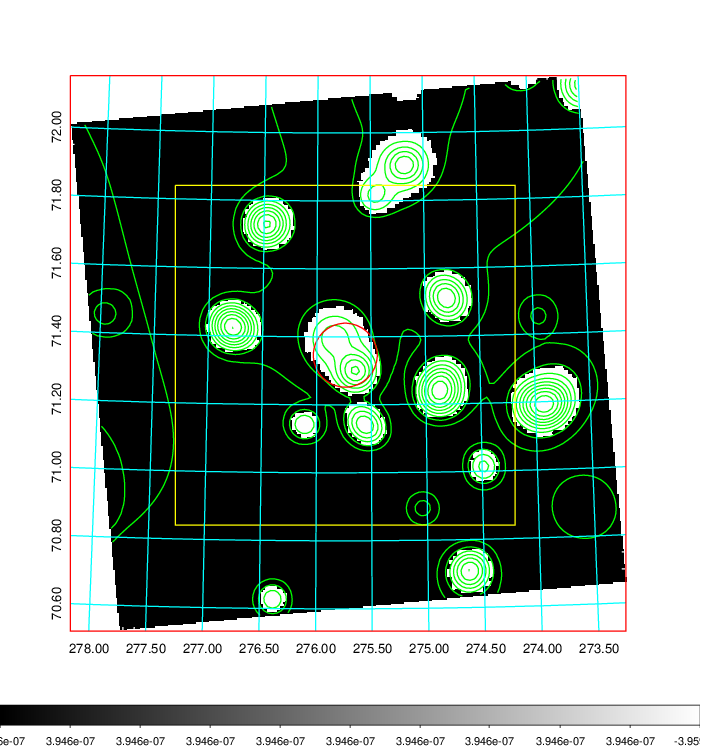
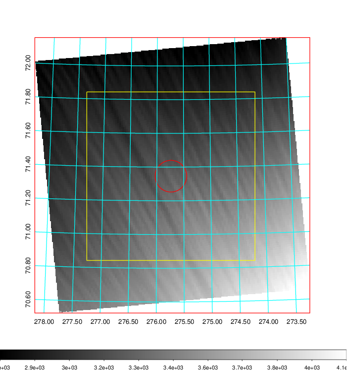
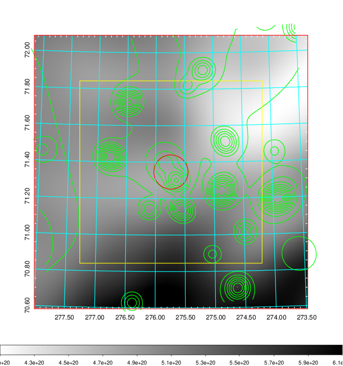
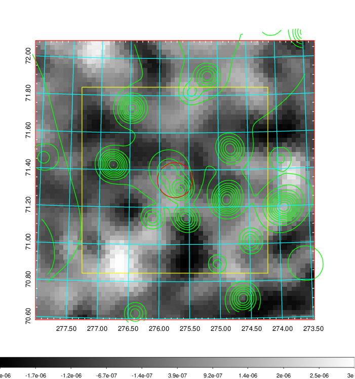
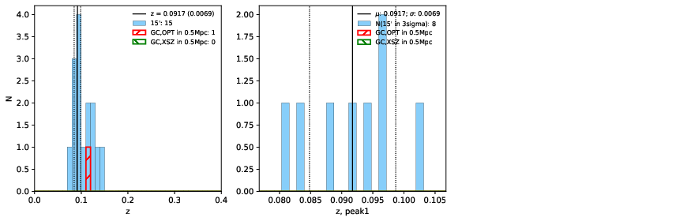
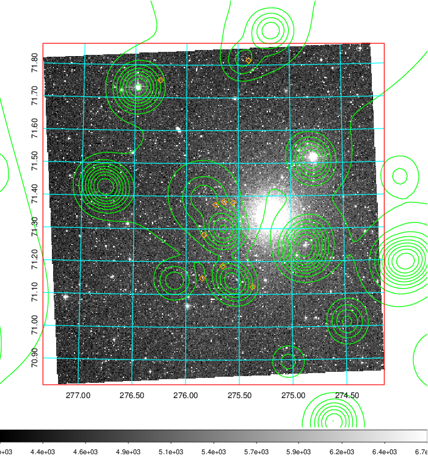
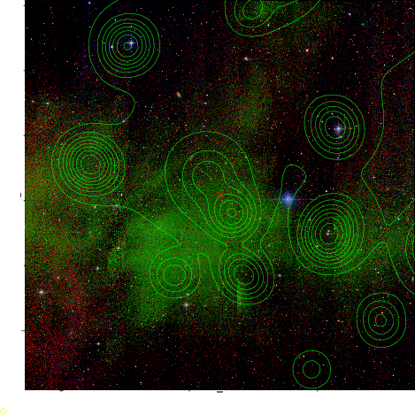
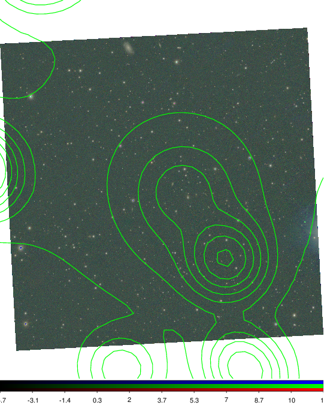

### 778

|Name|RAJ2000[deg]|DEJ2000[deg] |Ext[arcmin]| Ext,ml | z | z_src| C|GC(XSZ,Delta_z<0.01)| GC(OPT,Delta_z<0.01)|GC| R_sig[arcmin] | R500[arcmin] | R500[Mpc]| CRsig[c/s] | CR500[c/s] |L500[1E44 erg/s]|F500[1E-12 erg/s/cm^2]| M500[1E14 Msun]|Tx[keV]|Cnt_sig|Beta|Rc[arcmin]|Comment|Alias|
|---|---|---|---|---|---|------|---|--------|---------|----------|---|---|---|---|---|---|---|---|---|---|---|---|---|---|
|778| 275.738| 71.346| 5.64| 28.00| 0.0917(0.007)| z1,| G| -| -| A, W| 12.212| 5.915| 0.606| 0.037(0.011)| 0.034(0.010)| 0.119(0.032)| 0.563(0.152)| 0.69(0.10)| 1.75(0.15)| 154.7| 0.523(-0.017+0.041)| 2.502(-0.185+0.301)| An Abell cluster with no $z$ and offset = 0.13 Mpc| t291|

|[RASS image](../image/778/778_img.pdf)|[filtered image](../image/778/778_fil.pdf)|[Segment image](../image/778/778_seg.pdf)|
|-------------------|--------------------|-------------------|
|   |    |   |

|[Exposure image](../image/778/778_mex.pdf)| [nH image](../image/778/778_nh.pdf)| [Planck image](../image/778/778_p.pdf)|
|-------------------|--------------------|-------------------|
|   |     |  |

|[Redshift Histogram](../image/778/778_zg.pdf) | [DSS image(z1)](../image/778/778_dss_z1.pdf)      |  [DSS image(z2)](../image/778/778_dss_z2.pdf)    |
|-------------------|--------------------|-------------------|
| |  Blue circle for optical clusters;  Magenta circle for XSZ clusters;  all with r=1Mpc;  Only GC with Delta_z<0.01 are shown. |  Blue circle for optical clusters;  Magenta circle for XSZ clusters;  all with r=1Mpc;  Only GC with Delta_z<0.01 are shown.  |

|[Previous-identified clusters](../image/778/778_gc.pdf) | [2MASS image](../image/778/778_2mass.pdf)      |
|-------------------|-------------------|
|  Green, magenta, and blue circles  for optical, X-ray and SZ clusters  respectively, with redshift of clusters  labelled. The radius of circles  are 1Mpc.|  |

|[PS1 image](../image/778/778_ps1.pdf)            |
|-------------------|
|   |
