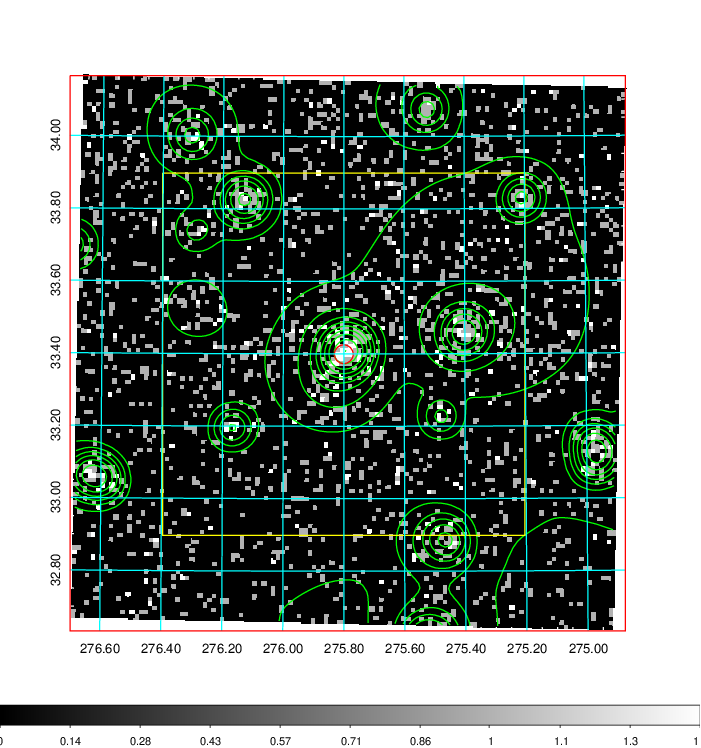
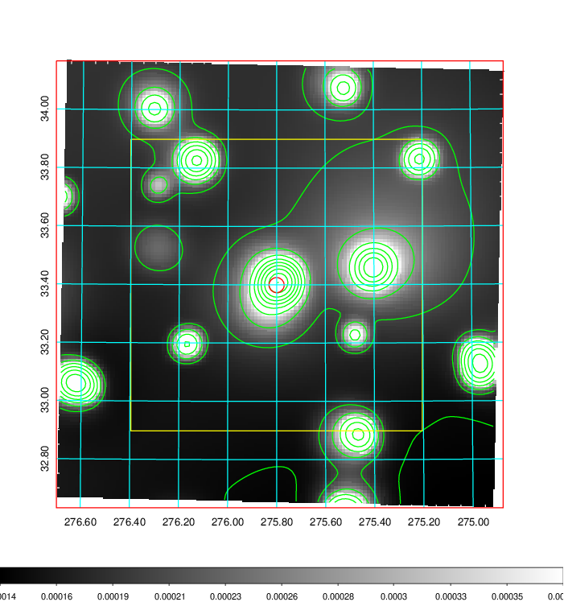
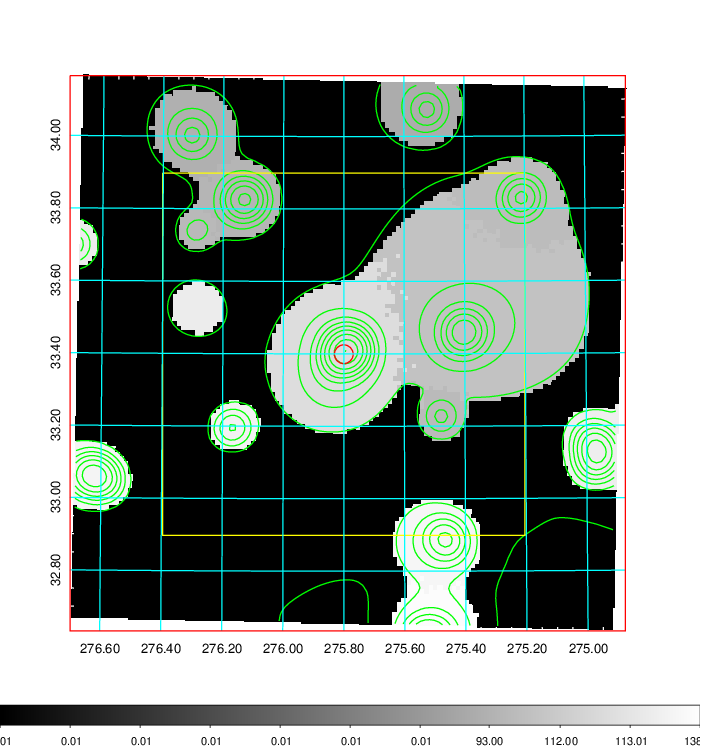
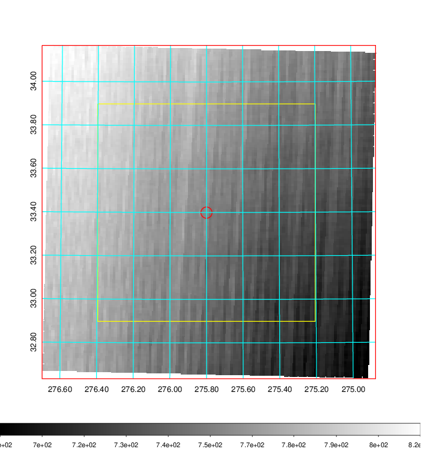
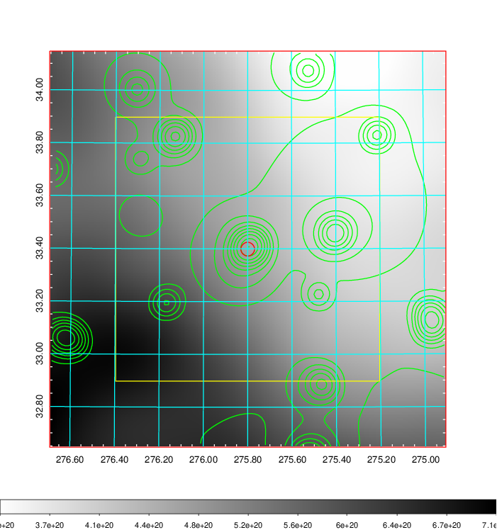
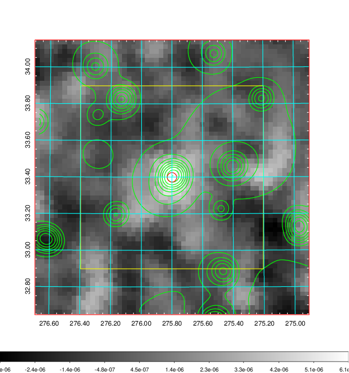
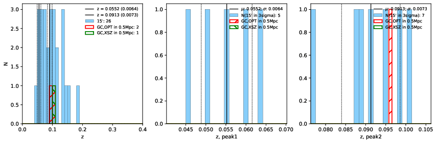
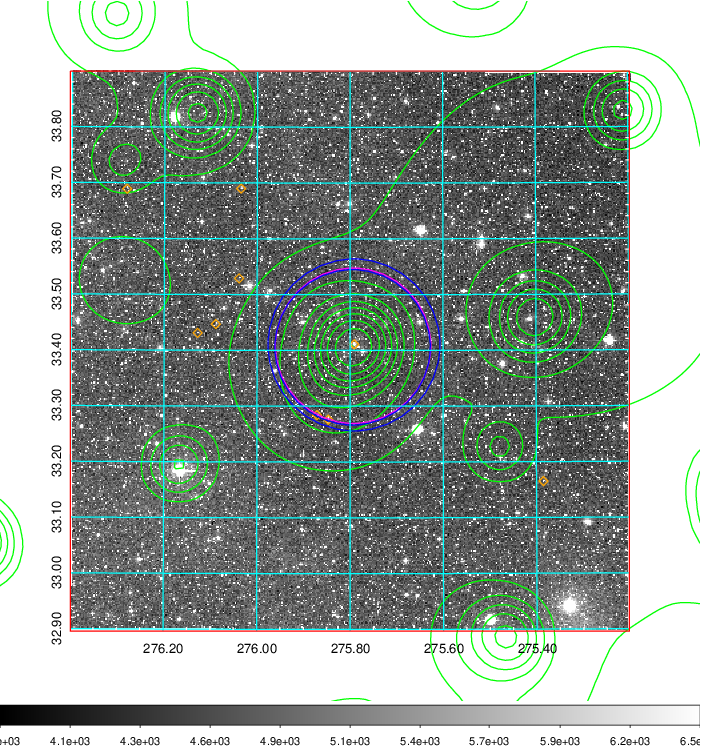
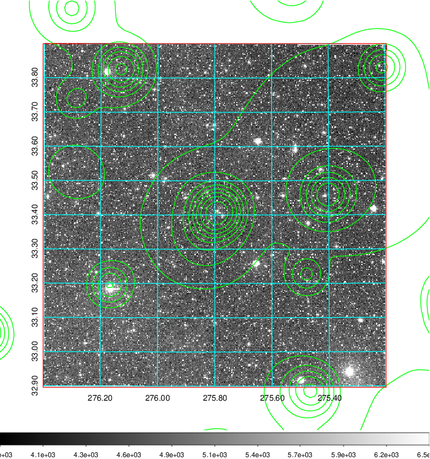
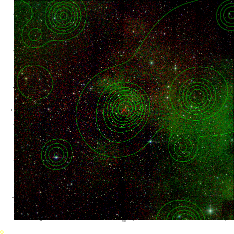

### 779

|Name|RAJ2000[deg]|DEJ2000[deg] |Ext[arcmin]| Ext,ml | z | z_src| C|GC(XSZ,Delta_z<0.01)| GC(OPT,Delta_z<0.01)|GC| R_sig[arcmin] | R500[arcmin] | R500[Mpc]| CRsig[c/s] | CR500[c/s] |L500[1E44 erg/s]|F500[1E-12 erg/s/cm^2]| M500[1E14 Msun]|Tx[keV]|Cnt_sig|Beta|Rc[arcmin]|Comment|Alias|
|---|---|---|---|---|---|------|---|--------|---------|----------|---|---|---|---|---|---|---|---|---|---|---|---|---|---|
|779| 275.800| 33.399| 1.56| 40.76| 0.1080(0.000)| z_xsz| B| Tar| N| N, Tar, W| 13.188| 7.869| 0.932| 0.216(0.028)| 0.202(0.027)| 1.099(0.083)| 3.678(0.277)| 2.55(0.10)| 3.95(0.09)| 170.0| 0.547(-0.033+0.062)| 1.796(-0.396+0.603)| -| t029|

|[RASS image](../image/779/779_img.pdf)|[filtered image](../image/779/779_fil.pdf)|[Segment image](../image/779/779_seg.pdf)|
|-------------------|--------------------|-------------------|
|   |    |   |

|[Exposure image](../image/779/779_mex.pdf)| [nH image](../image/779/779_nh.pdf)| [Planck image](../image/779/779_p.pdf)|
|-------------------|--------------------|-------------------|
|   |     |  |

|[Redshift Histogram](../image/779/779_zg.pdf) | [DSS image(z1)](../image/779/779_dss_z1.pdf)      |  [DSS image(z2)](../image/779/779_dss_z2.pdf)    |
|-------------------|--------------------|-------------------|
| |  Blue circle for optical clusters;  Magenta circle for XSZ clusters;  all with r=1Mpc;  Only GC with Delta_z<0.01 are shown. |  Blue circle for optical clusters;  Magenta circle for XSZ clusters;  all with r=1Mpc;  Only GC with Delta_z<0.01 are shown.  |

|[known Abell/XSZ clusters](../image/779/779_gc.pdf) | [2MASS image](../image/779/779_2mass.pdf)      |
|-------------------|-------------------|
|  Magenta, blue and green circles  for optical, X-ray and SZ clusters  respectively, with redshift of clusters  labelled. The radius of circles  are 1Mpc.|  |

|[PS1 image](../image/779/779_ps1.pdf)            |
|-------------------|
|   |
