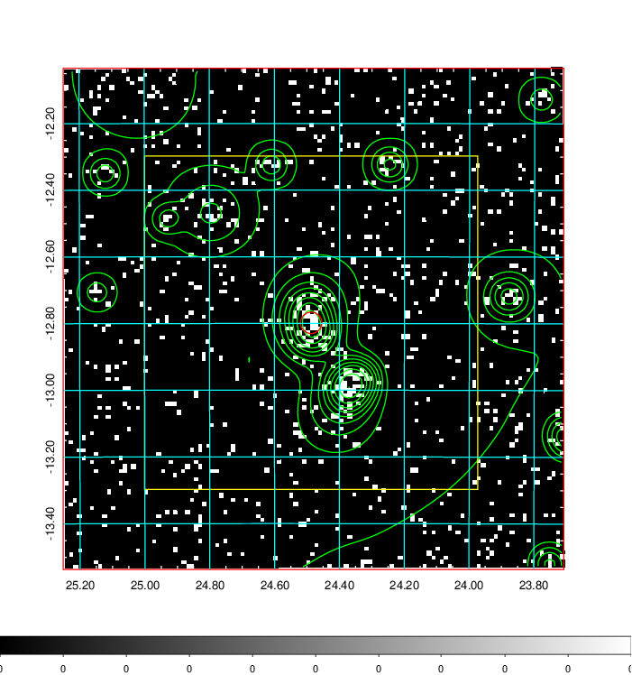
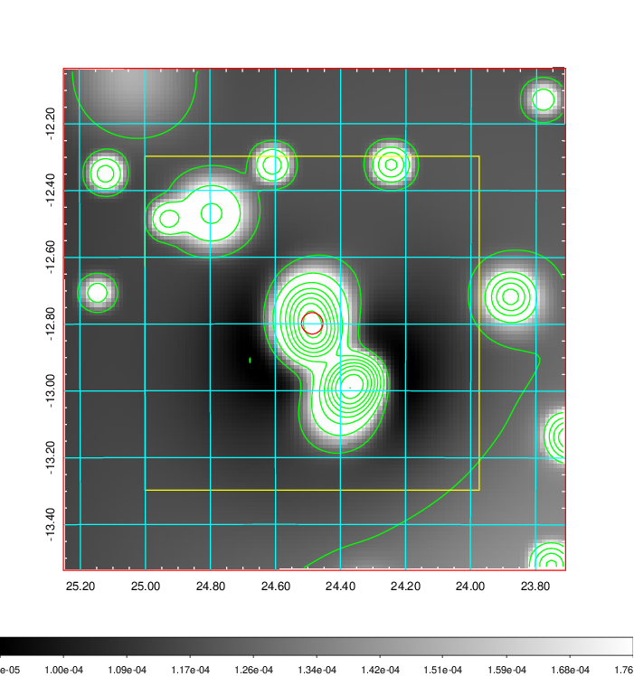
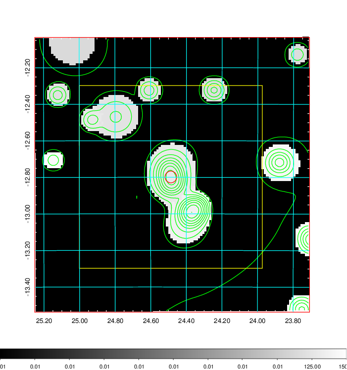
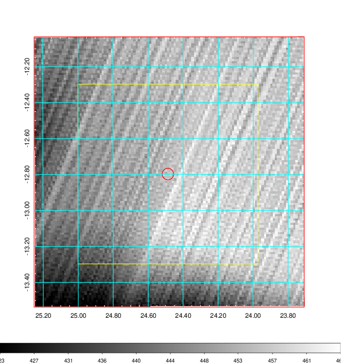
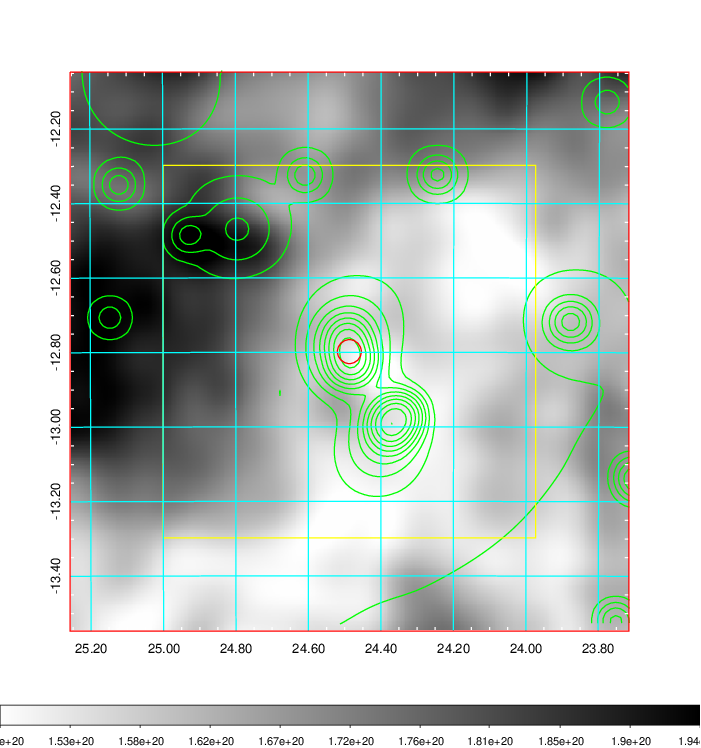
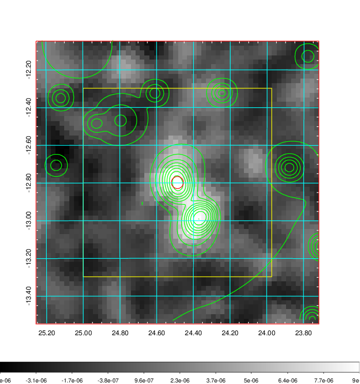
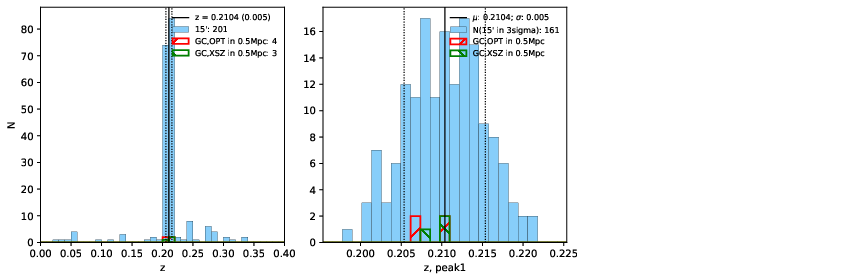
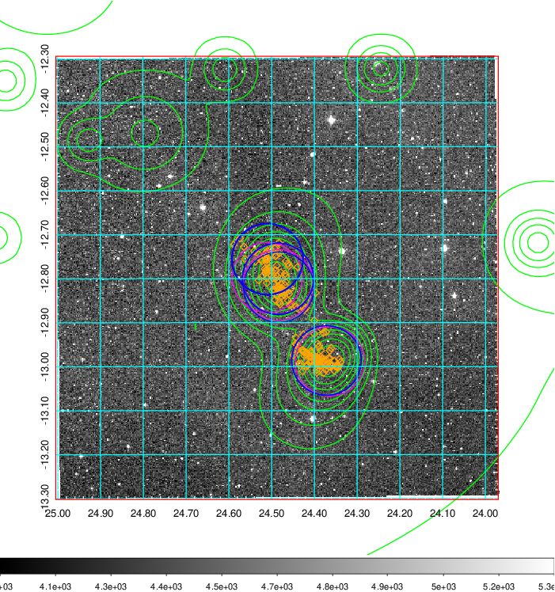
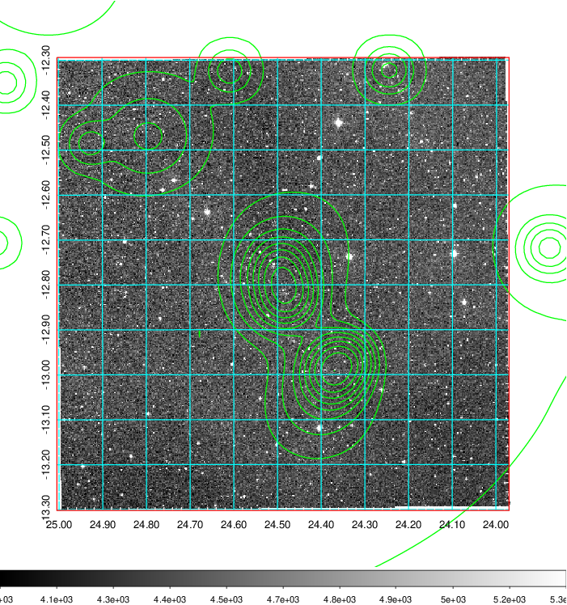
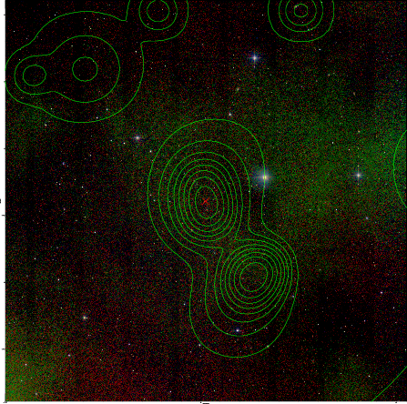

### 78

|Name|RAJ2000[deg]|DEJ2000[deg] |Ext[arcmin]| Ext,ml | z | z_src| C|GC(XSZ,Delta_z<0.01)| GC(OPT,Delta_z<0.01)|GC| R_sig[arcmin] | R500[arcmin] | R500[Mpc]| CRsig[c/s] | CR500[c/s] |L500[1E44 erg/s]|F500[1E-12 erg/s/cm^2]| M500[1E14 Msun]|Tx[keV]|Cnt_sig|Beta|Rc[arcmin]|Comment|Alias|
|---|---|---|---|---|---|------|---|--------|---------|----------|---|---|---|---|---|---|---|---|---|---|---|---|---|---|
|78| 24.487| -12.798| 1.93| 28.24| 0.2104(0.005)| z1, z_xsz| B| MCXC, PSZ2, Tar| A, N| A, MCXC, N, PSZ2, Tar, W| 6.850| 5.043| 1.039| 0.115(0.028)| 0.110(0.027)| 2.875(0.382)| 2.233(0.297)| 3.93(0.25)| 5.33(0.22)| 50.4| 0.909(-0.110+0.066)| 3.527(-0.603+0.491)| -| k204|

|[RASS image](../image/78/78_img.pdf)|[filtered image](../image/78/78_fil.pdf)|[Segment image](../image/78/78_seg.pdf)|
|-------------------|--------------------|-------------------|
|   |    |   |

|[Exposure image](../image/78/78_mex.pdf)| [nH image](../image/78/78_nh.pdf)| [Planck image](../image/78/78_p.pdf)|
|-------------------|--------------------|-------------------|
|   |     |  |

|[Redshift Histogram](../image/78/78_zg.pdf) | [DSS image(z1)](../image/78/78_dss_z1.pdf)      |  [DSS image(z2)](../image/78/78_dss_z2.pdf)    |
|-------------------|--------------------|-------------------|
| |  Blue circle for optical clusters;  Magenta circle for XSZ clusters;  all with r=1Mpc;  Only GC with Delta_z<0.01 are shown. |  Blue circle for optical clusters;  Magenta circle for XSZ clusters;  all with r=1Mpc;  Only GC with Delta_z<0.01 are shown.  |

|[known Abell/XSZ clusters](../image/78/78_gc.pdf) | [2MASS image](../image/78/78_2mass.pdf)      |
|-------------------|-------------------|
|  Magenta, blue and green circles  for optical, X-ray and SZ clusters  respectively, with redshift of clusters  labelled. The radius of circles  are 1Mpc.|  |

|[DES image](../image/78/78_des.pdf)   |[ATLAS image](../image/78/78_s.pdf)        |
|-------------------|-------------------|
|   |   |
