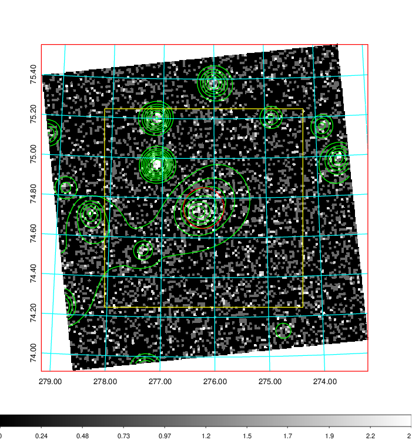
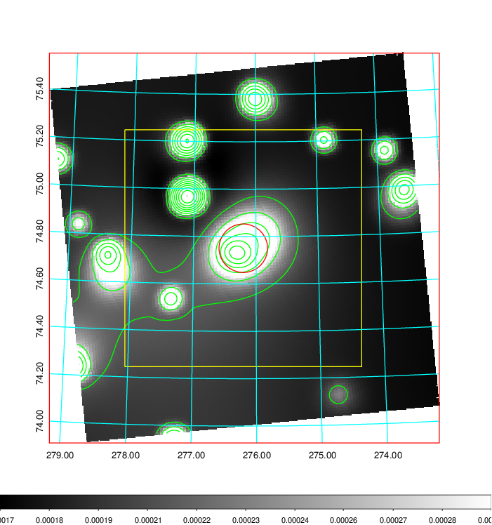
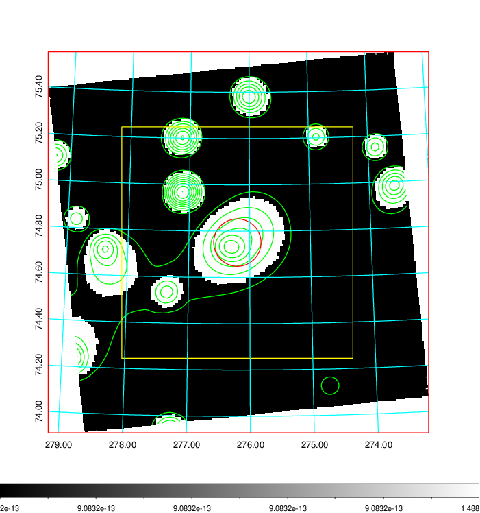
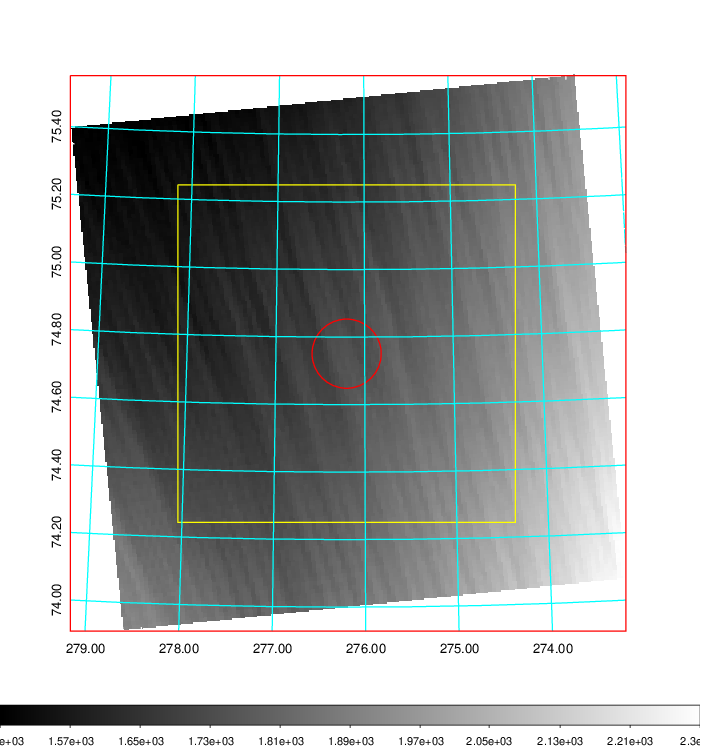
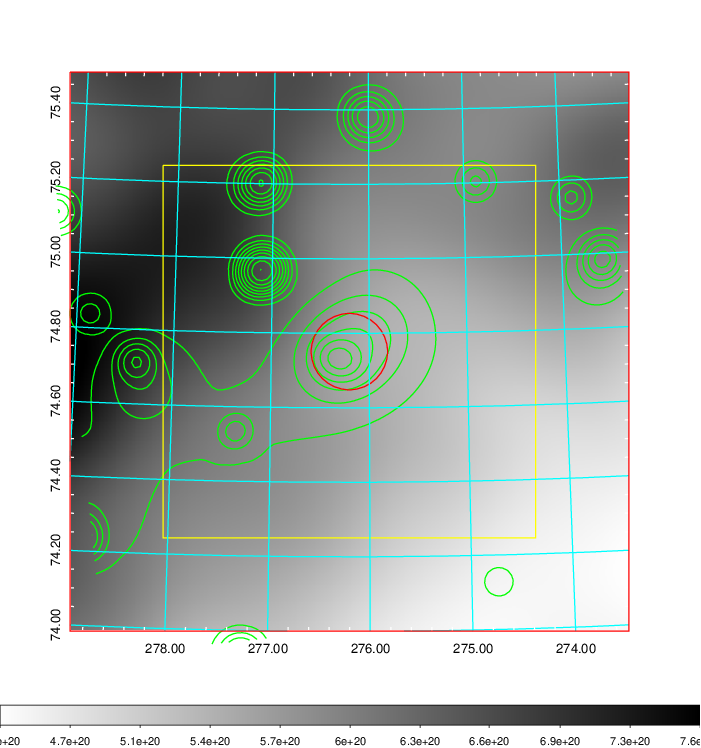
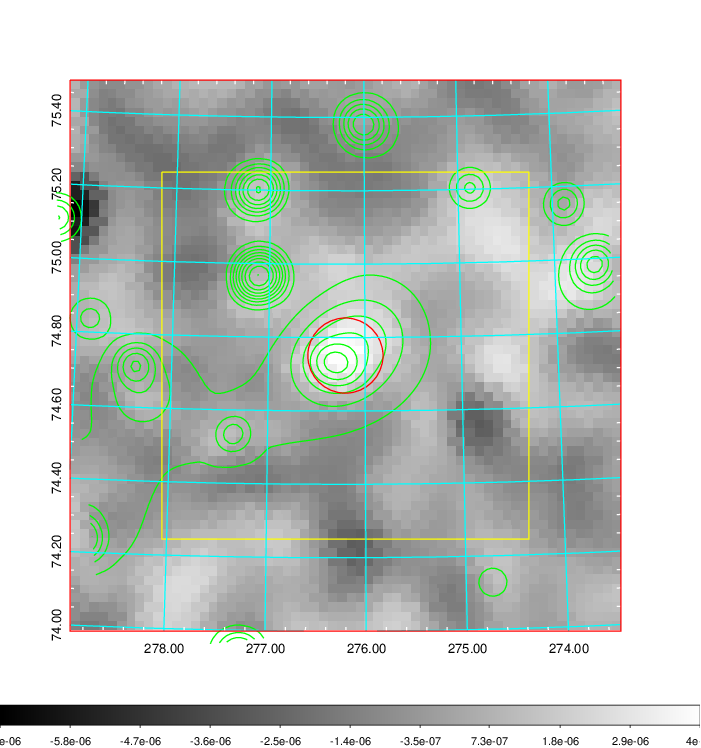
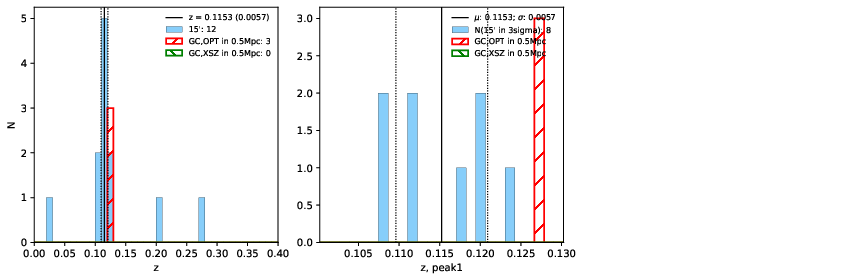
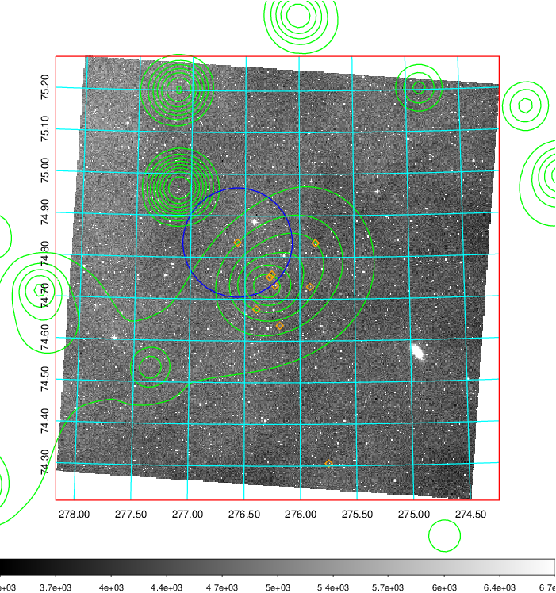
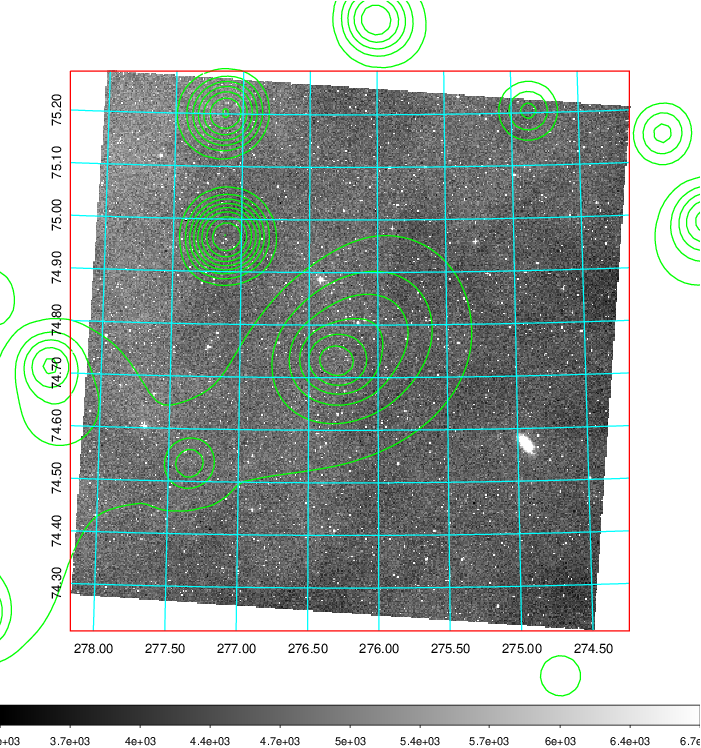
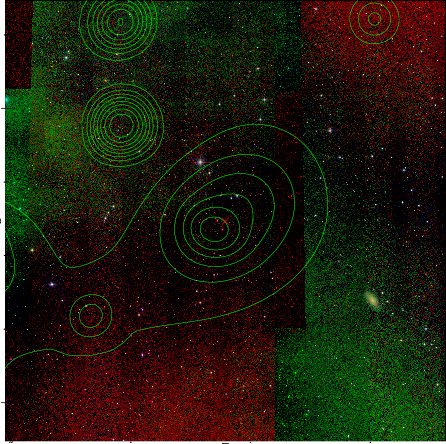

### 780

|Name|RAJ2000[deg]|DEJ2000[deg] |Ext[arcmin]| Ext,ml | z | z_src| C|GC(XSZ,Delta_z<0.01)| GC(OPT,Delta_z<0.01)|GC| R_sig[arcmin] | R500[arcmin] | R500[Mpc]| CRsig[c/s] | CR500[c/s] |L500[1E44 erg/s]|F500[1E-12 erg/s/cm^2]| M500[1E14 Msun]|Tx[keV]|Cnt_sig|Beta|Rc[arcmin]|Comment|Alias|
|---|---|---|---|---|---|------|---|--------|---------|----------|---|---|---|---|---|---|---|---|---|---|---|---|---|---|
|780| 276.203| 74.751| 6.15| 119.78| 0.1153(0.006)| z1,| G| -| -| A, W| 32.680| 7.568| 0.949| 0.215(0.043)| 0.191(0.038)| 1.188(0.269)| 3.453(0.783)| 2.72(0.30)| 4.11(0.29)| 659.3| 0.507(-0.005+0.011)| 4.631(-0.274+0.352)| An Abell cluster with $z$ = 0.1276 and offset = 0.32 Mpc| t312|

|[RASS image](../image/780/780_img.pdf)|[filtered image](../image/780/780_fil.pdf)|[Segment image](../image/780/780_seg.pdf)|
|-------------------|--------------------|-------------------|
|   |    |   |

|[Exposure image](../image/780/780_mex.pdf)| [nH image](../image/780/780_nh.pdf)| [Planck image](../image/780/780_p.pdf)|
|-------------------|--------------------|-------------------|
|   |     |  |

|[Redshift Histogram](../image/780/780_zg.pdf) | [DSS image(z1)](../image/780/780_dss_z1.pdf)      |  [DSS image(z2)](../image/780/780_dss_z2.pdf)    |
|-------------------|--------------------|-------------------|
| |  Blue circle for optical clusters;  Magenta circle for XSZ clusters;  all with r=1Mpc;  Only GC with Delta_z<0.01 are shown. |  Blue circle for optical clusters;  Magenta circle for XSZ clusters;  all with r=1Mpc;  Only GC with Delta_z<0.01 are shown.  |

|[known Abell/XSZ clusters](../image/780/780_gc.pdf) | [2MASS image](../image/780/780_2mass.pdf)      |
|-------------------|-------------------|
|  Magenta, blue and green circles  for optical, X-ray and SZ clusters  respectively, with redshift of clusters  labelled. The radius of circles  are 1Mpc.|  |

|[PS1 image](../image/780/780_ps1.pdf)            |
|-------------------|
|   |
