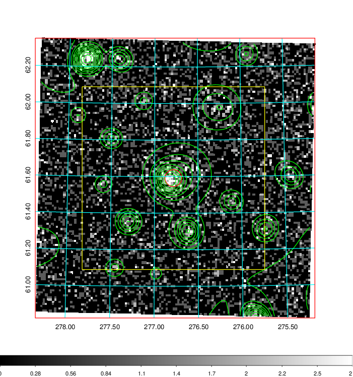
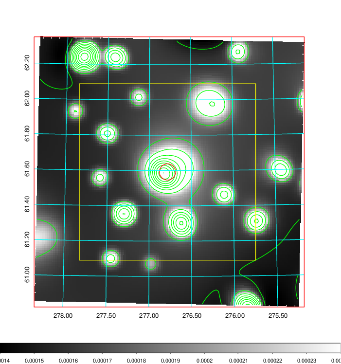
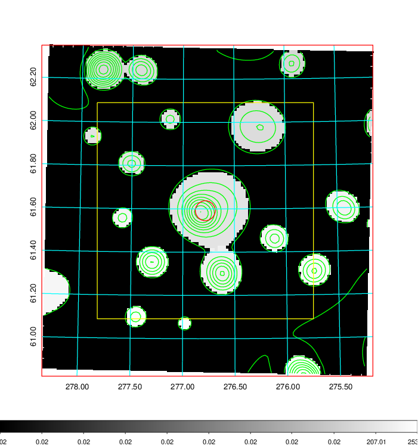
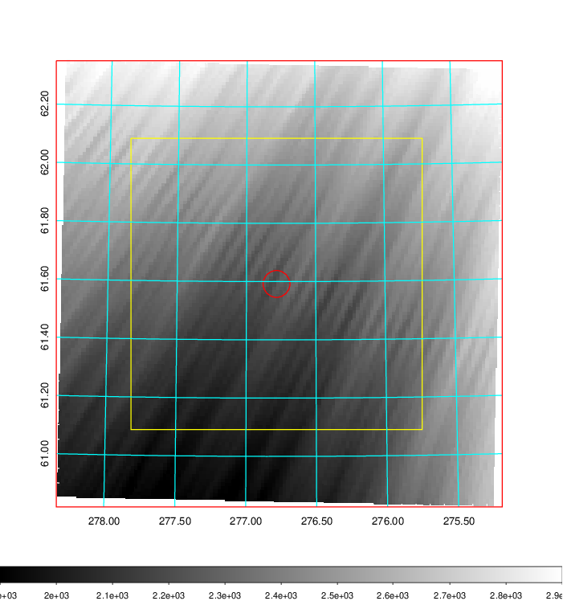
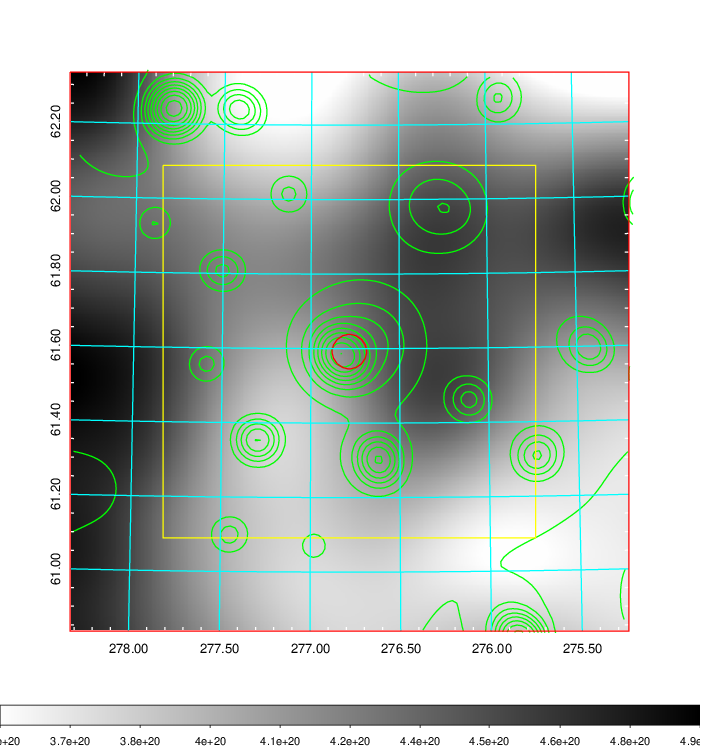
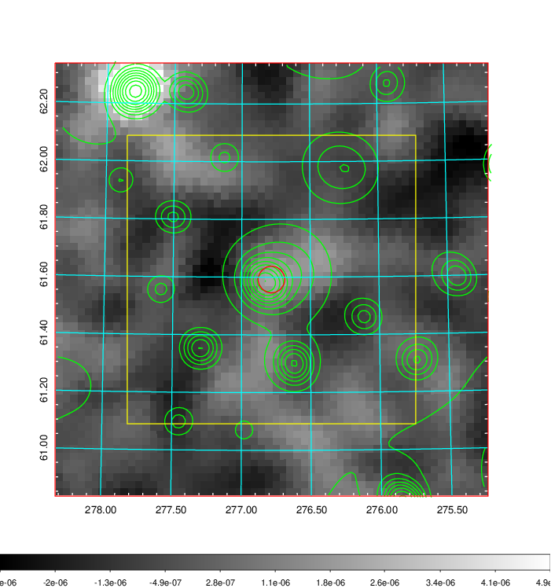
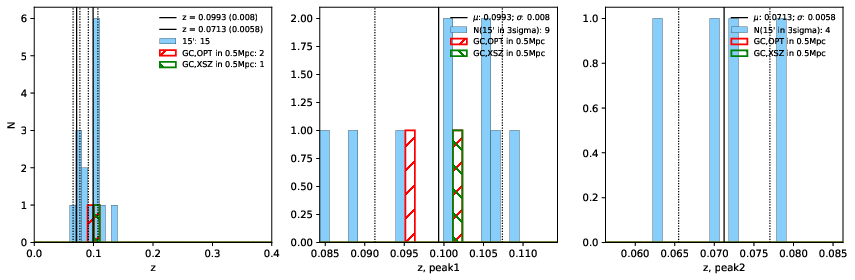
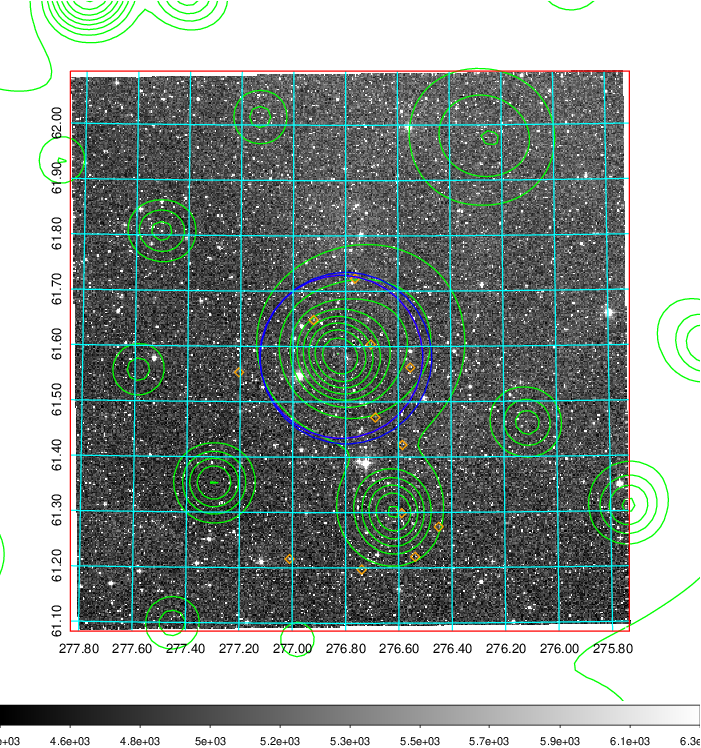
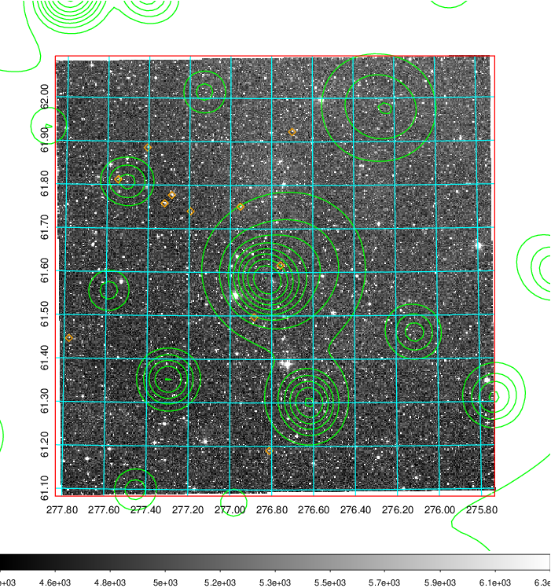
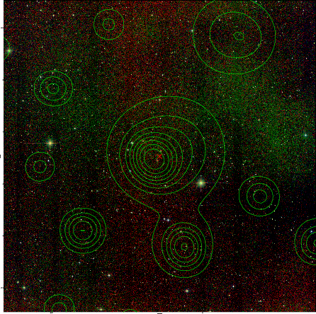

### 781

|Name|RAJ2000[deg]|DEJ2000[deg] |Ext[arcmin]| Ext,ml | z | z_src| C|GC(XSZ,Delta_z<0.01)| GC(OPT,Delta_z<0.01)|GC| R_sig[arcmin] | R500[arcmin] | R500[Mpc]| CRsig[c/s] | CR500[c/s] |L500[1E44 erg/s]|F500[1E-12 erg/s/cm^2]| M500[1E14 Msun]|Tx[keV]|Cnt_sig|Beta|Rc[arcmin]|Comment|Alias|
|---|---|---|---|---|---|------|---|--------|---------|----------|---|---|---|---|---|---|---|---|---|---|---|---|---|---|
|781| 276.783| 61.592| 2.77| 103.62| 0.0993(0.008)| z1, z_xsz| B| MCXC| N, W| MCXC, N, W| 11.238| 7.077| 0.778| 0.106(0.014)| 0.100(0.013)| 0.447(0.036)| 1.789(0.145)| 1.47(0.06)| 2.81(0.07)| 254.7| 0.893(-0.106+0.075)| 5.479(-0.778+0.542)| -| k347|

|[RASS image](../image/781/781_img.pdf)|[filtered image](../image/781/781_fil.pdf)|[Segment image](../image/781/781_seg.pdf)|
|-------------------|--------------------|-------------------|
|   |    |   |

|[Exposure image](../image/781/781_mex.pdf)| [nH image](../image/781/781_nh.pdf)| [Planck image](../image/781/781_p.pdf)|
|-------------------|--------------------|-------------------|
|   |     |  |

|[Redshift Histogram](../image/781/781_zg.pdf) | [DSS image(z1)](../image/781/781_dss_z1.pdf)      |  [DSS image(z2)](../image/781/781_dss_z2.pdf)    |
|-------------------|--------------------|-------------------|
| |  Blue circle for optical clusters;  Magenta circle for XSZ clusters;  all with r=1Mpc;  Only GC with Delta_z<0.01 are shown. |  Blue circle for optical clusters;  Magenta circle for XSZ clusters;  all with r=1Mpc;  Only GC with Delta_z<0.01 are shown.  |

|[known Abell/XSZ clusters](../image/781/781_gc.pdf) | [2MASS image](../image/781/781_2mass.pdf)      |
|-------------------|-------------------|
|  Magenta, blue and green circles  for optical, X-ray and SZ clusters  respectively, with redshift of clusters  labelled. The radius of circles  are 1Mpc.|  |

|[PS1 image](../image/781/781_ps1.pdf)            |
|-------------------|
|   |
