

### 782

|Name|RAJ2000[deg]|DEJ2000[deg] |Ext[arcmin]| Ext,ml | z | z_src| C|GC(XSZ,Delta_z<0.01)| GC(OPT,Delta_z<0.01)|GC| R_sig[arcmin] | R500[arcmin] | R500[Mpc]| CRsig[c/s] | CR500[c/s] |L500[1E44 erg/s]|F500[1E-12 erg/s/cm^2]| M500[1E14 Msun]|Tx[keV]|Cnt_sig|Beta|Rc[arcmin]|Comment|Alias|
|---|---|---|---|---|---|------|---|--------|---------|----------|---|---|---|---|---|---|---|---|---|---|---|---|---|---|
|782| 277.106| 48.089| 1.80| 28.58| 0.1680(0.000)| z_xsz| B| PSZ2, Tar| N, W| N, PSZ2, Tar, W| 8.312| 4.945| 0.852| 0.061(0.017)| 0.057(0.016)| 0.793(0.112)| 1.015(0.143)| 2.07(0.14)| 3.54(0.16)| 86.1| 0.866(-0.137+0.094)| 3.360(-0.779+0.577)| -| k172|

|[RASS image](../image/782/782_img.pdf)|[filtered image](../image/782/782_fil.pdf)|[Segment image](../image/782/782_seg.pdf)|
|-------------------|--------------------|-------------------|
| 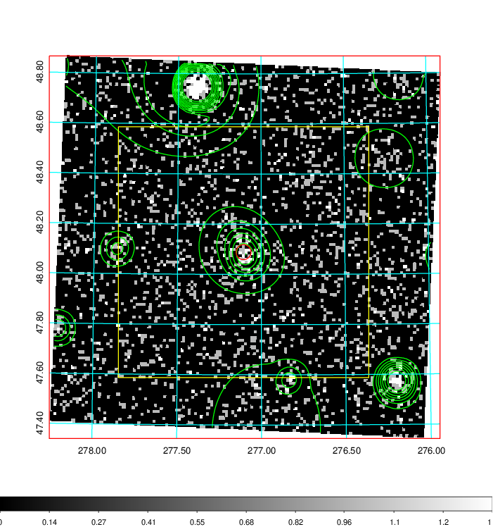  | 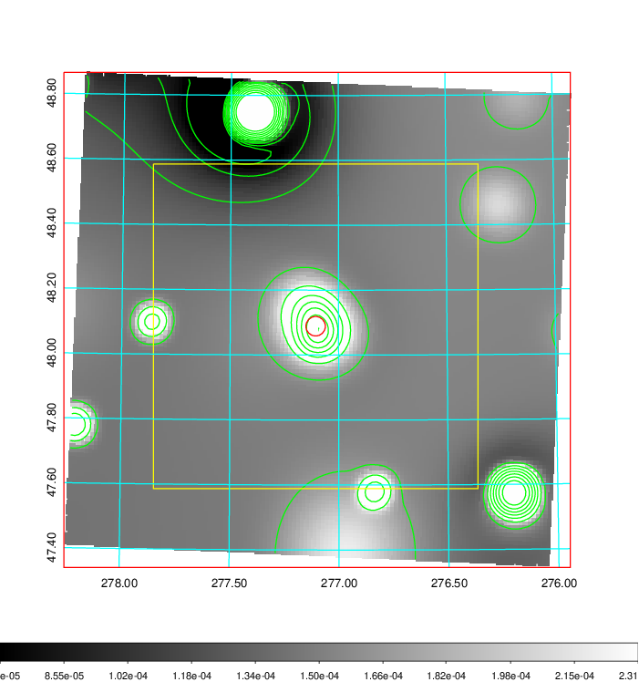   | 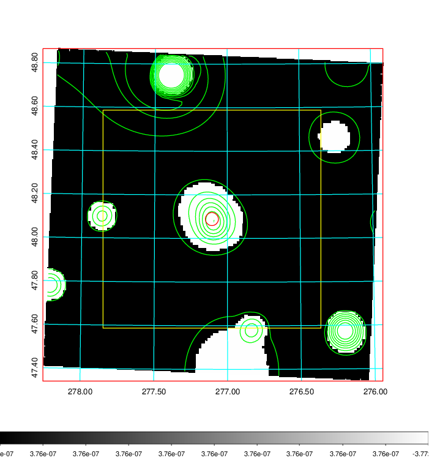  |

|[Exposure image](../image/782/782_mex.pdf)| [nH image](../image/782/782_nh.pdf)| [Planck image](../image/782/782_p.pdf)|
|-------------------|--------------------|-------------------|
|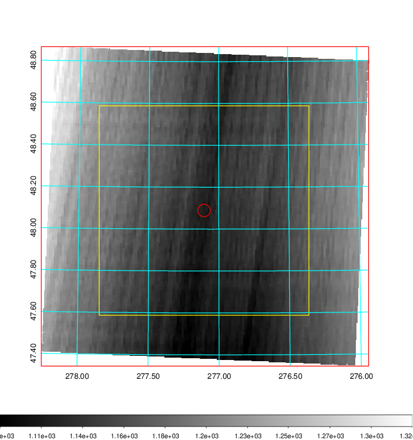   | 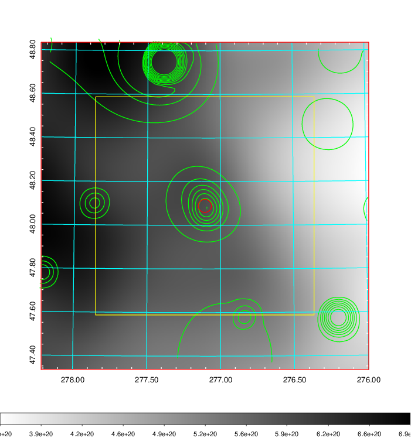    | 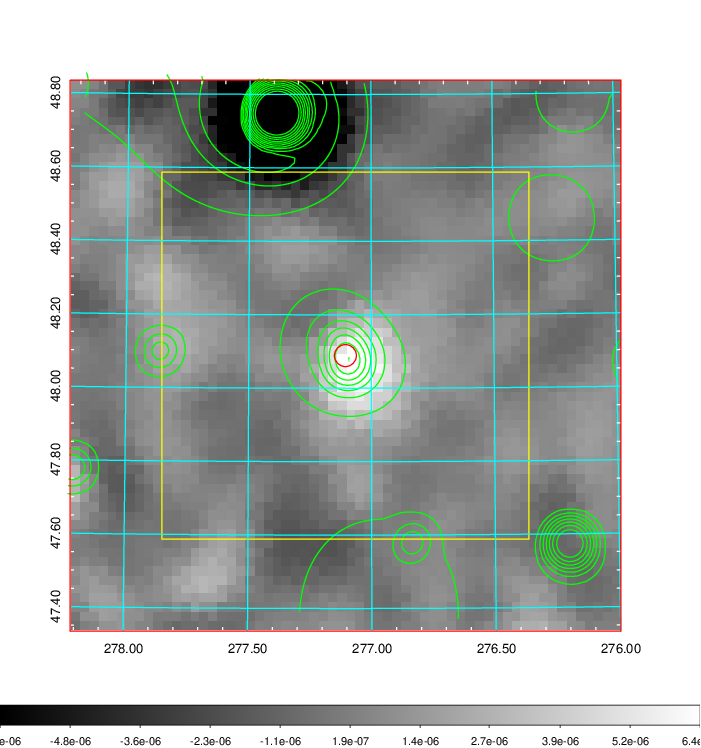 |

|[Redshift Histogram](../image/782/782_zg.pdf) | [DSS image(z1)](../image/782/782_dss_z1.pdf)      |  [DSS image(z2)](../image/782/782_dss_z2.pdf)    |
|-------------------|--------------------|-------------------|
|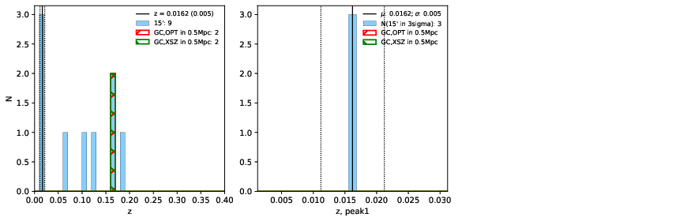 |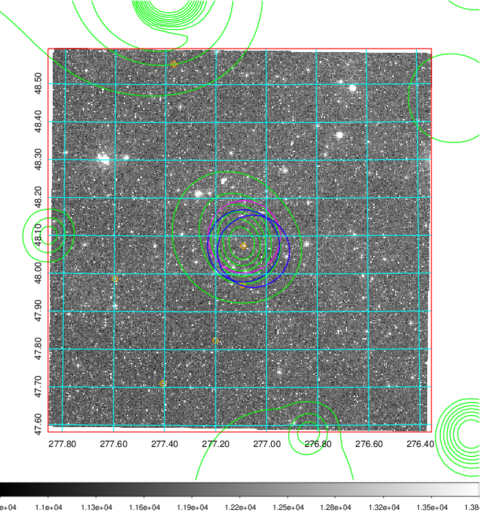  Blue circle for optical clusters;  Magenta circle for XSZ clusters;  all with r=1Mpc;  Only GC with Delta_z<0.01 are shown. | 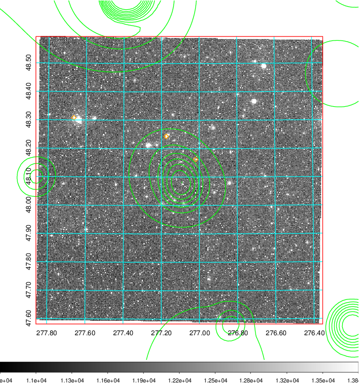 Blue circle for optical clusters;  Magenta circle for XSZ clusters;  all with r=1Mpc;  Only GC with Delta_z<0.01 are shown.  |

|[Previous-identified clusters](../image/782/782_gc.pdf) | [2MASS image](../image/782/782_2mass.pdf)      |
|-------------------|-------------------|
|  Green, magenta, and blue circles  for optical, X-ray and SZ clusters  respectively, with redshift of clusters  labelled. The radius of circles  are 1Mpc.|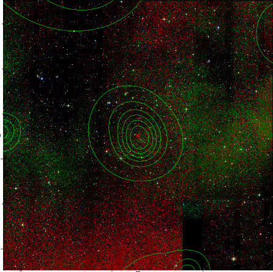  |

|[PS1 image](../image/782/782_ps1.pdf)            |
|-------------------|
| 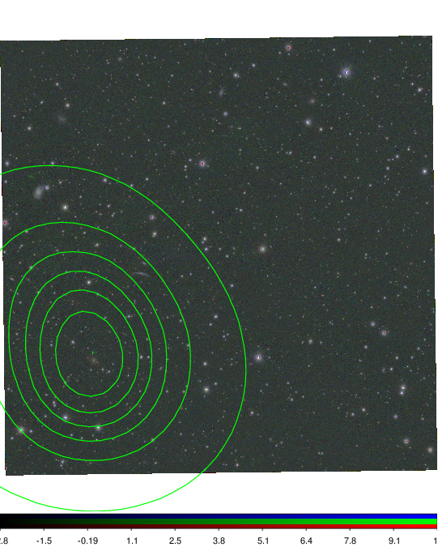  |
