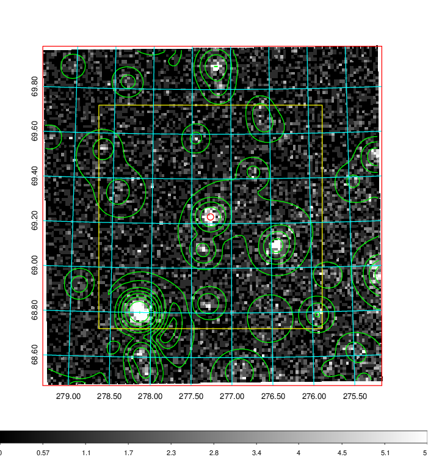
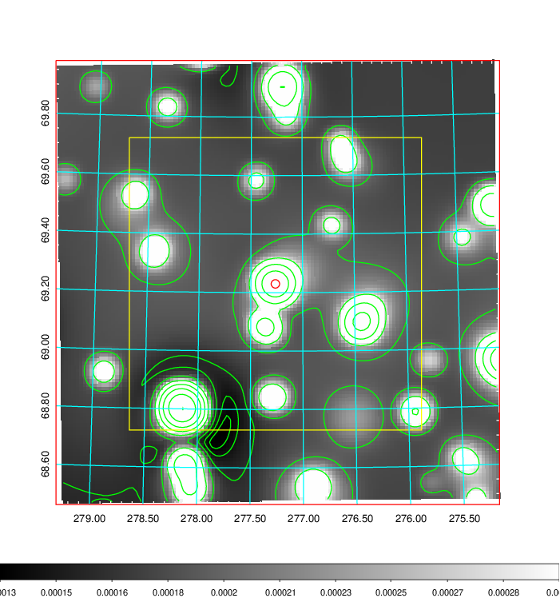
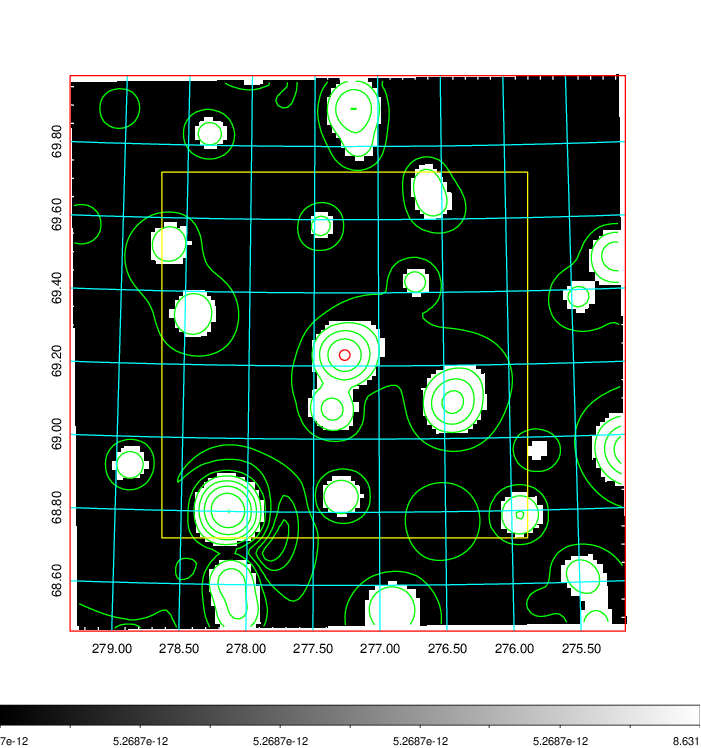
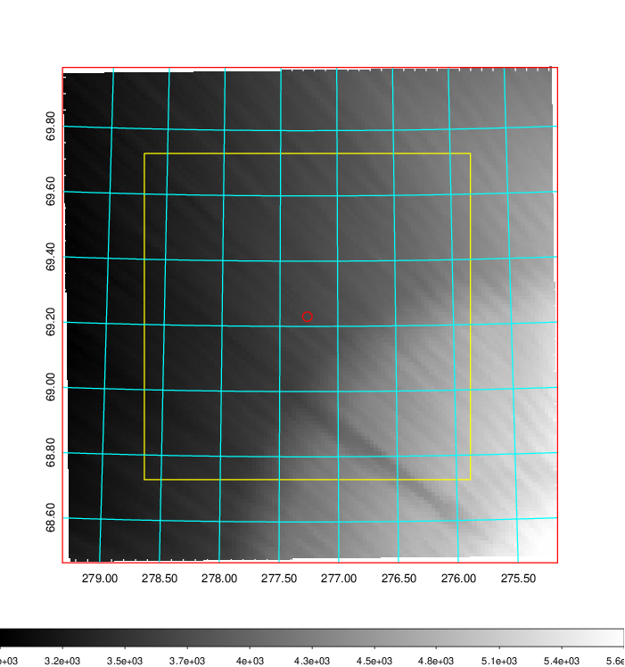
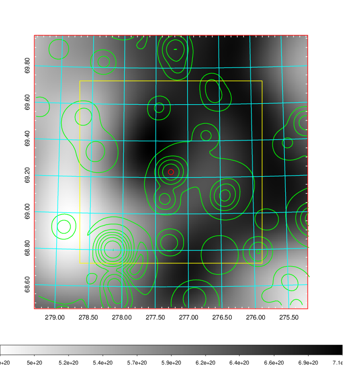
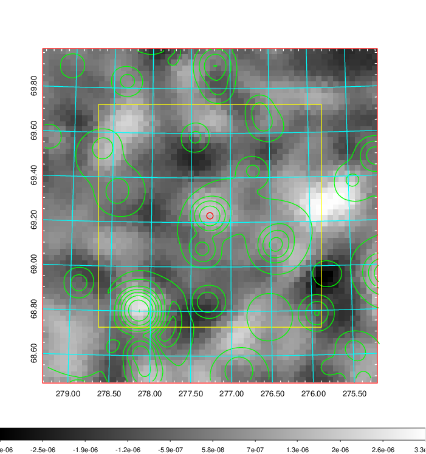
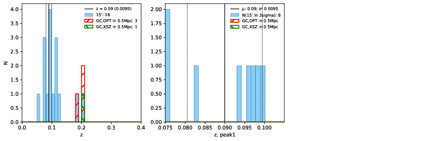
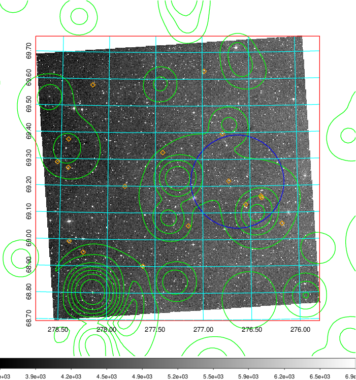
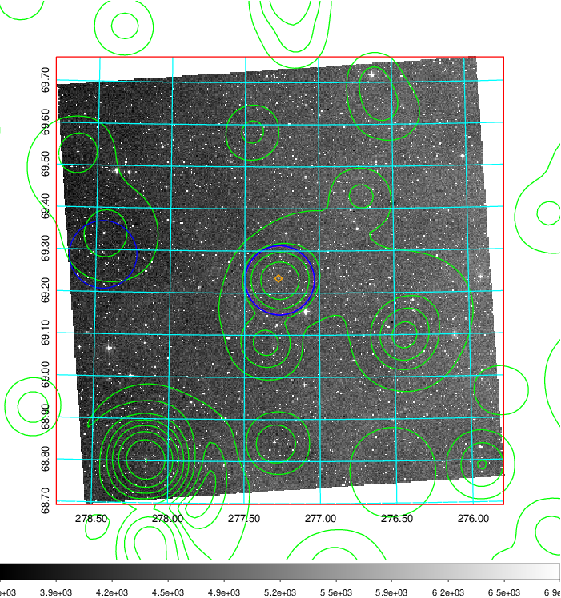
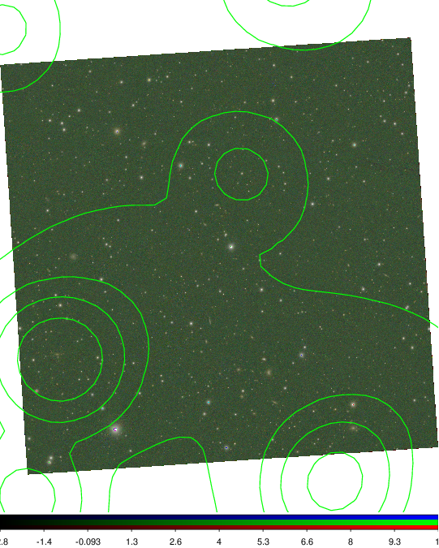

### 783

|Name|RAJ2000[deg]|DEJ2000[deg] |Ext[arcmin]| Ext,ml | z | z_src| C|GC(XSZ,Delta_z<0.01)| GC(OPT,Delta_z<0.01)|GC| R_sig[arcmin] | R500[arcmin] | R500[Mpc]| CRsig[c/s] | CR500[c/s] |L500[1E44 erg/s]|F500[1E-12 erg/s/cm^2]| M500[1E14 Msun]|Tx[keV]|Cnt_sig|Beta|Rc[arcmin]|Comment|Alias|
|---|---|---|---|---|---|------|---|--------|---------|----------|---|---|---|---|---|---|---|---|---|---|---|---|---|---|
|783| 277.263| 69.230| 0.87| 38.44| 0.2057(0.000)| z_xsz| B| MCXC| N, Zw| MCXC, N, W| 13.188| 4.731| 0.957| 0.077(0.011)| 0.070(0.010)| 1.534(0.115)| 1.254(0.094)| 3.06(0.11)| 4.57(0.11)| 400.5| 0.594(-0.062+0.103)| 1.000(-0.615+0.655)| -| k021|

|[RASS image](../image/783/783_img.pdf)|[filtered image](../image/783/783_fil.pdf)|[Segment image](../image/783/783_seg.pdf)|
|-------------------|--------------------|-------------------|
|   |    |   |

|[Exposure image](../image/783/783_mex.pdf)| [nH image](../image/783/783_nh.pdf)| [Planck image](../image/783/783_p.pdf)|
|-------------------|--------------------|-------------------|
|   |     |  |

|[Redshift Histogram](../image/783/783_zg.pdf) | [DSS image(z1)](../image/783/783_dss_z1.pdf)      |  [DSS image(z2)](../image/783/783_dss_z2.pdf)    |
|-------------------|--------------------|-------------------|
| |  Blue circle for optical clusters;  Magenta circle for XSZ clusters;  all with r=1Mpc;  Only GC with Delta_z<0.01 are shown. |  Blue circle for optical clusters;  Magenta circle for XSZ clusters;  all with r=1Mpc;  Only GC with Delta_z<0.01 are shown.  |

|[Previous-identified clusters](../image/783/783_gc.pdf) | [2MASS image](../image/783/783_2mass.pdf)      |
|-------------------|-------------------|
|  Green, magenta, and blue circles  for optical, X-ray and SZ clusters  respectively, with redshift of clusters  labelled. The radius of circles  are 1Mpc.|  |

|[PS1 image](../image/783/783_ps1.pdf)            |
|-------------------|
|   |
