

### 784

|Name|RAJ2000[deg]|DEJ2000[deg] |Ext[arcmin]| Ext,ml | z | z_src| C|GC(XSZ,Delta_z<0.01)| GC(OPT,Delta_z<0.01)|GC| R_sig[arcmin] | R500[arcmin] | R500[Mpc]| CRsig[c/s] | CR500[c/s] |L500[1E44 erg/s]|F500[1E-12 erg/s/cm^2]| M500[1E14 Msun]|Tx[keV]|Cnt_sig|Beta|Rc[arcmin]|Comment|Alias|
|---|---|---|---|---|---|------|---|--------|---------|----------|---|---|---|---|---|---|---|---|---|---|---|---|---|---|
|784| 278.135| 64.833| 1.92| 196.40| 0.1623(0.000)| z_xsz| B| MCXC, PSZ2, Tar| N, W| MCXC, N, PSZ2, Tar, W| 14.162| 6.025| 1.009| 0.155(0.010)| 0.142(0.009)| 1.950(0.087)| 2.695(0.120)| 3.42(0.07)| 4.82(0.07)| 930.5| 0.510(-0.007+0.014)| 2.284(-0.137+0.193)| -| k203|

|[RASS image](../image/784/784_img.pdf)|[filtered image](../image/784/784_fil.pdf)|[Segment image](../image/784/784_seg.pdf)|
|-------------------|--------------------|-------------------|
| 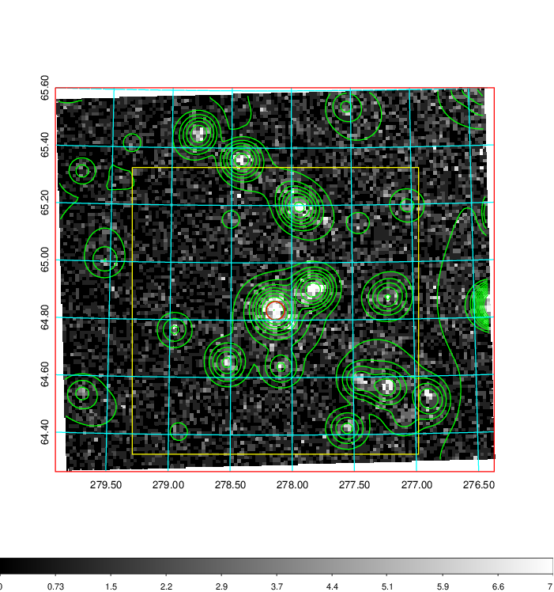  | 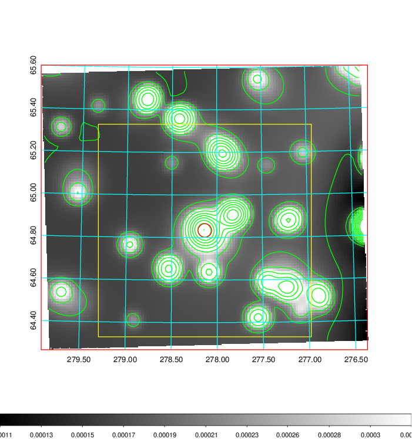   | 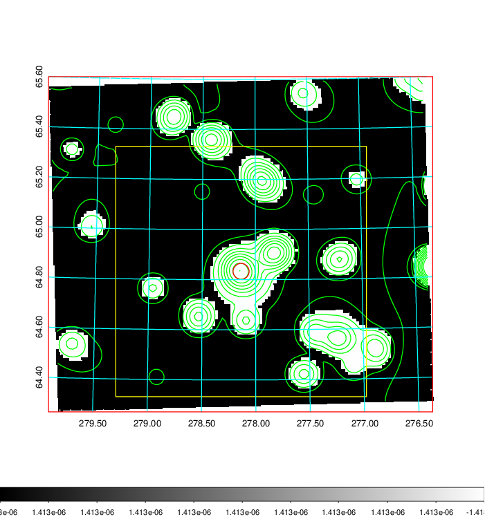  |

|[Exposure image](../image/784/784_mex.pdf)| [nH image](../image/784/784_nh.pdf)| [Planck image](../image/784/784_p.pdf)|
|-------------------|--------------------|-------------------|
|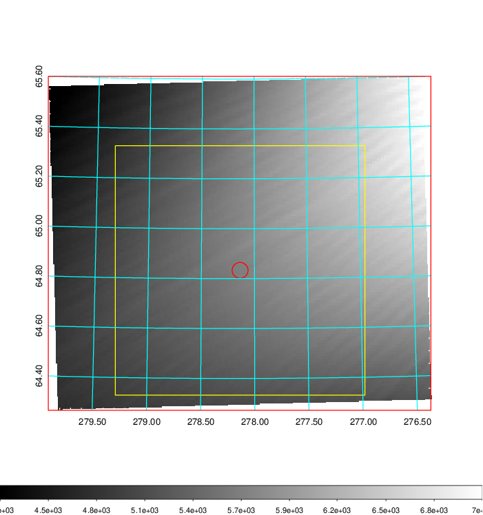   | 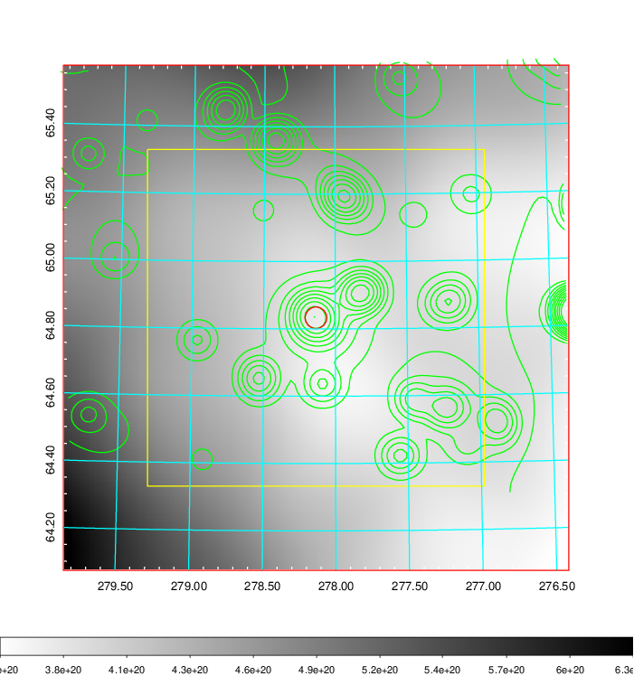    | 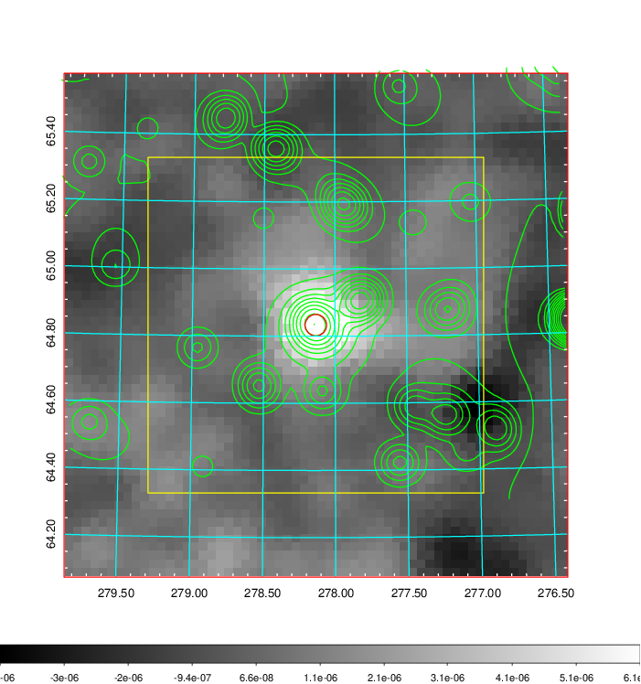 |

|[Redshift Histogram](../image/784/784_zg.pdf) | [DSS image(z1)](../image/784/784_dss_z1.pdf)      |  [DSS image(z2)](../image/784/784_dss_z2.pdf)    |
|-------------------|--------------------|-------------------|
|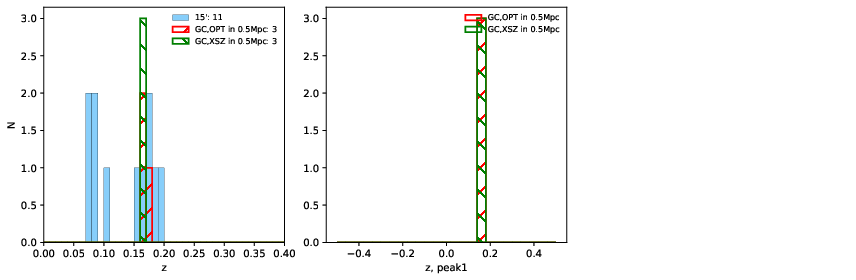 |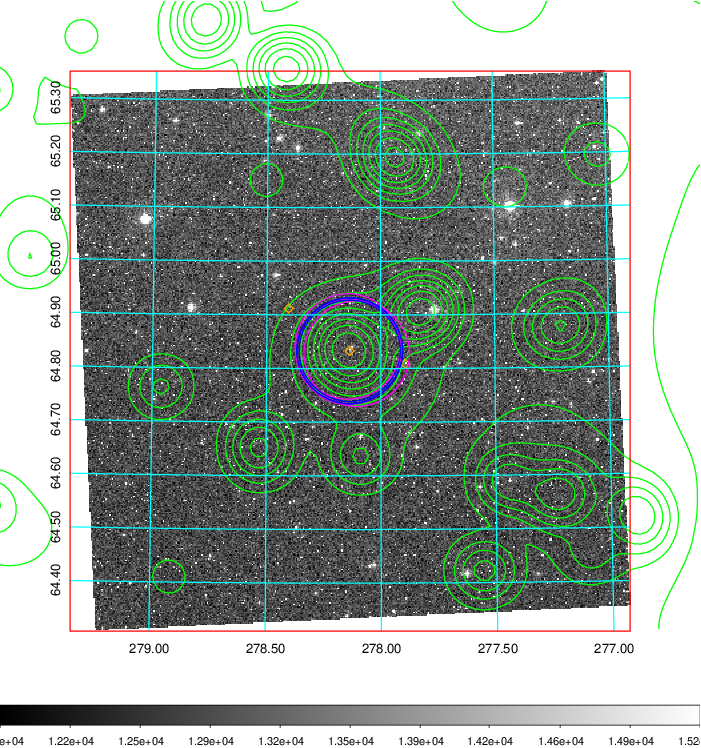  Blue circle for optical clusters;  Magenta circle for XSZ clusters;  all with r=1Mpc;  Only GC with Delta_z<0.01 are shown. | 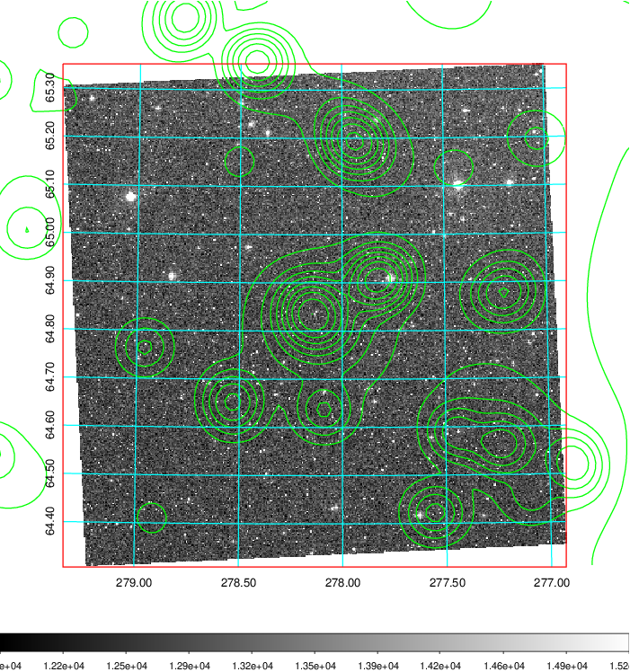 Blue circle for optical clusters;  Magenta circle for XSZ clusters;  all with r=1Mpc;  Only GC with Delta_z<0.01 are shown.  |

|[Previous-identified clusters](../image/784/784_gc.pdf) | [2MASS image](../image/784/784_2mass.pdf)      |[SDSS image](../image/784/784_sdss.pdf)   |
|-------------------|-------------------|-------------------|
|  Green, magenta, and blue circles  for optical, X-ray and SZ clusters  respectively, with redshift of clusters  labelled. The radius of circles  are 1Mpc.|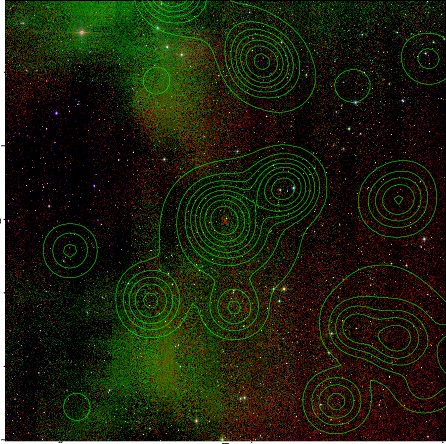  | 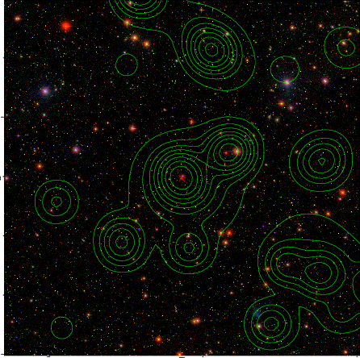  |

