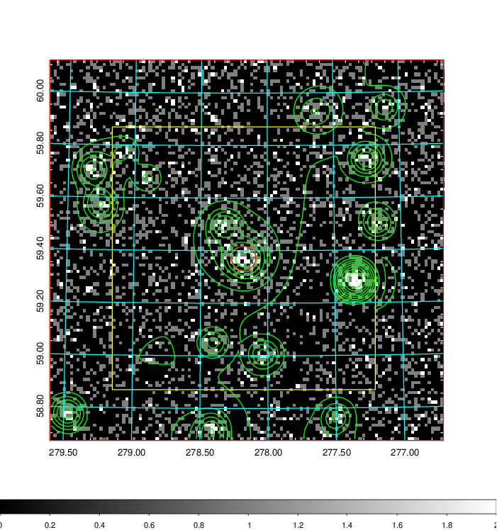
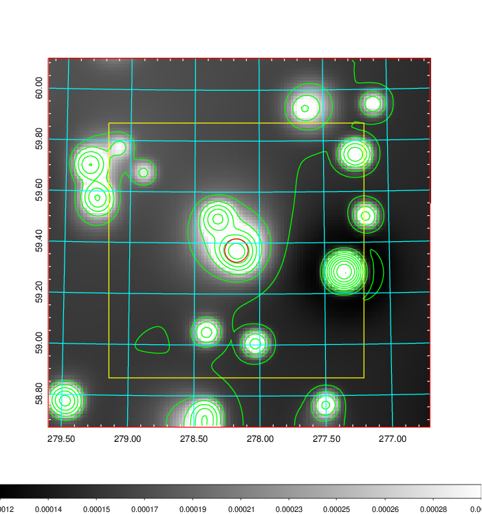
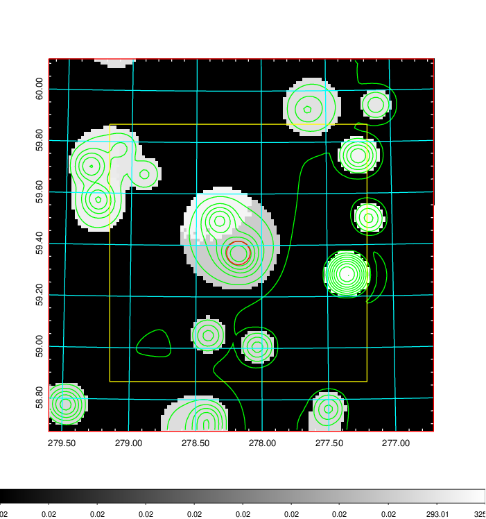
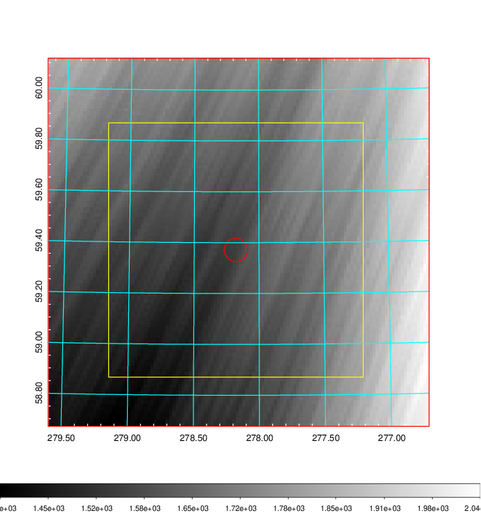
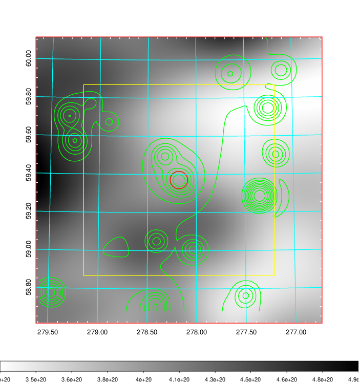
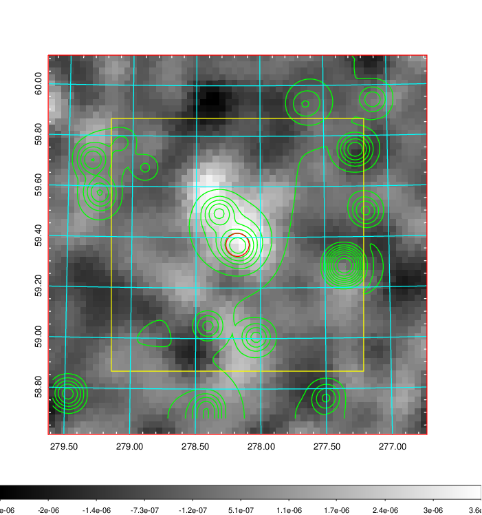
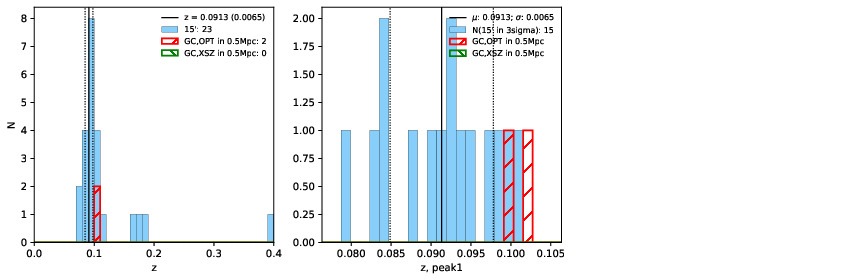
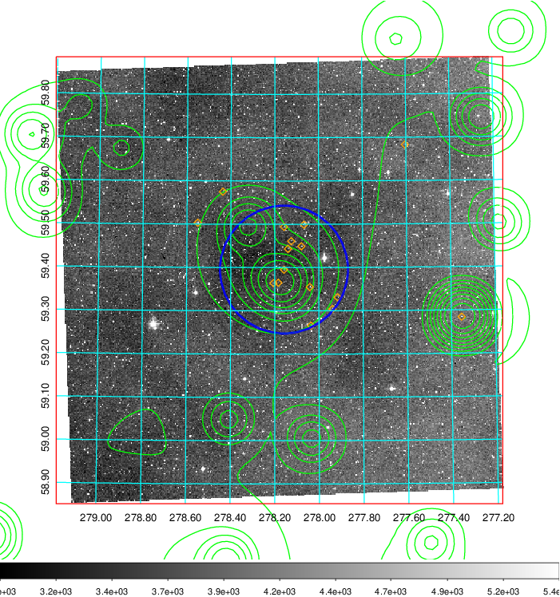
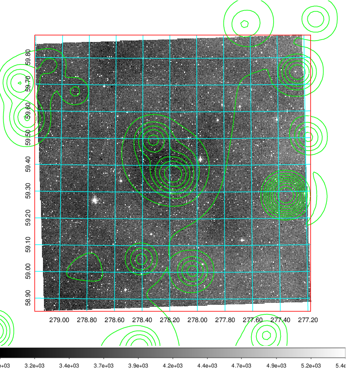
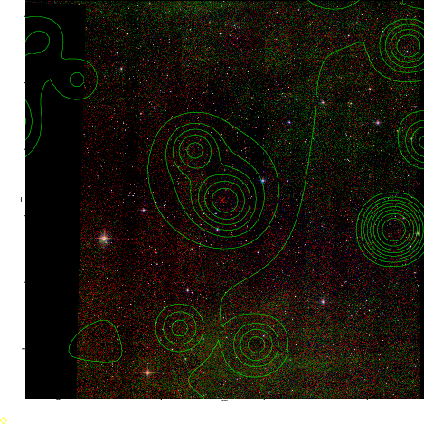

### 785

|Name|RAJ2000[deg]|DEJ2000[deg] |Ext[arcmin]| Ext,ml | z | z_src| C|GC(XSZ,Delta_z<0.01)| GC(OPT,Delta_z<0.01)|GC| R_sig[arcmin] | R500[arcmin] | R500[Mpc]| CRsig[c/s] | CR500[c/s] |L500[1E44 erg/s]|F500[1E-12 erg/s/cm^2]| M500[1E14 Msun]|Tx[keV]|Cnt_sig|Beta|Rc[arcmin]|Comment|Alias|
|---|---|---|---|---|---|------|---|--------|---------|----------|---|---|---|---|---|---|---|---|---|---|---|---|---|---|
|785| 278.178| 59.371| 2.75| 48.94| 0.0913(0.006)| z1, z_opt| S| -| W| N, Tar, W| 10.750| 7.078| 0.722| 0.086(0.016)| 0.081(0.015)| 0.302(0.036)| 1.447(0.171)| 1.17(0.07)| 2.43(0.09)| 163.3| 0.752(-0.130+0.150)| 4.322(-1.191+1.169)| An SZ cluster with no $z$ and offset = 0.06 Mpc| t117|

|[RASS image](../image/785/785_img.pdf)|[filtered image](../image/785/785_fil.pdf)|[Segment image](../image/785/785_seg.pdf)|
|-------------------|--------------------|-------------------|
|   |    |   |

|[Exposure image](../image/785/785_mex.pdf)| [nH image](../image/785/785_nh.pdf)| [Planck image](../image/785/785_p.pdf)|
|-------------------|--------------------|-------------------|
|   |     |  |

|[Redshift Histogram](../image/785/785_zg.pdf) | [DSS image(z1)](../image/785/785_dss_z1.pdf)      |  [DSS image(z2)](../image/785/785_dss_z2.pdf)    |
|-------------------|--------------------|-------------------|
| |  Blue circle for optical clusters;  Magenta circle for XSZ clusters;  all with r=1Mpc;  Only GC with Delta_z<0.01 are shown. |  Blue circle for optical clusters;  Magenta circle for XSZ clusters;  all with r=1Mpc;  Only GC with Delta_z<0.01 are shown.  |

|[known Abell/XSZ clusters](../image/785/785_gc.pdf) | [2MASS image](../image/785/785_2mass.pdf)      |
|-------------------|-------------------|
|  Magenta, blue and green circles  for optical, X-ray and SZ clusters  respectively, with redshift of clusters  labelled. The radius of circles  are 1Mpc.|  |

|[PS1 image](../image/785/785_ps1.pdf)            |
|-------------------|
|   |
