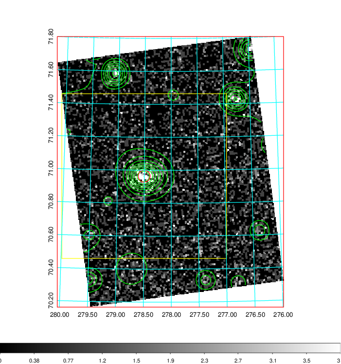
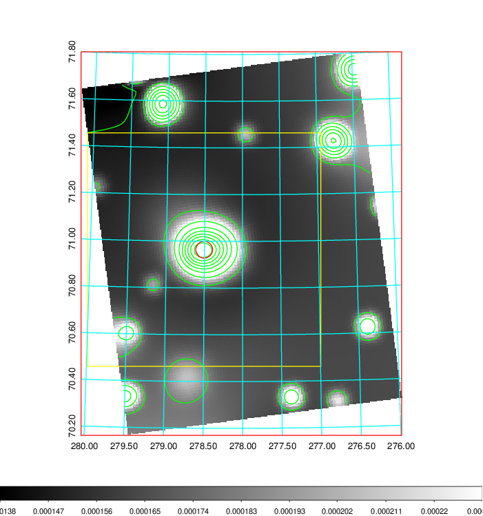
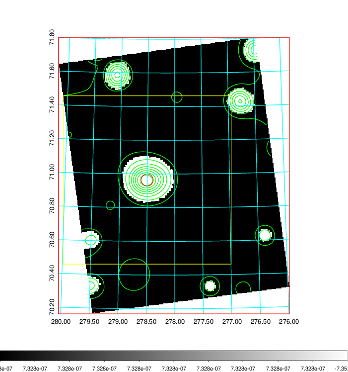
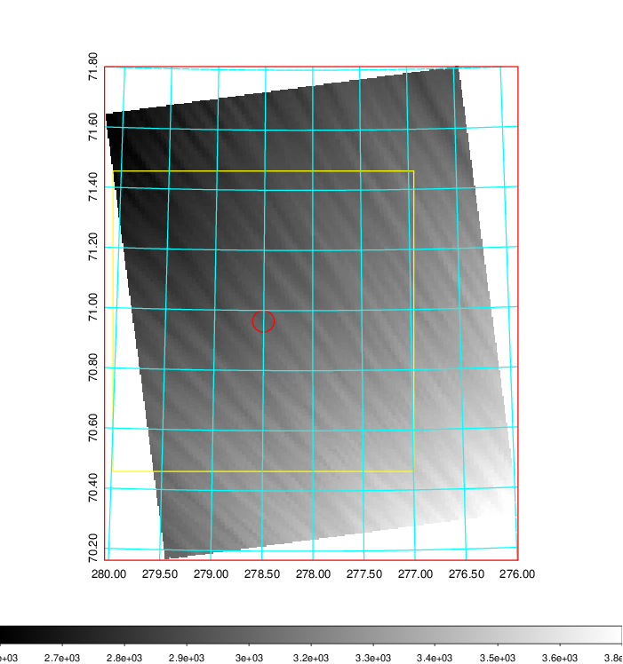
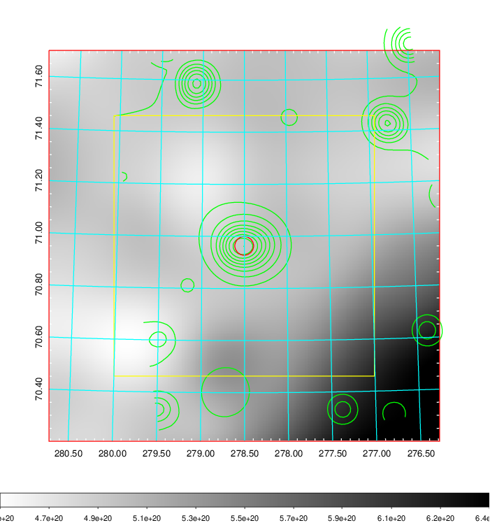
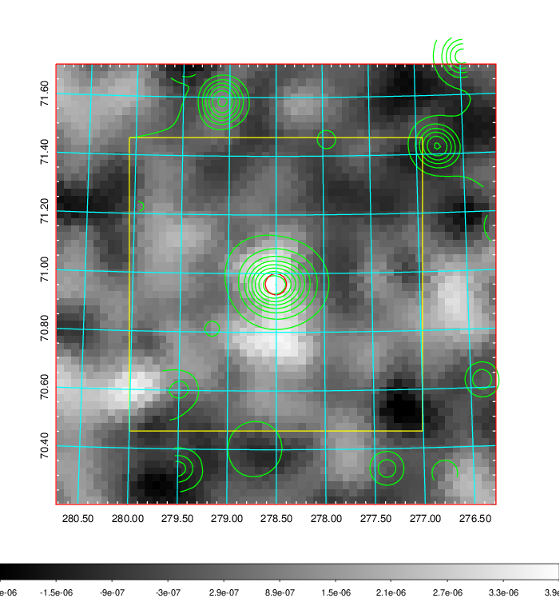
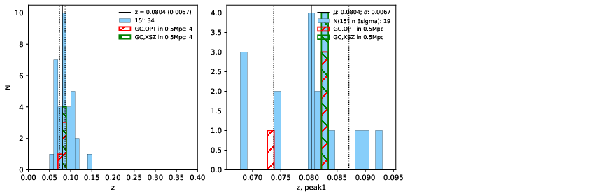
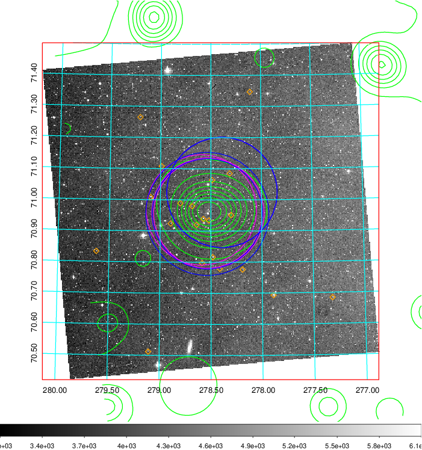
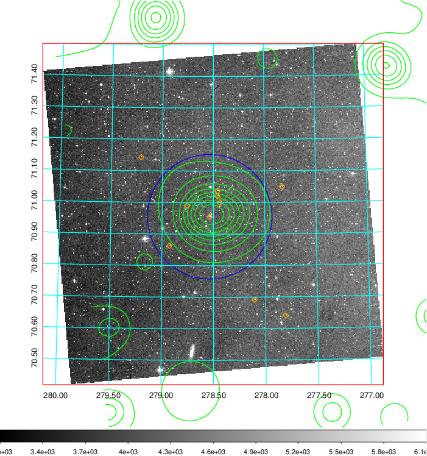
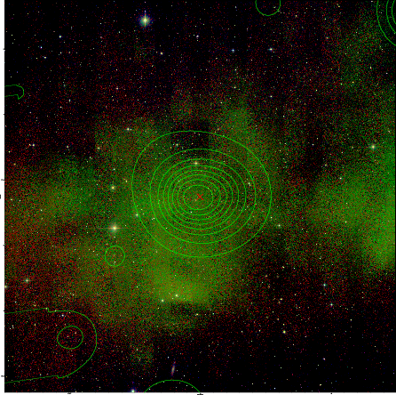

### 786

|Name|RAJ2000[deg]|DEJ2000[deg] |Ext[arcmin]| Ext,ml | z | z_src| C|GC(XSZ,Delta_z<0.01)| GC(OPT,Delta_z<0.01)|GC| R_sig[arcmin] | R500[arcmin] | R500[Mpc]| CRsig[c/s] | CR500[c/s] |L500[1E44 erg/s]|F500[1E-12 erg/s/cm^2]| M500[1E14 Msun]|Tx[keV]|Cnt_sig|Beta|Rc[arcmin]|Comment|Alias|
|---|---|---|---|---|---|------|---|--------|---------|----------|---|---|---|---|---|---|---|---|---|---|---|---|---|---|
|786| 278.503| 70.964| 2.17| 145.56| 0.0804(0.007)| z1, z_xsz| B| L03, MCXC, Tar| A, N, W| A, L03, MCXC, N, Tar, W| 8.800| 8.107| 0.738| 0.115(0.011)| 0.113(0.011)| 0.313(0.016)| 1.964(0.101)| 1.23(0.03)| 2.50(0.04)| 335.5| 0.944(-0.073+0.041)| 4.803(-0.430+0.292)| -| k252|

|[RASS image](../image/786/786_img.pdf)|[filtered image](../image/786/786_fil.pdf)|[Segment image](../image/786/786_seg.pdf)|
|-------------------|--------------------|-------------------|
|   |    |   |

|[Exposure image](../image/786/786_mex.pdf)| [nH image](../image/786/786_nh.pdf)| [Planck image](../image/786/786_p.pdf)|
|-------------------|--------------------|-------------------|
|   |     |  |

|[Redshift Histogram](../image/786/786_zg.pdf) | [DSS image(z1)](../image/786/786_dss_z1.pdf)      |  [DSS image(z2)](../image/786/786_dss_z2.pdf)    |
|-------------------|--------------------|-------------------|
| |  Blue circle for optical clusters;  Magenta circle for XSZ clusters;  all with r=1Mpc;  Only GC with Delta_z<0.01 are shown. |  Blue circle for optical clusters;  Magenta circle for XSZ clusters;  all with r=1Mpc;  Only GC with Delta_z<0.01 are shown.  |

|[known Abell/XSZ clusters](../image/786/786_gc.pdf) | [2MASS image](../image/786/786_2mass.pdf)      |
|-------------------|-------------------|
|  Magenta, blue and green circles  for optical, X-ray and SZ clusters  respectively, with redshift of clusters  labelled. The radius of circles  are 1Mpc.|  |

|[PS1 image](../image/786/786_ps1.pdf)            |
|-------------------|
|   |
