

### 789

|Name|RAJ2000[deg]|DEJ2000[deg] |Ext[arcmin]| Ext,ml | z | z_src| C|GC(XSZ,Delta_z<0.01)| GC(OPT,Delta_z<0.01)|GC| R_sig[arcmin] | R500[arcmin] | R500[Mpc]| CRsig[c/s] | CR500[c/s] |L500[1E44 erg/s]|F500[1E-12 erg/s/cm^2]| M500[1E14 Msun]|Tx[keV]|Cnt_sig|Beta|Rc[arcmin]|Comment|Alias|
|---|---|---|---|---|---|------|---|--------|---------|----------|---|---|---|---|---|---|---|---|---|---|---|---|---|---|
|789| 279.730| 60.424| 5.05| 30.23| 0.0693(0.007)| z1,| G| -| -| N, W| 32.185| 7.690| 0.611| 0.072(0.038)| 0.064(0.034)| 0.121(0.090)| 1.039(0.771)| 0.69(0.26)| 1.74(0.42)| 291.7| 0.541(-0.027+0.040)| 2.987(-0.353+0.441)| -| t262|

|[RASS image](../image/789/789_img.pdf)|[filtered image](../image/789/789_fil.pdf)|[Segment image](../image/789/789_seg.pdf)|
|-------------------|--------------------|-------------------|
| 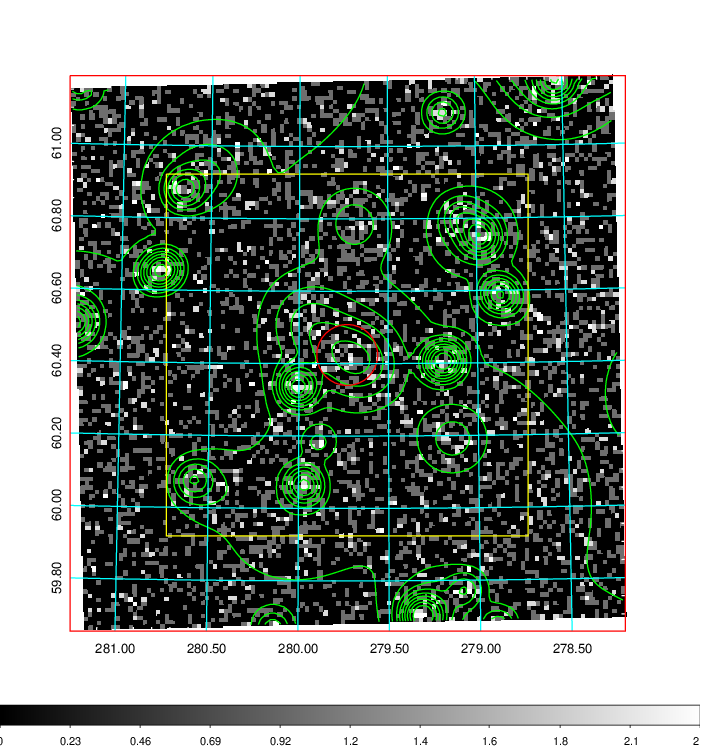  | 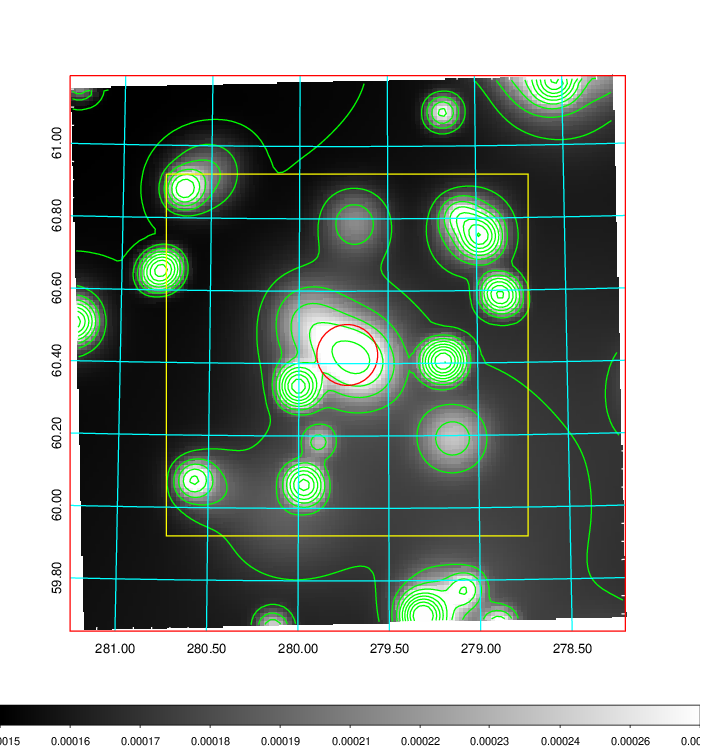   | 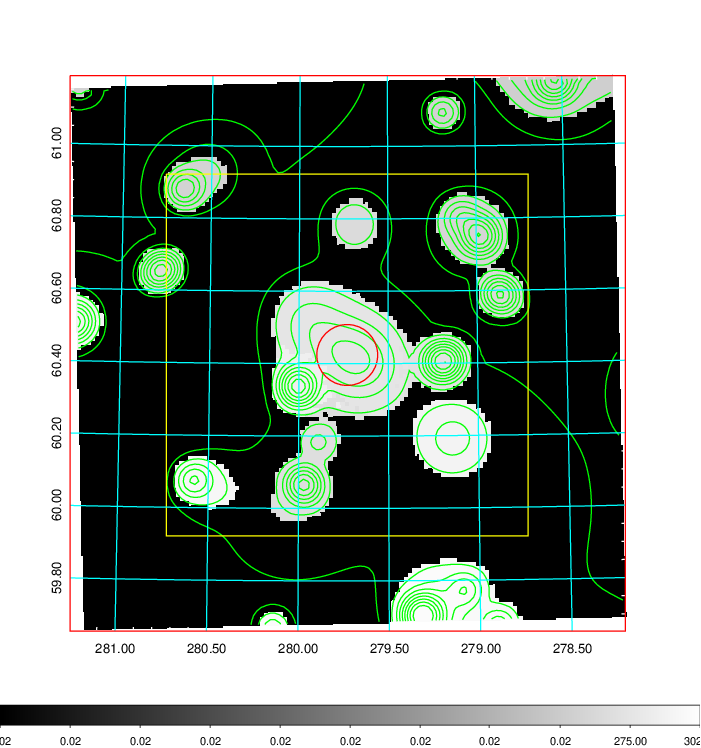  |

|[Exposure image](../image/789/789_mex.pdf)| [nH image](../image/789/789_nh.pdf)| [Planck image](../image/789/789_p.pdf)|
|-------------------|--------------------|-------------------|
|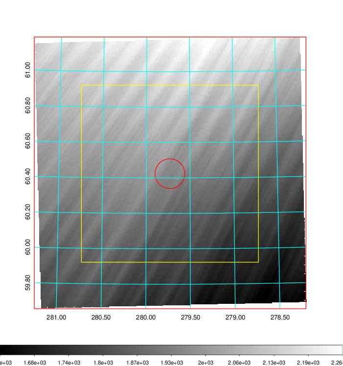   | 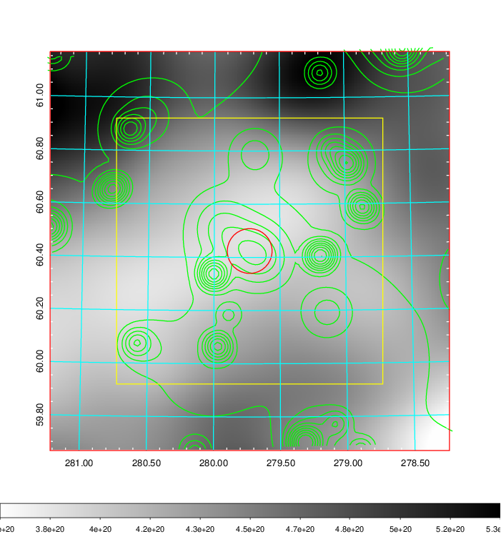    | 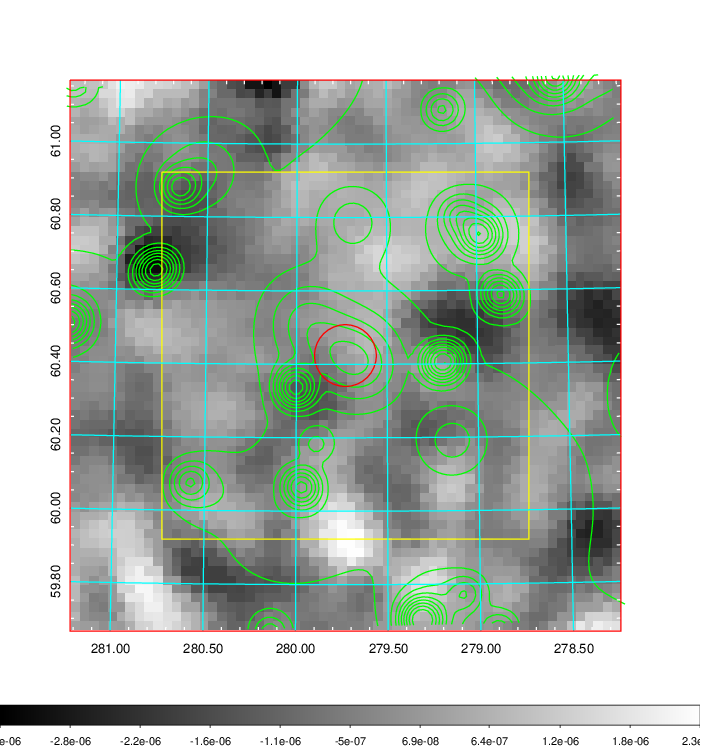 |

|[Redshift Histogram](../image/789/789_zg.pdf) | [DSS image(z1)](../image/789/789_dss_z1.pdf)      |  [DSS image(z2)](../image/789/789_dss_z2.pdf)    |
|-------------------|--------------------|-------------------|
|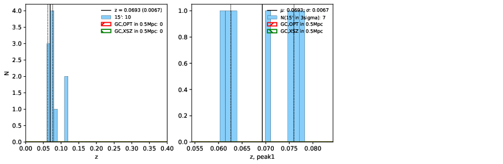 |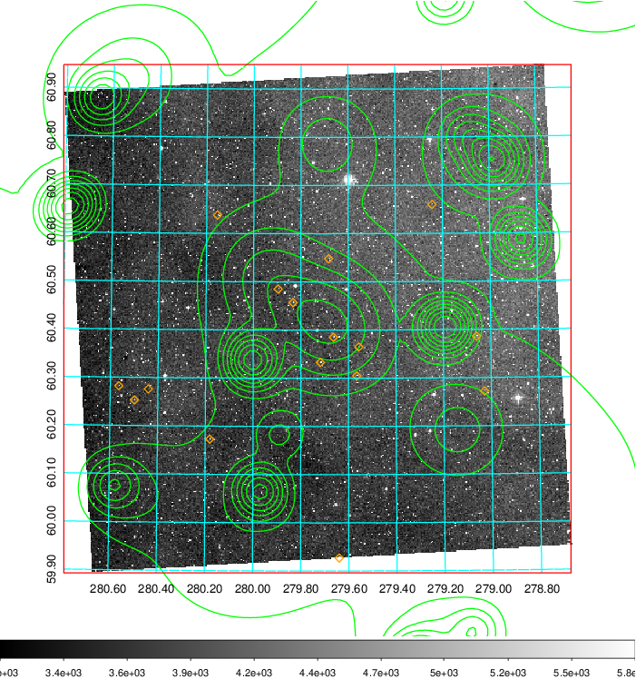  Blue circle for optical clusters;  Magenta circle for XSZ clusters;  all with r=1Mpc;  Only GC with Delta_z<0.01 are shown. | 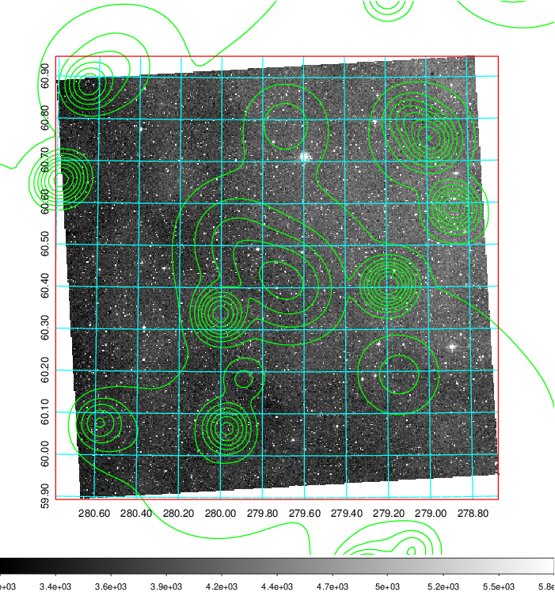 Blue circle for optical clusters;  Magenta circle for XSZ clusters;  all with r=1Mpc;  Only GC with Delta_z<0.01 are shown.  |

|[Previous-identified clusters](../image/789/789_gc.pdf) | [2MASS image](../image/789/789_2mass.pdf)      |
|-------------------|-------------------|
|  Green, magenta, and blue circles  for optical, X-ray and SZ clusters  respectively, with redshift of clusters  labelled. The radius of circles  are 1Mpc.|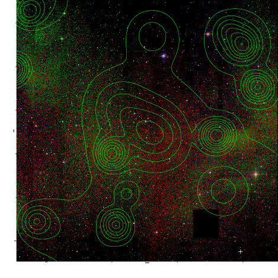  |

|[PS1 image](../image/789/789_ps1.pdf)            |
|-------------------|
| 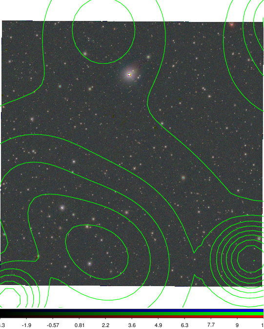  |
