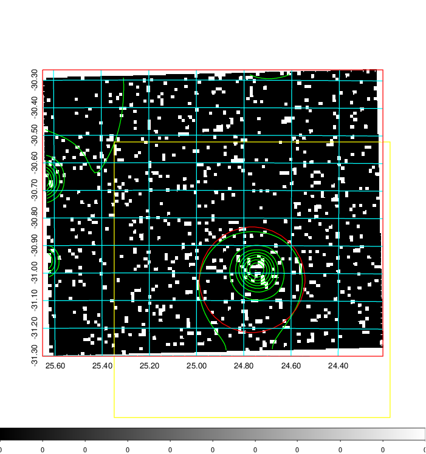
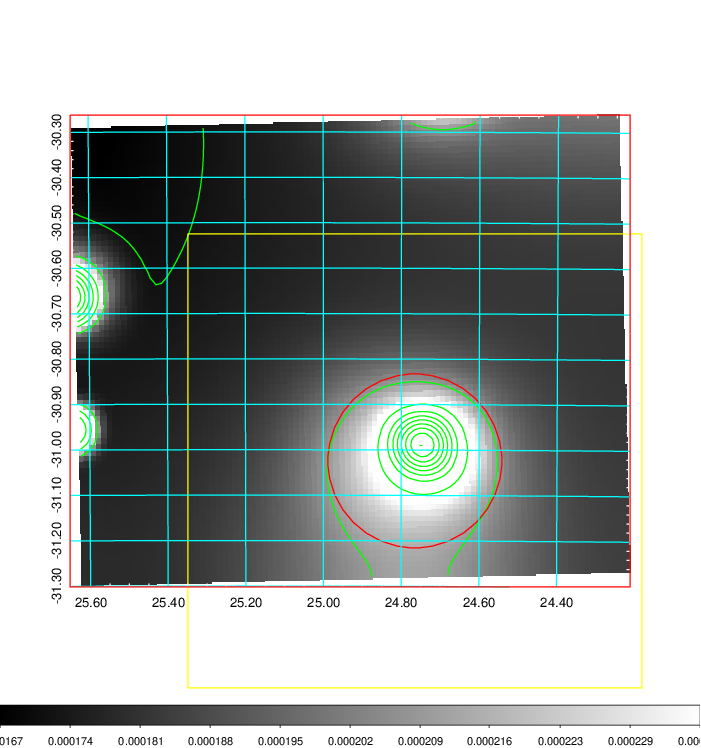
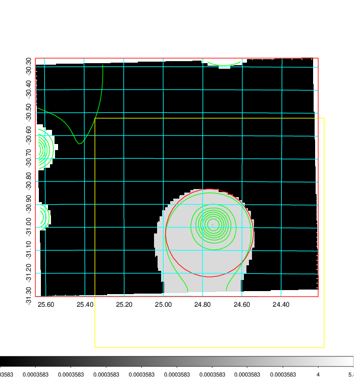
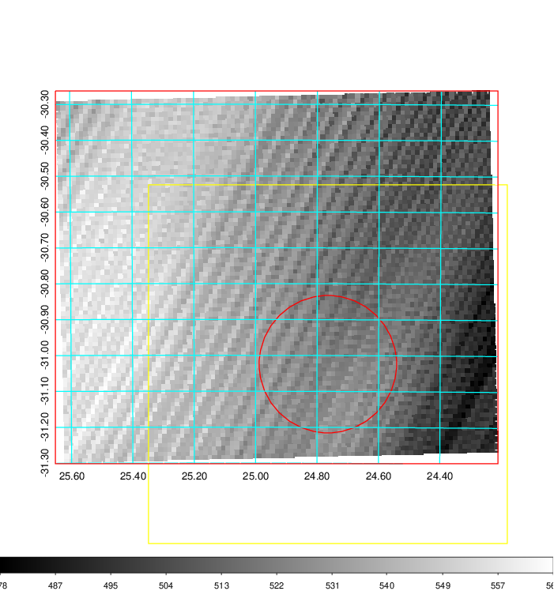
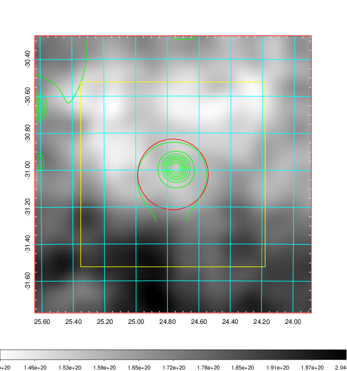
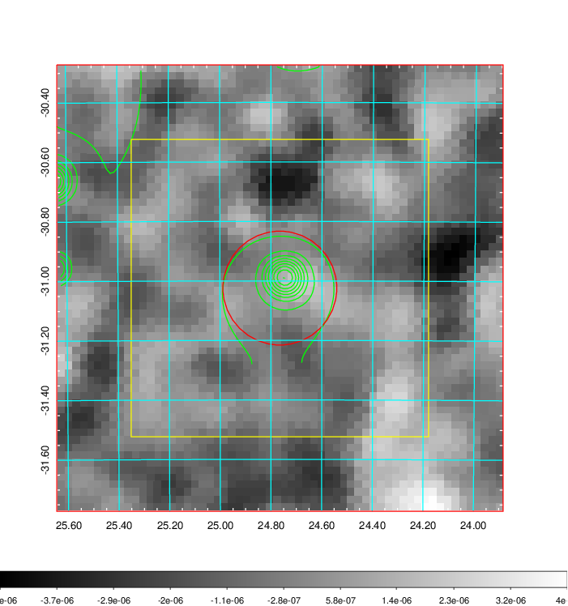
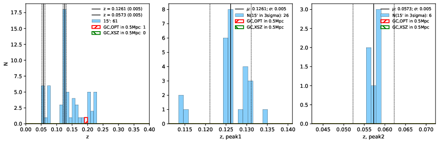
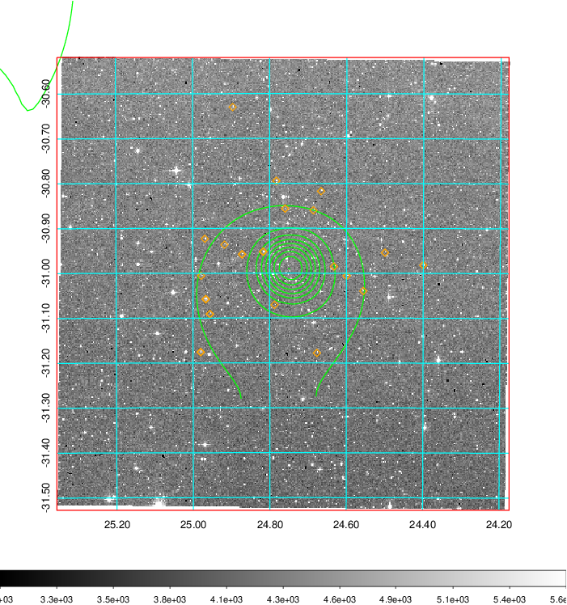
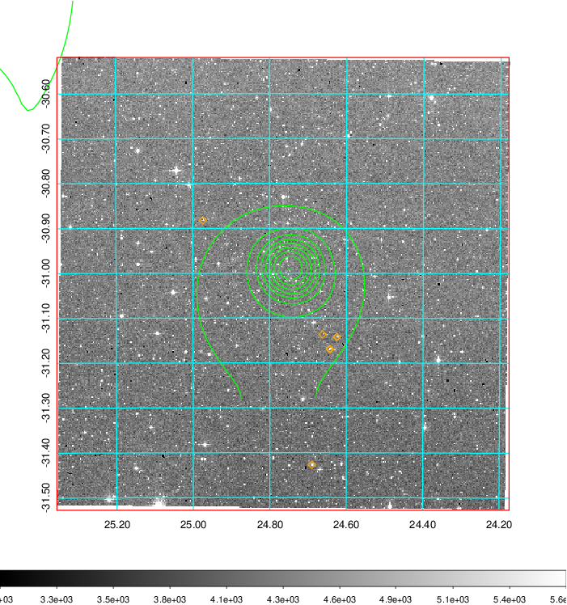
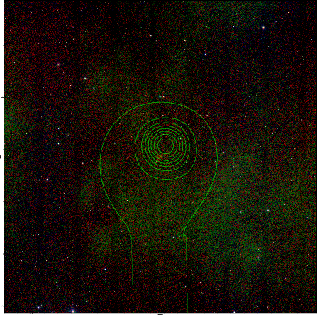

### 79

|Name|RAJ2000[deg]|DEJ2000[deg] |Ext[arcmin]| Ext,ml | z | z_src| C|GC(XSZ,Delta_z<0.01)| GC(OPT,Delta_z<0.01)|GC| R_sig[arcmin] | R500[arcmin] | R500[Mpc]| CRsig[c/s] | CR500[c/s] |L500[1E44 erg/s]|F500[1E-12 erg/s/cm^2]| M500[1E14 Msun]|Tx[keV]|Cnt_sig|Beta|Rc[arcmin]|Comment|Alias|
|---|---|---|---|---|---|------|---|--------|---------|----------|---|---|---|---|---|---|---|---|---|---|---|---|---|---|
|79| 24.765| -31.024| 11.49| 30.20| 0.1261(0.005)| z1,| G| -| -| A, W| 13.188| 6.245| 0.846| 0.110(0.029)| 0.102(0.027)| 0.835(0.297)| 2.001(0.712)| 1.94(0.35)| 3.36(0.38)| 69.7| 0.691(-0.138+0.192)| 6.426(-1.782+1.975)| An Abell cluster with no $z$ and offset = 0.64 Mpc(4.66 arcmin)| t479|

|[RASS image](../image/79/79_img.pdf)|[filtered image](../image/79/79_fil.pdf)|[Segment image](../image/79/79_seg.pdf)|
|-------------------|--------------------|-------------------|
|   |    |   |

|[Exposure image](../image/79/79_mex.pdf)| [nH image](../image/79/79_nh.pdf)| [Planck image](../image/79/79_p.pdf)|
|-------------------|--------------------|-------------------|
|   |     |  |

|[Redshift Histogram](../image/79/79_zg.pdf) | [DSS image(z1)](../image/79/79_dss_z1.pdf)      |  [DSS image(z2)](../image/79/79_dss_z2.pdf)    |
|-------------------|--------------------|-------------------|
| |  Blue circle for optical clusters;  Magenta circle for XSZ clusters;  all with r=1Mpc;  Only GC with Delta_z<0.01 are shown. |  Blue circle for optical clusters;  Magenta circle for XSZ clusters;  all with r=1Mpc;  Only GC with Delta_z<0.01 are shown.  |

|[known Abell/XSZ clusters](../image/79/79_gc.pdf) | [2MASS image](../image/79/79_2mass.pdf)      |
|-------------------|-------------------|
|  Magenta, blue and green circles  for optical, X-ray and SZ clusters  respectively, with redshift of clusters  labelled. The radius of circles  are 1Mpc.|  |

|[DES image](../image/79/79_des.pdf)   |[ATLAS image](../image/79/79_s.pdf)        |
|-------------------|-------------------|
|   |   |
