

### 790

|Name|RAJ2000[deg]|DEJ2000[deg] |Ext[arcmin]| Ext,ml | z | z_src| C|GC(XSZ,Delta_z<0.01)| GC(OPT,Delta_z<0.01)|GC| R_sig[arcmin] | R500[arcmin] | R500[Mpc]| CRsig[c/s] | CR500[c/s] |L500[1E44 erg/s]|F500[1E-12 erg/s/cm^2]| M500[1E14 Msun]|Tx[keV]|Cnt_sig|Beta|Rc[arcmin]|Comment|Alias|
|---|---|---|---|---|---|------|---|--------|---------|----------|---|---|---|---|---|---|---|---|---|---|---|---|---|---|
|790| 280.268| 63.752| 4.17| 85.58| 0.0861(0.007)| z1, z_opt| S| -| W| W| 30.131| 6.365| 0.616| 0.047(0.020)| 0.041(0.018)| 0.121(0.042)| 0.657(0.226)| 0.72(0.13)| 1.80(0.20)| 958.8| 0.934(-0.086+0.048)| 5.076(-0.503+0.329)| -| t210|

|[RASS image](../image/790/790_img.pdf)|[filtered image](../image/790/790_fil.pdf)|[Segment image](../image/790/790_seg.pdf)|
|-------------------|--------------------|-------------------|
| 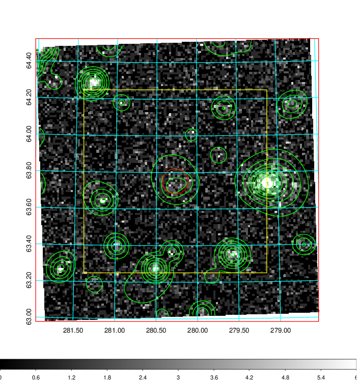  | 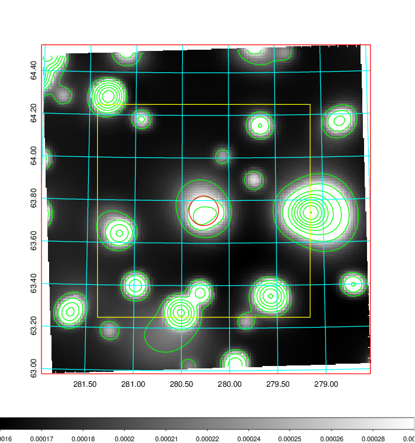   | 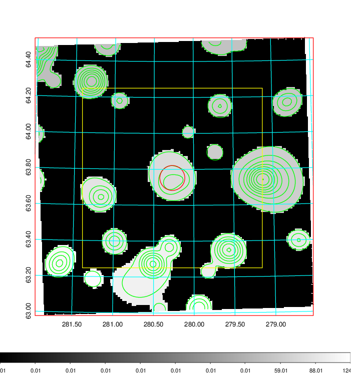  |

|[Exposure image](../image/790/790_mex.pdf)| [nH image](../image/790/790_nh.pdf)| [Planck image](../image/790/790_p.pdf)|
|-------------------|--------------------|-------------------|
|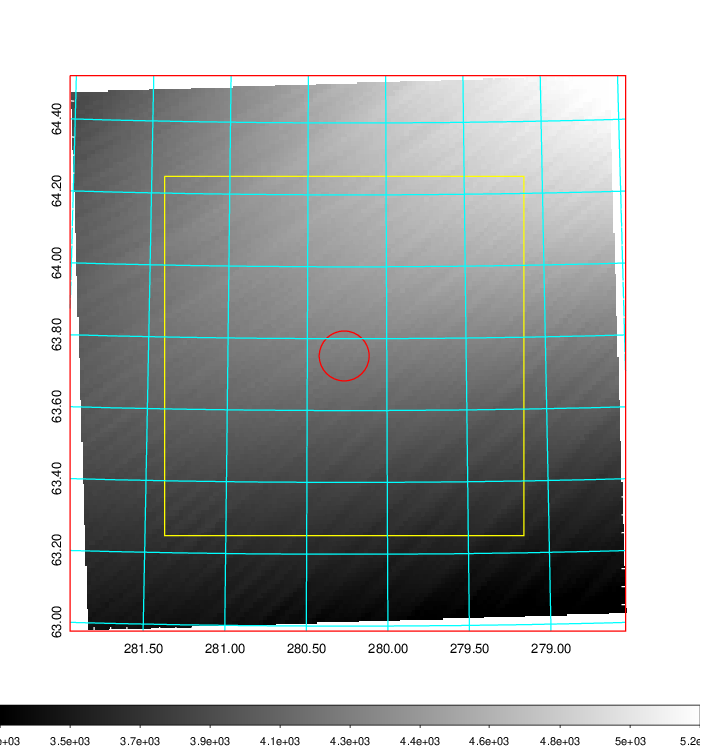   | 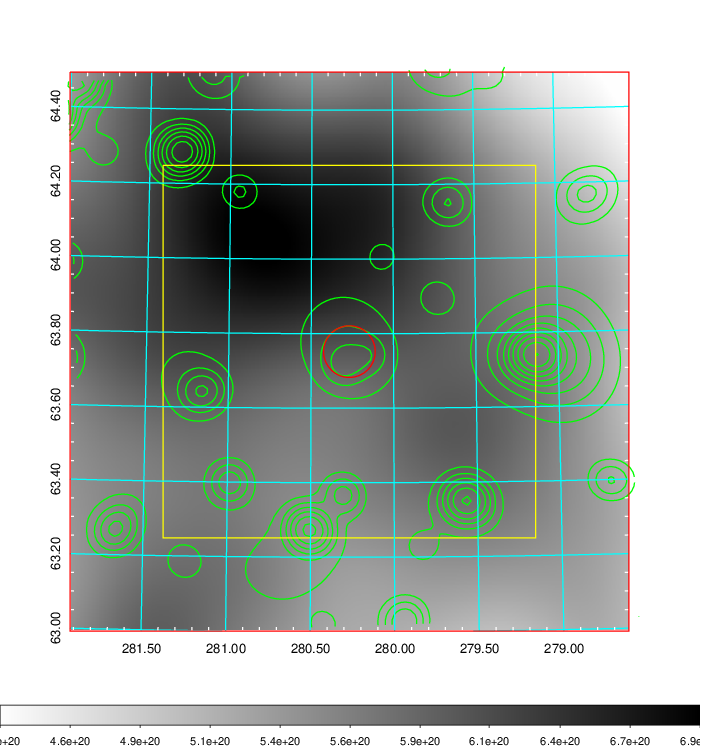    | 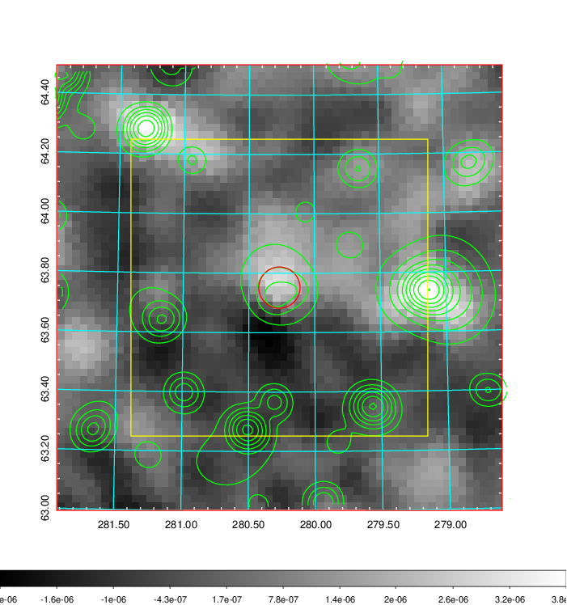 |

|[Redshift Histogram](../image/790/790_zg.pdf) | [DSS image(z1)](../image/790/790_dss_z1.pdf)      |  [DSS image(z2)](../image/790/790_dss_z2.pdf)    |
|-------------------|--------------------|-------------------|
|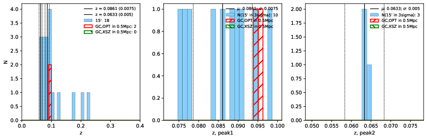 |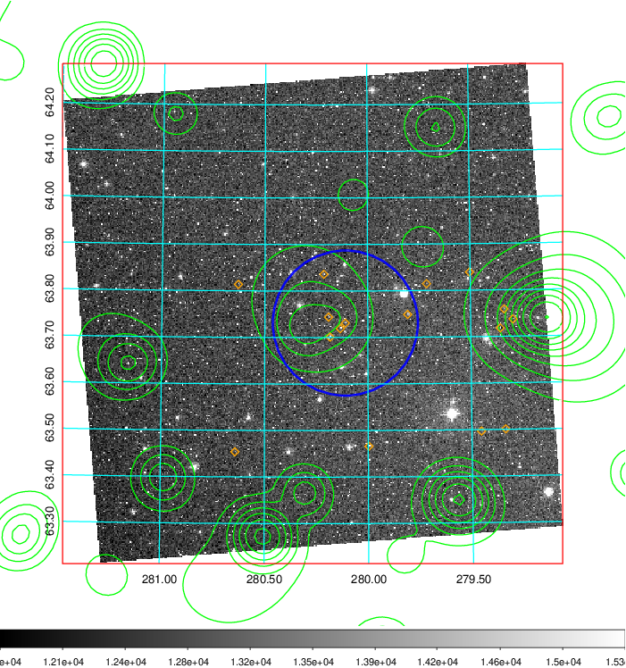  Blue circle for optical clusters;  Magenta circle for XSZ clusters;  all with r=1Mpc;  Only GC with Delta_z<0.01 are shown. | 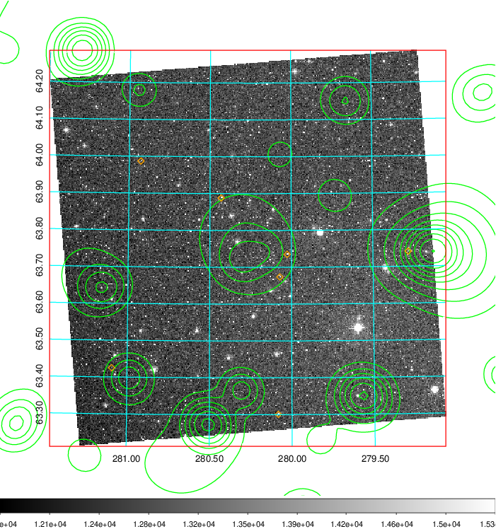 Blue circle for optical clusters;  Magenta circle for XSZ clusters;  all with r=1Mpc;  Only GC with Delta_z<0.01 are shown.  |

|[Previous-identified clusters](../image/790/790_gc.pdf) | [2MASS image](../image/790/790_2mass.pdf)      |[SDSS image](../image/790/790_sdss.pdf)   |
|-------------------|-------------------|-------------------|
|  Green, magenta, and blue circles  for optical, X-ray and SZ clusters  respectively, with redshift of clusters  labelled. The radius of circles  are 1Mpc.|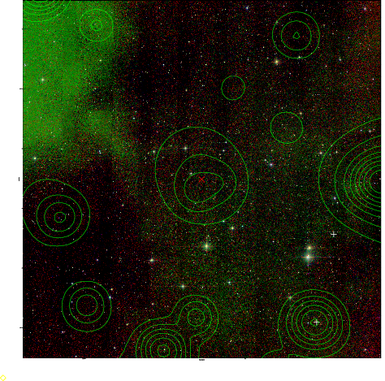  | 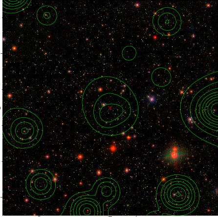  |

