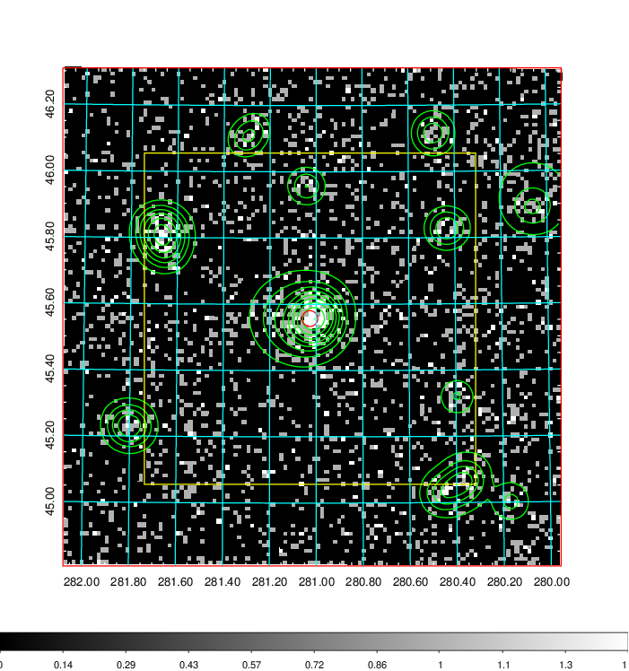
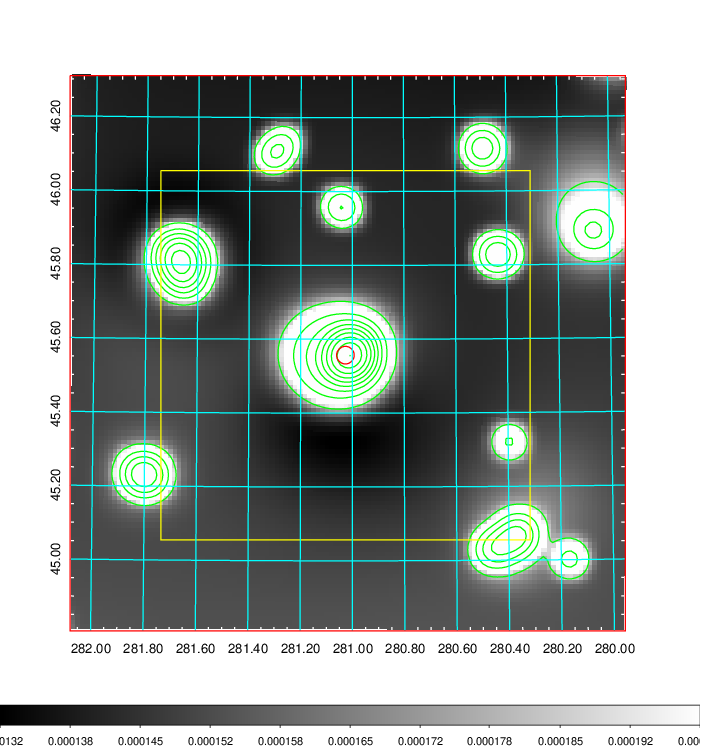
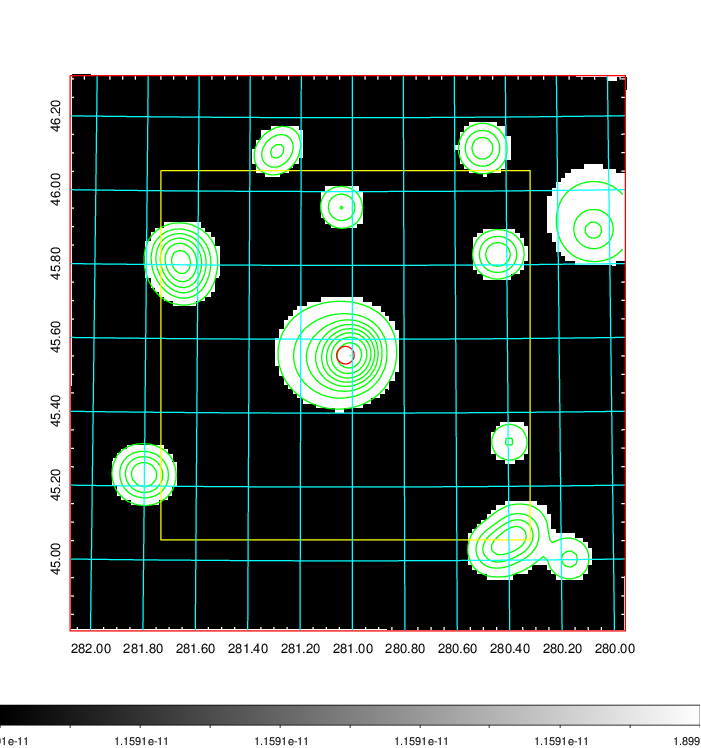
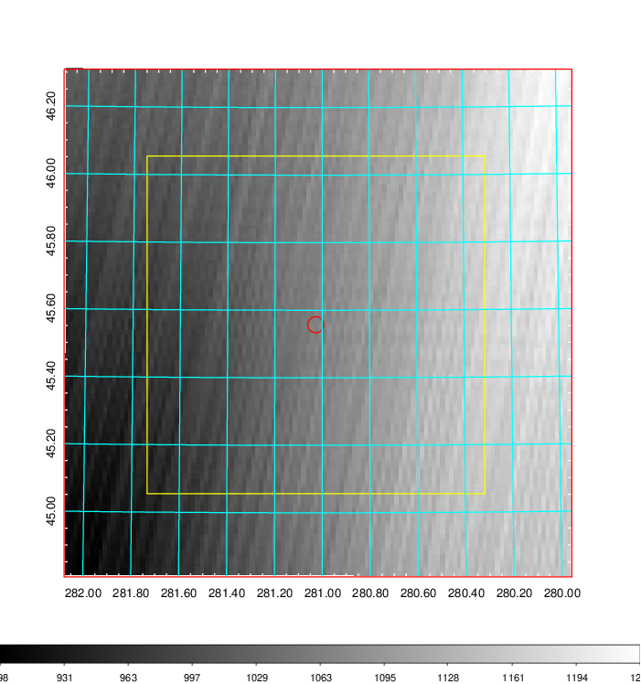
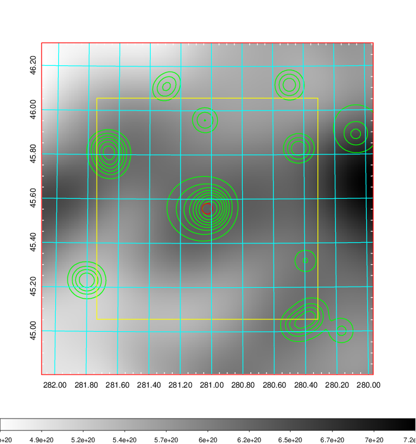
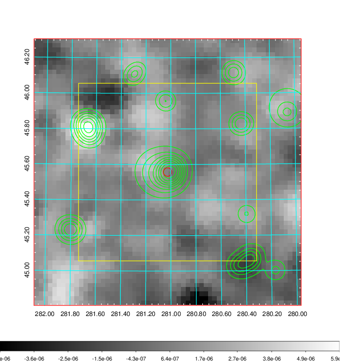
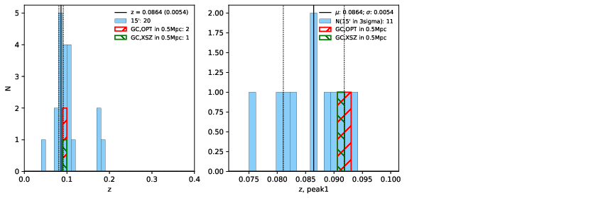
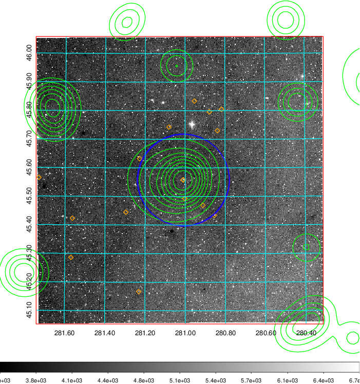
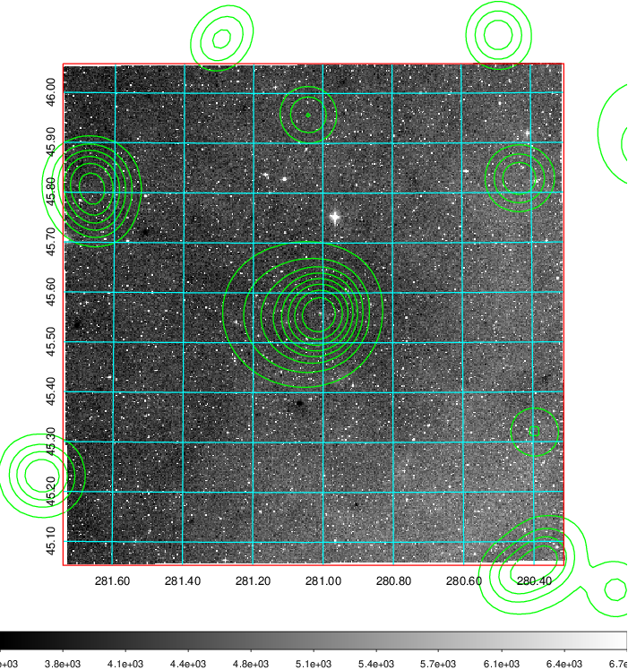
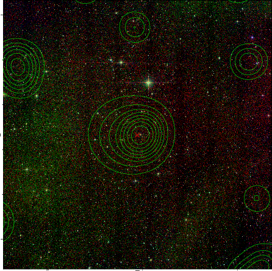

### 791

|Name|RAJ2000[deg]|DEJ2000[deg] |Ext[arcmin]| Ext,ml | z | z_src| C|GC(XSZ,Delta_z<0.01)| GC(OPT,Delta_z<0.01)|GC| R_sig[arcmin] | R500[arcmin] | R500[Mpc]| CRsig[c/s] | CR500[c/s] |L500[1E44 erg/s]|F500[1E-12 erg/s/cm^2]| M500[1E14 Msun]|Tx[keV]|Cnt_sig|Beta|Rc[arcmin]|Comment|Alias|
|---|---|---|---|---|---|------|---|--------|---------|----------|---|---|---|---|---|---|---|---|---|---|---|---|---|---|
|791| 281.027| 45.557| 1.43| 68.70| 0.0864(0.005)| z1, z_xsz| B| MCXC| N, W| MCXC, N, W| 8.800| 8.573| 0.833| 0.173(0.021)| 0.172(0.021)| 0.557(0.030)| 3.000(0.164)| 1.78(0.05)| 3.14(0.05)| 183.9| 0.890(-0.103+0.077)| 3.706(-0.594+0.432)| -| k104|

|[RASS image](../image/791/791_img.pdf)|[filtered image](../image/791/791_fil.pdf)|[Segment image](../image/791/791_seg.pdf)|
|-------------------|--------------------|-------------------|
|   |    |   |

|[Exposure image](../image/791/791_mex.pdf)| [nH image](../image/791/791_nh.pdf)| [Planck image](../image/791/791_p.pdf)|
|-------------------|--------------------|-------------------|
|   |     |  |

|[Redshift Histogram](../image/791/791_zg.pdf) | [DSS image(z1)](../image/791/791_dss_z1.pdf)      |  [DSS image(z2)](../image/791/791_dss_z2.pdf)    |
|-------------------|--------------------|-------------------|
| |  Blue circle for optical clusters;  Magenta circle for XSZ clusters;  all with r=1Mpc;  Only GC with Delta_z<0.01 are shown. |  Blue circle for optical clusters;  Magenta circle for XSZ clusters;  all with r=1Mpc;  Only GC with Delta_z<0.01 are shown.  |

|[known Abell/XSZ clusters](../image/791/791_gc.pdf) | [2MASS image](../image/791/791_2mass.pdf)      |
|-------------------|-------------------|
|  Magenta, blue and green circles  for optical, X-ray and SZ clusters  respectively, with redshift of clusters  labelled. The radius of circles  are 1Mpc.|  |

|[PS1 image](../image/791/791_ps1.pdf)            |
|-------------------|
|   |
