

### 792

|Name|RAJ2000[deg]|DEJ2000[deg] |Ext[arcmin]| Ext,ml | z | z_src| C|GC(XSZ,Delta_z<0.01)| GC(OPT,Delta_z<0.01)|GC| R_sig[arcmin] | R500[arcmin] | R500[Mpc]| CRsig[c/s] | CR500[c/s] |L500[1E44 erg/s]|F500[1E-12 erg/s/cm^2]| M500[1E14 Msun]|Tx[keV]|Cnt_sig|Beta|Rc[arcmin]|Comment|Alias|
|---|---|---|---|---|---|------|---|--------|---------|----------|---|---|---|---|---|---|---|---|---|---|---|---|---|---|
|792| 281.176| 72.145| 2.16| 68.16| 0.1092(0.008)| z1,| G| -| -| N, SWXCS, W| 10.262| 6.408| 0.766| 0.081(0.013)| 0.076(0.013)| 0.410(0.038)| 1.339(0.123)| 1.42(0.07)| 2.75(0.08)| 197.6| 0.933(-0.082+0.049)| 4.928(-0.509+0.378)| An X-ray cluster with no $z$ and offset = 0.28 Mpc| t070|

|[RASS image](../image/792/792_img.pdf)|[filtered image](../image/792/792_fil.pdf)|[Segment image](../image/792/792_seg.pdf)|
|-------------------|--------------------|-------------------|
| 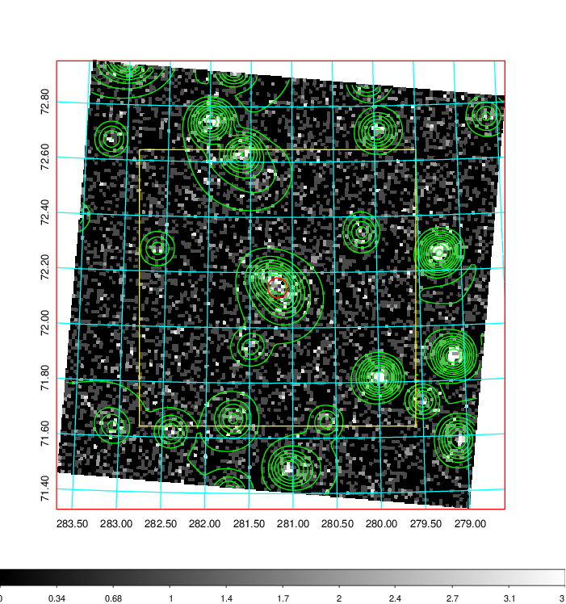  | 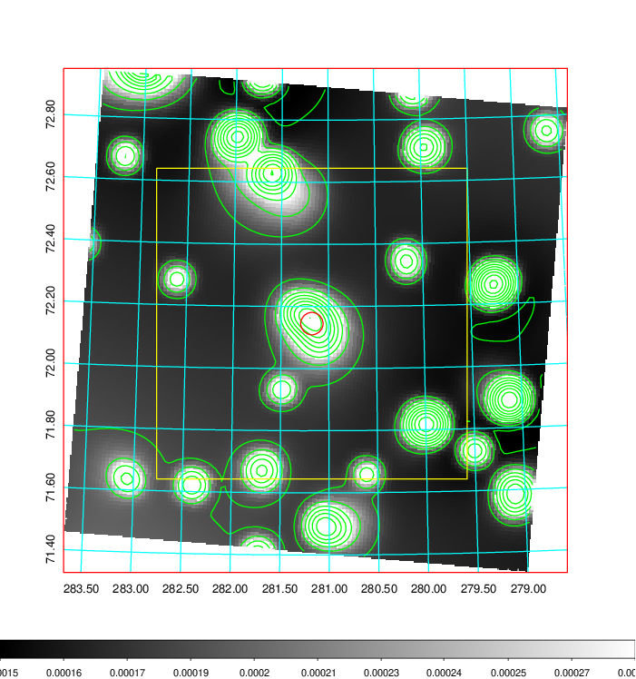   | 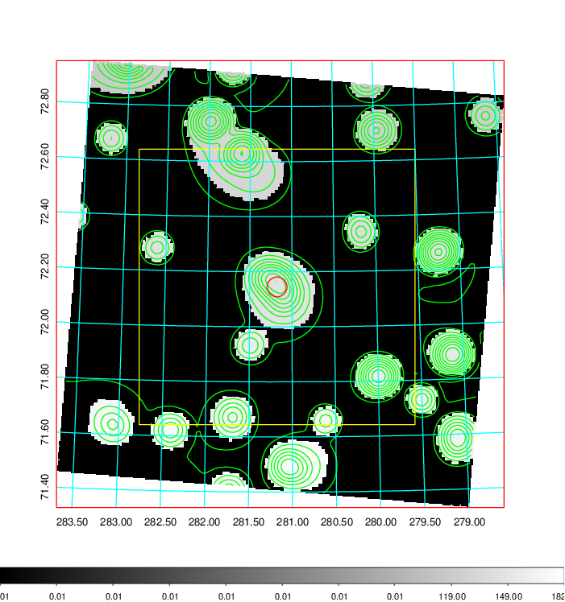  |

|[Exposure image](../image/792/792_mex.pdf)| [nH image](../image/792/792_nh.pdf)| [Planck image](../image/792/792_p.pdf)|
|-------------------|--------------------|-------------------|
|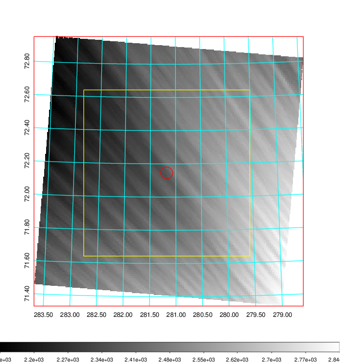   | 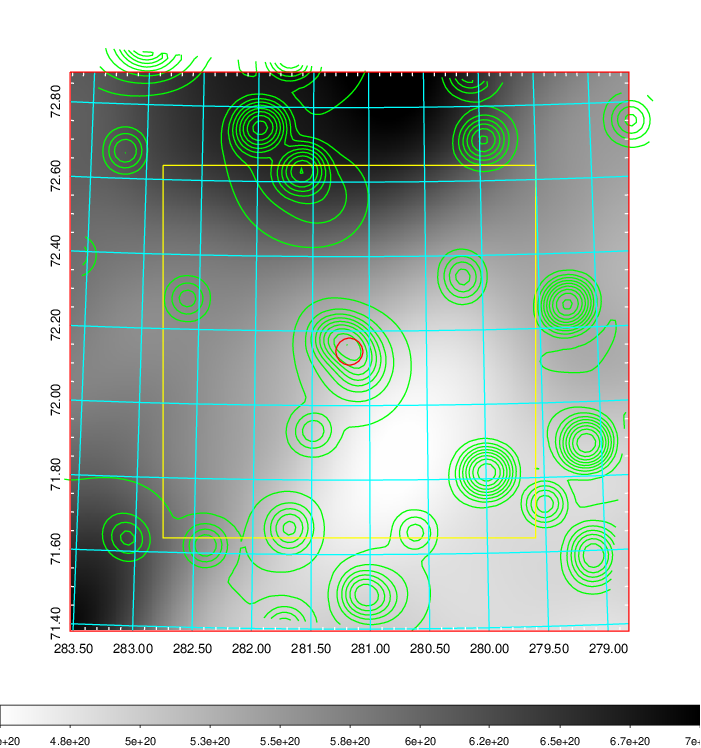    | 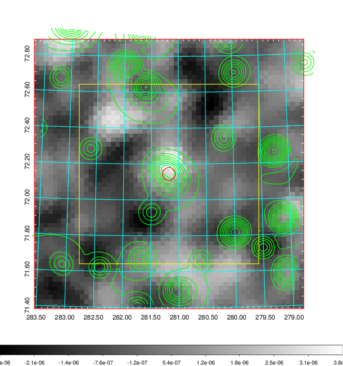 |

|[Redshift Histogram](../image/792/792_zg.pdf) | [DSS image(z1)](../image/792/792_dss_z1.pdf)      |  [DSS image(z2)](../image/792/792_dss_z2.pdf)    |
|-------------------|--------------------|-------------------|
|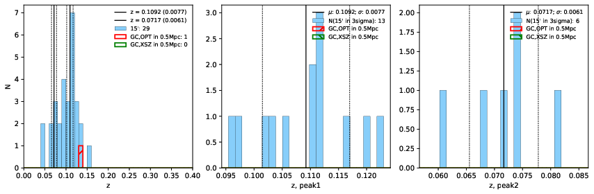 |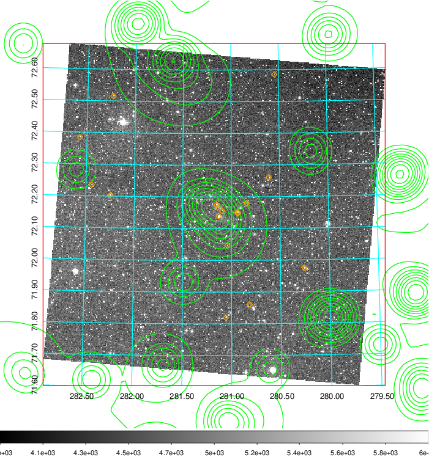  Blue circle for optical clusters;  Magenta circle for XSZ clusters;  all with r=1Mpc;  Only GC with Delta_z<0.01 are shown. | 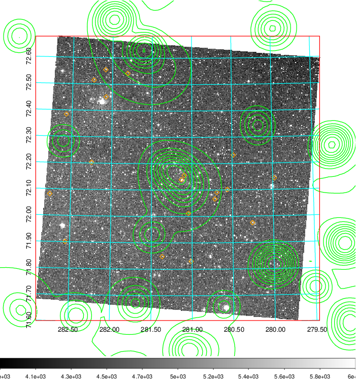 Blue circle for optical clusters;  Magenta circle for XSZ clusters;  all with r=1Mpc;  Only GC with Delta_z<0.01 are shown.  |

|[Previous-identified clusters](../image/792/792_gc.pdf) | [2MASS image](../image/792/792_2mass.pdf)      |
|-------------------|-------------------|
|  Green, magenta, and blue circles  for optical, X-ray and SZ clusters  respectively, with redshift of clusters  labelled. The radius of circles  are 1Mpc.|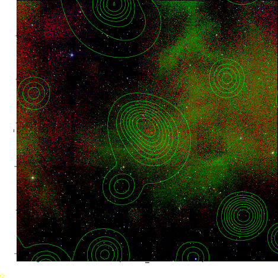  |

|[PS1 image](../image/792/792_ps1.pdf)            |
|-------------------|
| 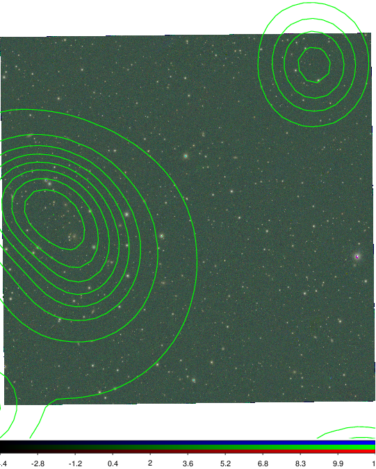  |
