

### 793

|Name|RAJ2000[deg]|DEJ2000[deg] |Ext[arcmin]| Ext,ml | z | z_src| C|GC(XSZ,Delta_z<0.01)| GC(OPT,Delta_z<0.01)|GC| R_sig[arcmin] | R500[arcmin] | R500[Mpc]| CRsig[c/s] | CR500[c/s] |L500[1E44 erg/s]|F500[1E-12 erg/s/cm^2]| M500[1E14 Msun]|Tx[keV]|Cnt_sig|Beta|Rc[arcmin]|Comment|Alias|
|---|---|---|---|---|---|------|---|--------|---------|----------|---|---|---|---|---|---|---|---|---|---|---|---|---|---|
|793| 282.066| 64.635| 2.01| 29.08| 0.0730(0.006)| z1,| G| -| -| W| 49.510| 9.781| 0.815| 0.248(0.025)| 0.219(0.022)| 0.503(0.130)| 3.863(1.002)| 1.65(0.22)| 2.98(0.25)| 1611.1| 0.500(-0.000+0.001)| 5.528(-0.048+0.410)| -| t062|

|[RASS image](../image/793/793_img.pdf)|[filtered image](../image/793/793_fil.pdf)|[Segment image](../image/793/793_seg.pdf)|
|-------------------|--------------------|-------------------|
| 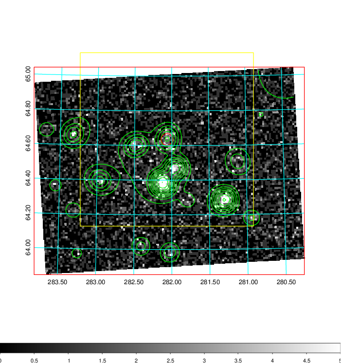  | 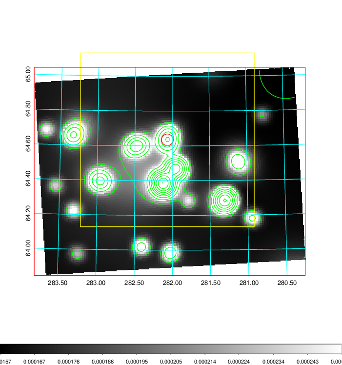   | 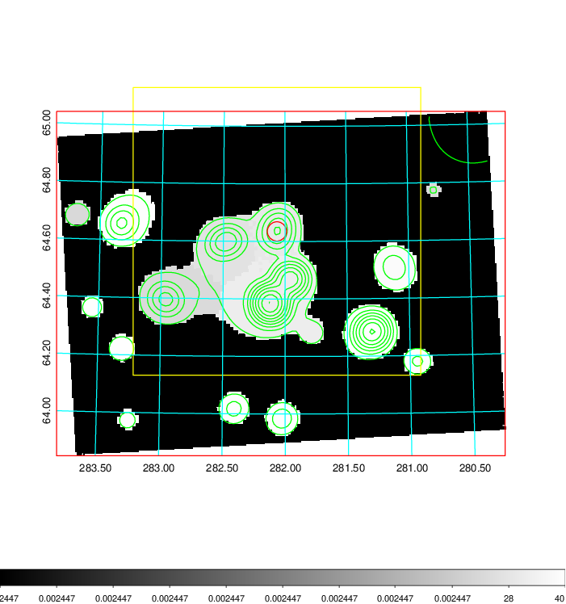  |

|[Exposure image](../image/793/793_mex.pdf)| [nH image](../image/793/793_nh.pdf)| [Planck image](../image/793/793_p.pdf)|
|-------------------|--------------------|-------------------|
|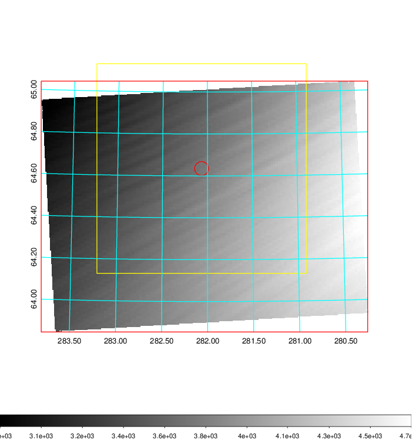   | 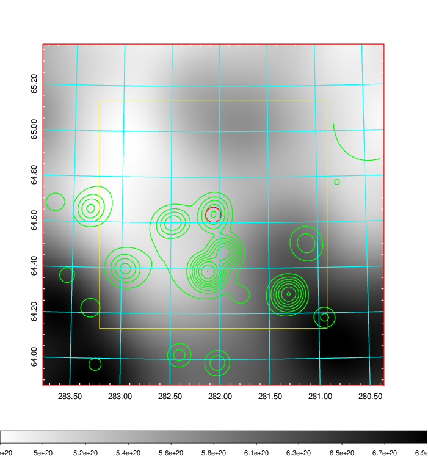    | 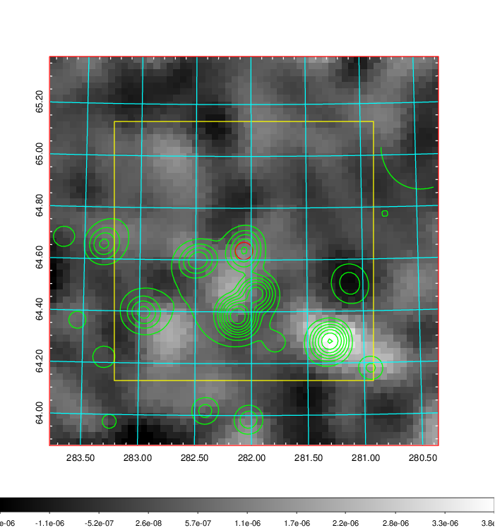 |

|[Redshift Histogram](../image/793/793_zg.pdf) | [DSS image(z1)](../image/793/793_dss_z1.pdf)      |  [DSS image(z2)](../image/793/793_dss_z2.pdf)    |
|-------------------|--------------------|-------------------|
|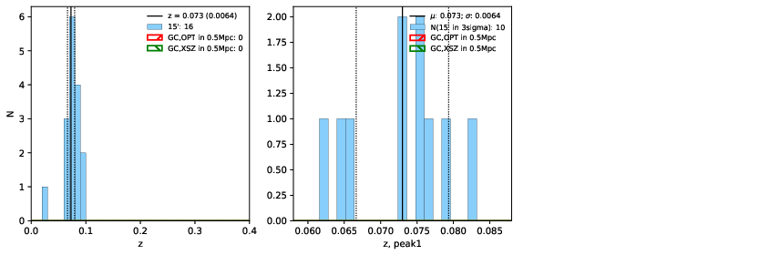 |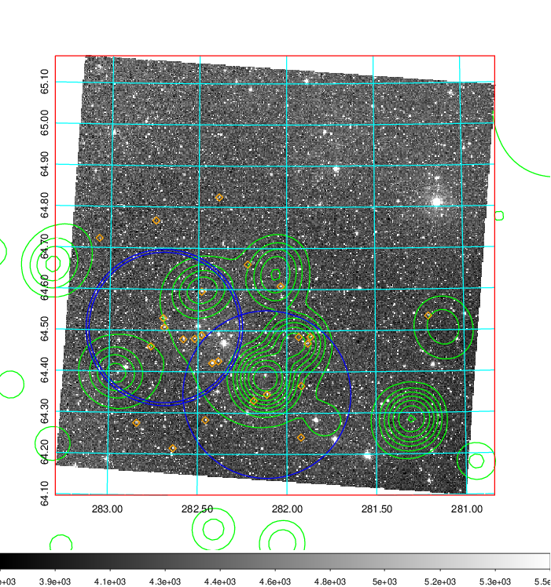  Blue circle for optical clusters;  Magenta circle for XSZ clusters;  all with r=1Mpc;  Only GC with Delta_z<0.01 are shown. | 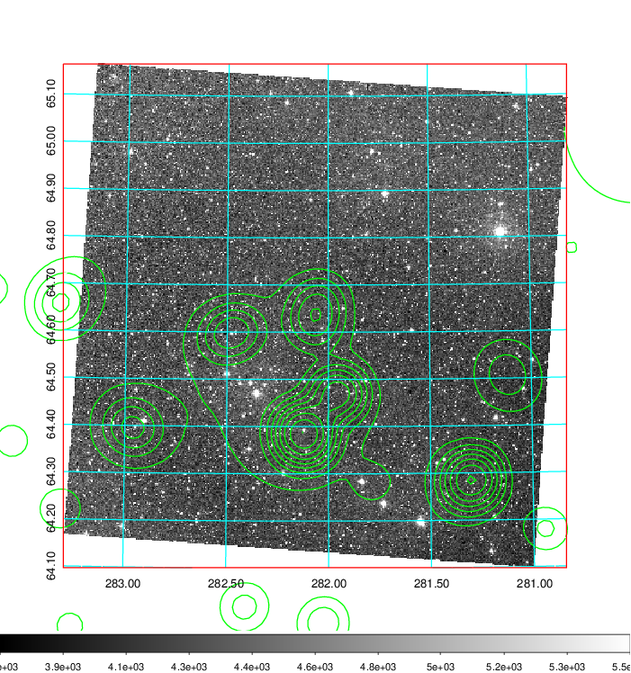 Blue circle for optical clusters;  Magenta circle for XSZ clusters;  all with r=1Mpc;  Only GC with Delta_z<0.01 are shown.  |

|[Previous-identified clusters](../image/793/793_gc.pdf) | [2MASS image](../image/793/793_2mass.pdf)      |[SDSS image](../image/793/793_sdss.pdf)   |
|-------------------|-------------------|-------------------|
|  Green, magenta, and blue circles  for optical, X-ray and SZ clusters  respectively, with redshift of clusters  labelled. The radius of circles  are 1Mpc.|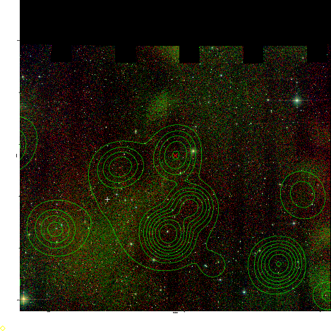  | 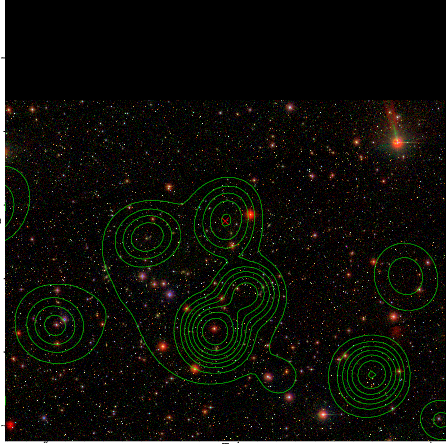  |

