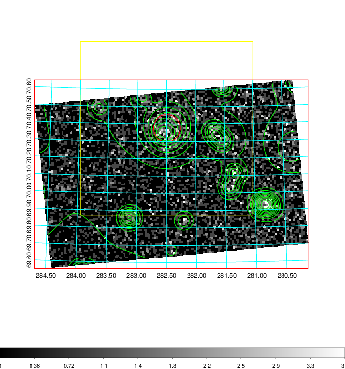
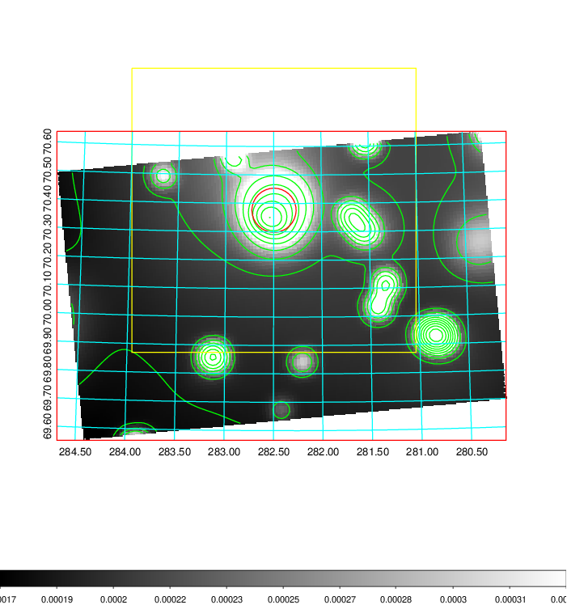
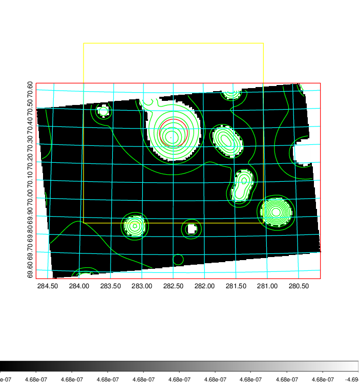
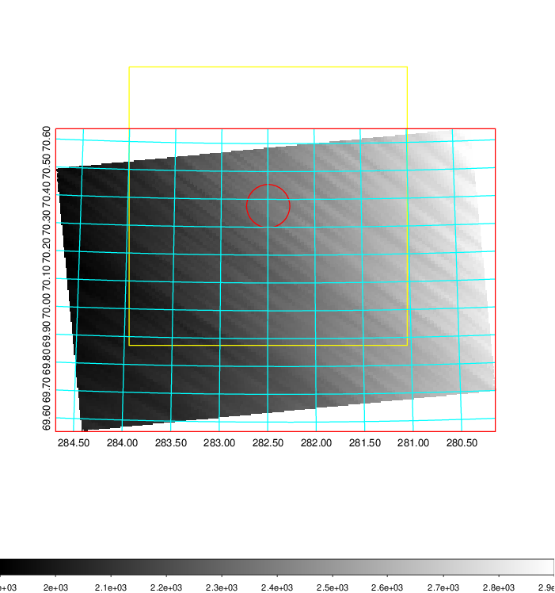
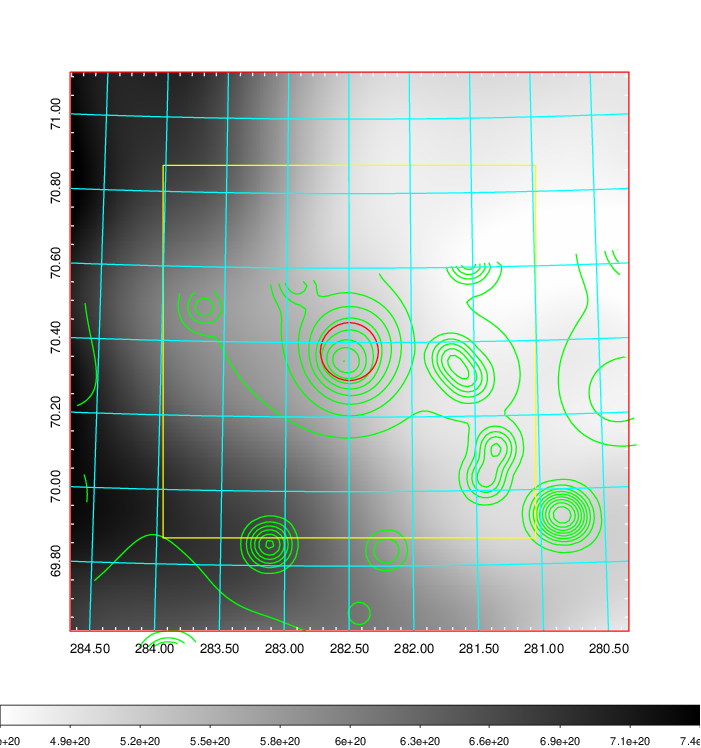
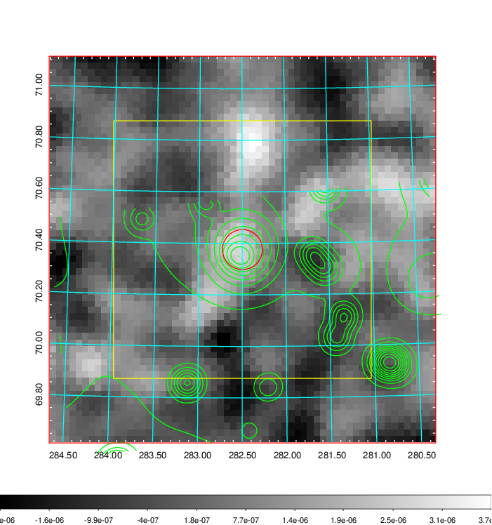
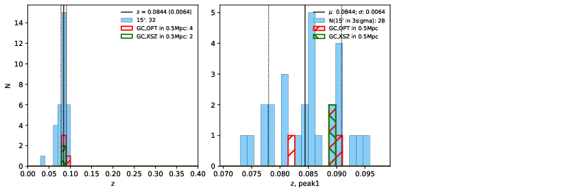
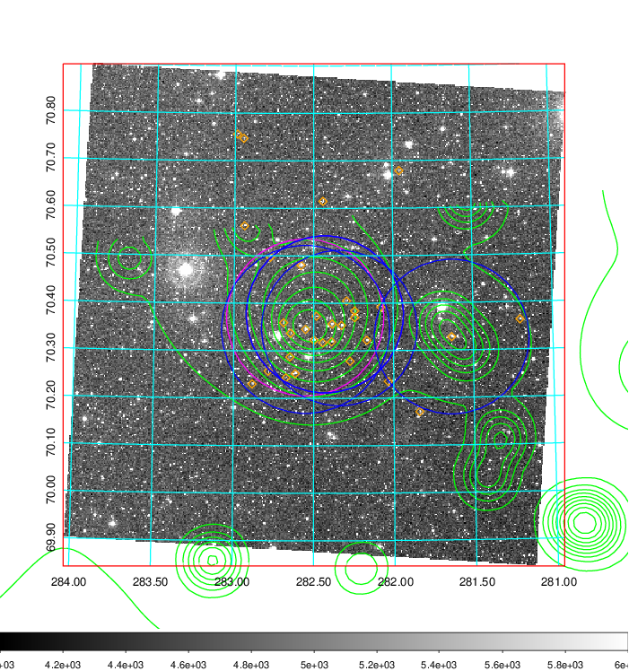
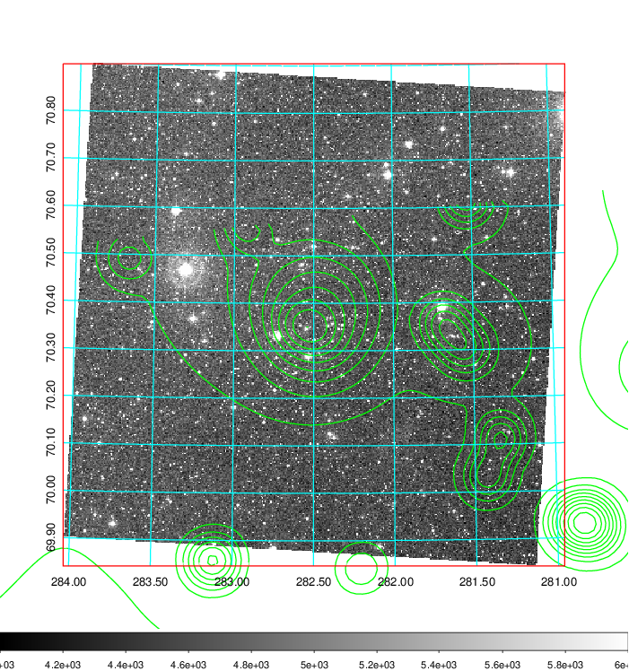
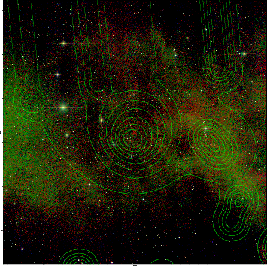

### 794

|Name|RAJ2000[deg]|DEJ2000[deg] |Ext[arcmin]| Ext,ml | z | z_src| C|GC(XSZ,Delta_z<0.01)| GC(OPT,Delta_z<0.01)|GC| R_sig[arcmin] | R500[arcmin] | R500[Mpc]| CRsig[c/s] | CR500[c/s] |L500[1E44 erg/s]|F500[1E-12 erg/s/cm^2]| M500[1E14 Msun]|Tx[keV]|Cnt_sig|Beta|Rc[arcmin]|Comment|Alias|
|---|---|---|---|---|---|------|---|--------|---------|----------|---|---|---|---|---|---|---|---|---|---|---|---|---|---|
|794| 282.497| 70.376| 4.66| 155.19| 0.0844(0.006)| z1, z_xsz| B| L03| A, N, W| A, L03, N, W| 29.638| 8.431| 0.802| 0.171(0.023)| 0.153(0.020)| 0.474(0.048)| 2.680(0.273)| 1.59(0.08)| 2.92(0.10)| 597.6| 0.691(-0.054+0.071)| 5.985(-0.790+0.948)| -| t241|

|[RASS image](../image/794/794_img.pdf)|[filtered image](../image/794/794_fil.pdf)|[Segment image](../image/794/794_seg.pdf)|
|-------------------|--------------------|-------------------|
|   |    |   |

|[Exposure image](../image/794/794_mex.pdf)| [nH image](../image/794/794_nh.pdf)| [Planck image](../image/794/794_p.pdf)|
|-------------------|--------------------|-------------------|
|   |     |  |

|[Redshift Histogram](../image/794/794_zg.pdf) | [DSS image(z1)](../image/794/794_dss_z1.pdf)      |  [DSS image(z2)](../image/794/794_dss_z2.pdf)    |
|-------------------|--------------------|-------------------|
| |  Blue circle for optical clusters;  Magenta circle for XSZ clusters;  all with r=1Mpc;  Only GC with Delta_z<0.01 are shown. |  Blue circle for optical clusters;  Magenta circle for XSZ clusters;  all with r=1Mpc;  Only GC with Delta_z<0.01 are shown.  |

|[known Abell/XSZ clusters](../image/794/794_gc.pdf) | [2MASS image](../image/794/794_2mass.pdf)      |
|-------------------|-------------------|
|  Magenta, blue and green circles  for optical, X-ray and SZ clusters  respectively, with redshift of clusters  labelled. The radius of circles  are 1Mpc.|  |

|[PS1 image](../image/794/794_ps1.pdf)            |
|-------------------|
|   |
