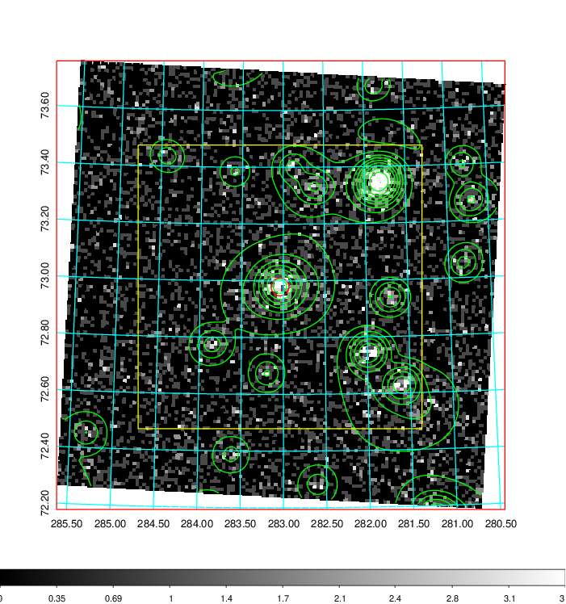
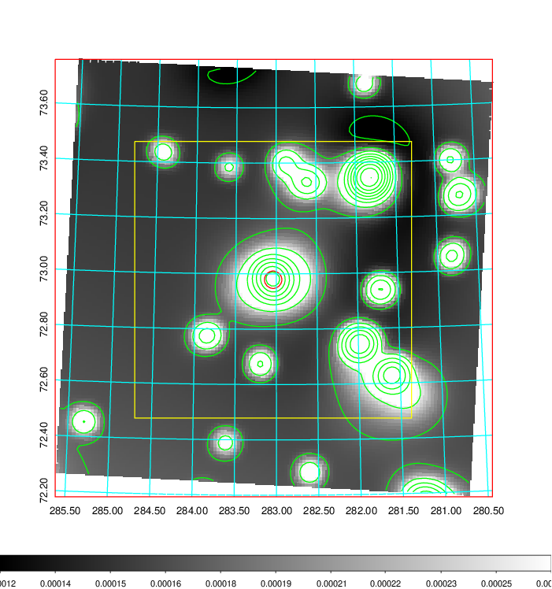
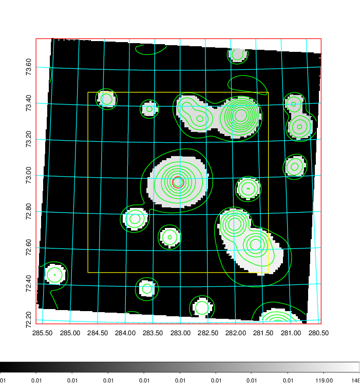
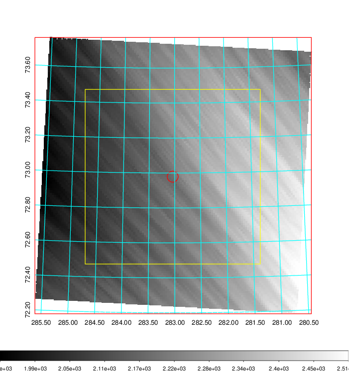
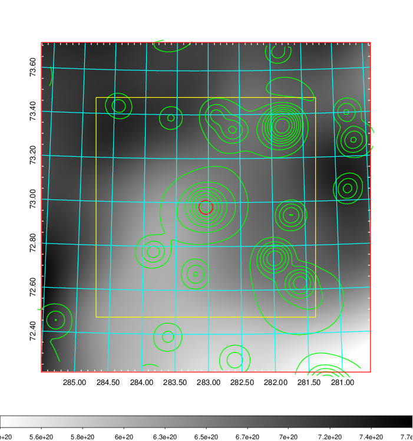
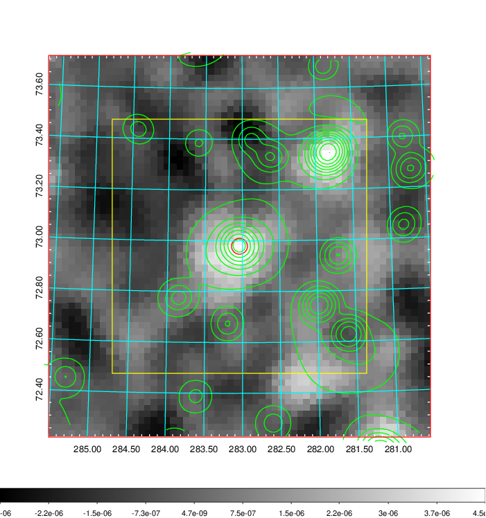
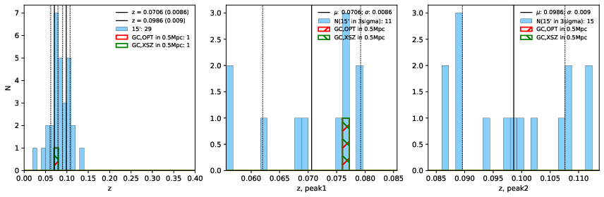
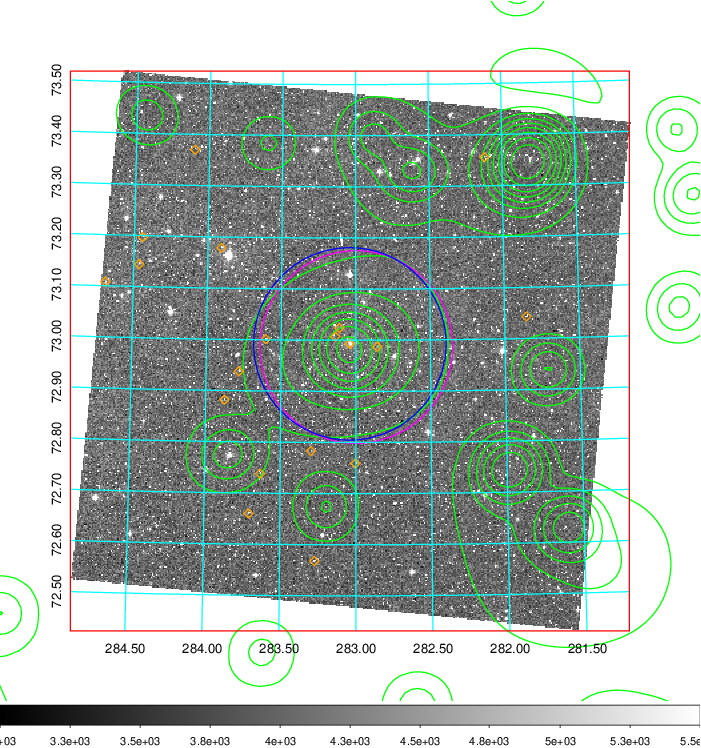
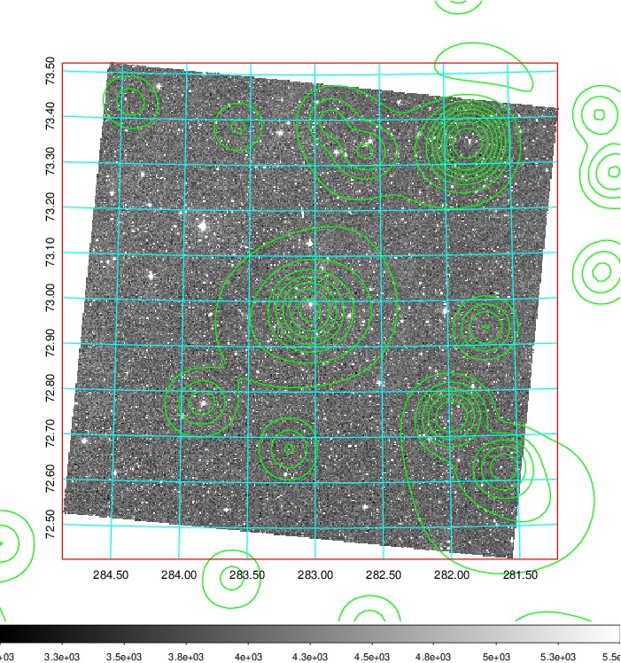
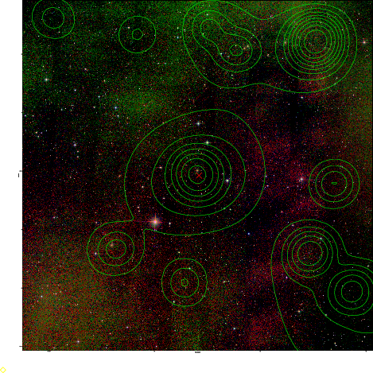

### 795

|Name|RAJ2000[deg]|DEJ2000[deg] |Ext[arcmin]| Ext,ml | z | z_src| C|GC(XSZ,Delta_z<0.01)| GC(OPT,Delta_z<0.01)|GC| R_sig[arcmin] | R500[arcmin] | R500[Mpc]| CRsig[c/s] | CR500[c/s] |L500[1E44 erg/s]|F500[1E-12 erg/s/cm^2]| M500[1E14 Msun]|Tx[keV]|Cnt_sig|Beta|Rc[arcmin]|Comment|Alias|
|---|---|---|---|---|---|------|---|--------|---------|----------|---|---|---|---|---|---|---|---|---|---|---|---|---|---|
|795| 283.039| 72.979| 1.89| 88.59| 0.0706(0.009)| z1, z_xsz| B| Tar| W| N, Tar, W| 11.725| 8.906| 0.720| 0.129(0.015)| 0.124(0.014)| 0.256(0.016)| 2.106(0.128)| 1.13(0.04)| 2.37(0.05)| 264.4| 0.764(-0.095+0.122)| 3.768(-0.730+0.819)| -| t053|

|[RASS image](../image/795/795_img.pdf)|[filtered image](../image/795/795_fil.pdf)|[Segment image](../image/795/795_seg.pdf)|
|-------------------|--------------------|-------------------|
|   |    |   |

|[Exposure image](../image/795/795_mex.pdf)| [nH image](../image/795/795_nh.pdf)| [Planck image](../image/795/795_p.pdf)|
|-------------------|--------------------|-------------------|
|   |     |  |

|[Redshift Histogram](../image/795/795_zg.pdf) | [DSS image(z1)](../image/795/795_dss_z1.pdf)      |  [DSS image(z2)](../image/795/795_dss_z2.pdf)    |
|-------------------|--------------------|-------------------|
| |  Blue circle for optical clusters;  Magenta circle for XSZ clusters;  all with r=1Mpc;  Only GC with Delta_z<0.01 are shown. |  Blue circle for optical clusters;  Magenta circle for XSZ clusters;  all with r=1Mpc;  Only GC with Delta_z<0.01 are shown.  |

|[known Abell/XSZ clusters](../image/795/795_gc.pdf) | [2MASS image](../image/795/795_2mass.pdf)      |
|-------------------|-------------------|
|  Magenta, blue and green circles  for optical, X-ray and SZ clusters  respectively, with redshift of clusters  labelled. The radius of circles  are 1Mpc.|  |

|[PS1 image](../image/795/795_ps1.pdf)            |
|-------------------|
|   |
