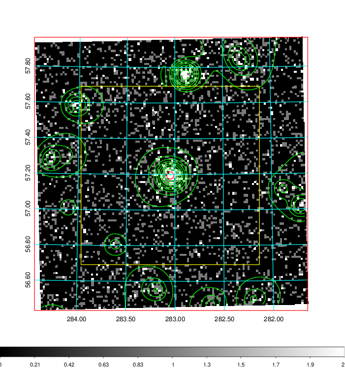
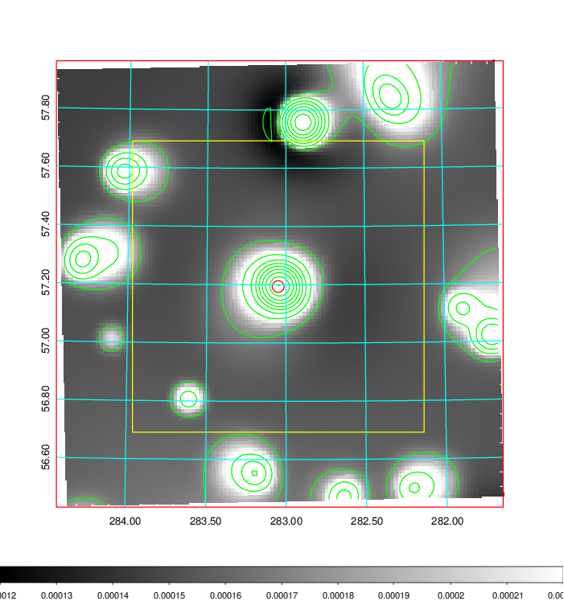
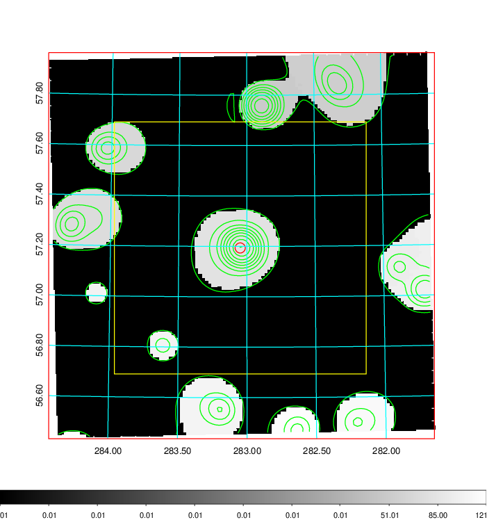
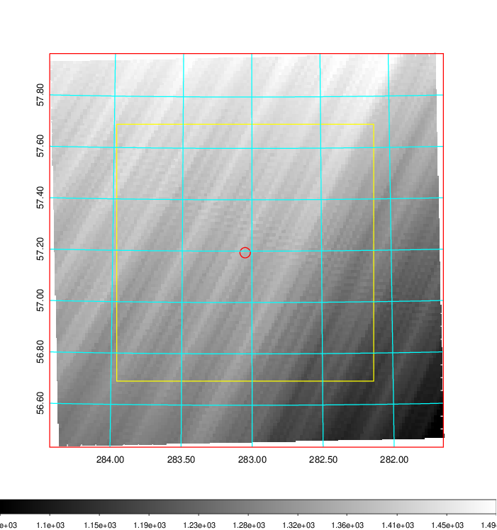
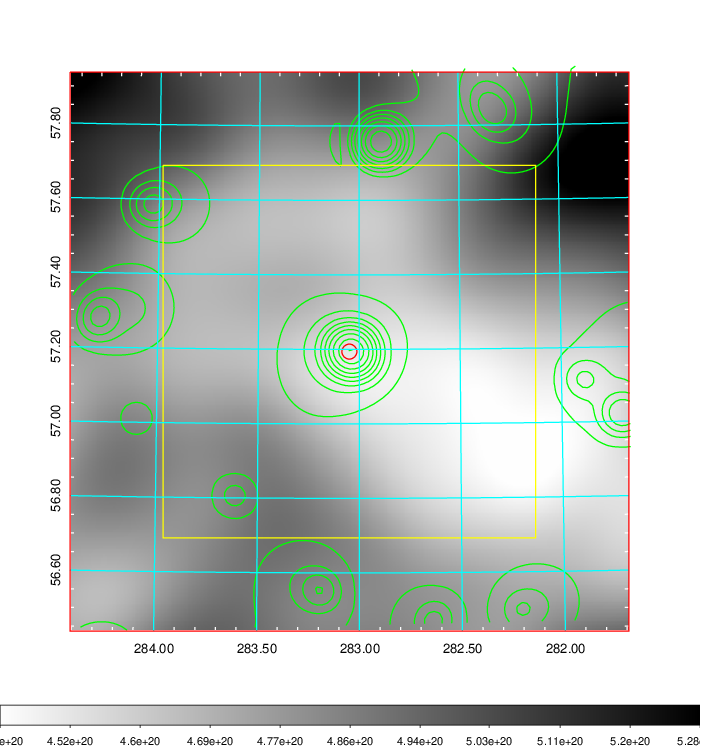
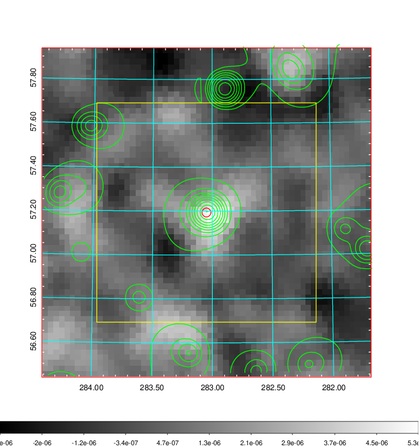
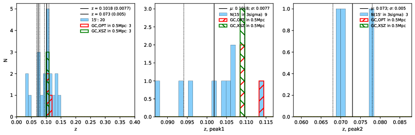
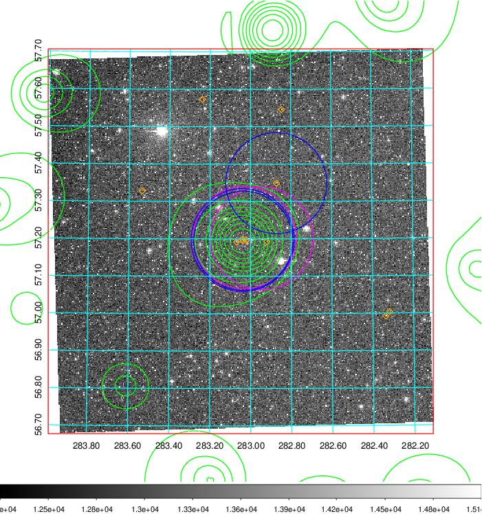
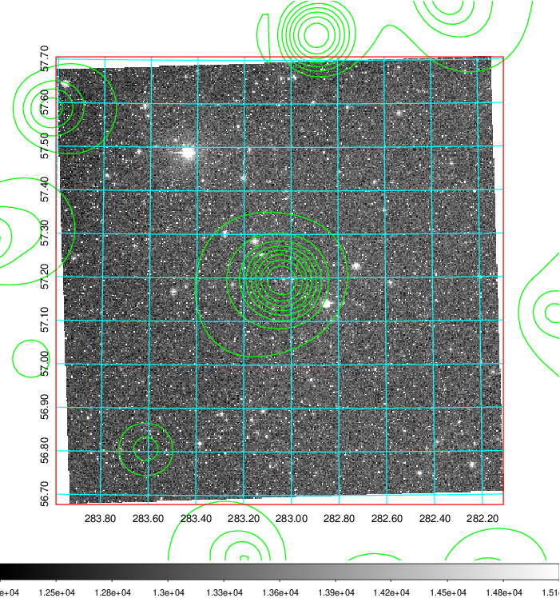
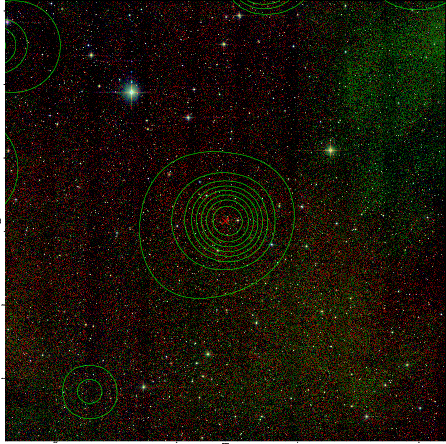

### 796

|Name|RAJ2000[deg]|DEJ2000[deg] |Ext[arcmin]| Ext,ml | z | z_src| C|GC(XSZ,Delta_z<0.01)| GC(OPT,Delta_z<0.01)|GC| R_sig[arcmin] | R500[arcmin] | R500[Mpc]| CRsig[c/s] | CR500[c/s] |L500[1E44 erg/s]|F500[1E-12 erg/s/cm^2]| M500[1E14 Msun]|Tx[keV]|Cnt_sig|Beta|Rc[arcmin]|Comment|Alias|
|---|---|---|---|---|---|------|---|--------|---------|----------|---|---|---|---|---|---|---|---|---|---|---|---|---|---|
|796| 283.049| 57.194| 1.21| 56.86| 0.1018(0.008)| z1, z_xsz| B| MCXC, PSZ2, Tar| N| MCXC, N, PSZ2, Tar, W| 11.238| 7.734| 0.869| 0.170(0.019)| 0.161(0.018)| 0.771(0.047)| 2.929(0.177)| 2.06(0.06)| 3.45(0.07)| 243.6| 0.580(-0.047+0.065)| 1.407(-0.433+0.515)| -| k062|

|[RASS image](../image/796/796_img.pdf)|[filtered image](../image/796/796_fil.pdf)|[Segment image](../image/796/796_seg.pdf)|
|-------------------|--------------------|-------------------|
|   |    |   |

|[Exposure image](../image/796/796_mex.pdf)| [nH image](../image/796/796_nh.pdf)| [Planck image](../image/796/796_p.pdf)|
|-------------------|--------------------|-------------------|
|   |     |  |

|[Redshift Histogram](../image/796/796_zg.pdf) | [DSS image(z1)](../image/796/796_dss_z1.pdf)      |  [DSS image(z2)](../image/796/796_dss_z2.pdf)    |
|-------------------|--------------------|-------------------|
| |  Blue circle for optical clusters;  Magenta circle for XSZ clusters;  all with r=1Mpc;  Only GC with Delta_z<0.01 are shown. |  Blue circle for optical clusters;  Magenta circle for XSZ clusters;  all with r=1Mpc;  Only GC with Delta_z<0.01 are shown.  |

|[known Abell/XSZ clusters](../image/796/796_gc.pdf) | [2MASS image](../image/796/796_2mass.pdf)      |
|-------------------|-------------------|
|  Magenta, blue and green circles  for optical, X-ray and SZ clusters  respectively, with redshift of clusters  labelled. The radius of circles  are 1Mpc.|  |

|[PS1 image](../image/796/796_ps1.pdf)            |
|-------------------|
|   |
