

### 797

|Name|RAJ2000[deg]|DEJ2000[deg] |Ext[arcmin]| Ext,ml | z | z_src| C|GC(XSZ,Delta_z<0.01)| GC(OPT,Delta_z<0.01)|GC| R_sig[arcmin] | R500[arcmin] | R500[Mpc]| CRsig[c/s] | CR500[c/s] |L500[1E44 erg/s]|F500[1E-12 erg/s/cm^2]| M500[1E14 Msun]|Tx[keV]|Cnt_sig|Beta|Rc[arcmin]|Comment|Alias|
|---|---|---|---|---|---|------|---|--------|---------|----------|---|---|---|---|---|---|---|---|---|---|---|---|---|---|
|797| 283.467| 68.383| 1.66| 302.65| 0.0928(0.000)| z_xsz| B| MCXC, PSZ2, Tar, XB| A, N| A, MCXC, N, PSZ2, Tar, W, XB| 12.700| 8.995| 0.931| 0.276(0.015)| 0.263(0.014)| 1.029(0.026)| 4.759(0.121)| 2.51(0.03)| 3.89(0.03)| 751.3| 0.728(-0.049+0.059)| 3.112(-0.362+0.409)| -| k151|

|[RASS image](../image/797/797_img.pdf)|[filtered image](../image/797/797_fil.pdf)|[Segment image](../image/797/797_seg.pdf)|
|-------------------|--------------------|-------------------|
| 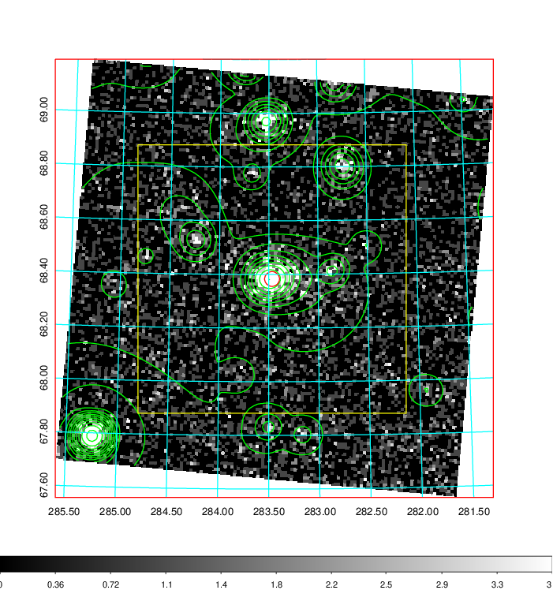  | 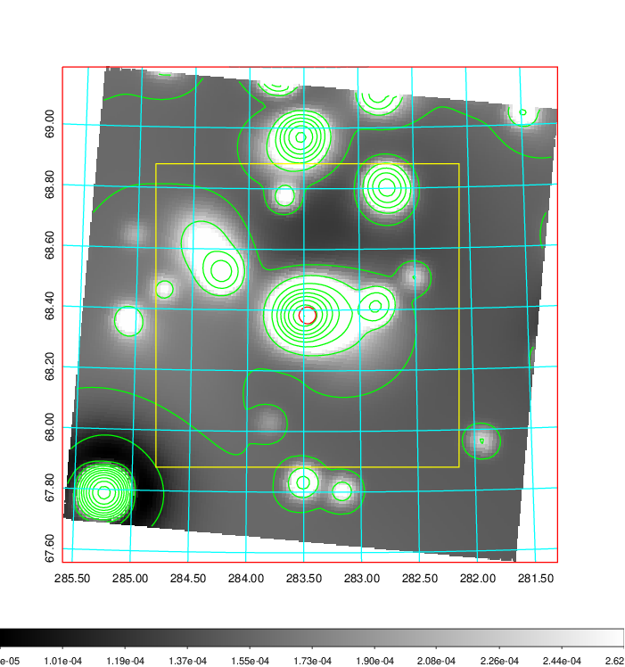   | 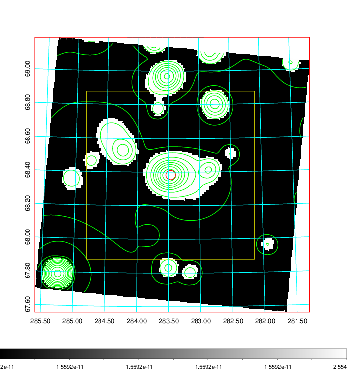  |

|[Exposure image](../image/797/797_mex.pdf)| [nH image](../image/797/797_nh.pdf)| [Planck image](../image/797/797_p.pdf)|
|-------------------|--------------------|-------------------|
|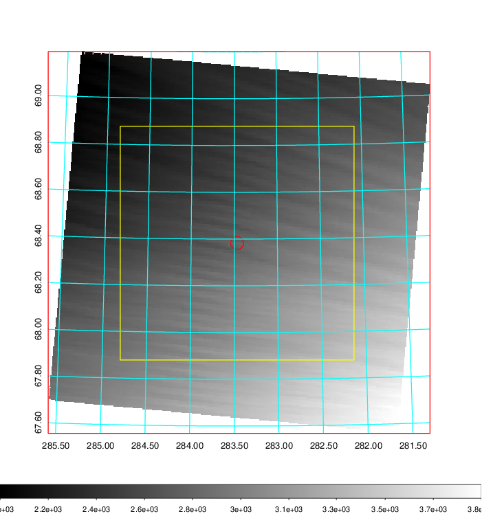   | 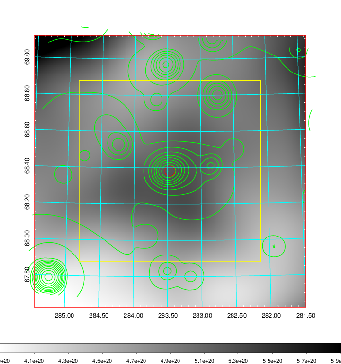    | 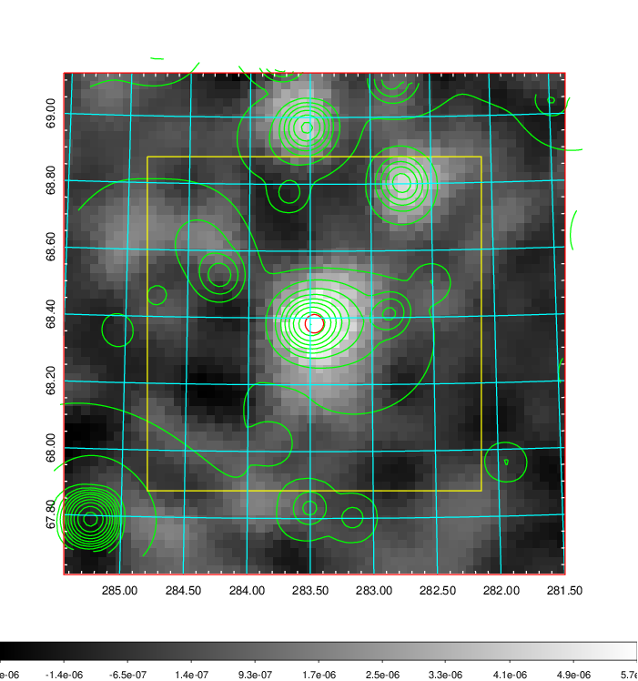 |

|[Redshift Histogram](../image/797/797_zg.pdf) | [DSS image(z1)](../image/797/797_dss_z1.pdf)      |  [DSS image(z2)](../image/797/797_dss_z2.pdf)    |
|-------------------|--------------------|-------------------|
|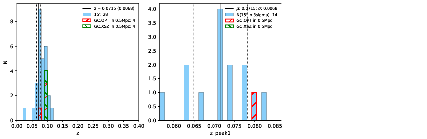 |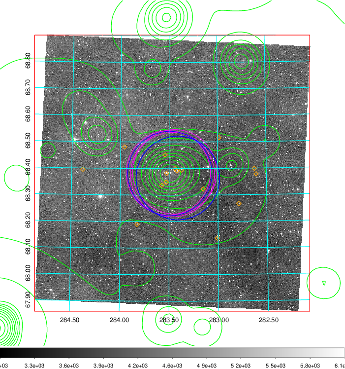  Blue circle for optical clusters;  Magenta circle for XSZ clusters;  all with r=1Mpc;  Only GC with Delta_z<0.01 are shown. | 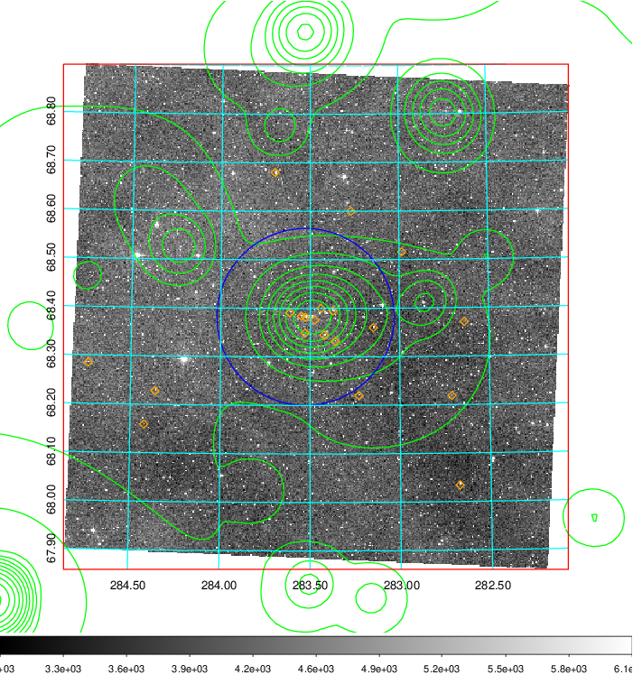 Blue circle for optical clusters;  Magenta circle for XSZ clusters;  all with r=1Mpc;  Only GC with Delta_z<0.01 are shown.  |

|[Previous-identified clusters](../image/797/797_gc.pdf) | [2MASS image](../image/797/797_2mass.pdf)      |
|-------------------|-------------------|
|  Green, magenta, and blue circles  for optical, X-ray and SZ clusters  respectively, with redshift of clusters  labelled. The radius of circles  are 1Mpc.|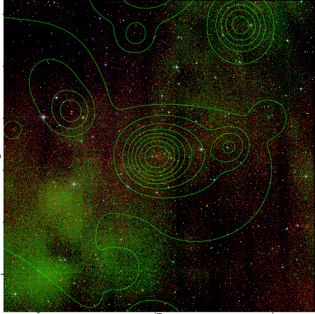  |

|[PS1 image](../image/797/797_ps1.pdf)            |
|-------------------|
| 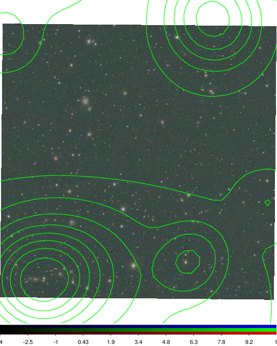  |
