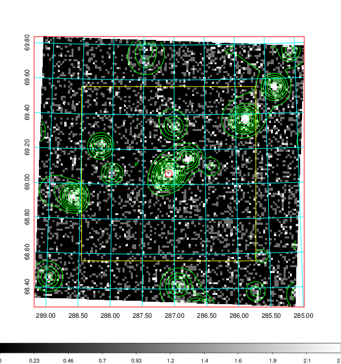
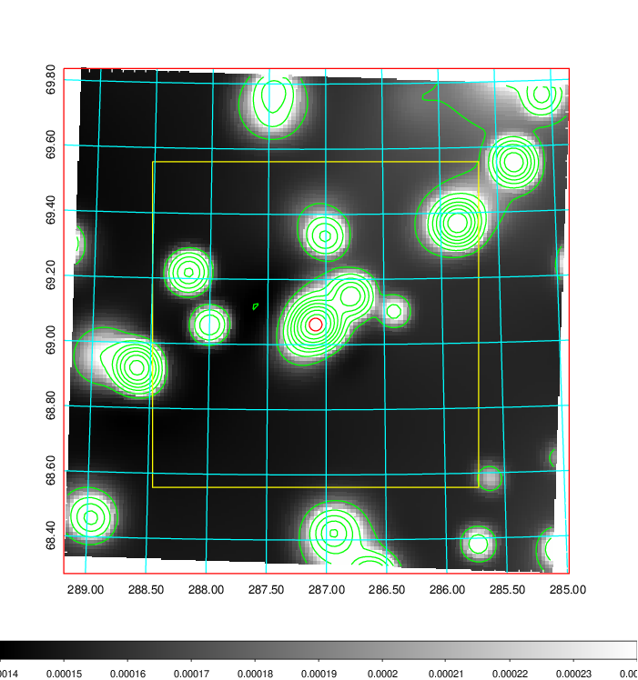
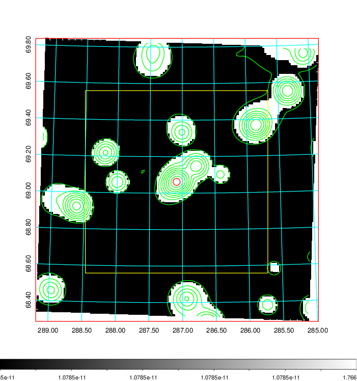
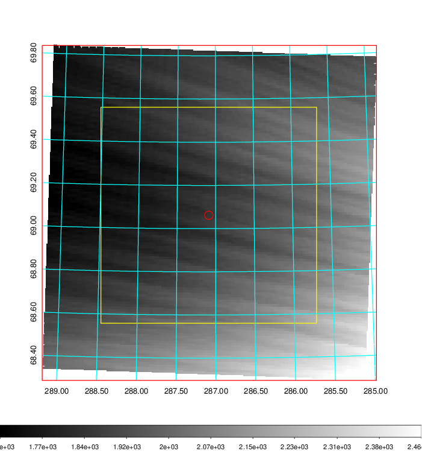
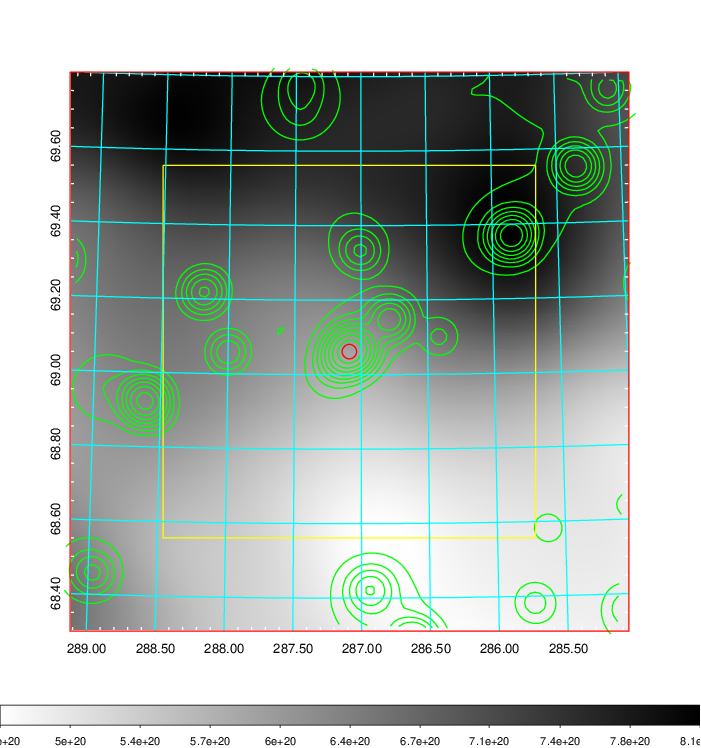
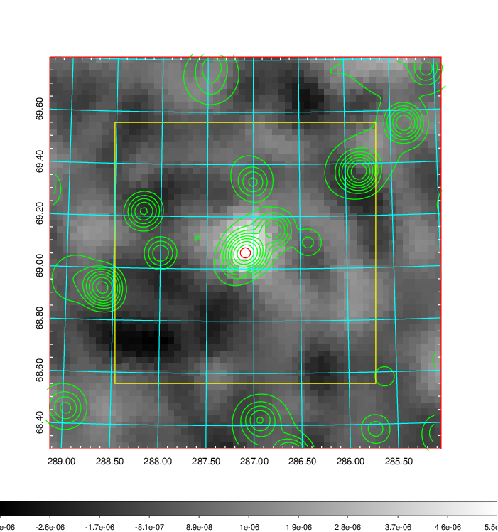
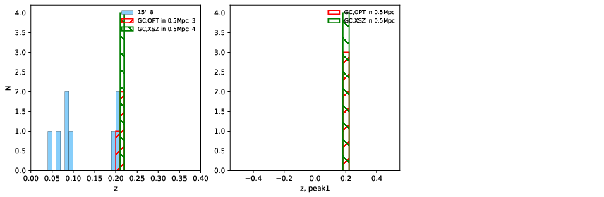
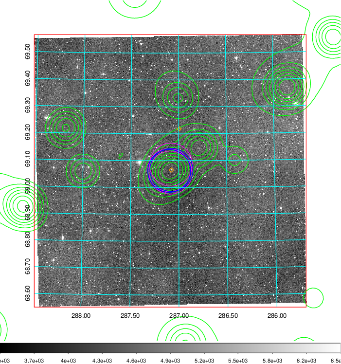
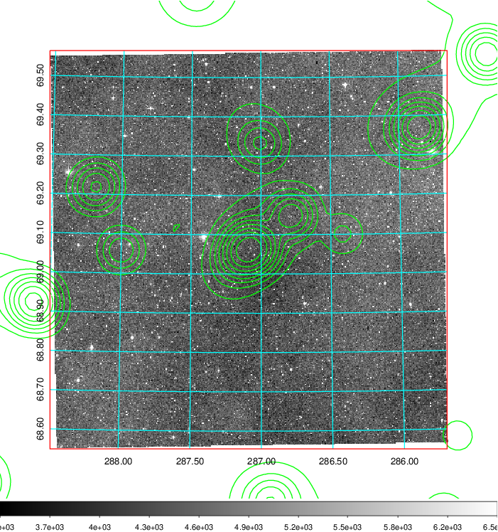
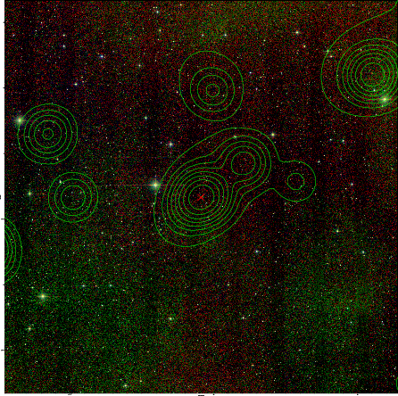

### 799

|Name|RAJ2000[deg]|DEJ2000[deg] |Ext[arcmin]| Ext,ml | z | z_src| C|GC(XSZ,Delta_z<0.01)| GC(OPT,Delta_z<0.01)|GC| R_sig[arcmin] | R500[arcmin] | R500[Mpc]| CRsig[c/s] | CR500[c/s] |L500[1E44 erg/s]|F500[1E-12 erg/s/cm^2]| M500[1E14 Msun]|Tx[keV]|Cnt_sig|Beta|Rc[arcmin]|Comment|Alias|
|---|---|---|---|---|---|------|---|--------|---------|----------|---|---|---|---|---|---|---|---|---|---|---|---|---|---|
|799| 287.089| 69.062| 1.17| 42.98| 0.2103(0.000)| z_xsz| B| MCXC, PSZ2, Tar, XCS| A, W| A, MCXC, PSZ2, Tar, W, XCS| 24.206| 5.261| 1.083| 0.138(0.027)| 0.123(0.024)| 2.916(0.340)| 2.268(0.264)| 4.46(0.25)| 5.76(0.20)| 360.6| 0.580(-0.032+0.041)| 1.615(-0.333+0.381)| -| k056|

|[RASS image](../image/799/799_img.pdf)|[filtered image](../image/799/799_fil.pdf)|[Segment image](../image/799/799_seg.pdf)|
|-------------------|--------------------|-------------------|
|   |    |   |

|[Exposure image](../image/799/799_mex.pdf)| [nH image](../image/799/799_nh.pdf)| [Planck image](../image/799/799_p.pdf)|
|-------------------|--------------------|-------------------|
|   |     |  |

|[Redshift Histogram](../image/799/799_zg.pdf) | [DSS image(z1)](../image/799/799_dss_z1.pdf)      |  [DSS image(z2)](../image/799/799_dss_z2.pdf)    |
|-------------------|--------------------|-------------------|
| |  Blue circle for optical clusters;  Magenta circle for XSZ clusters;  all with r=1Mpc;  Only GC with Delta_z<0.01 are shown. |  Blue circle for optical clusters;  Magenta circle for XSZ clusters;  all with r=1Mpc;  Only GC with Delta_z<0.01 are shown.  |

|[known Abell/XSZ clusters](../image/799/799_gc.pdf) | [2MASS image](../image/799/799_2mass.pdf)      |
|-------------------|-------------------|
|  Magenta, blue and green circles  for optical, X-ray and SZ clusters  respectively, with redshift of clusters  labelled. The radius of circles  are 1Mpc.|  |

|[PS1 image](../image/799/799_ps1.pdf)            |
|-------------------|
|   |
