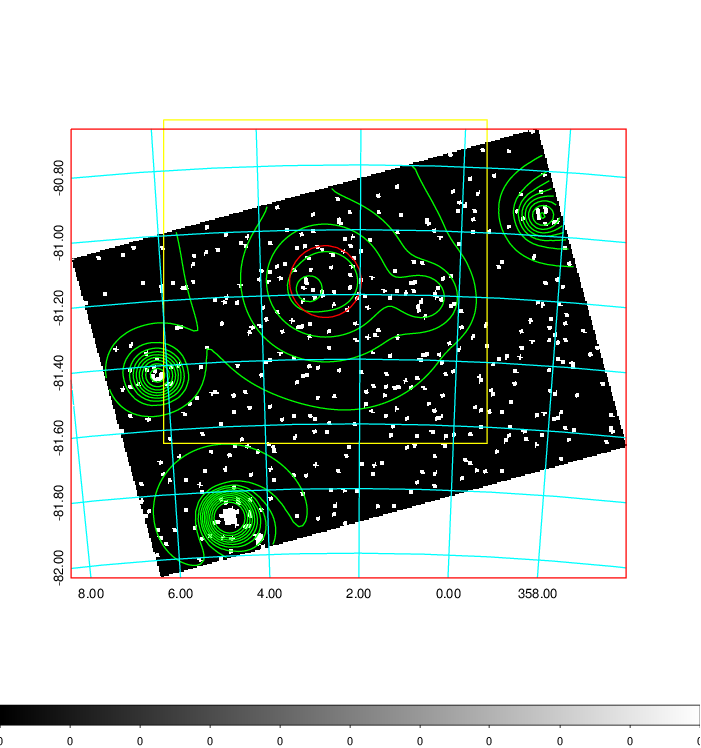
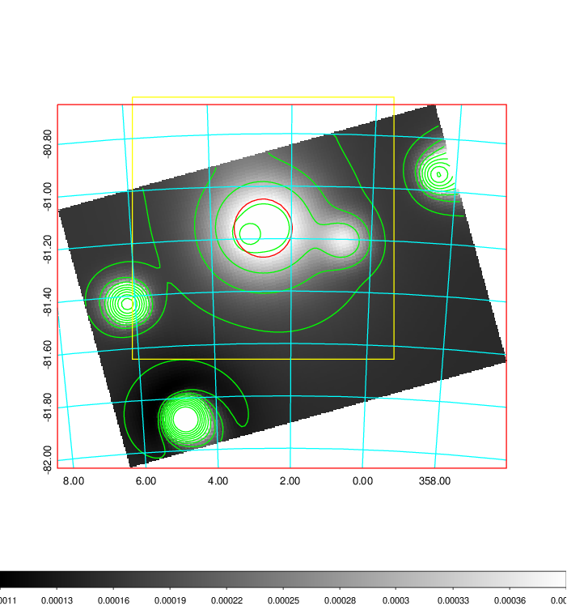
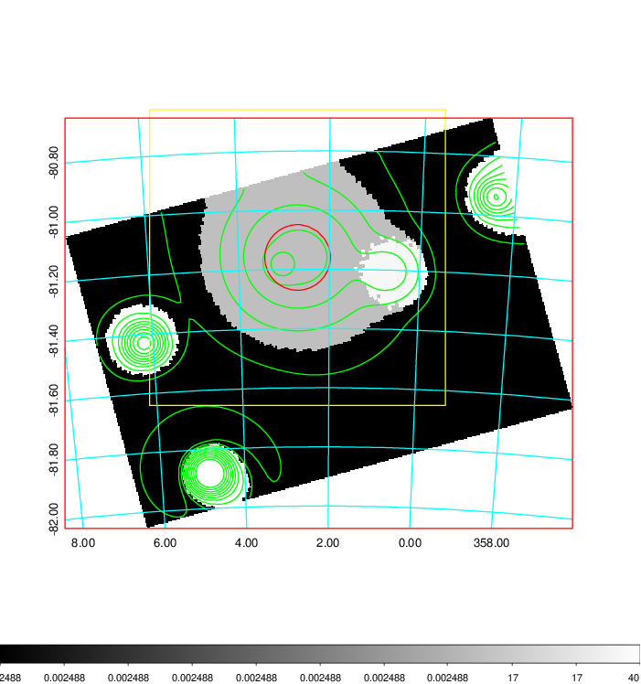
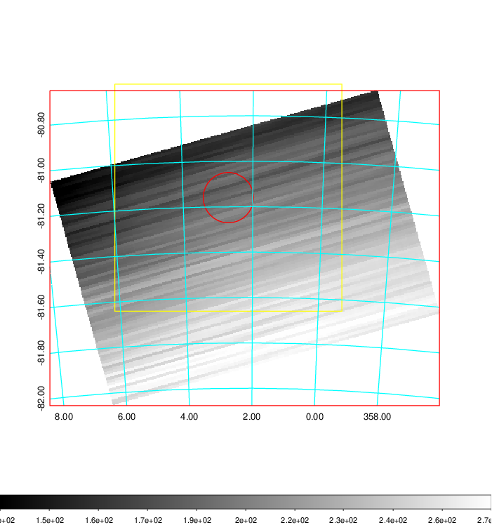
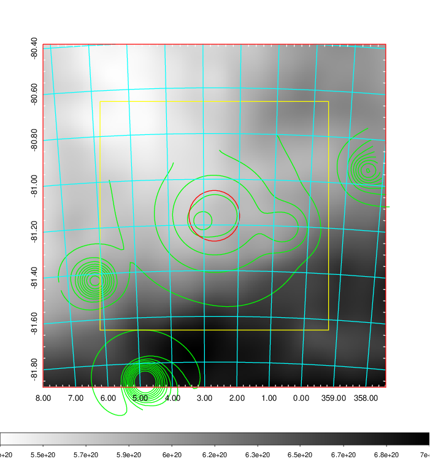
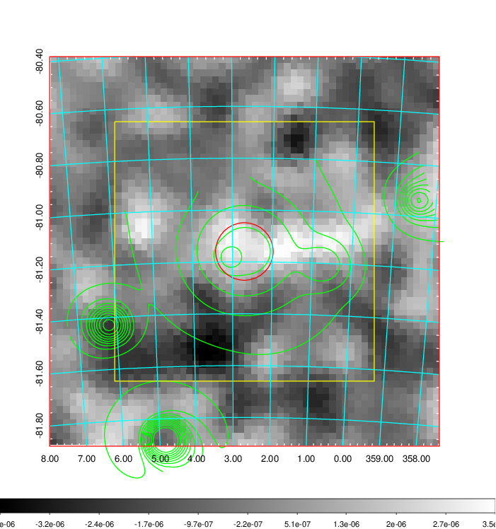
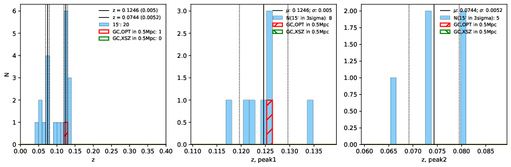
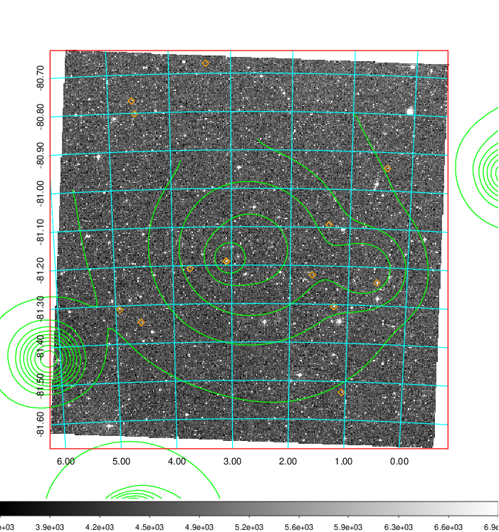
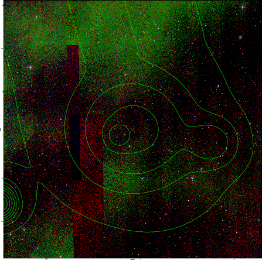

### 8

|Name|RAJ2000[deg]|DEJ2000[deg] |Ext[arcmin]| Ext,ml | z | z_src| C|GC(XSZ,Delta_z<0.01)| GC(OPT,Delta_z<0.01)|GC| R_sig[arcmin] | R500[arcmin] | R500[Mpc]| CRsig[c/s] | CR500[c/s] |L500[1E44 erg/s]|F500[1E-12 erg/s/cm^2]| M500[1E14 Msun]|Tx[keV]|Cnt_sig|Beta|Rc[arcmin]|Comment|Alias|
|---|---|---|---|---|---|------|---|--------|---------|----------|---|---|---|---|---|---|---|---|---|---|---|---|---|---|
|8| 2.700| -81.160| 6.66| 26.49| 0.1246(0.005)| z1, z_opt| S| -| W| W| 21.738| 7.675| 1.029| 0.268(0.072)| 0.242(0.065)| 1.794(0.413)| 4.413(1.016)| 3.50(0.39)| 4.82(0.35)| 41.6| 0.880(-0.128+0.085)| 11.549(-1.986+1.474)| -| t331|

|[RASS image](../image/8/8_img.pdf)|[filtered image](../image/8/8_fil.pdf)|[Segment image](../image/8/8_seg.pdf)|
|-------------------|--------------------|-------------------|
|   |    |   |

|[Exposure image](../image/8/8_mex.pdf)| [nH image](../image/8/8_nh.pdf)| [Planck image](../image/8/8_p.pdf)|
|-------------------|--------------------|-------------------|
|   |     |  |

|[Redshift Histogram](../image/8/8_zg.pdf) | [DSS image(z1)](../image/8/8_dss_z1.pdf)      |  [DSS image(z2)](../image/8/8_dss_z2.pdf)    |
|-------------------|--------------------|-------------------|
| |  Blue circle for optical clusters;  Magenta circle for XSZ clusters;  all with r=1Mpc;  Only GC with Delta_z<0.01 are shown. |  Blue circle for optical clusters;  Magenta circle for XSZ clusters;  all with r=1Mpc;  Only GC with Delta_z<0.01 are shown.  |

|[known Abell/XSZ clusters](../image/8/8_m.pdf) | [2MASS image](../image/8/8_2mass.pdf)      |
|-------------------|-------------------|
|  Blue and magenta circles for optical and  XSZ clusters, respectively with name and  redshift of clusters labelled. The  radius of circles are 1Mpc. Circles with  solid line for clusters with  Delta_z<0.01, and those with dashed  line for other XSZ/Abell clusters.        |  |

|[Galaxies with z](../image/8/8_opt_ned.pdf) |[Galaxies with z](../image/8/8_opt_ned_zoom.pdf) |
|-------------------|-------------------|
|    For candidates with X-ray or SZ clusters within 10':   - cyan for z<z_gc,xsz-0.01,   - green for z=z_gc,x-0.01~ z_gc,x+0.01,   - yellow for z=z_gc,sz-0.01~ z_gc,sz+0.01,   - white for z between z_gc,x and z_gc,sz, and Delta_z > 0.01,   - magenta for other galaxies;  For candiates with no XSZ clusters in 10':   - cyan for z=0-0.06,   - green for z=0.06-0.12,   - yellow for z=0.12-0.18,   - white for z=0.18-0.24,   - magenta for z=0.24-0.3,   - red for z>0.3 ;  |    Zoom-in image of the left image|

|[known clusters](../image/8/8_gc.pdf) |[known Abell/XSZ clusters](../image/8/8_gc_large.pdf) |
|-------------------|-------------------|
|    The size of circles only used to avoid the overlap. Red for X-ray clusters,   blue for SZ clusters,   green for Abell clusters,   cyan for optical clusters with z_photo,   magenta for optical clusters with z_spec. Coral cross for 1RXS and FCS, lightblue cross for 2RXS. |   Zoom out of the left plot,   and only XSZ, Abell, Zwicky clusters are shown.  |

