

### 80

|Name|RAJ2000[deg]|DEJ2000[deg] |Ext[arcmin]| Ext,ml | z | z_src| C|GC(XSZ,Delta_z<0.01)| GC(OPT,Delta_z<0.01)|GC| R_sig[arcmin] | R500[arcmin] | R500[Mpc]| CRsig[c/s] | CR500[c/s] |L500[1E44 erg/s]|F500[1E-12 erg/s/cm^2]| M500[1E14 Msun]|Tx[keV]|Cnt_sig|Beta|Rc[arcmin]|Comment|Alias|
|---|---|---|---|---|---|------|---|--------|---------|----------|---|---|---|---|---|---|---|---|---|---|---|---|---|---|
|80| 25.064| -29.404| 26.90| 42.82| 0.0650(0.005)| z1, z_opt| S| -| N| N| 41.590| 10.963| 0.821| 0.344(0.074)| 0.307(0.066)| 0.603(0.452)| 5.906(4.431)| 1.68(0.64)| 3.00(0.72)| 282.9| 0.554(-0.042+0.113)| 18.973(-2.763+5.435)| -| t627|

|[RASS image](../image/80/80_img.pdf)|[filtered image](../image/80/80_fil.pdf)|[Segment image](../image/80/80_seg.pdf)|
|-------------------|--------------------|-------------------|
| 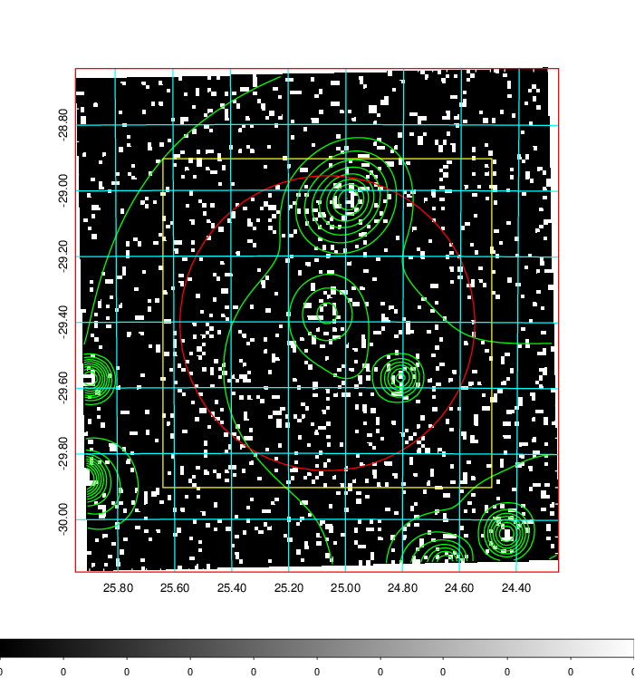  | 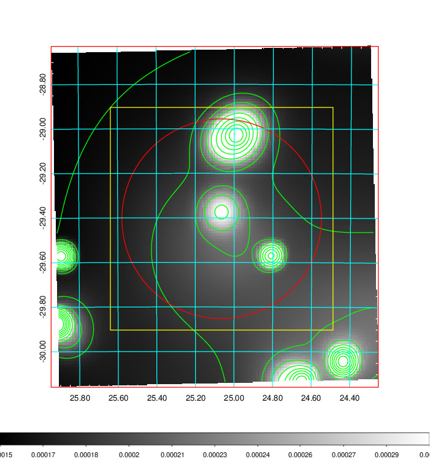   | 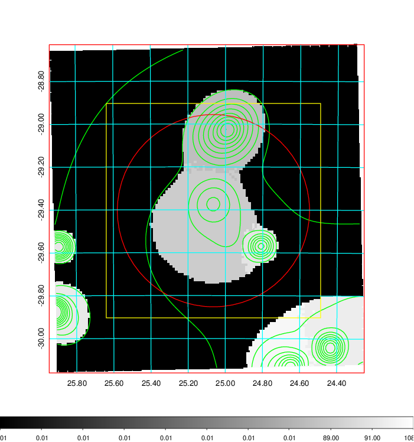  |

|[Exposure image](../image/80/80_mex.pdf)| [nH image](../image/80/80_nh.pdf)| [Planck image](../image/80/80_p.pdf)|
|-------------------|--------------------|-------------------|
|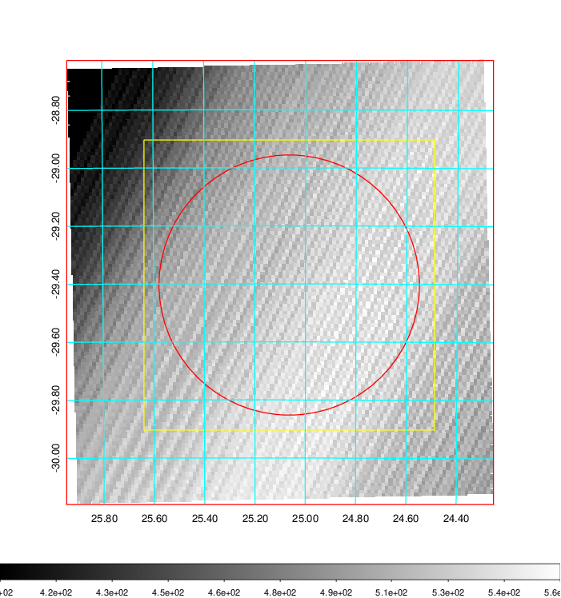   | 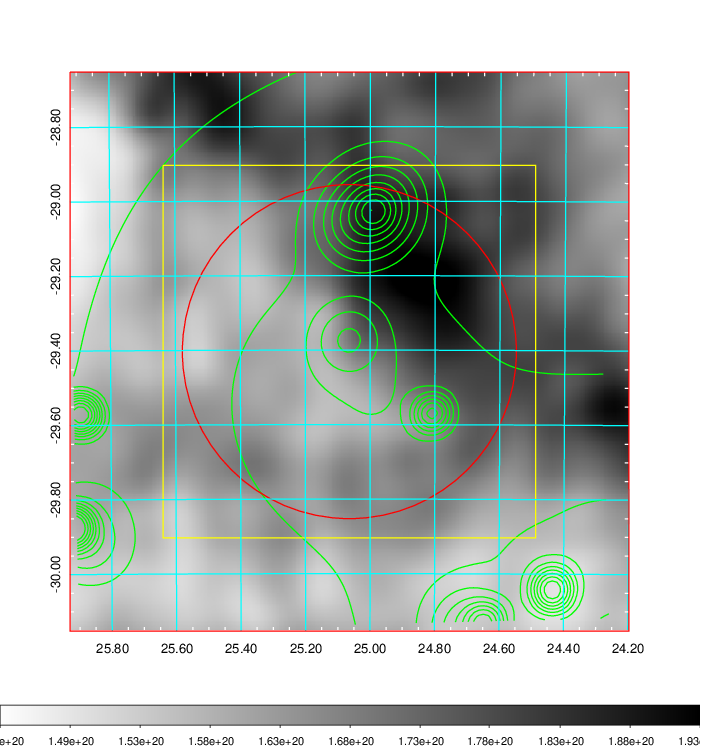    | 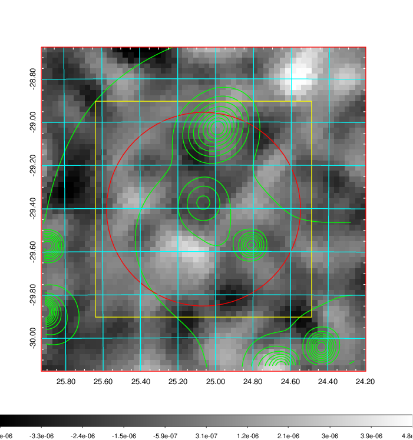 |

|[Redshift Histogram](../image/80/80_zg.pdf) | [DSS image(z1)](../image/80/80_dss_z1.pdf)      |  [DSS image(z2)](../image/80/80_dss_z2.pdf)    |
|-------------------|--------------------|-------------------|
|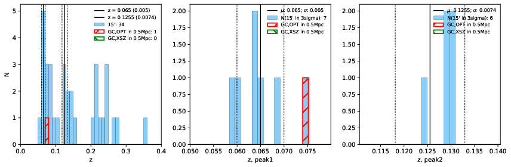 |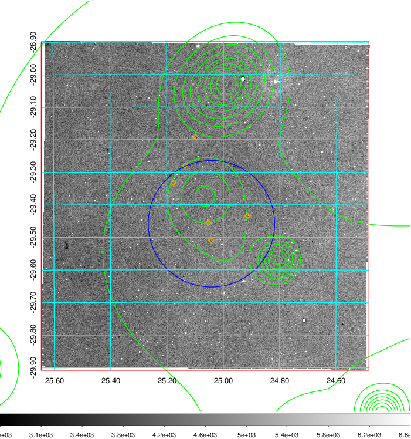  Blue circle for optical clusters;  Magenta circle for XSZ clusters;  all with r=1Mpc;  Only GC with Delta_z<0.01 are shown. | 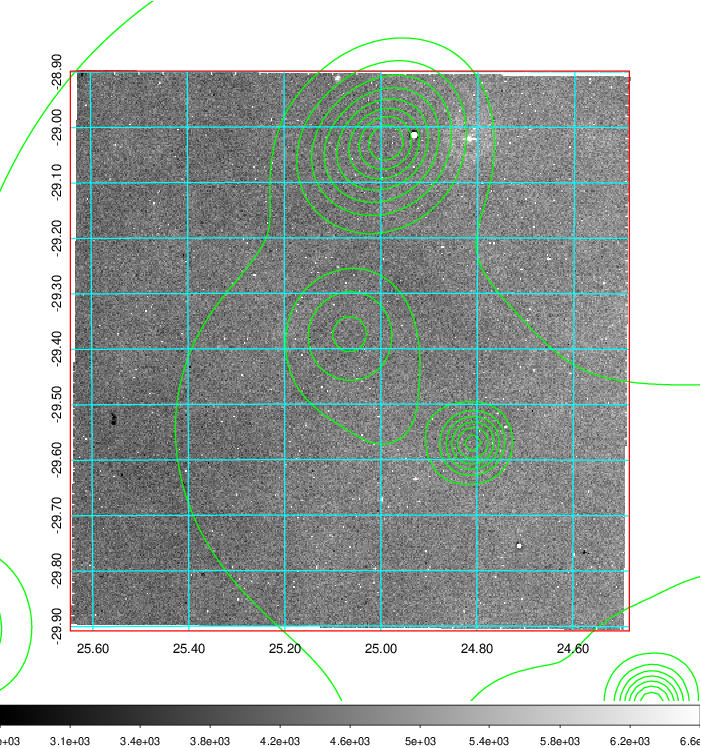 Blue circle for optical clusters;  Magenta circle for XSZ clusters;  all with r=1Mpc;  Only GC with Delta_z<0.01 are shown.  |

|[Previous-identified clusters](../image/80/80_gc.pdf) | [2MASS image](../image/80/80_2mass.pdf)      |
|-------------------|-------------------|
|  Green, magenta, and blue circles  for optical, X-ray and SZ clusters  respectively, with redshift of clusters  labelled. The radius of circles  are 1Mpc.|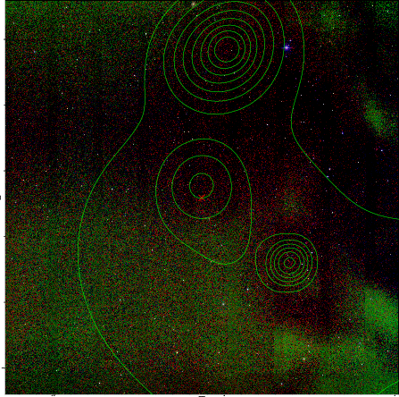  |

|[DES image](../image/80/80_des.pdf)   |[ATLAS image](../image/80/80_s.pdf)        |
|-------------------|-------------------|
| 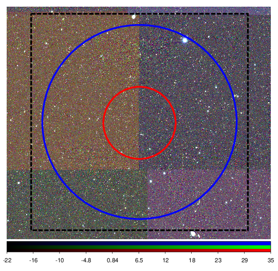  | 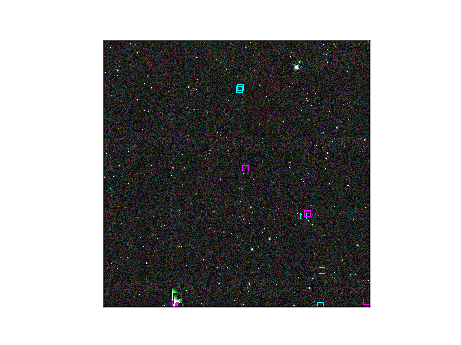  |
