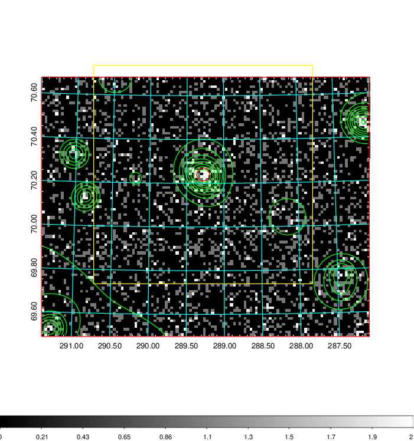
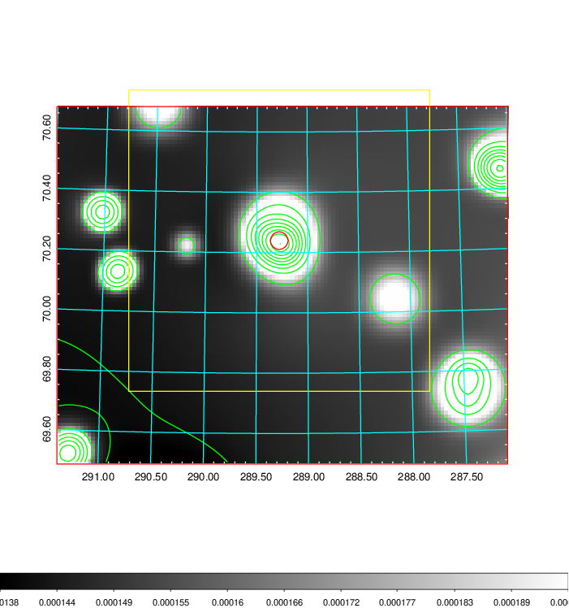
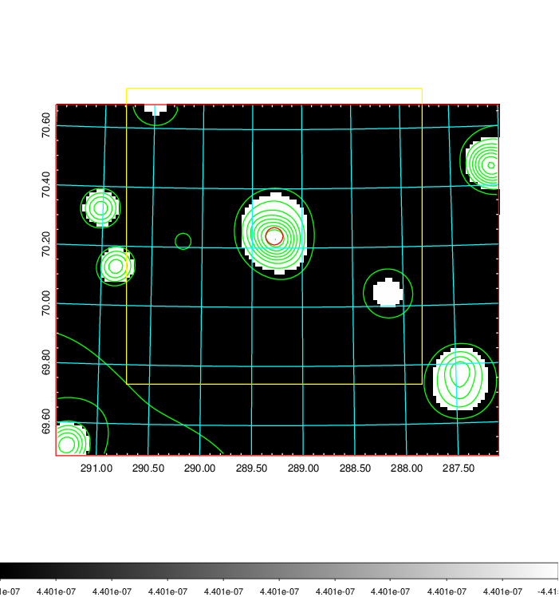
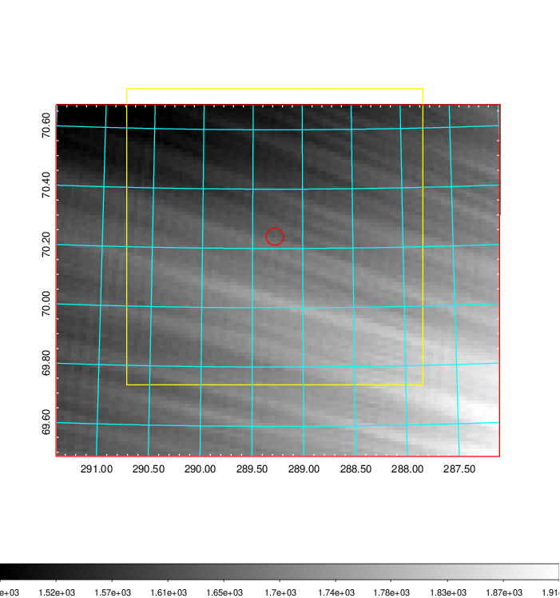
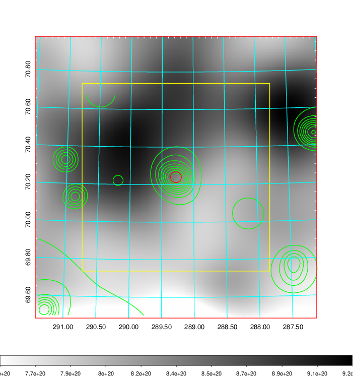
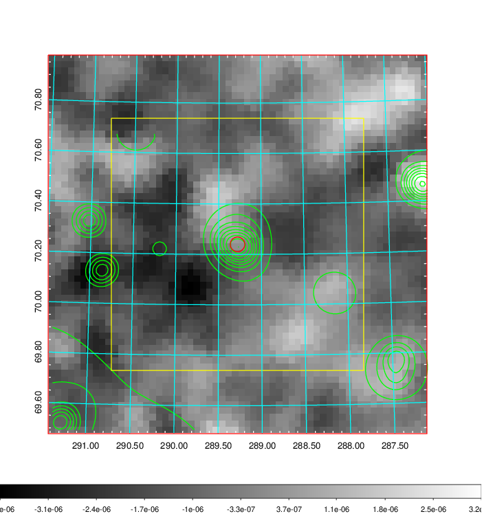
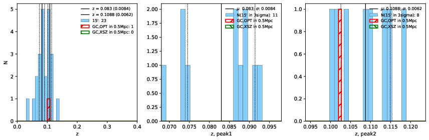
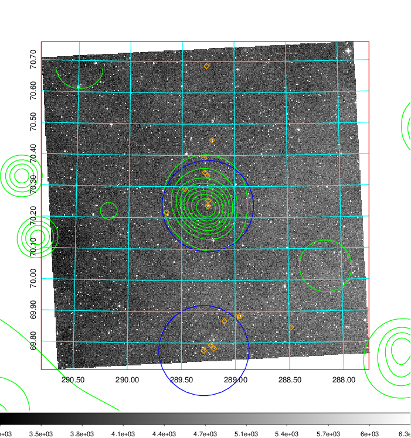
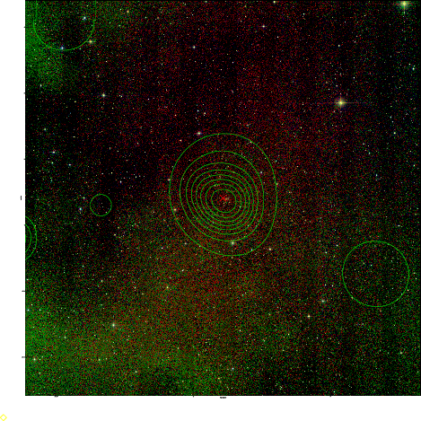
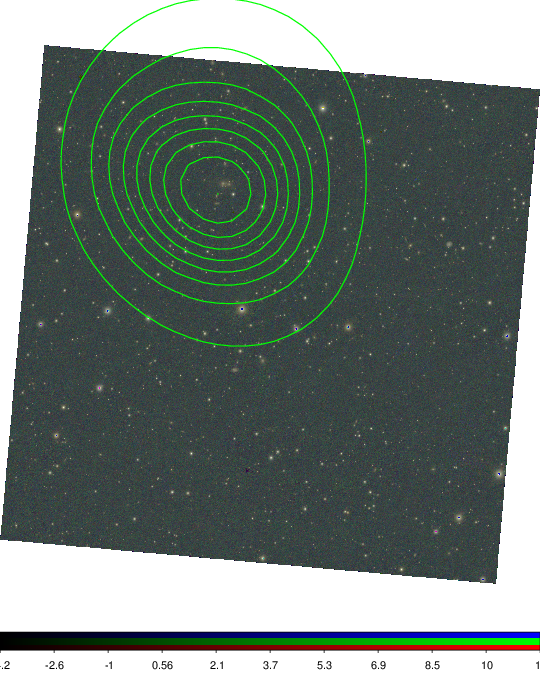

### 801

|Name|RAJ2000[deg]|DEJ2000[deg] |Ext[arcmin]| Ext,ml | z | z_src| C|GC(XSZ,Delta_z<0.01)| GC(OPT,Delta_z<0.01)|GC| R_sig[arcmin] | R500[arcmin] | R500[Mpc]| CRsig[c/s] | CR500[c/s] |L500[1E44 erg/s]|F500[1E-12 erg/s/cm^2]| M500[1E14 Msun]|Tx[keV]|Cnt_sig|Beta|Rc[arcmin]|Comment|Alias|
|---|---|---|---|---|---|------|---|--------|---------|----------|---|---|---|---|---|---|---|---|---|---|---|---|---|---|
|801| 289.279| 70.240| 1.74| 31.28| 0.1088(0.006)| z2, z_opt| S| -| W| W| 7.825| 6.323| 0.754| 0.068(0.015)| 0.065(0.014)| 0.336(0.038)| 1.108(0.124)| 1.35(0.08)| 2.67(0.10)| 120.7| 0.860(-0.131+0.098)| 3.567(-0.791+0.585)| -| t043|

|[RASS image](../image/801/801_img.pdf)|[filtered image](../image/801/801_fil.pdf)|[Segment image](../image/801/801_seg.pdf)|
|-------------------|--------------------|-------------------|
|   |    |   |

|[Exposure image](../image/801/801_mex.pdf)| [nH image](../image/801/801_nh.pdf)| [Planck image](../image/801/801_p.pdf)|
|-------------------|--------------------|-------------------|
|   |     |  |

|[Redshift Histogram](../image/801/801_zg.pdf) | [DSS image(z1)](../image/801/801_dss_z1.pdf)      |  [DSS image(z2)](../image/801/801_dss_z2.pdf)    |
|-------------------|--------------------|-------------------|
| |  Blue circle for optical clusters;  Magenta circle for XSZ clusters;  all with r=1Mpc;  Only GC with Delta_z<0.01 are shown. |  Blue circle for optical clusters;  Magenta circle for XSZ clusters;  all with r=1Mpc;  Only GC with Delta_z<0.01 are shown.  |

|[Previous-identified clusters](../image/801/801_gc.pdf) | [2MASS image](../image/801/801_2mass.pdf)      |
|-------------------|-------------------|
|  Green, magenta, and blue circles  for optical, X-ray and SZ clusters  respectively, with redshift of clusters  labelled. The radius of circles  are 1Mpc.|  |

|[PS1 image](../image/801/801_ps1.pdf)            |
|-------------------|
|   |
