

### 802

|Name|RAJ2000[deg]|DEJ2000[deg] |Ext[arcmin]| Ext,ml | z | z_src| C|GC(XSZ,Delta_z<0.01)| GC(OPT,Delta_z<0.01)|GC| R_sig[arcmin] | R500[arcmin] | R500[Mpc]| CRsig[c/s] | CR500[c/s] |L500[1E44 erg/s]|F500[1E-12 erg/s/cm^2]| M500[1E14 Msun]|Tx[keV]|Cnt_sig|Beta|Rc[arcmin]|Comment|Alias|
|---|---|---|---|---|---|------|---|--------|---------|----------|---|---|---|---|---|---|---|---|---|---|---|---|---|---|
|802| 290.035| 63.281| 3.66| 97.32| 0.0752(0.007)| z1, z_opt| S| -| W| N, W| 28.156| 8.985| 0.769| 0.174(0.028)| 0.157(0.025)| 0.378(0.052)| 2.725(0.373)| 1.39(0.10)| 2.69(0.12)| 434.2| 0.525(-0.017+0.026)| 3.266(-0.339+0.459)| -| t171|

|[RASS image](../image/802/802_img.pdf)|[filtered image](../image/802/802_fil.pdf)|[Segment image](../image/802/802_seg.pdf)|
|-------------------|--------------------|-------------------|
| 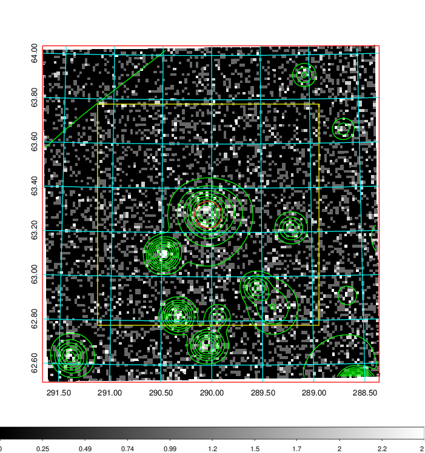  | 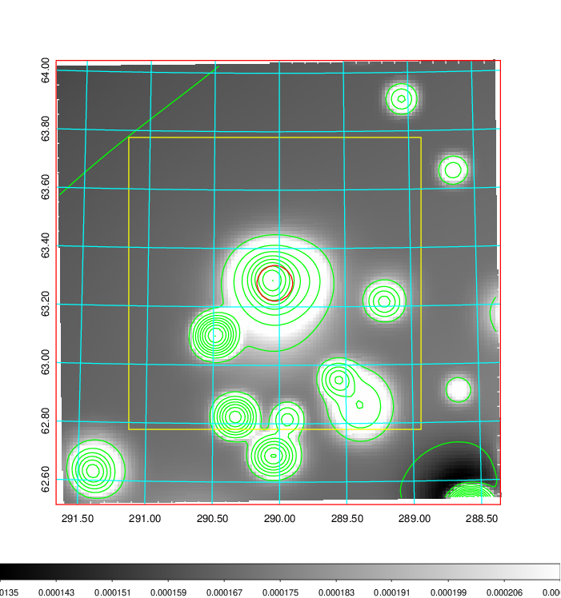   | 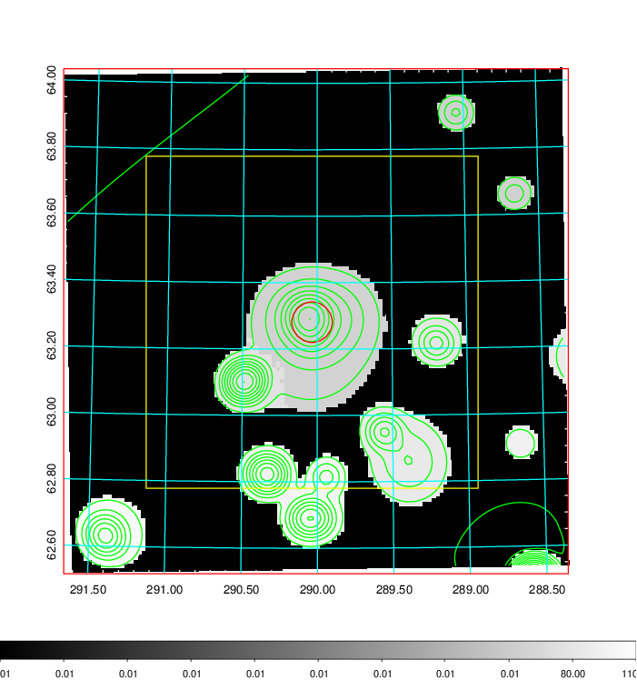  |

|[Exposure image](../image/802/802_mex.pdf)| [nH image](../image/802/802_nh.pdf)| [Planck image](../image/802/802_p.pdf)|
|-------------------|--------------------|-------------------|
|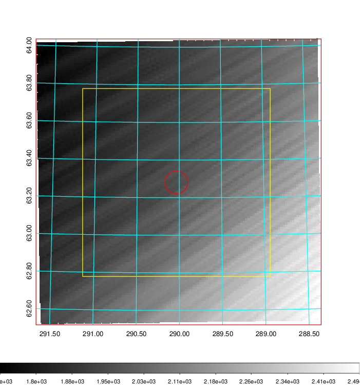   | 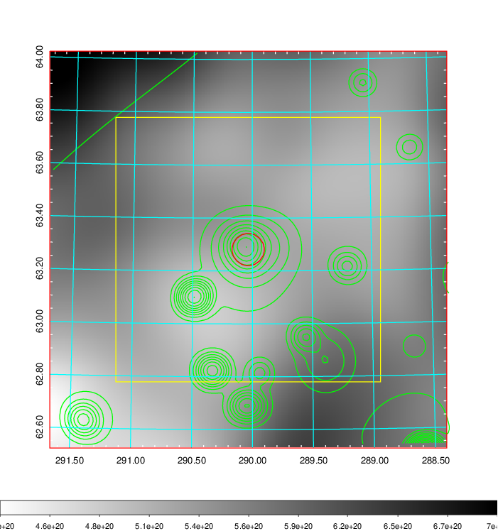    | 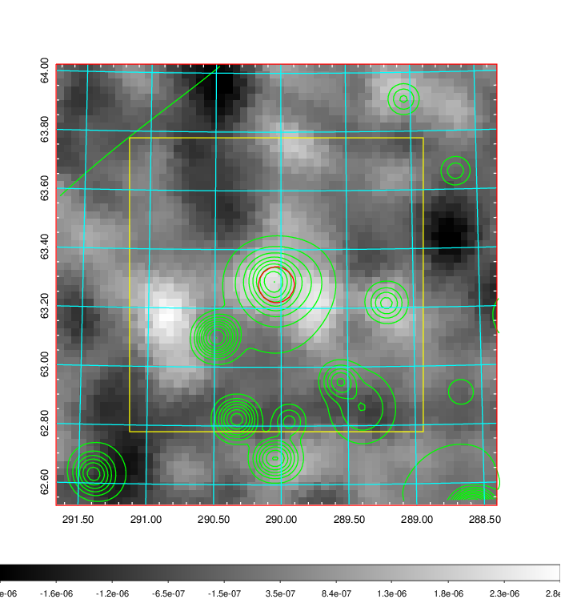 |

|[Redshift Histogram](../image/802/802_zg.pdf) | [DSS image(z1)](../image/802/802_dss_z1.pdf)      |  [DSS image(z2)](../image/802/802_dss_z2.pdf)    |
|-------------------|--------------------|-------------------|
|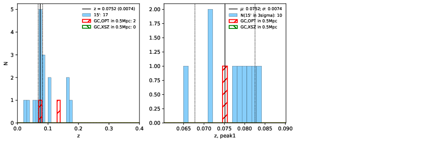 |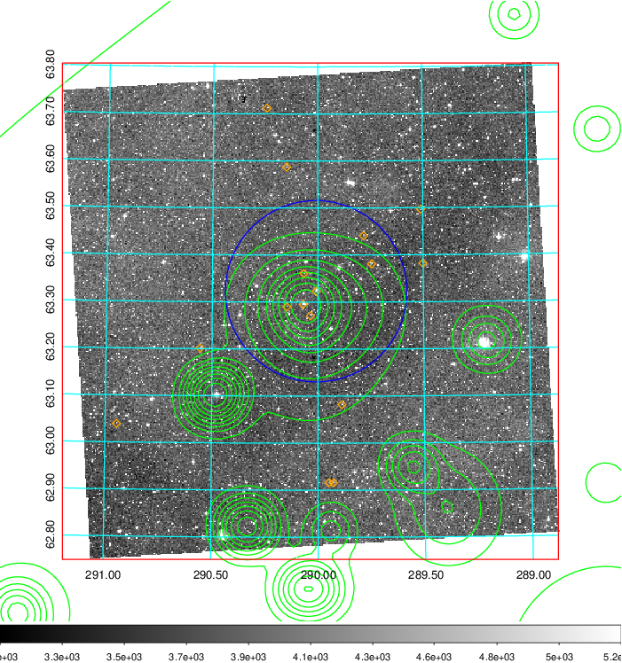  Blue circle for optical clusters;  Magenta circle for XSZ clusters;  all with r=1Mpc;  Only GC with Delta_z<0.01 are shown. | 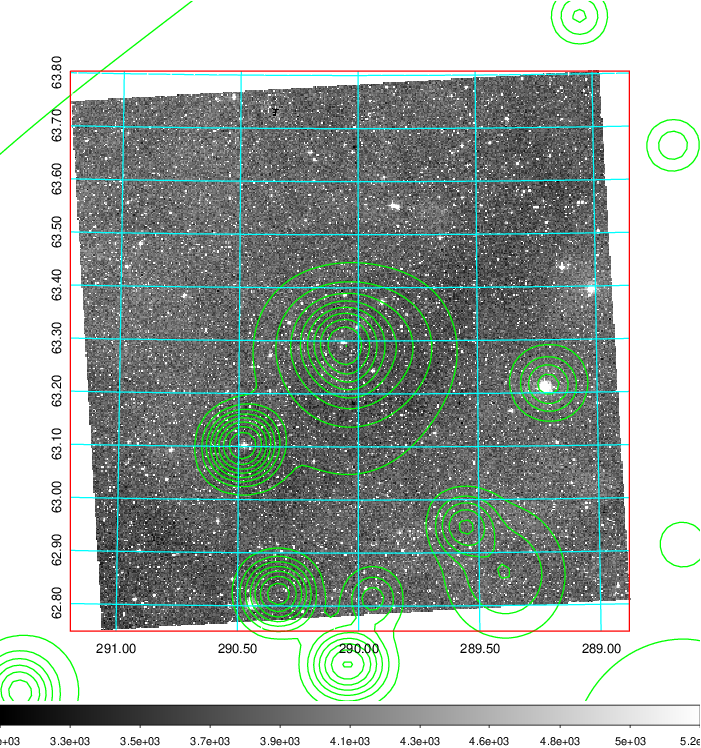 Blue circle for optical clusters;  Magenta circle for XSZ clusters;  all with r=1Mpc;  Only GC with Delta_z<0.01 are shown.  |

|[Previous-identified clusters](../image/802/802_gc.pdf) | [2MASS image](../image/802/802_2mass.pdf)      |[SDSS image](../image/802/802_sdss.pdf)   |
|-------------------|-------------------|-------------------|
|  Green, magenta, and blue circles  for optical, X-ray and SZ clusters  respectively, with redshift of clusters  labelled. The radius of circles  are 1Mpc.|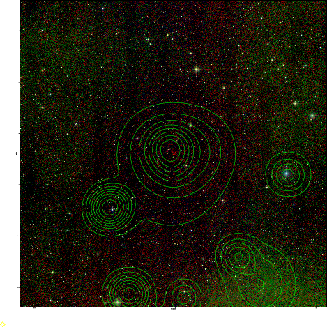  | 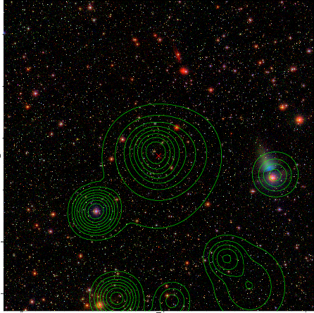  |

