

### 803

|Name|RAJ2000[deg]|DEJ2000[deg] |Ext[arcmin]| Ext,ml | z | z_src| C|GC(XSZ,Delta_z<0.01)| GC(OPT,Delta_z<0.01)|GC| R_sig[arcmin] | R500[arcmin] | R500[Mpc]| CRsig[c/s] | CR500[c/s] |L500[1E44 erg/s]|F500[1E-12 erg/s/cm^2]| M500[1E14 Msun]|Tx[keV]|Cnt_sig|Beta|Rc[arcmin]|Comment|Alias|
|---|---|---|---|---|---|------|---|--------|---------|----------|---|---|---|---|---|---|---|---|---|---|---|---|---|---|
|803| 290.289| 74.571| 1.81| 84.26| 0.1130(0.006)| z1, z_opt| S| -| W| PSZ2, Tar, W| 14.650| 6.912| 0.852| 0.127(0.016)| 0.117(0.015)| 0.678(0.050)| 2.060(0.153)| 1.96(0.07)| 3.36(0.08)| 215.2| 0.802(-0.107+0.118)| 3.776(-0.727+0.702)| An SZ cluster with no $z$ and offset = 0.17 Mpc, another SZ cluster with $z$ = 0.15 and offset = 0.26 Mpc| k173|

|[RASS image](../image/803/803_img.pdf)|[filtered image](../image/803/803_fil.pdf)|[Segment image](../image/803/803_seg.pdf)|
|-------------------|--------------------|-------------------|
| 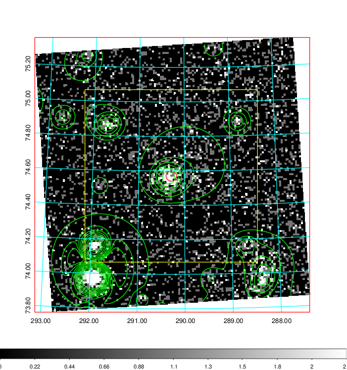  | 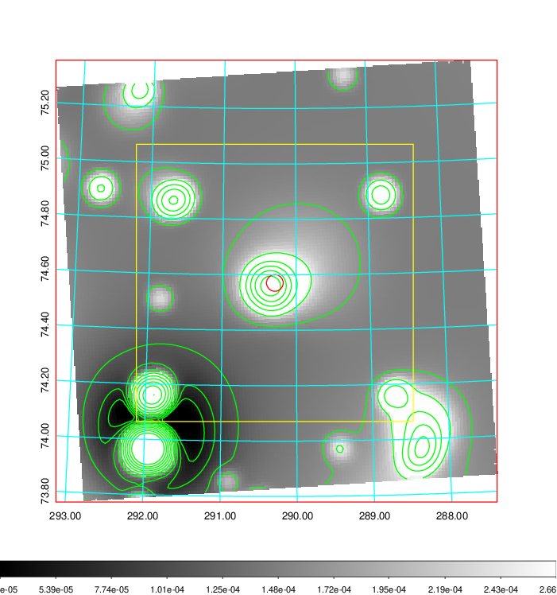   | 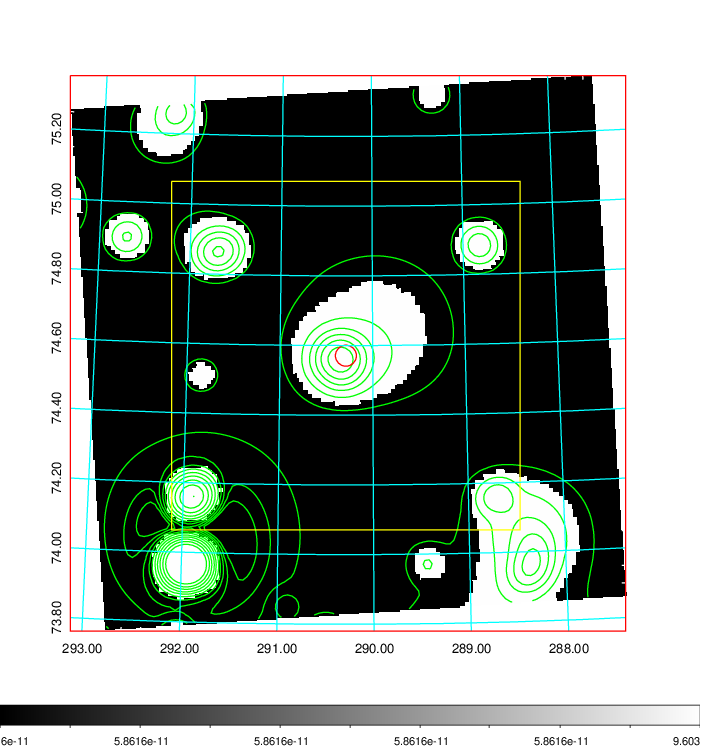  |

|[Exposure image](../image/803/803_mex.pdf)| [nH image](../image/803/803_nh.pdf)| [Planck image](../image/803/803_p.pdf)|
|-------------------|--------------------|-------------------|
|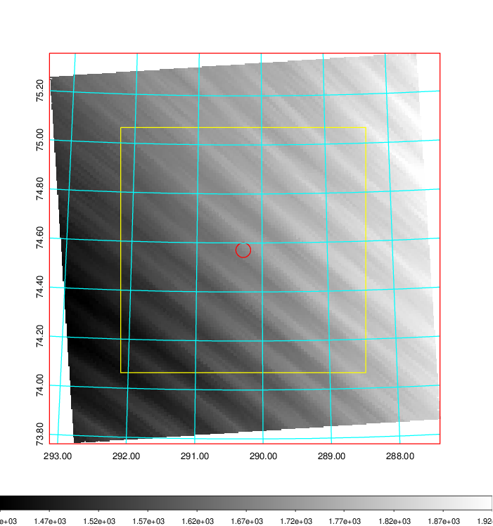   | 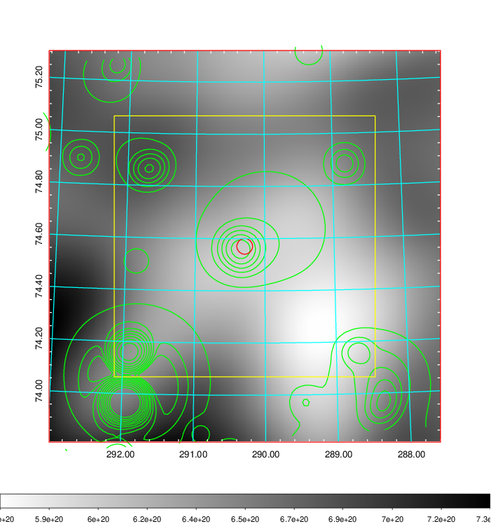    | 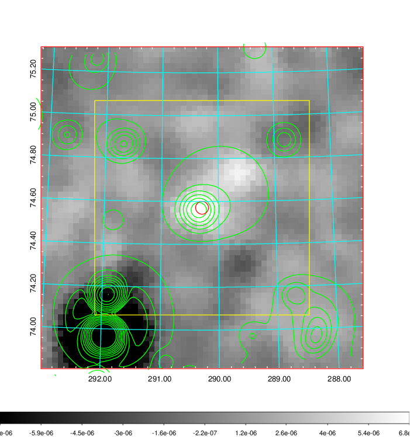 |

|[Redshift Histogram](../image/803/803_zg.pdf) | [DSS image(z1)](../image/803/803_dss_z1.pdf)      |  [DSS image(z2)](../image/803/803_dss_z2.pdf)    |
|-------------------|--------------------|-------------------|
|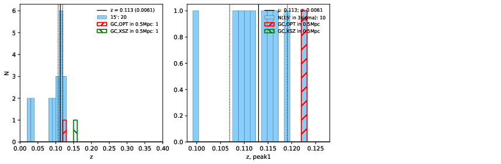 |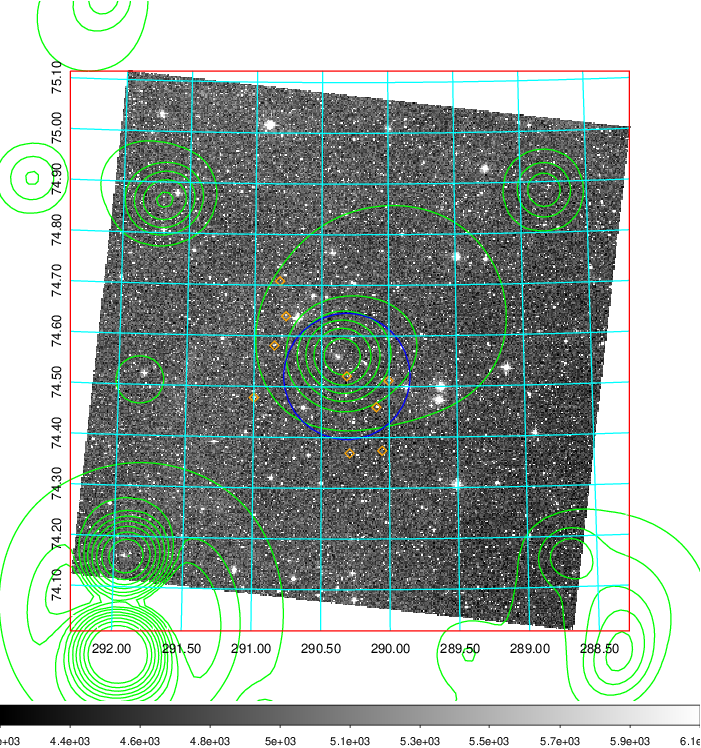  Blue circle for optical clusters;  Magenta circle for XSZ clusters;  all with r=1Mpc;  Only GC with Delta_z<0.01 are shown. | 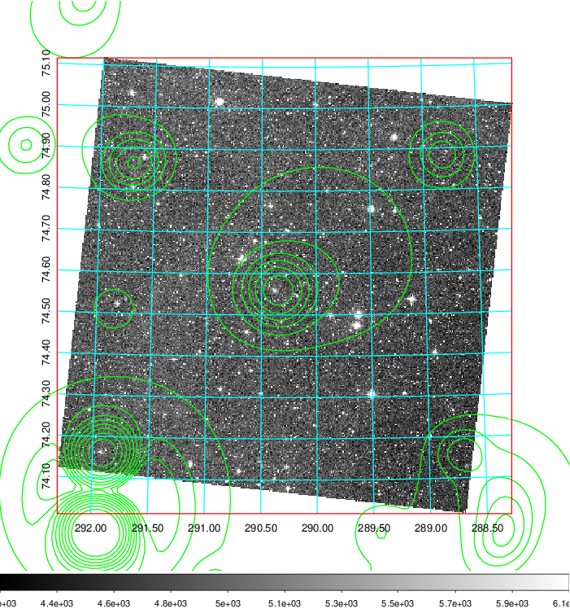 Blue circle for optical clusters;  Magenta circle for XSZ clusters;  all with r=1Mpc;  Only GC with Delta_z<0.01 are shown.  |

|[Previous-identified clusters](../image/803/803_gc.pdf) | [2MASS image](../image/803/803_2mass.pdf)      |
|-------------------|-------------------|
|  Green, magenta, and blue circles  for optical, X-ray and SZ clusters  respectively, with redshift of clusters  labelled. The radius of circles  are 1Mpc.|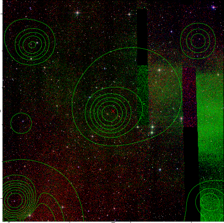  |

|[PS1 image](../image/803/803_ps1.pdf)            |
|-------------------|
| 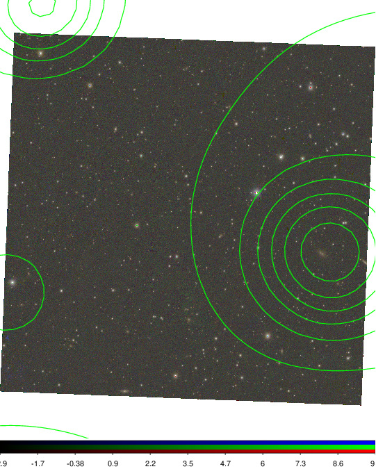  |
