

### 804

|Name|RAJ2000[deg]|DEJ2000[deg] |Ext[arcmin]| Ext,ml | z | z_src| C|GC(XSZ,Delta_z<0.01)| GC(OPT,Delta_z<0.01)|GC| R_sig[arcmin] | R500[arcmin] | R500[Mpc]| CRsig[c/s] | CR500[c/s] |L500[1E44 erg/s]|F500[1E-12 erg/s/cm^2]| M500[1E14 Msun]|Tx[keV]|Cnt_sig|Beta|Rc[arcmin]|Comment|Alias|
|---|---|---|---|---|---|------|---|--------|---------|----------|---|---|---|---|---|---|---|---|---|---|---|---|---|---|
|804| 291.136| 67.408| 2.72| 30.08| 0.0735(0.006)| z1, z_opt| S| -| W| W| 12.212| 6.044| 0.507| 0.024(0.013)| 0.023(0.012)| 0.042(0.012)| 0.316(0.092)| 0.40(0.06)| 1.24(0.12)| 70.6| 0.902(-0.117+0.070)| 4.308(-0.677+0.503)| -| t116|

|[RASS image](../image/804/804_img.pdf)|[filtered image](../image/804/804_fil.pdf)|[Segment image](../image/804/804_seg.pdf)|
|-------------------|--------------------|-------------------|
| 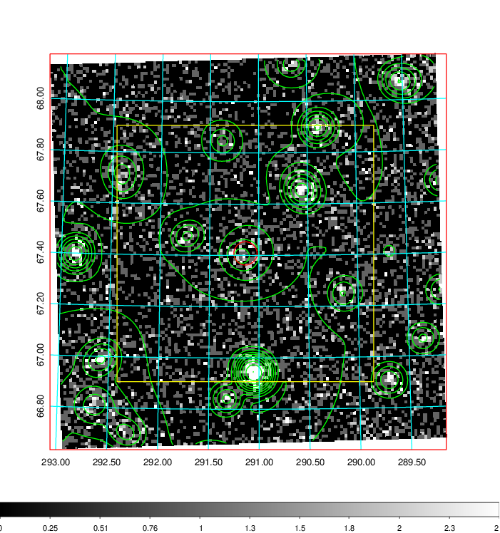  | 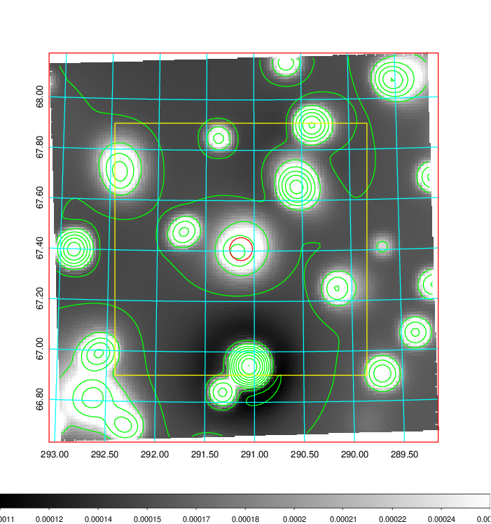   | 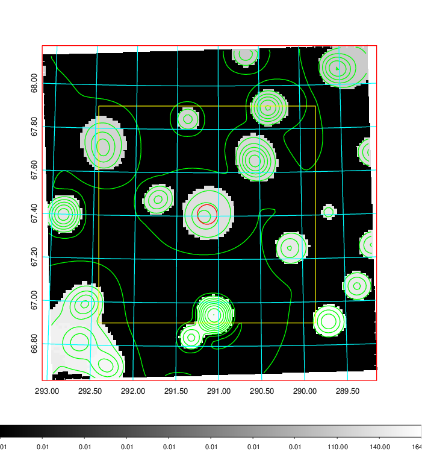  |

|[Exposure image](../image/804/804_mex.pdf)| [nH image](../image/804/804_nh.pdf)| [Planck image](../image/804/804_p.pdf)|
|-------------------|--------------------|-------------------|
|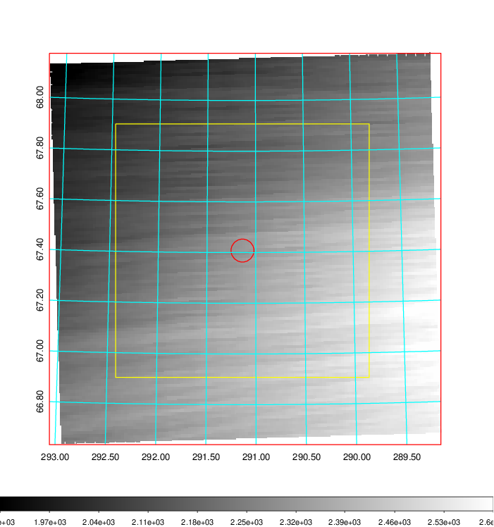   | 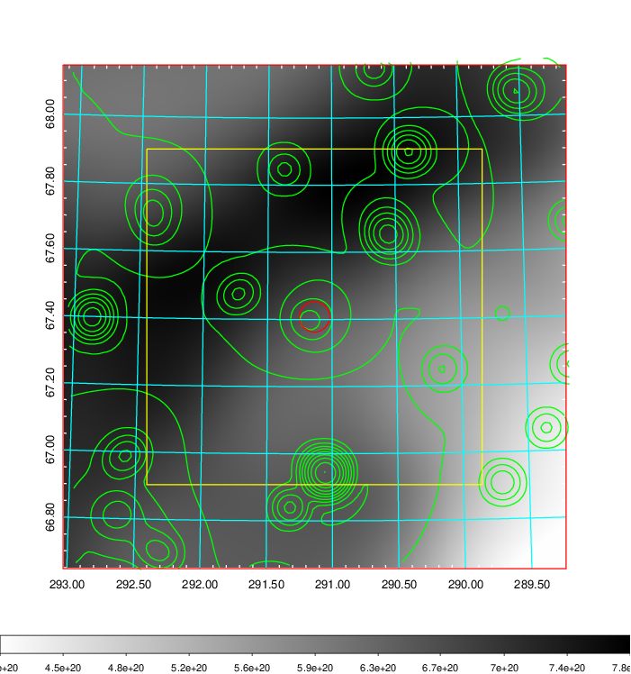    | 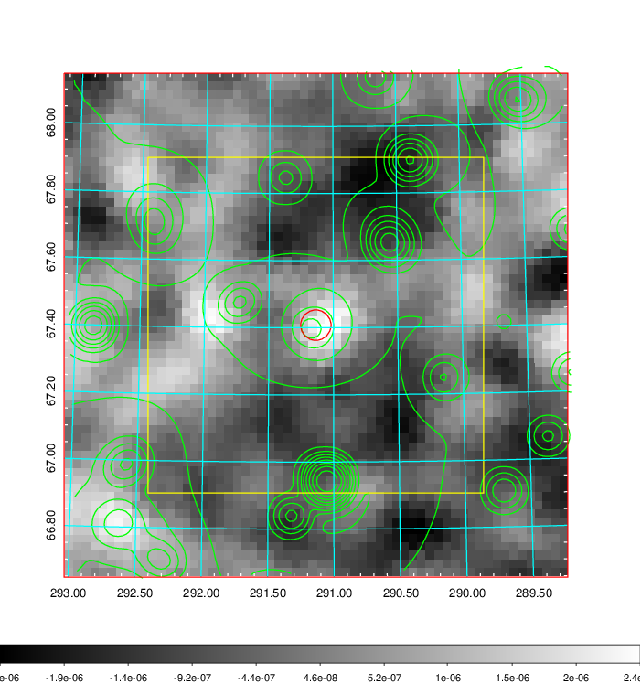 |

|[Redshift Histogram](../image/804/804_zg.pdf) | [DSS image(z1)](../image/804/804_dss_z1.pdf)      |  [DSS image(z2)](../image/804/804_dss_z2.pdf)    |
|-------------------|--------------------|-------------------|
|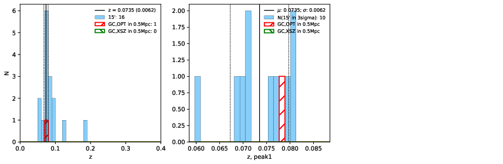 |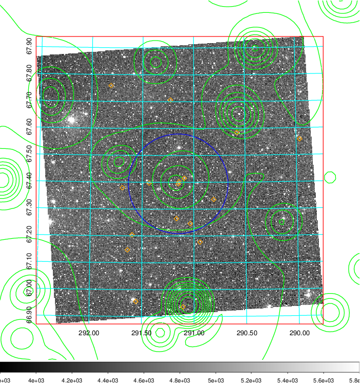  Blue circle for optical clusters;  Magenta circle for XSZ clusters;  all with r=1Mpc;  Only GC with Delta_z<0.01 are shown. | 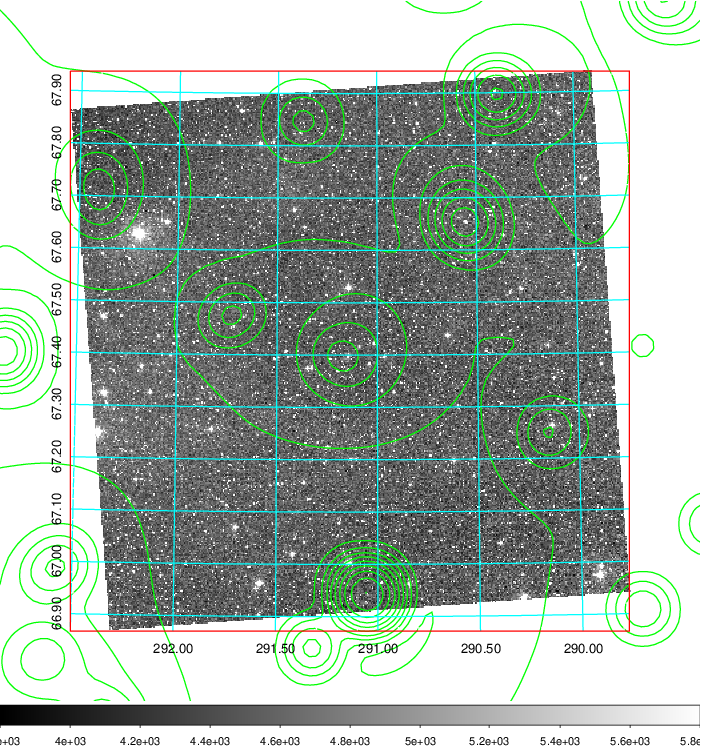 Blue circle for optical clusters;  Magenta circle for XSZ clusters;  all with r=1Mpc;  Only GC with Delta_z<0.01 are shown.  |

|[Previous-identified clusters](../image/804/804_gc.pdf) | [2MASS image](../image/804/804_2mass.pdf)      |
|-------------------|-------------------|
|  Green, magenta, and blue circles  for optical, X-ray and SZ clusters  respectively, with redshift of clusters  labelled. The radius of circles  are 1Mpc.|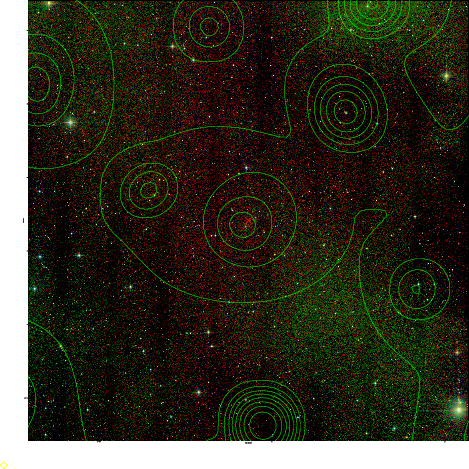  |

|[PS1 image](../image/804/804_ps1.pdf)            |
|-------------------|
| 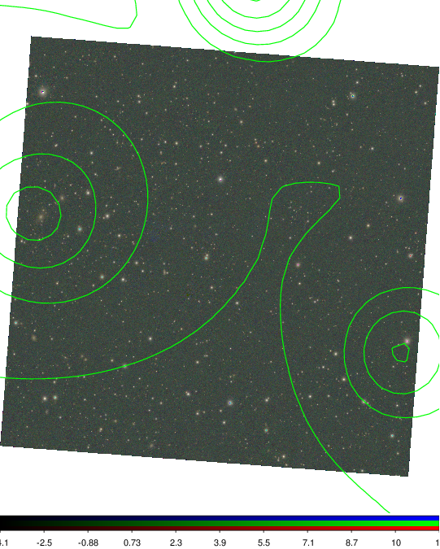  |
