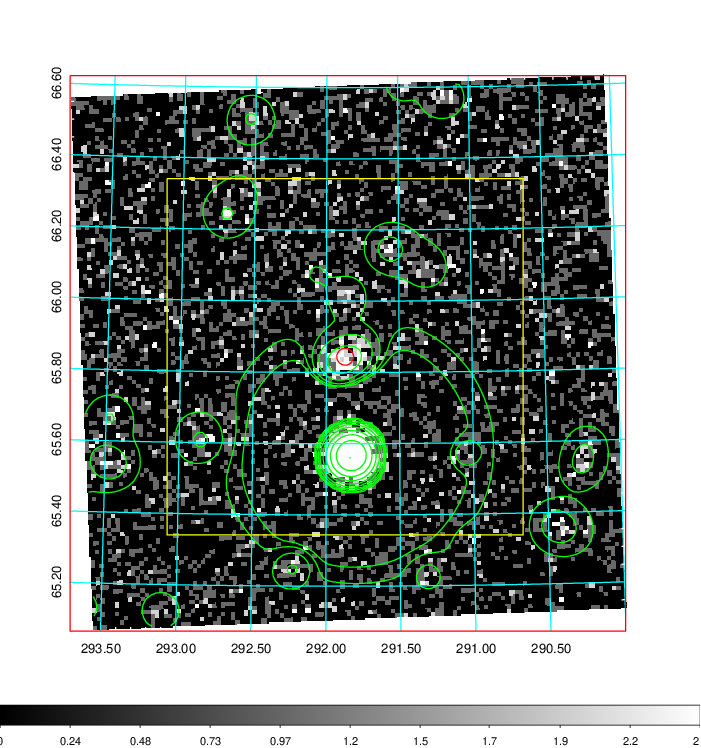
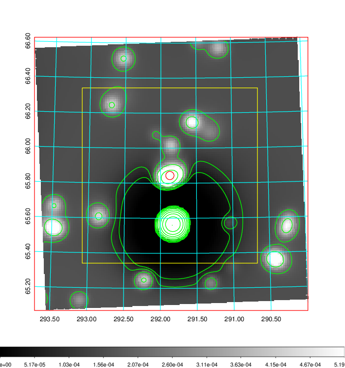
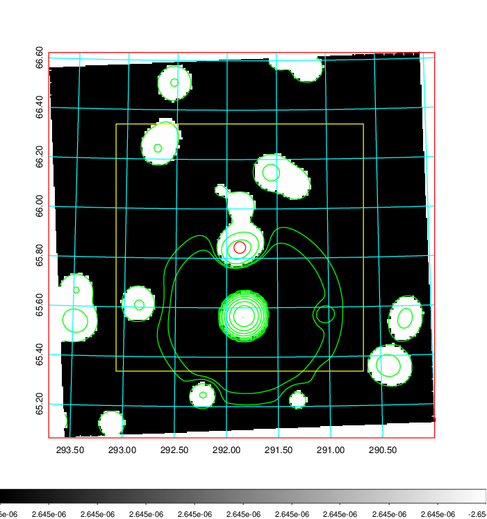
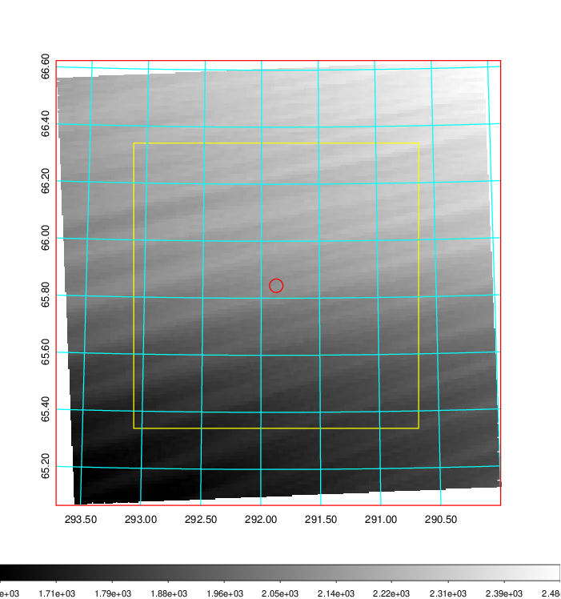
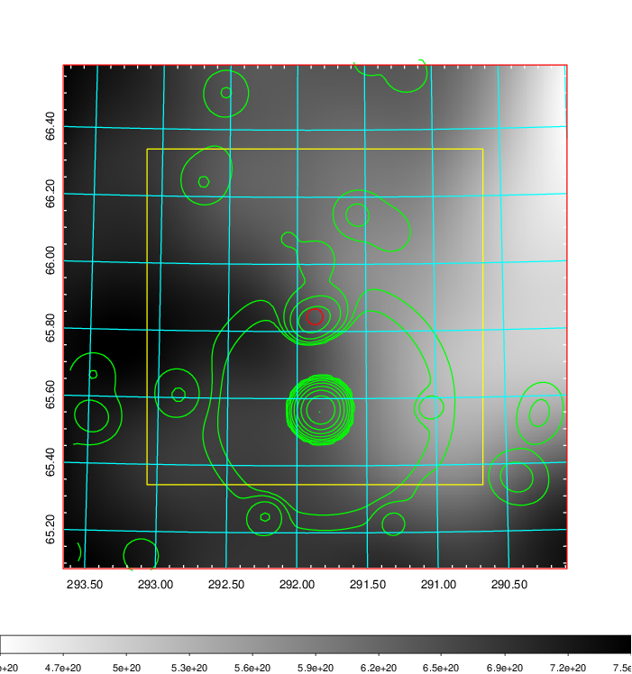
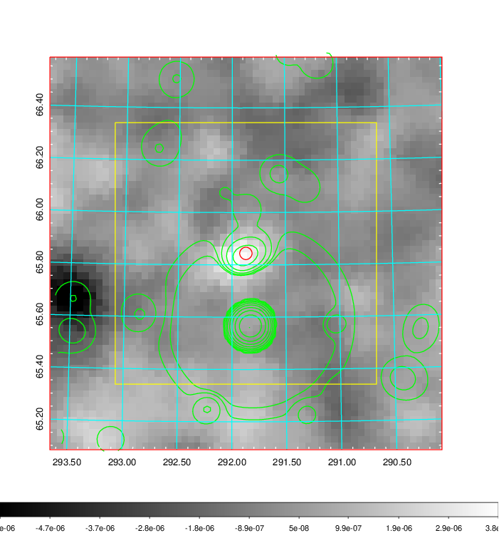
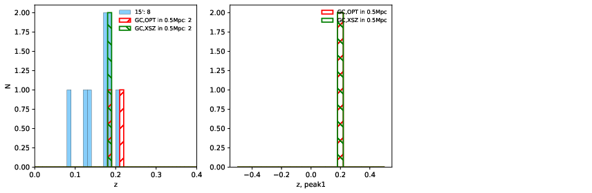
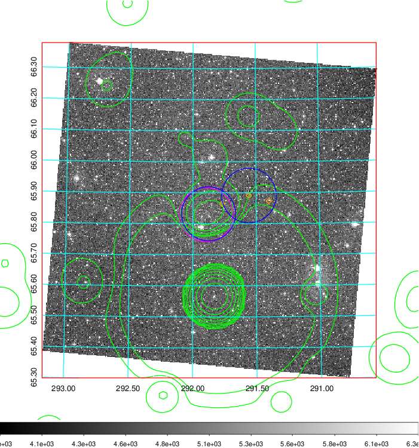
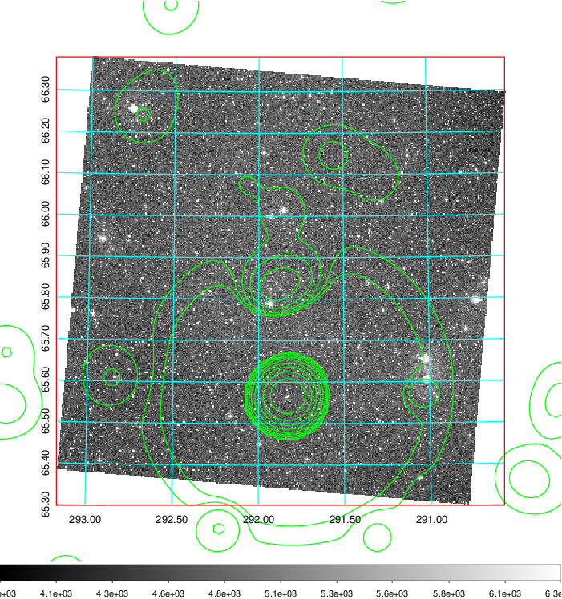
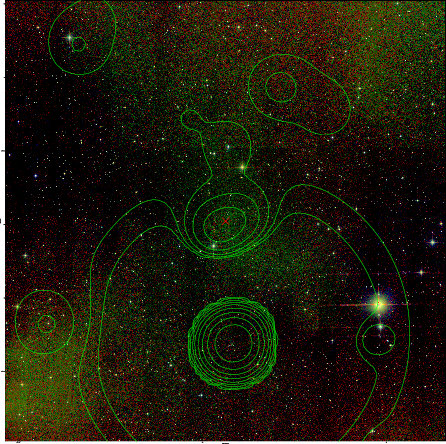

### 805

|Name|RAJ2000[deg]|DEJ2000[deg] |Ext[arcmin]| Ext,ml | z | z_src| C|GC(XSZ,Delta_z<0.01)| GC(OPT,Delta_z<0.01)|GC| R_sig[arcmin] | R500[arcmin] | R500[Mpc]| CRsig[c/s] | CR500[c/s] |L500[1E44 erg/s]|F500[1E-12 erg/s/cm^2]| M500[1E14 Msun]|Tx[keV]|Cnt_sig|Beta|Rc[arcmin]|Comment|Alias|
|---|---|---|---|---|---|------|---|--------|---------|----------|---|---|---|---|---|---|---|---|---|---|---|---|---|---|
|805| 291.871| 65.844| 1.42| 55.45| 0.1886(0.000)| z_xsz| B| MCXC, Tar| N| MCXC, N, Tar, W| 12.212| 4.752| 0.898| 0.065(0.016)| 0.059(0.015)| 1.074(0.095)| 1.065(0.094)| 2.48(0.11)| 3.99(0.11)| 177.7| 0.963(-0.054+0.028)| 3.565(-0.278+0.234)| -| k096|

|[RASS image](../image/805/805_img.pdf)|[filtered image](../image/805/805_fil.pdf)|[Segment image](../image/805/805_seg.pdf)|
|-------------------|--------------------|-------------------|
|   |    |   |

|[Exposure image](../image/805/805_mex.pdf)| [nH image](../image/805/805_nh.pdf)| [Planck image](../image/805/805_p.pdf)|
|-------------------|--------------------|-------------------|
|   |     |  |

|[Redshift Histogram](../image/805/805_zg.pdf) | [DSS image(z1)](../image/805/805_dss_z1.pdf)      |  [DSS image(z2)](../image/805/805_dss_z2.pdf)    |
|-------------------|--------------------|-------------------|
| |  Blue circle for optical clusters;  Magenta circle for XSZ clusters;  all with r=1Mpc;  Only GC with Delta_z<0.01 are shown. |  Blue circle for optical clusters;  Magenta circle for XSZ clusters;  all with r=1Mpc;  Only GC with Delta_z<0.01 are shown.  |

|[known Abell/XSZ clusters](../image/805/805_gc.pdf) | [2MASS image](../image/805/805_2mass.pdf)      |
|-------------------|-------------------|
|  Magenta, blue and green circles  for optical, X-ray and SZ clusters  respectively, with redshift of clusters  labelled. The radius of circles  are 1Mpc.|  |

|[PS1 image](../image/805/805_ps1.pdf)            |
|-------------------|
|   |
