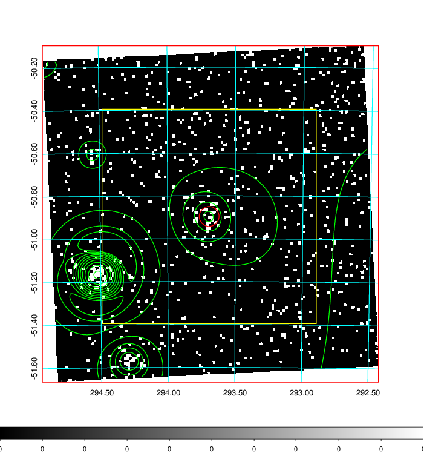
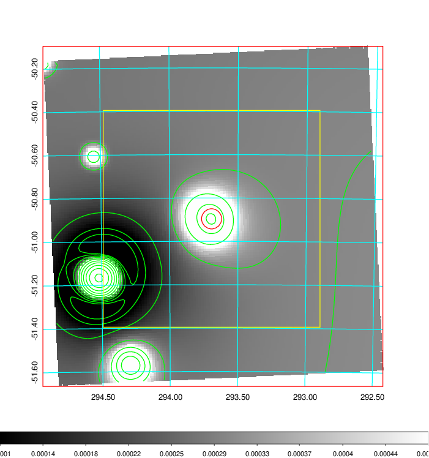
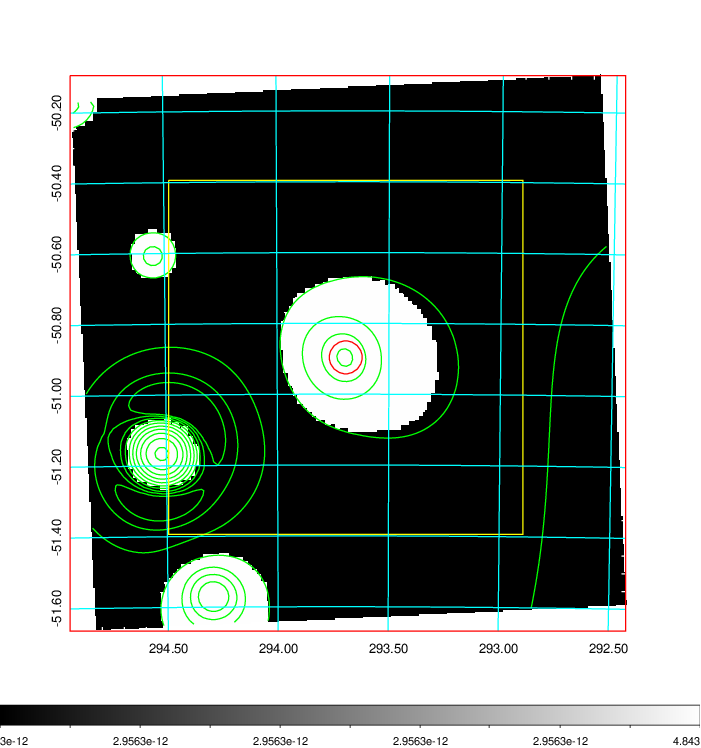
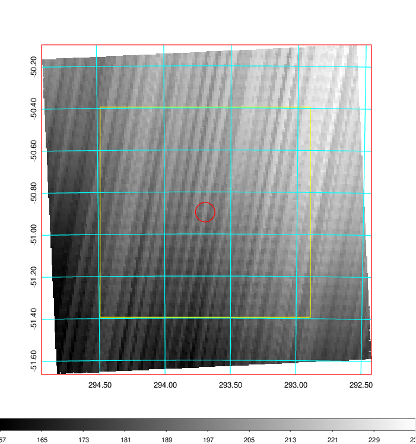
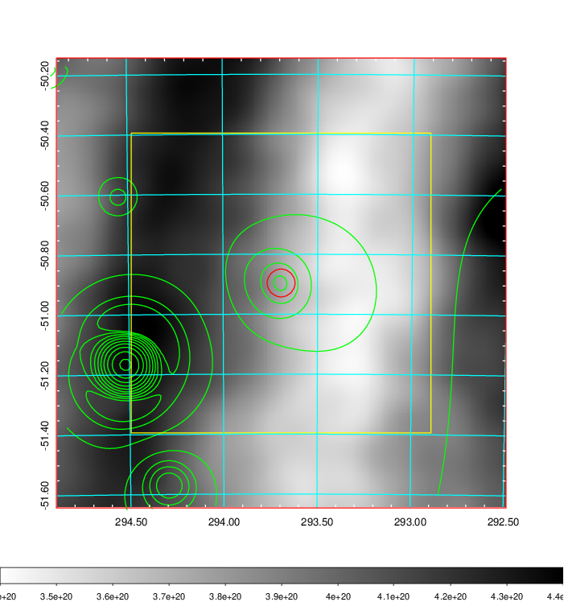
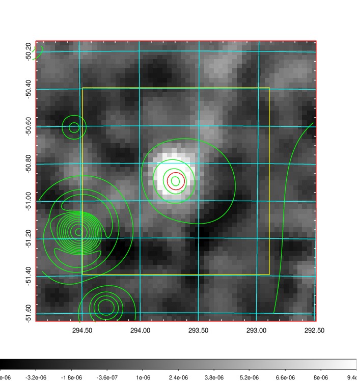
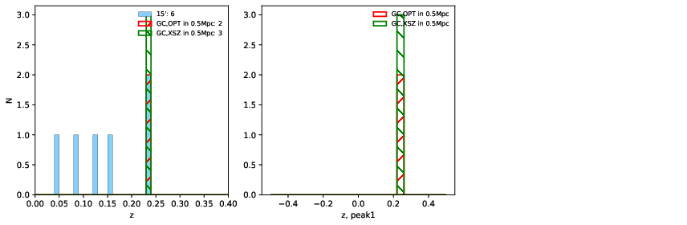
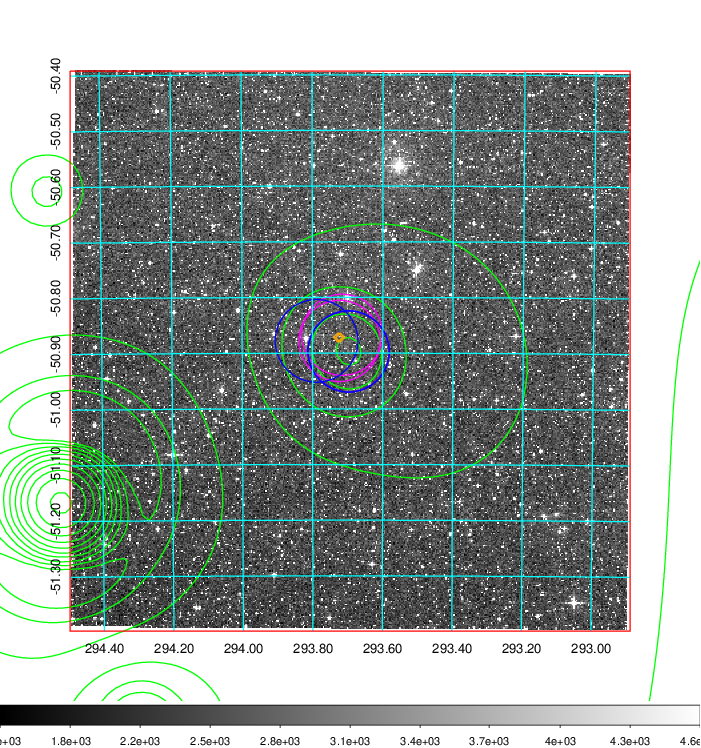
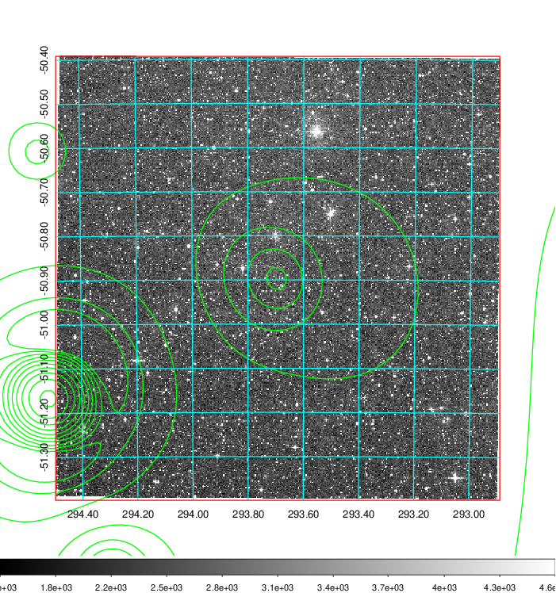
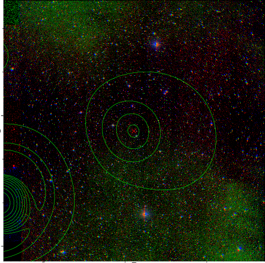

### 807

|Name|RAJ2000[deg]|DEJ2000[deg] |Ext[arcmin]| Ext,ml | z | z_src| C|GC(XSZ,Delta_z<0.01)| GC(OPT,Delta_z<0.01)|GC| R_sig[arcmin] | R500[arcmin] | R500[Mpc]| CRsig[c/s] | CR500[c/s] |L500[1E44 erg/s]|F500[1E-12 erg/s/cm^2]| M500[1E14 Msun]|Tx[keV]|Cnt_sig|Beta|Rc[arcmin]|Comment|Alias|
|---|---|---|---|---|---|------|---|--------|---------|----------|---|---|---|---|---|---|---|---|---|---|---|---|---|---|
|807| 293.693| -50.896| 2.79| 25.84| 0.2371(0.000)| z_xsz| B| MCXC, PSZ2, Tar| A| A, MCXC, PSZ2, Tar, W| 16.306| 5.359| 1.209| 0.197(0.106)| 0.178(0.095)| 5.781(1.458)| 3.431(0.865)| 6.37(0.75)| 7.25(0.55)| 38.2| 0.921(-0.099+0.058)| 4.275(-0.673+0.585)| -| k352|

|[RASS image](../image/807/807_img.pdf)|[filtered image](../image/807/807_fil.pdf)|[Segment image](../image/807/807_seg.pdf)|
|-------------------|--------------------|-------------------|
|   |    |   |

|[Exposure image](../image/807/807_mex.pdf)| [nH image](../image/807/807_nh.pdf)| [Planck image](../image/807/807_p.pdf)|
|-------------------|--------------------|-------------------|
|   |     |  |

|[Redshift Histogram](../image/807/807_zg.pdf) | [DSS image(z1)](../image/807/807_dss_z1.pdf)      |  [DSS image(z2)](../image/807/807_dss_z2.pdf)    |
|-------------------|--------------------|-------------------|
| |  Blue circle for optical clusters;  Magenta circle for XSZ clusters;  all with r=1Mpc;  Only GC with Delta_z<0.01 are shown. |  Blue circle for optical clusters;  Magenta circle for XSZ clusters;  all with r=1Mpc;  Only GC with Delta_z<0.01 are shown.  |

|[known Abell/XSZ clusters](../image/807/807_gc.pdf) | [2MASS image](../image/807/807_2mass.pdf)      |
|-------------------|-------------------|
|  Magenta, blue and green circles  for optical, X-ray and SZ clusters  respectively, with redshift of clusters  labelled. The radius of circles  are 1Mpc.|  |

